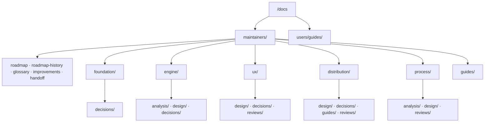

# Documentation

`ytdl` downloads audio from YouTube through yt-dlp, with clean `Artist - Track`
filenames and correct ID3 tags. Since Cycle 1 it is a **single Go binary** acting as
three front-ends over one core — a CLI, an on-demand queue daemon, and a local web
GUI — shipped to non-developer macOS users by a Bash installer.

User-facing text is **Italian**; code, comments, identifiers and documentation are
**English**. The two `guida-*.md` are the deliberate exceptions, by audience.

## How this tree is organised

Two axes, in this order: **audience → domain → document type**. A document's type is
the leaf, never the top-level bucket, so a domain's analysis, design and decisions
stay together instead of being scattered by kind.

The type folders differ per domain on purpose: **a domain gets one only when it has
a document to put in it.** An empty `reviews/` would advertise a review nobody ran.

The shape, and the rules that keep it that way, are in
[the reorganization design](maintainers/process/design/docs-reorganization.md).

## Start here

| Document | What it is for |
|---|---|
| [roadmap.md](maintainers/roadmap.md) | **Single source of truth** for where the work stands and what comes next |
| [roadmap-history.md](maintainers/roadmap-history.md) | Closed units, one block each, append-only |
| [glossary.md](maintainers/glossary.md) | One vocabulary for documents and code |
| [improvements.md](maintainers/improvements.md) | Known, worth doing, **not** scheduled |

`maintainers/handoff.md` carries the working state between sessions. It is
**ephemeral** — deleted when its cycle closes — so nothing in this tree links to it;
it links out. Open it directly when resuming.

## For users — in Italian

| Guida | Contenuto |
|---|---|
| [guida-installazione.md](users/guides/guida-installazione.md) | Installazione passo passo, per chi non ha mai aperto il Terminale |
| [guida-uso.md](users/guides/guida-uso.md) | Uso quotidiano, opzioni, problemi comuni |

## For maintainers, by domain

### `engine/` — the runtime and its subsystems

| Document | What it covers |
|---|---|
| [go-engine.md](maintainers/engine/design/go-engine.md) | **As-built engine**: package layout, the parity gate, build/test/release, deliberate divergences |
| [go-port-parity-contract.md](maintainers/engine/design/go-port-parity-contract.md) | The exact behaviour the Go port reproduces — flags, modes, argv, metadata pipeline, exit codes |
| [cycle1-core.md](maintainers/engine/design/cycle1-core.md) · [cycle1-remaining.md](maintainers/engine/design/cycle1-remaining.md) | The two Cycle 1 designs approved at gate B |
| [2026-07-21-code-bash-as-built.md](maintainers/engine/analysis/2026-07-21-code-bash-as-built.md) | The original Bash script as built — still the golden **reference** |
| [2026-07-21-code-initial-findings.md](maintainers/engine/analysis/2026-07-21-code-initial-findings.md) | The first register: `C`/`U`/`M` findings and the `E` evolutions asked for |
| [2026-07-22-tech-choice-golden-tests.md](maintainers/engine/analysis/2026-07-22-tech-choice-golden-tests.md) | How the Bash argv was captured as goldens — partly superseded, and says so |
| [2026-08-26-code-test-suite-self-replication.md](maintainers/engine/analysis/2026-08-26-code-test-suite-self-replication.md) | **`DEV-1`**: why `go test ./cmd/ytdl` re-executes itself, and what containment has to cover |

### `ux/` — the user-facing surface, both channels

| Document | What it covers |
|---|---|
| [ux-principles.md](maintainers/ux/design/ux-principles.md) | **Normative** for GUI and CLI alike: task model, information hierarchy, shared vocabulary, message conventions |
| [cli-reference.md](maintainers/ux/design/cli-reference.md) | The CLI surface: command → action map, output conventions, the spool-vs-log-store state model |
| [cycle5-ux.md](maintainers/ux/design/cycle5-ux.md) | The Cycle 5 design approved at gate B |
| [reviews/001-cycle5-gate-c.md](maintainers/ux/reviews/001-cycle5-gate-c.md) | The Cycle 5 hands-on verification and its `G1`–`G26` register |

### `distribution/` — reaching a machine, and staying current

| Document | What it covers |
|---|---|
| [distribution.md](maintainers/distribution/design/distribution.md) | Constraints and design for shipping to non-developer macOS users |
| [cycle6plus-update.md](maintainers/distribution/design/cycle6plus-update.md) | The update-path design approved at gate B |
| [guides/releasing.md](maintainers/distribution/guides/releasing.md) | How a release is cut, and the two failures that taught the order |
| [reviews/](maintainers/distribution/reviews/) | Four Cycle 6-plus reviews: implementation, fix session, documentation, gate C |

### `foundation/` · `process/` · cross-cutting guides

| Document | What it covers |
|---|---|
| [foundation/decisions/](maintainers/foundation/decisions/) | The project-level decisions everything else inherits |
| [guides/dev-testing.md](maintainers/guides/dev-testing.md) | Running a development build without disturbing the installed one |
| [process/](maintainers/process/) | How this project's own documentation is organised, and why |

## Decisions

One global numbering sequence across the per-domain folders; the next ADR is `0017`
wherever it lands. `hack/check-docs-links.sh` enforces both the uniqueness of the
numbers and the completeness of this table.

| ADR | Title | Domain |
|---|---|---|
| [0001](maintainers/distribution/decisions/0001-distribution-channel.md) | Distribute via a curl-based installer script | `distribution` |
| [0002](maintainers/foundation/decisions/0002-public-repository-and-licence.md) | Public repository with a restrictive licence | `foundation` |
| [0003](maintainers/foundation/decisions/0003-engine-language-go.md) | Build the engine as a single Go binary | `foundation` |
| [0004](maintainers/engine/decisions/0004-go-engine-package-layout.md) | Go engine package layout: reusable `internal/` core | `engine` |
| [0005](maintainers/foundation/decisions/0005-macos-floor-and-single-engine.md) | Raise the macOS floor to 10.15; a single Go engine, no Python | `foundation` |
| [0006](maintainers/engine/decisions/0006-cycle2a-logs-breadcrumbs-notifications.md) | Cycle 2A: central logs, failure breadcrumbs, and completion notifications | `engine` |
| [0007](maintainers/engine/decisions/0007-cycle2b-queue-daemon.md) | Cycle 2B-core: filesystem queue + on-demand `ytdld` daemon | `engine` |
| [0008](maintainers/engine/decisions/0008-daemon-lifecycle.md) | Daemon lifecycle: long-lived, session-scoped — no always-on service | `engine` |
| [0009](maintainers/ux/decisions/0009-cycle2c-cli-ux.md) | Cycle 2C: CLI UX pass | `ux` |
| [0010](maintainers/ux/decisions/0010-cycle3-web-gui.md) | Cycle 3 Web GUI: single binary, SSE progress, authenticated local API | `ux` |
| [0011](maintainers/engine/decisions/0011-cycle2b-plus-cancel-retry-hardening.md) | Cycle 2B-plus: cancel/retry, per-job timeout, no-residue downloads | `engine` |
| [0012](maintainers/ux/decisions/0012-cycle4-cli-ux-title-disambiguation.md) | Cycle 4: command/URL disambiguation + job title in queue views | `ux` |
| [0013](maintainers/ux/decisions/0013-cycle5-unified-ux.md) | Cycle 5: one task model for GUI and CLI, an actionable history, and a safe open primitive | `ux` |
| [0014](maintainers/ux/decisions/0014-ux-scope-model-and-partial-outcome.md) | The scope of a per-download choice, and partial outcome as a first-class state | `ux` |
| [0015](maintainers/ux/decisions/0015-cycle6-tab-scope-and-faithful-reruns.md) | The middle scope is the browser tab, re-runs are faithful, and no control is offered that does nothing | `ux` |
| [0016](maintainers/distribution/decisions/0016-cycle6plus-update-path.md) | ytdl owns its dependency versions, and the update is one axis the user can see and apply | `distribution` |
| [0017](maintainers/foundation/decisions/0017-dev-container-oracle.md) | The development container's oracle: yt-dlp as a zipapp, and a test binary that cannot become a daemon | `foundation` |

## Reading order

[roadmap.md](maintainers/roadmap.md) for the current state, then the domain you are
about to touch. Before re-opening a settled question, the domain's `decisions/`. For
the distribution work specifically, [distribution.md](maintainers/distribution/design/distribution.md)
then [ADR-0001](maintainers/distribution/decisions/0001-distribution-channel.md).
