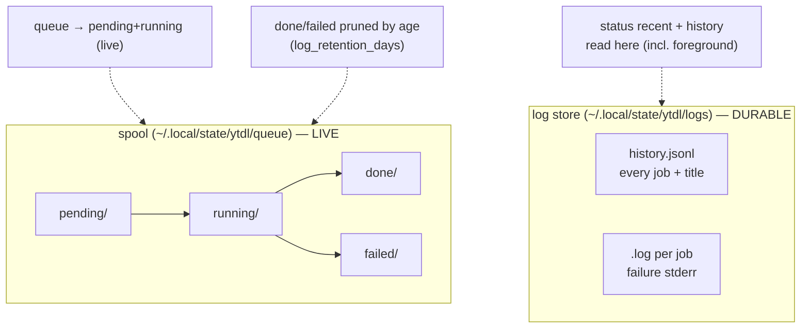

# ytdl CLI — Maintainer Reference

The reference for the command-line surface of `ytdl`: the design principles, the
command → action map, output conventions, the live-vs-history state model, and the
rationale behind each UX choice. It is a **maintainer** document — for how the CLI
is *built and extended*, not an end-user guide (that is
[guida-uso.md](guida-uso.md), in Italian). Written against the Cycle 2C design
([ADR-0009](decisions/0009-cycle2c-cli-ux.md)); update it when the surface changes.

> **Interface language.** User-facing CLI strings are **Italian** (the audience);
> code, identifiers and this document are English. Keep new messages Italian and in
> the shared message files, never inlined ad hoc.

## 1. Design principles

- **P1 — Live vs history are different questions, answered by different commands.**
  "What is running now?" (`queue`) is not "what did I download?" (`history`) is not
  "is the system healthy?" (`status`). Never fold one into another.
- **P2 — No lifetime counters. Windowed, and always labelled.** A cumulative
  count-since-forever answers nothing. Every count/list that covers a time window
  states the window, derived from the *effective* `log_retention_days`
  (*"ultimi 30 giorni"*; *"da sempre"* when `0`). A number without its window is a bug.
- **P3 — Daemon-lifecycle-agnostic.** The CLI reads **live** work from the spool and
  **history** from the log store; daemon liveness is *informational*, never treated
  as an error. This stays correct whether the daemon is on-demand (today),
  session-scoped, or a future start-on-work agent ([ADR-0008](decisions/0008-daemon-lifecycle.md)).
- **P4 — Non-invasive terminal output.** Live views update **in place** (region
  redraw), never clear the whole screen or pollute scrollback. Anything that emits
  ANSI first checks it is writing to a TTY.
- **P5 — Mediate external errors.** yt-dlp/ffmpeg stderr is captured and translated
  into a legible message; the raw dump is available behind `-v`, not the default.
- **P6 — One source of truth per concern.** The **spool** owns live + recently-
  terminal state; the **log store** owns durable history. Do not derive history from
  the spool (it is background-only and pruned) or liveness from the log store.
- **P7 — Consistent vocabulary.** The same glyph always means the same thing (§3.1).
- **P8 — Standard library only.** No third-party CLI/TTY/colour dependency; `isatty`
  is `os.ModeCharDevice`. Keeps the single-static-binary distribution intact
  ([ADR-0003](decisions/0003-engine-language-go.md)).

## 2. Command → action map

`realMain` dispatches in this order: `__daemon` (hidden, intercepted before the
parser) → reserved subcommand keywords (`queue`, `status`, `history`, `gui`,
`cancel`, `retry`) → the download parser (a URL never collides with a keyword).
Exit codes: `0` success, `1` user/parse/setup error (incl. a cancel/retry whose
target could not be acted on), yt-dlp's own code (incl. `128+signal`) for a
download.

**Command/URL disambiguation (Cycle 4, ADR-0012).** A reserved keyword is only
dispatched at `args[0]`; any other positional is the download URL. To catch a
mistyped subcommand (`ytdl queu`) without breaking valid inputs, the download parser
rejects a **bare word** (a token with none of `/ . :`) *only when it is close to a
known command* (Levenshtein ≤ 2) — printing a "did you mean" hint. A bare word that
is not near any command is passed straight to yt-dlp, because a bare 11-char YouTube
video id or a playlist id is a valid yt-dlp input (verified 2026.07.04) and must not
be rejected. `looksLikeURL`/`nearestCommand` live in `internal/cli/guess.go`;
`ytdl -- <token>` bypasses the guard.

| Invocation | Action | Reads / writes | Output |
|---|---|---|---|
| `ytdl URL` | download, default mode | writes: log store + title; breadcrumb on failure | progress + `✓ Salvata in …` |
| `ytdl -n URL` | preview (no download) | reads yt-dlp (simulate) | filenames, or a **mediated** failure (§3.5) |
| `ytdl -s URL` | download, silent | as default, no stdout | none (log/breadcrumb/notify only) |
| `ytdl -v URL` | download, verbose | as default | full yt-dlp output |
| `ytdl -b URL` | enqueue + ensure daemon | writes: spool `pending/` | `▸ Download accodato (N in coda)` |
| `ytdl queue` | live queue snapshot | reads: spool `pending/`+`running/` | live list + live footer (no lifetime counts) |
| `ytdl queue --watch` | live queue, in-place | reads: spool (loop) | region redraw; **auto-exit** on drain (§4) |
| `ytdl status` | health summary | reads: spool (live) + log store (recent) | daemon (informational) + live + windowed recent |
| `ytdl history [--failed] [--limit N]` | durable history | reads: log store `history.jsonl` | chronological list, title-first (§3.4) |
| `ytdl cancel [<n>\|<id>\|--all]` | stop live work | writes: spool `cancel/` marker; deletes `pending/` | numbered list (no arg), or a per-target `▸ Annullato/Annullamento richiesto` line; exit 1 if any target failed |
| `ytdl retry [<n>\|<id>\|--all]` | re-queue failed | moves `failed/`→`pending/`; resumes daemon | numbered failed list (no arg), or `▸ Rimesso in coda`; exit 1 if any re-queue failed |
| `ytdl gui` | open the web interface | spawns a GUI daemon (`__daemon --gui`) if none is listening, then opens the browser | `▸ Interfaccia ytdl su http://127.0.0.1:8765/` |
| `ytdl -V` / `--version` | version | — | `ytdl X` + `yt-dlp Y` |
| `ytdl -h` / `--help` | help | — | usage |
| `ytdl --update` | re-run installer | network | streamed installer output |

**Flags** (download actions): `-o/--output DIR`, `-f/--format FMT` (validated,
fail-fast), `-p/--playlist`, and the mode flags `-n/-s/-b/-v` (priority: dry-run >
background > verbose > silent > default). `--` takes the next token as the URL.

**Job line format (Cycle 4).** `queue`/`retry`/`cancel` render each job **title-first**
(the resolved `Artist - Track`) with the full URL on the line below; a job with no
known title yet shows the URL alone, and a playlist shows the URL flagged
`(playlist)`. The title is written onto the spool job while it runs
(`queue.Spool.SetTitle`, driven by `run.RunQueued`'s `onTitle` callback — the daemon
package is untouched); `retry` additionally back-fills a title from the log store
(`logstore.TitleForURL`, per-job `Settings.LogDir`) for jobs that failed before their
metadata resolved.

**Where each part lives** (keep this separation when extending):

- **Parsing** → `internal/cli/parse.go` (`Parse`, `parseQueue`, `parseStatus`,
  `parseHistory`, `parseTargeted` for `cancel`/`retry`). Pure: string args →
  `Parsed`. No I/O. Target resolution (index vs. unique id-prefix, tri-state) lives
  in `cmd/ytdl` (`resolveTarget`), since it needs the live spool snapshot.
- **Rendering** → `internal/cli/*.go` (`RenderQueue`, `RenderStatus`,
  `RenderHistory`). **Pure functions over snapshots/records** → string. No I/O, no
  time-now, no colour decision inside (colour is applied by a passed-in styler).
- **I/O & control flow** → `cmd/ytdl/main.go` (read the spool/log store, the
  `--watch` redraw loop, isatty, signal handling, exit codes).
- **User-facing strings** → `internal/cli/messages.go` (parse-time) and
  `internal/run` (runtime). Italian, centralised.

## 3. Output conventions

### 3.1 Vocabulary

| Glyph | Meaning | Colour (TTY) |
|---|---|---|
| `▸` | an action starting/queued | default |
| `✓` | success | green |
| `✗` | failure | red |
| `!` | warning / advisory | yellow |
| `♪` | a saved track | default |
| `•` | pending job | dim |
| `⟳` | running / spinner | cyan |

### 3.2 Colour

Applied **only** when stdout is a TTY **and** `NO_COLOR` is unset (the
[NO_COLOR](https://no-color.org/) convention). When piped/redirected: plain text,
no escape codes. Colour is a presentation concern applied at the edge (`cmd/ytdl` /
a small styler), never baked into the pure renderers — so a renderer's golden test
is colour-free and stable.

### 3.3 Window labels (P2)

Any count or list bounded by retention prints its window from the effective
`log_retention_days`:

- `N > 0` → *"ultimi N giorni"*
- `N == 0` → *"da sempre"*

Example: `status` → `recenti (ultimi 30 giorni): 12 ok · 1 fallito`.

### 3.4 History listing

Title-first, most-recent-first, one line per job:

```
STORICO ytdl — ultimi 30 giorni
  ✓ 23/07 20:47  Massive Attack - Black Milk
  ✓ 23/07 20:31  Massive Attack - Dissolved Girl
  ✗ 23/07 19:12  (fallito) youtu.be/Xk3…
```

The title comes from `history.jsonl`; a failure with no resolved title falls back
to a shortened URL. `--failed` filters to failures; `--limit N` caps the count
(default a small N).

### 3.5 Error mediation (P5)

Download modes already translate yt-dlp outcomes. `-n` joins them: its stderr is
captured, and on failure a mediated line is printed. The YouTube anti-bot signature
(*"Sign in to confirm you're not a bot"*) is recognised and gets a specific hint
that the real download usually still works. Unknown failures print a generic line
plus the last stderr line; the full dump is behind `-v`.

### 3.6 Empty states

Never a blank or a bare zero — give the next action:
`(coda vuota) · accoda con ytdl -b <url>`.

## 4. The `--watch` redraw contract

1. **TTY check first.** Not a TTY → print one snapshot and return (no loop, no
   ANSI). This is what makes `ytdl queue --watch | tee log` sane.
2. **Region redraw.** Track the printed line count `N`. Each tick: `\033[{N}A`
   (cursor up N) + `\033[0J` (clear to end of screen), then rewrite; update `N`.
   Never `\033[2J` (whole-screen clear wipes the terminal and fills scrollback).
   The redraw assumes **one logical line = one physical row**, so every rendered
   line — job lines, the header/section/footer, and the spinner — is clipped to the
   terminal width (`term.Width`, 80 fallback) in **display columns**, not runes
   (`term.DisplayWidth`/`term.Clip`: CJK/emoji count as 2), so a wide title never
   wraps and desyncs the cursor math. One-shot views (`queue` without `--watch`,
   `cancel`, `retry`) print the full untruncated URL — a wrap is harmless there.
   `RenderQueue(snap, full, width)`: one-shot passes `full=true`; `--watch` passes
   `full=false` + the width.
3. **Redraw on change only**, with a header spinner (`⟳`) advanced each tick for
   liveness even when the snapshot is unchanged.
4. **Cursor** hidden on entry (`\033[?25l`), restored on exit (`\033[?25h`) — on the
   normal path **and** on SIGINT.
5. **Auto-exit** when the queue drains (no pending, no running): print a one-line
   final summary and return `0`. Ctrl-C also exits cleanly at any time.
6. **Session deltas, not lifetime.** If the watch shows a completed counter, it
   counts transitions observed *since the watch started* (`questa sessione: +K`),
   never the spool's lifetime — consistent with P2.

## 5. State model — spool vs log store

Two stores, two jobs. Keep them from bleeding into each other.



- **Spool** (`internal/queue`): the queue's live truth. `pending`/`running` are the
  only "live" states; `done`/`failed` are *recently-terminal* and **pruned by age**
  (`PruneTerminal`, reusing `log_retention_days`). Only background/queued jobs ever
  enter the spool.
- **Log store** (`internal/logstore`): durable history of **every** job — foreground
  *and* background — since each `run.Dispatch` records one entry. `history.jsonl`
  is the structured index (`{time,url,title,mode,format,rc,success}`); the per-job
  `.log` holds the captured stderr for failure diagnosis. Read via
  `Load(dir, QueryOpts{Since, Limit, OnlyFailed})`. Pruned by age.

Consequence: **history and the `status` summary come from the log store**, so they
include foreground downloads; **`queue` comes from the spool**, so it shows only
what a daemon is (or will be) draining. This is why the old spool-`done/` count was
wrong for "how much have I downloaded".

## 6. UX choices & rationale

| Choice | Why | Ref |
|---|---|---|
| `queue` = live only; no lifetime footer | a lifetime, background-only, unpruned count answered nothing and hid foreground | ADR-0009 §1–2 |
| history from the log store, not the spool | the log store records foreground + background and has retention | ADR-0009 §2–3 |
| `history.jsonl` + title (not parse `.log`) | titles make history useful; structured parse is robust | ADR-0009 §3 |
| in-place redraw, not screen clear | screen clear wiped the terminal and spammed scrollback | ADR-0009 §5 |
| `--watch` auto-exit on drain | matches "enqueue and watch until done" | ADR-0009 §5 |
| daemon liveness informational | the daemon is on-demand today, session-scoped later — "down" is normal | ADR-0008 |
| windowed labels everywhere | a number without its window is ambiguous (the "2" that confused a real user) | ADR-0009 P2 |
| TTY-aware colour, `NO_COLOR` | colour helps interactively, breaks pipes | ADR-0009 |
| stdlib-only isatty/colour | preserve the single-static-binary install | ADR-0003 |

## 7. Extending the CLI — checklist

When adding a command or flag:

1. **Parse** in `internal/cli` (pure), with an unknown-option error + usage, like the
   existing subcommands. Add a test in `parse_test.go`.
2. **Render** as a pure function over a data snapshot in `internal/cli`; golden/table
   test it colour-free. No `time.Now()` inside — pass the clock in.
3. **Wire I/O** in `cmd/ytdl/main.go`; keep the exit-code ownership there.
4. **Strings** go in the message/`run` files, in Italian; add the window label if it
   is windowed (§3.3).
5. **Colour** only at the edge; **TTY-check** before any ANSI.
6. **Docs:** update this file's §2 map and, if user-facing, `guida-uso.md` and the
   `Usage` help text. Record a non-trivial design decision as an ADR.
7. **Parity:** if the change touches `internal/core`, it must keep the goldens
   byte-identical — CLI/UX work should not need to.
