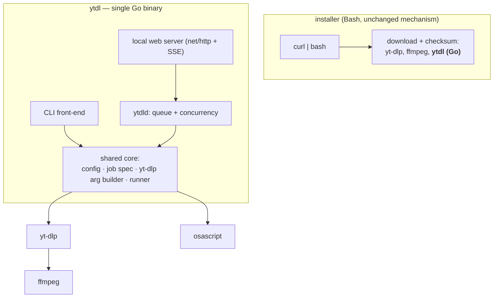

# ADR-0003 — Build the engine as a single Go binary

- **Status:** accepted
- **Date:** 2026-07-22
- **Context:** [improvements.md](../improvements.md) (U4, U5, E2), [roadmap.md](../roadmap.md)
- **Supersedes:** nothing. Refines the runtime question left open by
  [ADR-0001](0001-distribution-channel.md) and roadmap phase 4.

## Context

The evolutions requested by the maintainer — persistent user configuration (U4),
a real download queue with a concurrency limit and status inspection (U5),
persistent logs, system notifications (U6), and a GUI for non-developer users
(E2) — go well beyond what the current single Bash script does. Before building
them, the language and runtime of the "engine" behind them had to be settled,
because every one of those features is a front-end concern over one shared core:
a job specification, the yt-dlp argument builder (including the fragile metadata
pipeline), config resolution, and a runner.

Two hard constraints frame the choice, both inherited from the distribution work:

1. **Python is not universally present.** On macOS 10.15+ `yt-dlp` ships as a
   standalone binary with no interpreter; only the legacy 10.13–10.14 path
   installs python.org Python 3.13 (see [ADR-0001](0001-distribution-channel.md)).
   Relying on Python for the engine would force it onto every user.
2. **The shipping tool is Bash 3.2.** macOS ships Bash 3.2 — no `declare -A`, no
   `mapfile`. A bounded-concurrency queue and a local web server are both awkward
   and fragile to write correctly in that environment.

A third, non-negotiable constraint from the maintainer: **no paid signing or
distribution** (no Apple Developer ID), and **installation must stay simple**.

### Where a compiled binary actually helps

Evaluated feature by feature, a general-purpose runtime only pays off in two
places — and they are the same component:

| Feature | Benefit from a compiled engine |
|---|---|
| Queue + concurrency | **Decisive** — a worker pool with a semaphore is trivial and correct; in Bash it is the single most error-prone part of the plan (launchd + spool + locks). |
| Local web GUI server | **Decisive** — a standard-library HTTP server + SSE for live progress, with zero third-party dependencies. Bash has no real web server. |
| Config, logs | Minor — they fold into the same binary for cohesion. |
| yt-dlp / ffmpeg invocation | **None** — a subprocess call in any language. |
| Notifications | **None** — `osascript` shell-out in any language. |
| Metadata pipeline (the crown jewel) | **Neutral** — it is a set of yt-dlp *arguments*; the same argv strings in any language. |

The queue daemon and the GUI web server are in fact one long-running process
(`ytdld`): it owns the queue *and* serves the UI. Config and the job runner fall
into it naturally. Everything else stays a subprocess call regardless of language.

## Decision

Build the engine as a **single statically-linked Go binary** that provides the
CLI, the queue daemon, and the local web GUI server, shelling out to `yt-dlp`,
`ffmpeg`, and `osascript`. **The installer stays Bash.** **Python is not adopted.**

The metadata pipeline lives in the shared core, in exactly one place. The CLI and
the GUI are both thin front-ends over it — "one engine, two front-ends".

### Go, not Rust

- The workload is **I/O-bound subprocess orchestration**, not hot-path
  computation. Rust's performance and no-GC advantages do not show here; the
  bottleneck is the network and yt-dlp.
- Go gives an HTTP server and concurrency **in the standard library** — no
  external crates for the two features that justify the compiled engine. Rust
  needs tokio/axum, i.e. more dependencies and a heavier build.
- Go cross-compiles to a single static binary via `GOOS`/`GOARCH`, which makes
  both the macOS install and a future Windows/Linux port nearly free.

### Distribution cost is near zero

The installer **already** downloads-verifies-installs binaries (yt-dlp, ffmpeg):
`curl` fetch → `SHA2-256SUMS`-style checksum → `chmod`. Shipping our own Go binary
is the *same* mechanism, so it adds no new install paradigm, no runtime
dependency, and — because `curl` downloads are never quarantined — no Gatekeeper
prompt and no signing. The only new cost is a CI cross-compile-and-checksum step.

## Alternatives considered

- **Python, universally installed** — rejected. It is the only feature-relevant
  runtime that Bash lacks a good substitute for (a stdlib web server), but making
  it universal breaks the fully non-interactive, no-admin, single-paste install
  for the macOS 10.15+ majority (python.org is an admin `.pkg`). Paying that for a
  last-priority GUI is a bad trade. It also does not remove the shell-outs to
  yt-dlp/ffmpeg/osascript. Note the legacy path still installs Python for yt-dlp;
  that is unaffected.
- **Rust, single engine** — rejected. Same architecture, smaller binary, but a
  heavier build and advantages the workload cannot use. Reconsider only if a
  genuine CPU-bound need appears.
- **Bash-only backend + a web server for the GUI** — rejected. Bash has no robust
  HTTP server (`nc`/`socat` are fragile hacks), and the bounded-concurrency queue
  stays the most error-prone part of the system. The two features the user most
  wants are exactly the two Bash serves worst.
- **Go only for the daemon + GUI, Bash CLI retained** — rejected. It forces the
  metadata pipeline to be either duplicated in Bash (two sources of truth for the
  crown jewel) or reached by the CLI shelling out to the Go binary (which makes
  the Bash CLI pointless). A single Go core with a thin CLI front-end is cleaner.

## Consequences

- **The working Bash `ytdl` is not thrown away on day one.** It keeps shipping and
  receives only cheap correctness fixes (roadmap phase 2) until the Go engine
  reaches parity, so no user is ever left without a tool.
- **The metadata pipeline must be ported carefully.** It is mechanical (argv
  strings), but it is the most valuable and most fragile part. The port is guarded
  by **golden tests** asserting that Go produces the *same* yt-dlp argument vector
  as the Bash reference, preserving the `xartist`/`xtrack` helper-field ordering
  documented in [architecture.md](../architecture.md).
- **A build step enters the release process** (CI cross-compile for macOS arm64 +
  Intel, checksum publication). The installer consumes the result exactly as it
  consumes yt-dlp/ffmpeg today.
- **The GUI runtime question raised in roadmap phase 4 is now answered:** the rich
  GUI is a web UI served by the Go daemon; no separate runtime, no signing, no
  payment. An AppleScript MVP remains available as a zero-dependency first step.
- **A future Windows/Linux port becomes mostly a second installer**, since the Go
  engine cross-compiles. This does not pull that work forward; it only removes the
  language barrier to it.
- **The engine binary is opaque**, unlike the editable Bash script. This is not a
  real loss: config-file support (U4) removes the reason users edited the script
  (output dir, format, cleanup regexes), and the source remains in the repository.
