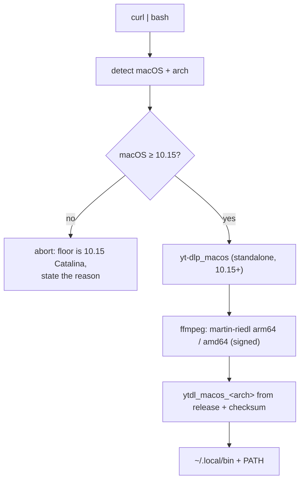

# ADR-0005 — Raise the macOS floor to 10.15; a single Go engine, no Python

- **Status:** accepted
- **Date:** 2026-07-22
- **Context:** [ADR-0001](0001-distribution-channel.md), [ADR-0003](0003-engine-language-go.md),
  [distribution.md](../distribution.md), [roadmap.md](../roadmap.md) (Cycle 1, items 3.1/3.2)
- **Supersedes:** the **macOS support floor** of [ADR-0001](0001-distribution-channel.md)
  (10.13 High Sierra → **10.15 Catalina**). ADR-0001's distribution *channel*
  (curl-based installer, checksum verification) stands unchanged.

## Context

Cycle 1 replaces the Bash `ytdl` with a compiled Go binary shipped through the same
installer that already provisions yt-dlp and ffmpeg ([ADR-0003](0003-engine-language-go.md)).
Designing the release (item 3.1) and the installer change (item 3.2) forced a
version-floor question the Bash tool never had:

**Every supported Go toolchain targets macOS 10.15 or newer.** Since Go 1.21 the
minimum is 10.15 Catalina; Go 1.20 — the last release to support 10.13–10.14 — is
end-of-life and receives no security fixes. The engine design pins Go 1.22+. A Go
`ytdl` therefore **cannot run on macOS 10.13–10.14**, which is exactly the legacy
tier ADR-0001 went out of its way to support (zipimport yt-dlp + a python.org
Python install).

That leaves three ways forward:

1. **Dual engine by tier** — modern (10.15+) runs the Go binary, legacy (10.13–10.14)
   keeps the Bash script. Preserves the 10.13 floor, but means maintaining *two*
   engines indefinitely, keeping the whole Python provisioning path alive, and
   denying legacy users every Cycle 2/3 feature (config, queue, GUI — all Go).
2. **Older Go toolchain** — build with Go 1.20 to keep 10.13 in one binary. Rejected
   on sight: 1.20 is EOL (no security updates) and forecloses current language and
   toolchain features.
3. **Raise the floor to 10.15** — one Go engine for everyone, Python removed from
   the project entirely.

The 10.13 floor existed for a **single** known user (a student on older macOS).
That user is most likely already on **Catalina 10.15**, which the raised floor still
covers; confirmation was not available when this decision was taken. Sustaining a
second engine and an entire Python provisioning path for one marginal, probably-not-
even-affected user is disproportionate.

## Decision

**Raise the supported macOS floor to 10.15 Catalina and ship a single Go engine.**

- One binary, both architectures: `ytdl_macos_arm64` and `ytdl_macos_amd64`.
- **Python is removed from the project.** It was only ever the legacy tier's yt-dlp
  runtime; at a 10.15 floor the standalone `yt-dlp_macos` build (10.15+) serves
  everyone, so no interpreter is provisioned anywhere.
- The installer collapses to a **single path**: no `legacy` tier, no Python
  detection/guidance, no zipimport yt-dlp + wrapper, no evermeet.cx ffmpeg source
  (used only by the legacy Intel path; martin-riedl's signed arm64/amd64 builds
  cover every supported target).
- The Bash `ytdl` is **retired at Cycle-1 parity** rather than kept for a legacy
  tier. It remains in git history as an unsupported stop-gap.

### If the assumption is wrong

If the student turns out to be on macOS 10.13–10.14, back-compatibility is
**cheap to re-introduce from git history**: the dual-engine option above resurfaces
as a documented fallback (hand them the last Bash `ytdl` + Python path), without
holding the main line hostage to it now. Estimated likelihood this is needed: low.

## Alternatives considered

- **Dual engine by tier (keep 10.13)** — rejected. 2× engine maintenance, keeps the
  Python path alive forever, and legacy users never get config/queue/GUI. All cost,
  for one probably-unaffected user.
- **Older Go toolchain (Go 1.20 for 10.13)** — rejected. EOL, no security fixes,
  forecloses modern toolchain features.
- **Keep 10.13 floor, port later** — rejected. The floor question is forced *now* by
  3.1/3.2; deferring it just ships a Go binary the installer can't safely place on a
  system it claims to support.

## Consequences

- **Installer simplification.** One provisioning path; the `legacy` tier, Python
  machinery (`find_python`/`require_python`/`MIN_PYTHON`/zipimport wrapper) and the
  evermeet source are removed. Fewer branches, fewer failure modes. (Implemented in
  Cycle 1, item 3.2.)
- **Audience.** macOS 10.13–10.14 is dropped. A Mojave/High Sierra user must upgrade
  macOS, or use the unsupported Bash stop-gap from git history.
- **Documentation.** ADR-0001's floor is superseded here; [distribution.md](../distribution.md)
  and [roadmap.md](../roadmap.md) are revised for the 10.15 floor, and the Mojave
  "open question" is closed. [ADR-0003](0003-engine-language-go.md)'s note that "the
  legacy path still installs Python" no longer holds.
- **User-facing guides** (`README.md`, `guida-installazione.md`) still describe the
  currently-shipping Mojave+Python installer; they are updated **together with the
  installer change** (Cycle 1, Session 3) so docs and behaviour flip in lockstep,
  not before.
- **Endgame is cleaner.** ADR-0003's "Bash ships until parity, then is superseded"
  becomes an outright retirement at parity — no legacy tier to keep it alive.
