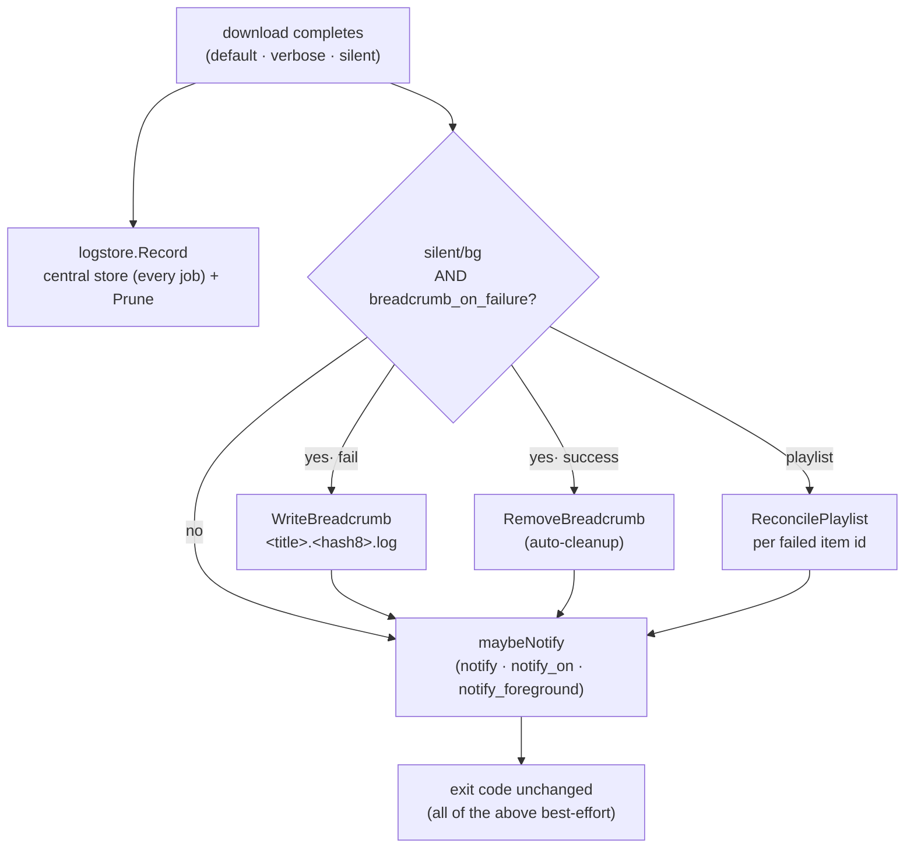

# ADR-0006 — Cycle 2A: central logs, failure breadcrumbs, and completion notifications

- **Status:** accepted
- **Date:** 2026-07-23
- **Context:** [roadmap.md](../roadmap.md) (Phase 4, items 4.1–4.4), [improvements.md](../improvements.md)
  (U6 notifications, U7 logs/breadcrumb), [go-engine.md](../go-engine.md) (extension points),
  [ADR-0003](0003-engine-language-go.md) / [ADR-0004](0004-go-engine-package-layout.md)
  (one core, thin front-ends; the golden parity gate)
- **Scope:** Cycle 2A — the first slice of Phase 4 backend work. The queue +
  `ytdld` daemon (U5, items 4.5–4.7) is Cycle 2B and is **not** covered here.

## Context

Cycle 1 shipped the Go engine at byte-exact argv parity with the Bash `ytdl`,
pinned by golden tests over `core.BuildArgs`. Phase 4 adds backend features that
live in the **runtime layer**, not the argv builder. Cycle 2A takes the three
self-contained ones that need no daemon:

- **U7 central logs (4.1):** the Bash tool left a title-derived `<title>.log`
  next to the audio on silent-mode failure — collision-prone (two failures with
  the same title overwrite, the deferred Cycle-1 issue **M2**) and fragile to
  name (**C5**). There was no persistent record of what ran.
- **U7 breadcrumb (4.2–4.3):** the maintainer wants an at-a-glance in-folder
  failure signal that a later successful re-download cleans up automatically.
- **U6 notifications (4.4):** silent/background completion is otherwise
  invisible.

The hard constraint is the **parity gate**: `core.BuildArgs` and the golden
references must stay byte-for-byte unchanged. Any feature that alters the yt-dlp
argument vector at default settings breaks it.

## Decision

Add two new leaf packages and wire them into `internal/run`, leaving
`internal/core` untouched.

### 1. Two levels of job record

- **Central store** (`internal/logstore`, under
  `${XDG_STATE_HOME:-~/.local/state}/ytdl/logs/`): one file per completed
  download — every job — with age-based retention (`log_retention_days`, default
  30; `0` keeps forever). This is the **source of truth**. Pruning uses
  `os.ReadDir` + a literal `.log` suffix match, never recurses, and never touches
  a non-`.log` file.
- **In-destination breadcrumb** (opt-*out*): on failure, a small readable marker
  `"<title> — FALLITO.<hash8>.log"` in the output directory, removed on a later
  success (U7 auto-cleanup).

### 2. Breadcrumb defaults ON (opt-out) — a deliberate divergence

`improvements.md` U7 described the breadcrumb as *off by default*. We ship it
**on by default** (`breadcrumb_on_failure=true`) because:

- it serves the **CLI walk-away** case (silent/background), where the terminal
  output is ephemeral and the user only ever looks at the destination folder;
- **auto-cleanup makes it self-limiting** — a breadcrumb persists *only while*
  that URL is still failing, so the folder shows exactly the set of unresolved
  failures, not accumulating clutter.

The breadcrumb is scoped to **silent/background modes only**: foreground
default/verbose already stream the error live, and the central store records it
regardless.

### 3. Breadcrumb naming fixes M2 and C5

The name is a **readable sanitized title + a stable `hash8` suffix**
(`Hash(NormalizeURL(url))`, or `Hash(item id)` for a playlist item):

- the title keeps the Bash tool's at-a-glance recognition;
- the hash suffix gives a stable identity — same title + different URL no longer
  collide (**M2**), a retry of the same URL overwrites its own marker, and a
  success finds and removes it by key (auto-cleanup);
- `sanitizeTitle` neutralises path/hostile characters (**C5**).

Cleanup only ever deletes files carrying our marker first line, so a same-shaped
user file is never removed.

### 4. Per-item playlist breadcrumbs stay off the golden path

Per-item failure keying (4.2, "one breadcrumb per failed item, keyed by item
id") needs to know which items were attempted vs. succeeded. That is derived
from two extra yt-dlp `--print-to-file` sinks (`before_dl:%(id)s…` attempted,
`after_move:%(id)s` succeeded; failed = attempted − succeeded). **These sinks are
appended by the runner *after* `core.BuildArgs`, never inside it**, and only for
a silent/background playlist with breadcrumbs enabled. `BuildArgs` and the
golden argv therefore stay byte-identical — verified real yt-dlp still groups the
trailing `--print-to-file` pairs correctly even though they follow the URL.

### 5. Notifications: best-effort, silent/background by default

`internal/notify` is an open/closed `Notifier` (macOS `osascript` backend, no-op
elsewhere — so CI and the Linux dev container exercise the same path). Config:
`notify` (master), `notify_on` (`failure|success|both`), `notify_foreground`
(default off), `notify_sound`. Default is **on for silent/background only**;
foreground modes notify only when `notify_foreground` is set. Delivery is
best-effort and bounded by a timeout — it can never fail or hang the download.

### 6. Config

Seven keys added to `config.Settings` + the `LoadFile` whitelist:
`log_dir`, `log_retention_days`, `breadcrumb_on_failure`, `notify`, `notify_on`,
`notify_foreground`, `notify_sound`. **None are read by `core`**, so they cannot
affect the argv. `concurrency`/`open_folder_on_done` remain for Cycle 2B;
`overwrites`/`archive` stay excluded (they *would* change the argv — parity).

## Alternatives considered

- **Central store only, drop the breadcrumb** — rejected. Regresses the CLI
  passive-discovery UX that motivated U7; a walk-away silent/background failure
  becomes effectively invisible in the folder the user actually looks at.
- **Keep the title-derived `<title>.log` as-is** — rejected. Its M2 collisions
  and C5 fragility are exactly what this feature fixes; kept in parallel it would
  double the artifacts and clutter the music folder.
- **Per-item breadcrumbs by changing `BuildArgs`** — rejected. Any default-config
  argv change breaks the parity gate. Appending the sinks in the runner keeps the
  goldens honest.
- **Notifications default off / on-for-all-modes** — rejected. Off denies the
  target audience (who won't edit config) the one signal they need; on-for-all
  banners the user while they are already watching the terminal.
- **`terminal-notifier` / a signed `.app` for clickable notifications** —
  rejected. Adds a dependency / paid signing; U6 explicitly stays a plain banner.

## Consequences

- **Parity preserved.** `internal/core` is byte-unchanged vs. `main`; the goldens
  pass untouched. New behaviour is confined to `logstore`, `notify`, and the
  `run` wiring.
- **Behaviour change from the Bash tool.** The always-on `<title>.log` is
  replaced by the central store (always) + the opt-out breadcrumb. Documented as
  a deliberate divergence in [go-engine.md](../go-engine.md).
- **Seams for Cycle 2B.** The central store is the history the queue/`ytdld`
  daemon will read; the notification abstraction and breadcrumb keying carry over
  unchanged. `NormalizeURL`/`Hash` give the daemon a stable job identity.
- **Platform.** Real notifications require macOS; every other platform silently
  no-ops, so the daemon/GUI can adopt a `notify-send` backend later without
  touching callers.
- **Docs.** `improvements.md` U7's "off by default" is updated to record the
  opt-out default; the roadmap marks 4.1–4.4 done for Cycle 2A.
