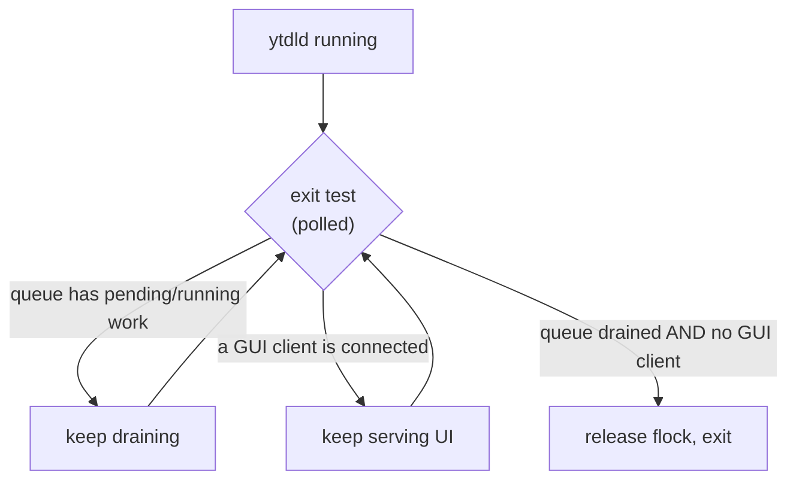

# ADR-0008 — Daemon lifecycle: long-lived, session-scoped — no always-on service

- **Status:** accepted
- **Date:** 2026-07-23
- **Context:** [ADR-0003](0003-engine-language-go.md) (one engine; `ytdld` owns the
  queue *and* serves the GUI), [ADR-0007](0007-cycle2b-queue-daemon.md) (the
  on-demand daemon shipped in Cycle 2B-core, whose always-on question was
  explicitly deferred to Cycle 3), [roadmap.md](../roadmap.md) Phase 6 (GUI)
- **Refines:** [ADR-0007](0007-cycle2b-queue-daemon.md) — resolves its deferred
  "always-on daemon? revisit in Cycle 3" question.

## Context

Cycle 2B-core ships an **on-demand** daemon: `ytdl -b` enqueues and self-execs
`ytdld`, which drains the spool under the concurrency cap and **idle-exits** after
~20 s of continuous emptiness (ADR-0007 §3–4). There is no resident process.

Cycle 3 (the GUI, roadmap Phase 6) makes `ytdld` also serve the local web UI
(`net/http` + SSE). A web server must stay up **across the whole browsing
session** — it cannot idle-exit after 20 s while the user is still looking at the
page. ADR-0003 already frames the queue daemon and the GUI server as *one*
process; ADR-0007 called that a "genuinely long-lived service" but **deferred**
the question of *how* long-lived: is it an always-on service started at login
(a `launchd` LaunchAgent with `RunAtLoad` + `KeepAlive`), or something lighter?

Maintainer constraints (confirmed 2026-07-23):

1. **No idle process** running when `ytdl` is not being used.
2. **Installation stays simple** — no `launchd` plist installed by default
   (consistent with ADR-0003's "installation must stay simple").

## Decision

**No always-on daemon.** `ytdld` is *long-lived but session-scoped*: it lives only
as long as it has a reason to. Its lifetime is the **union** of two conditions:

> **daemon alive  ⟺  (a GUI client is connected)  OR  (the queue has pending/running work)**

Equivalently, the **exit condition** is a conjunction: the daemon exits only when
the **GUI is closed AND the queue is drained**. Concretely:

- **CLI-only (no GUI)** — unchanged from Cycle 2B-core: spawned on enqueue,
  idle-exits when the queue drains. This is the special case with *no* GUI client.
- **GUI open** — the daemon stays up to serve the UI, regardless of queue state.
- **GUI closed with work still queued** — the daemon **persists** (keeps draining)
  until the queue empties, then exits. The GUI **warns on close** when work remains
  queued: *"Vuoi uscire? Hai download in coda."*

This is a clean generalization of 2B-core's idle-exit ("queue empty for ~20 s") —
it adds an **"AND no GUI client connected"** clause to the exit test. The daemon
gains a "GUI client connected" signal (e.g. an active SSE connection / session
count) alongside the existing queue-emptiness check.

**No `launchd` LaunchAgent** with `RunAtLoad` + `KeepAlive` (always-resident) is
installed. The default install remains plist-free.

## Alternatives considered

- **Always-on service (`launchd` LaunchAgent, `RunAtLoad` + `KeepAlive`)** —
  rejected. A resident process while the tool is unused, plus a plist in the
  installer, is disproportionate for a personal music downloader. Its only unique
  benefit — "the GUI is always reachable at a fixed URL without launching
  anything" — is better served by a menu-bar / "open GUI" action that starts the
  server on demand.
- **`launchd` start-on-work (`QueueDirectories` / `WatchPaths`)** — not now, but the
  sanctioned **future opt-in**. The OS starts `ytdld` when the spool receives a
  job; it drains and exits, with **no resident process**. This covers the niche
  "resume downloads after a reboot / unattended drain" cases without `KeepAlive`.
  Deferred as an explicit opt-in, never a default.
- **Pure idle-exit, ignoring the GUI (2B-core behaviour unchanged)** —
  insufficient for Cycle 3: the web server would idle-exit after 20 s while the
  user is still viewing the UI.

## Consequences

- **Cycle 3** splits `ytdld` into `cmd/ytdld` (per ADR-0003/0007) implementing this
  lifecycle: the exit test gains the "GUI client connected" clause; a
  "downloads still queued" guard lives in the GUI's close flow.
- **The installer stays plist-free by default.** Any `launchd` integration
  (start-on-work) is a later opt-in, not part of the base install.
- **The CLI UX (Cycle 2C) is designed daemon-lifecycle-agnostic:** live work is read
  from the spool, history from the log store, daemon liveness is *informational*
  (never "daemon down = error"). The same CLI surface is correct whether the daemon
  is on-demand, session-scoped, or a future start-on-work agent — no rework across
  Cycle 3.
- **Single source of state preserved.** The spool remains the queue's truth for both
  front-ends (ADR-0003/0007); this ADR only changes *when the process lives*, not
  *where the state lives*.
