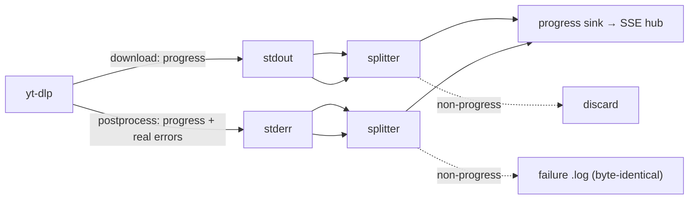

# ADR-0010 — Cycle 3 Web GUI: single binary, SSE progress, authenticated local API

- **Status:** accepted
- **Date:** 2026-07-24
- **Context:** [ADR-0003](0003-engine-language-go.md) (one engine, web UI served by
  the Go daemon), [ADR-0007](0007-cycle2b-queue-daemon.md) (the on-demand queue
  daemon), [ADR-0008](0008-daemon-lifecycle.md) (session-scoped daemon lifetime),
  [ADR-0009](0009-cycle2c-cli-ux.md) (the spool-vs-log-store state model the GUI
  reuses), [roadmap.md](../roadmap.md) Phase 6 / improvement
  [E2](../improvements.md).
- **Refines:** [ADR-0008](0008-daemon-lifecycle.md) — implements its lifetime rule
  and keeps the single-binary shape (see Decision 1).

## Context

Cycle 3 delivers the GUI (roadmap Phase 6, improvement E2): a browser interface
for non-developer users to start a download and watch live progress, launch
background downloads, see the queue and recent history, and edit settings —
without the Terminal. It is a **front-end over the existing engine**, not a
reimplementation: the queue spool is the job state, the config file is the
settings, the log store is the history (ADR-0003/0007/0009). Runtime is `net/http`
+ Server-Sent Events, standard library only, no new dependency.

This cycle's scope was **6b (the web UI)**; the 6a AppleScript MVP is deferred. By
maintainer decision the GUI queue is **read-only** — `cancel`/`retry` remain
Cycle 2B-plus.

Four questions had to be settled to build it, and one whole class of problem —
**local HTTP security** — surfaced in adversarial review and reshaped the design.

## Decisions

### 1. One binary, not a separate `cmd/ytdld`

ADR-0008's consequences mentioned "splits `ytdld` into `cmd/ytdld`". We keep the
**single binary** instead: the existing self-exec `__daemon` role gains an opt-in
`--gui` flag and, when set, also serves the web UI.

- **Why:** ADR-0008's own governing constraint is "installation stays simple". A
  second binary means a second cross-compile target, a second checksum, and a
  second file for the installer to place — real cost against ADR-0008's reason for
  existing. The `__daemon` role already works; extending it is cheaper and changes
  nothing for the installer or release pipeline.
- The daemon still imports only `internal/queue` + the standard library; the web
  server lives in a new `internal/webui` package, wired in `cmd/ytdl`.

### 2. Live progress: capture BOTH of yt-dlp's output streams, off the golden path

The GUI's progress bars need per-job progress, which the silent runner discarded.
yt-dlp emits `--progress-template` output on **two** streams, verified against
yt-dlp 2026.07.04:

- `download:` progress → **stdout**
- `postprocess:` progress → **stderr**

The runner routes each through a line-splitter that sends our sentinel-marked
progress lines to a per-job sink and everything else to its original sink
(stdout → discard, as `/dev/null` did; stderr → the failure `.log`, byte-for-byte).
The extra `--progress`/`--newline`/`--progress-template` args are appended **after**
`core.BuildArgs`, so `internal/core` stays byte-identical and the golden parity
gate holds. A nil sink (every CLI-only path) adds no args and is the pre-Cycle-3
behaviour exactly.

Progress is parsed from yt-dlp's **raw numeric** fields (`downloaded_bytes`,
`total_bytes`, `speed`, `eta`), not its pre-formatted `_*_str` ones: the latter
carry ANSI colour under a user's `--color always`, which would silently defeat
every parse. The title is emitted with the `j` (JSON) conversion so a newline in a
video title cannot corrupt the `.log` or forge a progress event.

### 3. Config write API for the settings editor

`config.Save(path, Settings)` is the inverse of `LoadFile`: a canonical
`key = value` document, **whitelist keys only** (so the editor can never inject a
key that would reach the yt-dlp argv), written atomically (temp file + fsync +
rename). It **validates before writing** — a value `LoadFile` would reject is
refused, so the editor can never report success while the value silently snaps
back to a default. It follows a symlinked config (a dotfiles repo), preserves the
existing file mode (a deliberate `0600` is not widened), and writes `$HOME`-relative
paths so a saved config stays portable between machines.

### 4. Session-scoped lifetime with a "GUI connected" signal (implements ADR-0008)

The daemon's exit test gains the ADR-0008 clause: it exits only when the queue is
drained **AND** no GUI client is connected. "Connected" = at least one live SSE
connection. A **first-client grace** covers the gap between `ytdl gui` spawning the
daemon and a cold browser connecting, so the URL just printed is never dead. The
browser warns on close while work remains queued ("Vuoi uscire? Hai download in
coda."). With no GUI (`ytdl -b`) the behaviour is exactly Cycle 2B-core idle-exit.

### 5. The local API is authenticated; the GUI is opt-in per spawn

Adversarial review showed a loopback bind and a `Host` check are **not enough**. A
`Host` check stops DNS rebinding, but **any web page the user visits can POST to
`http://127.0.0.1:<port>/`** — the browser supplies a valid `Host` itself, and a
`text/plain`/`<form>` body is a CORS-"simple" request with no preflight to block.
Because `core.BuildArgs` appends the URL as the last argv element with no `--`
separator (and is frozen by the parity gate), an unvalidated URL beginning with
`-` reaches yt-dlp as an **option** — e.g. `--update-to=<repo>@<tag>`, which makes
yt-dlp replace its own binary from an attacker's GitHub repo: remote code
execution from merely visiting a page while the GUI is open.

Four independent defences, each closing a case the others do not:

1. **Per-session token.** The GUI daemon writes a random token to a `0600` file;
   `ytdl gui` opens the page with `?t=<token>`, which the server exchanges for a
   `SameSite=Strict` cookie and redirects to strip the secret from the URL. A
   cross-site page cannot read the cookie; another local user cannot read the file.
2. **Origin check** on every `/api/` request — a present, non-loopback `Origin` is
   refused.
3. **`Content-Type: application/json` required on writes** — kills the
   preflight-free `<form>` and `text/plain` shapes.
4. **URL validation** — `http`/`https` only, never a leading `-`.

And the API is only opened when asked for: the web server runs **only** in a
daemon spawned with `--gui` (i.e. by `ytdl gui`). A daemon spawned by `ytdl -b`
stays headless and opens no socket at all — restoring the pre-Cycle-3 surface —
so a page cannot enqueue downloads or pin the daemon alive after an ordinary
background download.

**Port ownership and queue ownership are deliberately separate.** `ytdl gui` owns
the loopback port and serves immediately, even if a headless daemon from an
earlier `ytdl -b` still holds the queue lock; it retries the lock until that
daemon idle-exits, then drains itself. The whole UI works meanwhile (enqueue,
queue, history, settings all go through the shared spool and config); only live
progress needs queue ownership. This avoids the failure where binding before the
lock left the queue owner permanently GUI-less.

## Alternatives considered

- **A separate `cmd/ytdld` binary** (ADR-0008's literal wording) — rejected for
  the installation-simplicity reason in Decision 1.
- **Capturing progress from stderr only** (the first implementation) — wrong:
  yt-dlp writes download progress to stdout, so the bar never moved against real
  yt-dlp. Caught only because the review verified against the real tool; the test
  fake had encoded the same wrong assumption.
- **Loopback bind + Host check as the whole security model** — insufficient: it
  stops DNS rebinding but not ordinary CSRF, which on this codebase escalates to
  RCE via yt-dlp argv injection. A token was mandatory.
- **A resident always-on GUI service** — already rejected by ADR-0008.

## Consequences

- **Parity preserved.** `internal/core` is byte-identical to `main`; all progress
  machinery is appended after `BuildArgs` or lives in new packages.
- **CLI unchanged.** `ytdl -b` opens no socket; exit codes, output text (bar the
  new `--help` "INTERFACCIA GRAFICA" section), and the spool format are unchanged.
- **New surface:** `ytdl gui`; `internal/webui`; `config.Save`; `run.RunQueued` +
  the progress seam; `daemon.Config.LiveClients`/`FirstClientGrace` and
  `SpawnGUI`; `daemon.Config.Run` now takes a `queue.Claim` (so the runner can key
  progress by spool id). `$YTDL_GUI_PORT` overrides the default loopback port 8765.
- **Known deferrals** (recorded so they are not rediscovered): a `concurrency`
  change from the editor applies to the **next** GUI session, since the running
  pool reads it once at start; each SSE client polls the spool at ~1 Hz and the
  terminal-spool prune runs at daemon start (fine for a personal tool, revisit if
  a session runs for days); `PUT /api/settings` is a whole-document overwrite (the
  SPA always sends every field, and the empty-`concurrency`-means-`unlimited` trap
  is closed in the UI). The 6a AppleScript MVP and GUI `cancel`/`retry` remain
  planned, not done.
