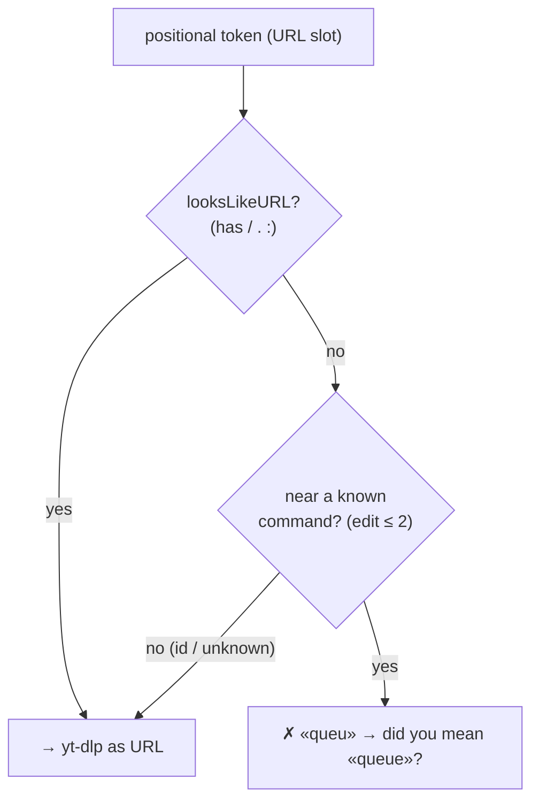
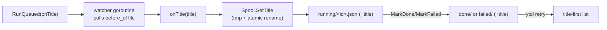

# ADR-0012 — Cycle 4: command/URL disambiguation + job title in queue views

- **Status:** accepted
- **Date:** 2026-07-24
- **Context:** [roadmap.md](../roadmap.md) (Cycle 4 — a second CLI UX pass),
  [ADR-0007](0007-cycle2b-queue-daemon.md) (the spool + per-job settings snapshot
  this builds on), [ADR-0009](0009-cycle2c-cli-ux.md) (the first CLI UX pass and the
  `--watch` region redraw this must not break),
  [ADR-0011](0011-cycle2b-plus-cancel-retry-hardening.md) (cancel/retry, whose lists
  this cycle enriches). The Bash parity contract
  ([go-port-parity-contract.md](../go-port-parity-contract.md)) still holds:
  `core.BuildArgs` and every golden reference stay byte-for-byte identical.
- **Scope:** Cycle 4 — a UX pass driven by two maintainer findings from real use.
  (1) A mistyped subcommand was forwarded to yt-dlp as a URL. (2) The queue / retry /
  cancel views showed only a truncated URL, so a user could not tell which video a
  job was. **Out of scope (deferred):** the dedicated Phase-5 hardening cycle
  (auto-retry/backoff + rate-limit), the 6a AppleScript MVP, and the future GUI
  multi-page/UX overhaul.

## Context

Two problems surfaced in day-to-day use:

1. **`ytdl queu` tried to download "queu".** The parser recognises subcommands only
   at `args[0]`; any other bare positional becomes the URL and is handed to yt-dlp,
   which fails with an opaque `ERROR: [generic] 'queu' is not a valid URL`. A typo of
   a real command reads as a cryptic download failure.
2. **Jobs were unidentifiable.** `ytdl queue`, `ytdl retry` and `ytdl cancel` showed
   a scheme-trimmed, 40-character URL stub and no title. Faced with
   `youtube.com/watch?v=6TSBMYQZq9Q&list=RD…`, the user cannot tell which video it is
   and so cannot choose consciously what to cancel or retry.

Both fixes live in the CLI/runtime layers; neither touches `core.BuildArgs` or the
goldens (parity preserved), and — a deliberate design goal — neither touches the
`internal/daemon` package, which stays queue+stdlib only (ADR-0007).

## Decisions

### 1. Disambiguation is command-similarity, not a URL allow-list

The naive fix — "reject a positional that does not look like a URL" — is **wrong**,
because yt-dlp accepts inputs that are neither URL-shaped nor commands. Verified
against yt-dlp 2026.07.04: a **bare 11-character YouTube video id** (`dQw4w9WgXcQ`)
and **bare playlist ids** are accepted by the extractor and download correctly.
`ytdl dQw4w9WgXcQ` has always worked; a URL allow-list would break it. (This was the
CRITICAL finding of the Cycle-4 adversarial review — the first design *did* use an
allow-list and *did* regress bare ids.)

So the guard keys on **similarity to a known command**, not on URL shape:

- A positional that is **URL-like** (`looksLikeURL` — contains any of `/ . :`, which
  covers `http(s)://…`, scheme-less `youtube.com/…`, and `ytsearch:…`) is always
  passed straight through.
- A **bare word** (none of `/ . :`) that is within a small Levenshtein distance
  (≤ 2, and < the command length) of a known subcommand
  (`queue|status|history|gui|cancel|retry`) is almost certainly a mistyped command:
  it is rejected with a "did you mean" hint.
- A bare word that is **not** near any command (a video id, a playlist id, or an
  unknown token) is passed through to yt-dlp untouched — exactly the pre-Cycle-4
  behaviour, so no valid input is ever lost.
- `ytdl -- <token>` still forces any token through as the URL (the documented escape
  hatch, surfaced in the error text).

This is a deliberate, documented divergence from the Bash parser, in the same spirit
as the C1/C3 parse fixes — and it leaves `internal/core` untouched.

### 2. The title travels on the job, written back by the run layer

`queue.Job` gains a `Title` field (`json:",omitempty"`, so pre-existing job files
still parse). It is filled in **while the job runs**, so `ytdl queue` names the
in-flight job and `ytdl retry` names a failed one:

- The queued/silent run already resolves the "Artist - Track" title into a
  `before_dl` temp file as part of the ordinary metadata pipeline (no new yt-dlp
  flags, headless included). `RunQueued` gains an `onTitle` callback; a watcher
  goroutine reports the title the moment that file lands, plus a final flush after
  the process exits (covering a job that finished before the first poll tick).
- `cmd/ytdl`'s `jobRunner` wires `onTitle` to a new `queue.Spool.SetTitle`, which
  rewrites `running/<id>.json` via a tmp file + atomic rename. The title then travels
  into `done/` or `failed/` with the file (a pure rename), so `retry` reads it off
  `failed/`.
- **The daemon package is not touched.** The write-back is a run-layer callback wired
  by the CLI edge, so `Config.Run` keeps its `int` return and the daemon stays I/O-
  agnostic. The watcher goroutine is joined (in a `defer`, panic-safe) before
  `RunQueued` returns, and the daemon's terminal `MarkDone`/`MarkFailed` runs only
  after that — so a `SetTitle` can never race the terminal rename.
- **Playlists are excluded**: a playlist's per-item `before_dl` title would
  misrepresent the whole job, so no title is written back and the view flags it as
  `(playlist)`.

**Retry also enriches from history at zero network cost.** A job that failed *before*
metadata resolved (or was queued before the write-back existed) has no title on its
spool record. `runRetryCmd` looks the URL up in the durable history
(`logstore.TitleForURL`/`TitleIn`, matched on the same normalized-URL identity as
breadcrumbs), using each job's **own snapshotted `Settings.LogDir`** (ADR-0007), and
loading each log dir at most once. Only the one-shot `retry` command does this — never
the live `queue --watch` redraw.

### 3. Rendering shows title + full URL; `--watch` clips by display columns

Each job renders title-first (when known) with its **full, untruncated URL** on the
line below. One-shot views (`queue`, `cancel`, `retry`) print the whole URL — a
wrapped line is harmless without a redraw. The in-place `queue --watch` redraw,
however, counts logical newlines and assumes one logical line = one physical row; a
wrapped line desyncs its cursor-up math and corrupts the display for the rest of the
session. So in `--watch` every line — job lines and the fixed header/section/footer
and the spinner alike — is capped to the terminal width (`term.Width`, an
`TIOCGWINSZ` ioctl, 80-column fallback).

Crucially, the cap is measured in **display columns, not runes**: East-Asian-wide and
emoji runes occupy two columns (`term.DisplayWidth`/`term.Clip`), and CJK/emoji video
titles are ordinary on YouTube. (Rune-based clipping was the second CRITICAL review
finding — a routine Japanese title overflowed an 80-column terminal and corrupted the
redraw.)

## Alternatives considered

- **Finding 1 — require an `http` prefix / positive URL allow-list.** Rejected: it
  wrongly rejects scheme-less `youtube.com/…`, `ytsearch:…`, and — the CRITICAL —
  bare video/playlist ids that yt-dlp accepts. Command-similarity loses nothing real.
- **Finding 1 — an explicit `download`/`get` subcommand.** Rejected: breaks the
  ergonomic `ytdl <url>` and every existing script.
- **Finding 2 — resolve the title at enqueue** (`yt-dlp --print title`). Rejected at
  design time: blocks `ytdl -b` on a network round-trip and fails on private/removed
  URLs. The run-layer write-back is instant to enqueue and reuses the title the
  pipeline already resolves.
- **Finding 2 — widen `Config.Run` to return the title (an `Outcome` struct).**
  Rejected: unnecessary. The run-layer callback keeps the daemon package untouched.
- **Finding 3 — physical-row accounting in `--watch` (let lines wrap, count rows).**
  Rejected: relies on terminal auto-margin quirks; clipping every line to the width is
  simpler and more robust.

## Consequences

- **Parity preserved.** `internal/core` and the goldens are byte-unchanged; the title
  comes from the existing `before_dl` pipeline, not a new argv. `internal/daemon` is
  unchanged.
- **Backward compatible.** `Job.Title` is `omitempty`; job files written before this
  cycle parse unchanged (empty title → the URL is shown).
- **Accepted residual risks / minor limitations:**
  - `ytdl -v queue` (a real command name after a flag, so not at `args[0]`) suggests
    itself (`«queue» → «queue»?`). Rare; a pre-existing dispatch limitation newly
    visible.
  - The `TIOCGWINSZ` constant is correct for the supported build matrix (darwin/linux
    on amd64/arm64); a few exotic Linux arches (mips, ppc64) would mis-probe —
    harmless (a bounded wrong number, or the 80-column fallback) and off-target.
  - `term.DisplayWidth` is an approximation of the common wide ranges; it errs toward
    over-counting (a clipped line is at worst a little short, never wide enough to
    wrap).
