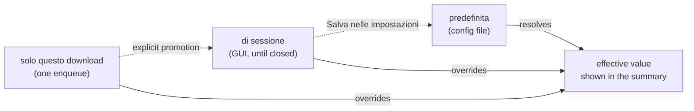
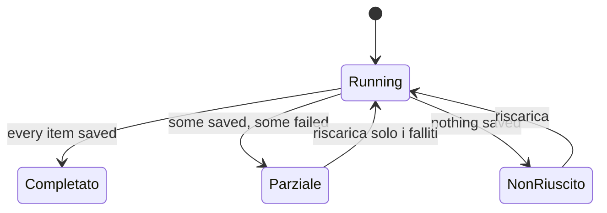

# ADR-0014 — The scope of a per-download choice, and partial outcome as a first-class state

- **Status:** accepted
- **Date:** 2026-08-03
- **Context:** the maintainer's hands-on verification of Cycle 5 at **gate C**.
  The findings register is [improvements.md § Gate-C findings](../improvements.md#gate-c);
  sequencing is in [roadmap.md](../roadmap.md).
- **Amends:** [ux-principles.md](../ux-principles.md) §3 (vocabulary), §4 (a new
  scope rule) and §5 (marks) — the normative document established by
  [ADR-0013](0013-cycle5-unified-ux.md), which requires that any cycle either
  conform to it or amend it here.
- **Builds on:** [ADR-0013](0013-cycle5-unified-ux.md) (task model, shared
  vocabulary, the extended history record and its derived identity),
  [ADR-0011](0011-cycle2b-plus-cancel-retry-hardening.md) (cancel/retry, no
  residue), [ADR-0006](0006-cycle2a-logs-breadcrumbs-notifications.md) (per-item
  breadcrumbs).

## Context

Cycle 5 designed both channels from the user's tasks and wrote the result down as
a normative document. Gate C then put it in front of the person who uses it, and
twenty-six findings came back. Most are ordinary defects with ordinary fixes.

Two of them are not, because the same root cause keeps producing new symptoms:

1. **Three of the Download view's controls decide the scope of a choice, and each
   one decides it differently.** The folder field says "vale solo per questo
   download" and is in fact remembered until the tab closes; the playlist
   checkbox is remembered and says nothing; the format select is remembered and
   nobody ever considered the question. Meanwhile a *fourth* scope — the session
   override — lives two views away, in Impostazioni, with a button whose effect
   is invisible. The user cannot see which folder is in force, cannot tell a
   one-shot choice from a durable one, and gets no signal when the two disagree.
   Nothing in `ux-principles.md` covers this: §3 has no word for "for this
   download only", and no rule says what a control does after it has been used.

2. **The history record cannot express "it mostly worked".** A download is
   `success := rc == 0 && count > 0`, and yt-dlp exits non-zero when any playlist
   item failed — even under `-i`, which the playlist path always passes. So a
   playlist that saved twenty-one tracks and lost one to an age check is recorded
   as ✗, with the count of what it saved sitting next to the mark that says it
   saved nothing useful, and with the failure reason of the single item presented
   as the reason for the whole job. Everything downstream inherits the lie: the
   notification, the CLI history row, the GUI row, and "Riscarica", which can only
   offer to do all twenty-two again.

Both are model gaps, not bugs, so they are settled once here rather than patched
per surface.

## Decisions

### 1. A per-download choice is one-shot; a durable choice is promoted on purpose

Three scopes exist. They get three names, used in both channels and in every
document:

| Scope | Name (it) | Lives | Set from |
|---|---|---|---|
| built-in / config file | **predefinita** | forever, on disk | Impostazioni · `ytdl config` · the config file |
| the running GUI | **di sessione** | until the GUI is closed | promoted from the Download view; shown and revocable in Impostazioni |
| one enqueue | **solo questo download** | one job | the Download view controls |

Four rules follow, and they apply to **every** per-download control — folder,
format, playlist — not only to the one that happened to be reported:

1. **A per-download control returns to the resolved default after a successful
   submit.** Sticky-by-accident is the defect; if the choice should persist, the
   user promotes it.
2. **The effective destination is visible without opening anything.** The
   disclosure summary states the folder that will actually be used and which
   scope it comes from — `Cartella: ~/Music/ytdl (predefinita)`.
3. **Promotion is one explicit act, from where the choice was made**, not a
   second screen with its own vocabulary. A promoted value is reflected wherever
   that scope is displayed; there is one source of truth for it.
4. **A control that has been changed but not applied must say so.** The GUI
   already owns this pattern — the sticky unsaved-changes bar — and any control
   with a deferred effect uses it. A surface may never display a value that is
   not in force without marking it.

**Recorded asymmetry (per `ux-principles.md` §7):** the *session* scope is
GUI-only and stays so. Each CLI invocation is its own process, so a session has
nothing to live in; the CLI's equivalent of promotion is editing the config
(`predefinita`) or passing `-o` per invocation (`solo questo download`). This
also means a GUI session override is invisible to a terminal running alongside
it — the two disagree on purpose, and the GUI label says so.

Settles G2, G3, G4, G12, G13; constrains G14, G16, G24.

### 2. A job has three outcomes, not two

`Completato` · `Completato parzialmente` · `Non riuscito`. The third state is not
a display trick over a boolean: it is derived from facts the runner already has
and currently discards.

- **The record carries the items.** `logstore.Entry` gains the attempted items
  and the succeeded item ids, both `omitempty` — the same discipline as ADR-0013
  §2, so records written before this cycle keep loading and simply offer no
  per-track detail. No migration.
- **Collection stops being conditional.** Per-item capture happens for every
  playlist job, not only when `breadcrumb_on_failure` is on, because the record
  now depends on it and the breadcrumb is a separate concern.
- **`success` stays honest and stops being the whole answer.** A job that saved
  files and lost items is neither ✓ nor ✗; the mark is `!`, which
  `ux-principles.md` §5 already defines as the warning mark, and the row states
  the ratio (`21/22 tracce`). "Never a number without its window" applies: a
  partial count always names the total.
- **The failure reason of one item is never presented as the reason for the
  job.** With items recorded, the inline reason for a partial outcome says how
  many failed; the per-item detail is one step away, per §2's tiering.
- **Retry acts on what failed.** "Riscarica" on a partial record offers the
  failed items, and the whole job only on request. The mechanism is a design
  question for the cycle that implements it (item ids are stable, playlist
  indices are not), and whatever it chooses is **appended after
  `core.BuildArgs`**, as `TempRedirectArgs` already is, so the byte-exact argv
  parity gate is untouched.

Settles G19, G20; forces G21 (bigger records make the unbounded-file scan real)
and pairs with G22.

### 3. The reveal label names the folder, not the file manager

*(ruled 2026-08-04)* "Mostra nel Finder" becomes **"Mostra nella cartella"** in
§3, on every platform. It was false on Linux, and naming a product teaches a
non-developer a word they do not need in order to find their music. Its
neighbour — the action offered when the file is gone but its folder is not —
becomes **"Apri la cartella"**, so two adjacent menu items stay one glance apart
instead of differing by a preposition.

"Finder" remains correct in `guida-installazione.md` and `guida-uso.md`, which
describe the actual macOS application, and in code comments about macOS
behaviour. Only the user-facing action labels change: `internal/webui/assets/app.js`
(and the assertion in `spa_test.go`), `internal/cli/messages.go`,
`internal/cli/help.go`.

Settles G9.

### 4. Riprova's GUI surface is deferred, and the asymmetry is recorded

*(ruled 2026-08-04)* §3 lists **Riprova** as a GUI label, but the GUI queue
renders running and pending jobs only — `queueDTO` carries no failed list — so a
job that failed in the spool has no row to carry the verb, and the vocabulary
table has been promising a control that does not exist.

Per §7 the choice is "land it in both channels, or record the asymmetry and its
reason". It is **recorded**, not landed: the closing session takes only fixes
that need no new decision, while showing failed spool jobs means deciding what
that row is (it is neither a queue entry the user still waits on nor a history
record — the same job also appears in the history, where the offered verb is
Riscarica, so two rows would show one job with two different verbs). Cycle 6
reworks that view for the scope model and settles it there.

Settles G11.

## Consequences

- `ux-principles.md` gains a scope section and two vocabulary rows, and its marks
  table gains the partial state. It stays the document both channels are checked
  against.
- Both decisions are **cross-cycle**: decision 1 governs Cycle 6 and constrains
  Cycle 8 (presets may retire the session scope — the Cycle 6 analysis rules on
  that before either is built); decision 2 governs Cycle 7 and reaches the
  notifier, the breadcrumbs, both history renderers and "Riscarica".
- The parity gate is unaffected. Neither decision changes `internal/core`;
  anything new on the argv is appended off the golden path.
- Records grow. A playlist record now carries one entry per item, which turns the
  known "retention 0 means an unbounded `history.jsonl`, and every read is a full
  scan" deferral into work that ships in the same cycle (G21).
- The three-state outcome is a **breaking change for readers of the boolean**:
  every place that branches on `success` must be revisited in one pass, or the
  partial state will silently render as one of the two old ones.

## Alternatives considered

- **Fix only what was reported** (clear the folder field, reset the checkbox).
  Rejected: it leaves the format control sticky for no stated reason, leaves the
  session override invisible, and guarantees the next hands-on session reports
  the same class of finding again.
- **Make every Download-view control durable** (the mirror image: everything
  sticks until changed). Coherent, and rejected because the failure mode is
  asymmetric — a forgotten *durable* playlist flag silently downloads two hundred
  tracks into the wrong folder, while a forgotten *one-shot* choice costs one
  extra click.
- **A fourth scope, "per questa sessione", on each control** (the maintainer's
  own third option for the playlist flag). Rejected: it multiplies the confusion
  the first decision exists to remove.
- **Keep the boolean and mark partial jobs failed, listing the survivors in the
  log.** Rejected: the record would still assert something untrue, and "Riscarica"
  could never be selective.
- **Treat a partial playlist as success when at least one file lands.** Rejected
  for the same reason in the opposite direction — the lost tracks would vanish
  from every surface, which is exactly the report that started this.
