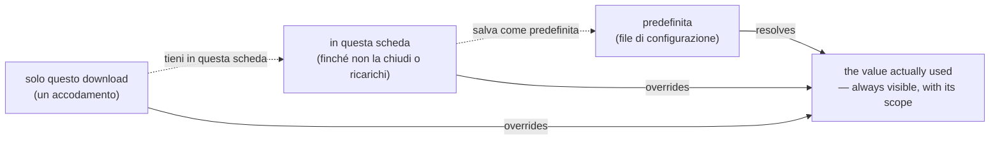
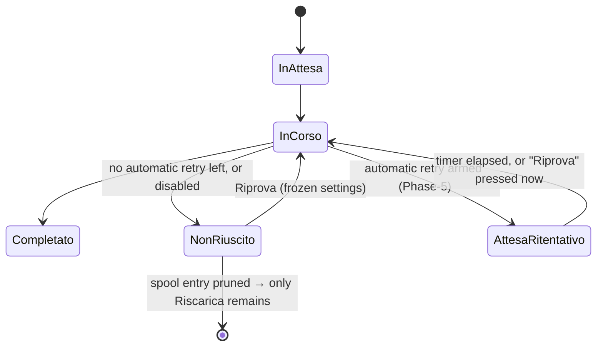

# ADR-0015 — The middle scope is the browser tab, re-runs are faithful, and no control is offered that does nothing

- **Status:** accepted (gate A of Cycle 6, 2026-08-12). These are *rulings*, not a
  design: the interfaces, DOM and endpoints they imply are produced by Cycle 6's
  design phase, which this document constrains.
- **Context:** the Cycle 6 analysis, which the roadmap required to settle whether
  Cycle 8's destination presets retire the middle scope before either is built.
  The analysis also read the code behind every finding it touches, and three of
  the rulings below exist because of what it found there.
- **Amends:** [ux-principles.md](../ux-principles.md) §3 (one vocabulary row) and
  §8 (the middle scope's name and lifetime), both established by
  [ADR-0014](0014-ux-scope-model-and-partial-outcome.md).
- **Builds on:** [ADR-0014](0014-ux-scope-model-and-partial-outcome.md)
  (decision 1: a per-download choice is one-shot, a durable one is promoted),
  [ADR-0013](0013-cycle5-unified-ux.md) (the extended history record and its
  derived identity), [ADR-0011](0011-cycle2b-plus-cancel-retry-hardening.md)
  (`cancel`/`retry` and the spool's terminal states),
  [ADR-0008](0008-daemon-lifecycle.md) (the daemon is session-scoped and
  idle-exits).
- **Constrains:** Cycle 8 (destination presets) and the deferred Phase-5
  hardening cycle (automatic retry with backoff).

## Context

ADR-0014 named three scopes and left one question open on purpose: whether named
destination presets — Cycle 8's subject — make the middle scope redundant. Cycle
6's analysis had to answer that before building the promotion affordance, because
the answer decides what promotion even means.

Reading the code to answer it surfaced four facts that were not in any finding:

1. **The middle scope is not scoped to what its name says.** The override lives in
   `webui.Server.sessOut`, a field of the process started by `ytdl gui`. So it is
   shared by every browser tab pointed at that process, it survives closing the
   tab that set it, and it disappears when the process idle-exits per ADR-0008 —
   which can happen while a tab is merely disconnected (a sleeping laptop), after
   which the field silently blanks on the next state frame. Neither the sharing
   nor the decay is visible anywhere.
2. **"Riscarica" does not re-download to the same place.** `jobs.Again` reuses the
   record's format and playlist flag but resolves the folder from *today's*
   settings, so a job that was enqueued into a one-shot folder comes back
   somewhere else, silently.
3. **A failed spool job cannot say why it failed.** `queue.Job` carries no failure
   reason (`Attempts`/`LastError` are reserved for the Phase-5 cycle), while the
   history record carries the reason, the hint and the log — and nothing links the
   two, because `logstore.Entry` has no spool id.
4. **The per-download folder is as unvalidated as the session one.** G16 named the
   session override; `settingsForRun` passes a per-request directory into
   `Resolve` with no checks either, and the run then creates it.

The rulings below settle the open question and these four facts together, because
they are the same question asked in four places: *which scope decides where this
file lands, and does the surface say so truthfully?*

## Decisions

### 1. Presets are values; scopes are durations. The middle scope stays

A preset answers **which value**; a scope answers **for how long**. They are
orthogonal axes and they compose: any preset can be applied at any scope. So
Cycle 8 does **not** retire the middle scope, and Cycle 8's config representation
(a `preset_<name>` prefix rule) is unaffected by this ADR.

The composition is the affordance Cycle 6 builds and Cycle 8 fills:

| Applying a value… | at scope | costs |
|---|---|---|
| use it for the next enqueue | solo questo download | choosing it |
| keep it for the rest of this tab's work | in questa scheda | one explicit act |
| make it the stored default | predefinita | one explicit act, written to disk |

Rejecting the alternative matters as much as taking this one: had presets retired
the middle scope, Cycle 8 would have been forced to make preset selection sticky
to keep the "all evening onto the USB stick" workflow — reintroducing exactly the
sticky-by-accident behaviour ADR-0014 exists to remove.

### 2. The middle scope is the browser tab, and it is held in the tab

**Name:** "in questa scheda" replaces "di sessione" in every surface and document.
*Sessione* is a word a non-technical user maps onto anything from the browser to
the login; the tab is a thing they can point at.

**Lifetime, stated and true:** in force for **this tab, until it is closed or
reloaded**. Two tabs are independent — the tab that sets a folder is the only one
that gets it.

**Where it lives:** in the page, not on the server. `Server.sessOut` and
`PUT /api/session` retire; `stateDTO.SessionOut` goes with them; the tab sends the
destination it has decided with each enqueue, which is the request field that
already exists. Three properties follow for free, and each one was a defect:

- the sharing across tabs cannot happen, because there is no shared holder;
- the invisible decay cannot happen, because the value dies with the page that
  shows it;
- the server keeps no per-client state, so nothing has to be reconciled after a
  reconnect (the `sessionEpoch` machinery in `app.js` retires with it).

**It is held in a variable, not in `sessionStorage`.** `sessionStorage` survives a
reload, and the ruled lifetime does not. The obvious storage is the wrong one.

**What the CLI does with this:** nothing, unchanged. A CLI invocation is a
process and has no tab; the asymmetry recorded in ADR-0014 §8 stands, now with a
name that makes it self-evident rather than needing the footnote.

Promotion is one explicit act made in the Download view (ADR-0014 §8.3): the
Impostazioni field becomes read-only display plus revoke, so a choice is never
born in one view and made durable in another.

### 3. A re-run is faithful to the destination the original job used

The finding is not that "Riscarica" re-resolves the folder; it is that it does so
**silently**, which makes the surface state something untrue the moment the
current default differs from the one the file actually went to.

- **Riprova** (spool) already reuses the job's frozen settings snapshot. Unchanged,
  and now stated on the row.
- **Riscarica** (history) takes the record's **`Dir`** — the job's resolved output
  directory — not `filepath.Dir(Path)`, which for a playlist is the subfolder
  yt-dlp itself created and would nest a level deeper on every re-run.
- A record with no `Dir` (written before Cycle 5) falls back to the resolved
  default, **and the surface says so before the click**, per §8.2.

### 4. Riprova is the primary action of a failed record while its job still exists

G11's surface is not a new row: it is the row that already exists. The history
record gains the verb for as long as the spool still holds the job, so one job is
one row — with its reason, its hint and its log, which a spool-built row cannot
have (context fact 3).

This needs a link that does not exist today: `logstore.Entry` gains the **spool
job id**, `omitempty`, written by the run layer, which already has the claim id.
No migration — a record without it simply never offers Riprova, exactly the
discipline of ADR-0013 §2. The id is threaded from `jobRunner` through the run
layer to `logstore.Append`; `internal/daemon` is not touched (it only calls the
runner func it is given).

Action ranking per ux-principles §4 — one primary, chosen by state:

| Record state | Primary | Overflow |
|---|---|---|
| failed, spool job still present | **Riprova** | Riscarica · vedi errore · copia link |
| failed, spool entry pruned | **Riscarica** | vedi errore · copia link |
| succeeded, file on disk | **Apri** | mostra nella cartella · riscarica · copia link |
| succeeded, file gone | **Riscarica** | apri la cartella · copia link |

**Riscarica is demoted, not retired.** It is the only verb available for a
succeeded record and for a failed one whose spool entry has been pruned, and the
two verbs stay distinct because their objects are (§3): Riprova re-runs *that job*
with its frozen settings, Riscarica creates a *new* job from the record.

### 5. Manual and automatic retry are one feature with one state

Cycle 6 does **not** build automatic retry — the deferred Phase-5 hardening cycle
owns it (`queue.Job.Attempts`/`LastError` are already reserved for it). But the
states are defined here, so the two cannot land as rival features with rival rows:

- a job waiting for an automatic attempt is **in the queue**, not in the failed
  list, and says what it is waiting for;
- its **Riprova is disabled with the reason and the wait** ("nuovo tentativo
  automatico tra 2 min"), never live-and-conflicting;
- **manual Riprova on such a job means "now, not later"**: it cancels the pending
  automatic attempt rather than adding a second one;
- automatic retry is a setting, off or on, and when it is off nothing in the
  surface implies a wait that will never come.

### 6. Audio quality: one stepped control over the real domain, each step carrying a word

`config.ValidAudioQuality` accepts exactly the eleven integers 0–10, so a stepped
slider covers the **whole** domain and there is no "custom value" case to design
around. The number stays visible — it is what the config file holds, what the
docs describe and what a support question quotes — and gains a word so it means
something to someone who has never met a VBR scale:

| Steps | Word |
|---|---|
| 0 | massima |
| 1–2 | molto alta |
| 3–4 | alta |
| 5 | media |
| 6–7 | bassa |
| 8–10 | minima |

Both channels say the same thing: the GUI renders `3 · alta`, `ytdl config` prints
`qualità audio: 3 (alta)`. The default stays `0`, so no behaviour changes.

**Lossless formats.** `--audio-quality` is emitted unconditionally by
`internal/core`, which is byte-frozen by the parity gate, so the argv does not
change. The ruling is therefore a surface one, and it is the honest half of the
finding: when the chosen format is `flac` or `wav`, the control is **disabled with
its reason** — in the Download view *and* in Impostazioni, following the format
select live — because a control that cannot affect the result must not look like
it can. The stored value is preserved untouched, so switching back to `mp3`
restores the user's choice.

### 7. One validation layer, and a refusal that carries its remedy

Every user-supplied value is validated in **one place**, used by all three
entry points — the GUI handlers, the CLI parser and the config-file reader — so
the same string is judged identically wherever it arrives. The home is
`internal/config`, which already owns `ValidFormat` and `ValidAudioQuality`; this
ADR does not create a new package for it.

**Destination rules:** absolute · exists · is a directory · is writable.

- **Relative paths are refused at input and never rewritten.** A relative
  `output_dir` is resolved by the *daemon's* working directory — which, for a GUI
  launched from the Finder, is nowhere the user means — so making it absolute in
  the reader would have the surface assert a path that is not the one in force. A
  relative value already present in a config file keeps working and is **displayed
  as written, marked as resolved by the engine**.
- **A folder that does not exist is refused, with an explicit offer to create it.**
  In the GUI that offer is a button which re-submits the same request with an
  explicit create flag, so creation is always a separate, deliberate act and never
  a side effect of a typo. In the CLI the error names the exact command
  (`mkdir -p …`). Both channels refuse and both say what to do next (§5); the GUI's
  "what to do next" is a button because its user has no shell — that is the
  channels serving the same rule, not an asymmetry.
- The check runs **when the value is applied**, not only when a download is
  enqueued, so the user learns at the moment they act. This implies a small
  server-side validation call for the GUI (a browser cannot stat a path); its
  design must keep it a *predicate on a supplied path* and never a directory
  listing — it must not become a filesystem browser.

### 8. Completion feedback, and history filters in the URL

- **Completion is announced in the view the user is on**, derived on the client
  from a job leaving the running set, with "Apri" offered on what just finished.
  No new SSE event and no protocol change: the queue frame and the state refresh
  that follows it already carry everything needed. (Cycle 7 may promote this to a
  real event when it introduces the partial outcome; it does not need one now.)
- **History filters and the search live in the hash**, so a reload keeps them and
  Back moves between filter states. Filter chips **push** a history entry; typing
  in the search box **replaces** it, so Back does not walk backwards through every
  keystroke. The hash router must split the route from its query — today it
  matches the whole hash exactly, and would resolve `#/cronologia?q=x` to no view
  at all.

### 9. The CLI carries every concept that exists in it

One system, two interfaces (§7). Landing in this cycle: the scope column in
`ytdl config`; the destination and its scope stated by an enqueue that carries
`-o`/`-f`/`-p`; the audio-quality word; and the same refusal-with-remedy on an
invalid destination. Not landing, because the concept does not exist there: the
tab scope.

## Consequences

- `ux-principles.md` §3 loses the "di sessione" row in favour of "in questa
  scheda", and §8's lifetime clause is restated. Section numbers stay stable.
- `logstore.Entry` gains one `omitempty` field (the spool job id). Records keep
  loading; no migration, per rule 3 of the project instructions.
- `internal/webui` **loses** state: `sessOut`, `PUT /api/session`,
  `stateDTO.SessionOut` and the `sessionEpoch` reconciliation in `app.js`. The
  Cycle 5 tests that assert the session field move with it — this is a deliberate
  removal of the surface those tests were written for, not a regression.
- `internal/core` stays byte-unchanged and `internal/daemon` untouched. The parity
  gate is not involved anywhere in this ADR.
- **Cycle 8 inherits** the preset × scope matrix of decision 1: presets are named
  values applied at a chosen scope, never a fourth scope.
- **The Phase-5 hardening cycle inherits** decision 5: automatic retry must land
  inside the state vocabulary defined here, not beside it.
- A user-visible label changes ("di sessione" → "in questa scheda"), so the guides
  and the changelog are part of Cycle 6's documentation phase, not an afterthought.

## Alternatives considered

- **Keep the middle scope on the server and only fix its truthfulness** (a banner
  stating the real lifetime, a notice when it decays). Rejected: it spends design
  effort explaining a behaviour — one holder shared by every tab — that the user
  did not ask for and cannot benefit from. Moving the value into the tab deletes
  the explanation instead of writing it.
- **Retire the middle scope and let presets cover it.** Rejected by decision 1: a
  preset does not answer "for how long", so the workflow it serves would come back
  as sticky preset selection, which is the defect ADR-0014 removed.
- **Persist the middle scope to disk as a durable, revocable override.** Rejected:
  it is the fourth scope ADR-0014 already turned down, and it would make `-o`'s
  meaning depend on invisible state on the other channel.
- **`sessionStorage` for the tab value.** Rejected: it survives a reload, and the
  ruled lifetime does not. Honesty here is a storage choice.
- **Named quality steps replacing the numbers** (massima/alta/media/compatta on
  four values). Rejected: it makes seven of the eleven valid values unreachable
  from the GUI and needs a "custom" case for config files that use them; the
  stepped slider keeps the domain whole and adds the meaning anyway.
- **A third queue section for failed spool jobs.** Rejected by decision 4: the row
  it would add cannot state why the job failed, while the history row beside it
  can — two surfaces for one job, the poorer one carrying the verb.
- **Retiring "Riscarica" in favour of "Riprova" alone.** Rejected: Riscarica is the
  only verb a succeeded record can offer, and the only one left once the spool
  entry is pruned. Demotion, not removal.
- **Accepting an unknown folder with a warning** ("verrà creata"). Rejected: it is
  today's behaviour with a decoration, and a typo keeps creating folders in places
  the user never meant — which is the finding itself.
