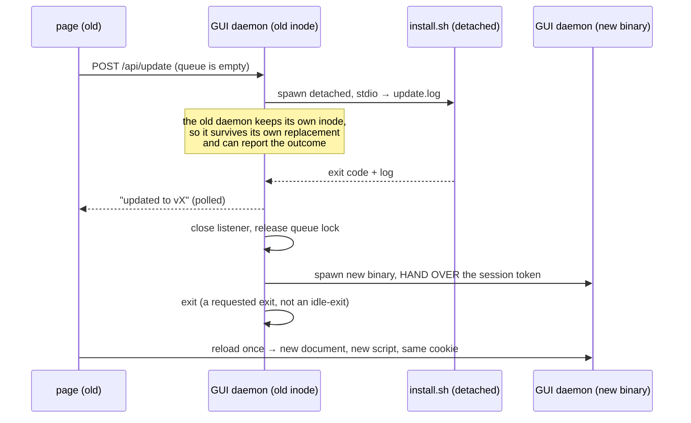

# ADR-0016 — ytdl owns its dependency versions, and the update is one axis the user can see and apply

- **Status:** accepted and **implemented** (gate A of Cycle 6-plus, 2026-08-12;
  revised twice on 2026-08-13 — first by the maintainer's dependency ruling, then
  by the analysis of the maintainer's own reaction latency, which separated the
  pin's *mechanism* from its *policy* in §2–§3; **amended a third time on
  2026-08-13 by what building it found**, §14). These are *rulings*, not a design:
  the interfaces, endpoints, DOM and tests they imply are produced by this cycle's
  design phase, which this document constrains.
- **Context:** the Cycle 6-plus analysis (2026-08-12), which the roadmap required
  to settle the probe, when it runs, consent, and where it lives — before any of
  it was built; plus the maintainer's ruling of 2026-08-13 that yt-dlp's version
  is ytdl's decision and never the user's.
- **Amends:** [ADR-0008](0008-daemon-lifecycle.md) — the daemon gains a third
  exit cause (§9). [ADR-0005](0005-macos-floor-and-single-engine.md) — what the
  installer fetches is now declared by ytdl rather than by upstream's `latest`
  (§2), and the installer becomes idempotent (§11); it remains the single
  provisioning path.
- **Builds on:** [ADR-0010](0010-cycle3-web-gui.md) (the local API, its session
  token and its CSP), [ADR-0008](0008-daemon-lifecycle.md) (the daemon is
  session-scoped and an open SSE connection keeps it alive), and the golden argv
  contract (`internal/core` is byte-frozen).
- **Constrains:** Cycle 6-launch (the launcher starts the same daemon and inherits
  §9's handover), and every future release, which now carries a dependency
  attestation.

## Context

`ytdl --update` has existed since Cycle 1 and works: it re-runs `install.sh`
through `curl … | bash`, and the installer is the single place that fetches and
verifies anything. **Applying an update was never the gap.** The gap is that
nothing *detects* one, and that the GUI — the surface built for the audience that
does not open a Terminal — has no update surface at all. It does not even display
which version it is.

That became urgent on 2026-08-12, when ytdl was installed for its first user who
is not the maintainer, and it exposed a second, deeper gap on 2026-08-13: **ytdl
does not control the versions of the tools it drives.** The installer fetches
`yt-dlp/releases/latest` and an ffmpeg `latest` redirect, so what a user ends up
running is decided by when they happened to install, and no combination is
recorded, tested or reproducible. ytdl builds a fixed yt-dlp command line — that
argv is a frozen contract enforced by golden tests — so which yt-dlp is
compatible is a **property of ytdl**, not a user preference.

## Decisions

### 1. The probe reads two sources, and both comparisons are string equality

`HEAD https://github.com/<slug>/releases/latest` answers `302` with the tag in
`Location`. No API, no rate limit, no token. `api.github.com` is rejected: 60
unauthenticated requests per hour **per IP** is fragile behind shared NAT, and it
buys nothing this needs.

Measured on 2026-08-12, and the reason the second half of this ruling is possible:

| probe | answer |
|---|---|
| `HEAD github.com/alergyonthestage/ytdl/releases/latest` | `302 → …/releases/tag/v2.1.0` |
| `HEAD github.com/yt-dlp/yt-dlp/releases/latest` | `302 → …/releases/tag/2026.07.04` |
| `buildinfo.Version` (release build) | `v2.1.0` — the same `GITHUB_REF_NAME` |
| `yt-dlp --version` | `2026.07.04` — byte-identical to its tag |

Both components already carry, locally, the exact string their tag carries. So
**the comparison is string equality, not version ordering**: no semver parser, no
date parser, no `v`-prefix handling, and none of the bug class that ordering
brings with it.

The second source is `deps.conf` (§2), fetched from the same
`raw.githubusercontent.com/<slug>/<branch>/` the installer itself comes from. It
answers "which yt-dlp should this machine be running", which after §2 is a
different question from "what is the newest yt-dlp" — even when its current
answer happens to be `latest`.

The comparison is therefore **version-neutral**, never "newer than": a pin can
legitimately name an *older* yt-dlp than the one installed (a rollback, §2), and
the surface must present that as "ytdl requires a different version", not as an
upgrade.

A build whose `Version` is `"dev"` is **never** checked and never reported stale.

### 2. ytdl owns its dependency versions: the mechanism is a pin, the policy is separate

The user updates **ytdl**. Which yt-dlp and which ffmpeg that implies is ytdl's
decision — never something the user is asked to arbitrate, and never something
they can get wrong.

That decision is written in **`deps.conf` at the repository root**, beside
`install.sh` and fetched from the same place: the yt-dlp version, the exact
(versioned) ffmpeg build, and ffmpeg's checksums. The installer reads it and
installs exactly what it says.

**`latest` is a legal value for `yt_dlp_version`, and it is the starting policy.**
This separates two things the first revision of this ADR conflated: the
*mechanism* — a file that decides, which ytdl has never had — from the *policy*,
which is whatever that file currently says. Changing policy costs one commit and
no code.

**Why the policy starts at `latest`.** Two failure modes exist and they are not
symmetric:

| | **A** — yt-dlp too old, YouTube changed | **B** — a new yt-dlp breaks ytdl |
|---|---|---|
| frequency | several times a year | rare; never observed here |
| visibility | loud — downloads fail | silent — wrong tags, wrong names |
| who it hits | whoever downloads next | the whole fleet, at once |
| recovery under `latest` | the user clicks update, same day | maintainer pins back: one commit, everyone within the cache TTL |
| recovery under a frozen pin | **nobody can act until the maintainer re-pins** | does not arise |

The maintainer's reaction latency is **weeks** (stated 2026-08-13): ytdl is a
personal tool shared with students, artists and clients, and there are stretches
where its own author does not use it. That is an argument *for* `latest`, not
against it. A frozen pin converts A — frequent, loud, self-healing — into a
failure that waits on one person who may not be looking, several times a year.
And the asymmetry is decisive: **the lever works retroactively for B; nothing
works retroactively for A.** A bad yt-dlp can be undone by a commit after the
fact; a YouTube change cannot be pre-empted by one.

So the pin's primary value is not freezing. It is **having a lever at all** —
today every user is on "latest, forever", with no way back — plus the fleet-wide
remediation property that falls out of §1: because the verdict compares the
machine against `deps.conf`, changing that file makes every installation see it
within the cache TTL, **with no release and no new binary**. That is a remedy
channel this project has never had, and it exists whatever the policy says.

**ffmpeg is pinned hard from day one**, because its economics are the opposite:
ytdl never invokes it (yt-dlp does), its interface does not move, and pinning
buys the checksum that is missing today (§12) plus exact reproducibility, at no
recurring cost.

The binary also embeds, at build time, the versions it was verified against —
used for runtime honesty (§4), never as the source of truth.

### 3. A scheduled canary substitutes for the maintainer's attention

The residual risk of the `latest` policy is B going unnoticed. The maintainer will
not hear about it: the users are students, artists, clients and strangers who
found the repository, and none of them file bug reports — they stop using the
tool. Detection therefore cannot depend on a human noticing.

CI runs a **scheduled canary** against the *newest* yt-dlp that exercises ytdl end
to end, rather than merely checking that the flags parse: a fixture media file
served over local HTTP (yt-dlp's `generic` extractor handles it), ffmpeg from the
runner, and assertions on what actually couples the two programs —

- the produced filename follows the naming rules;
- the ID3 tags are written as expected;
- `--print-to-file after_move:` returned the saved path — how ytdl learns where
  the file went;
- the `--progress-template` lines are still parseable by `internal/run`.

A red canary is an email to the maintainer, which is the entire point: the lever
of §2 is only useful if someone knows to pull it, and at a weeks-long latency that
someone has to be a machine.

**Its honest limit, recorded rather than glossed:** the metadata fallback chain
`%(artist,creator,xartist,uploader)s` is populated by the *extractor*, and the
`generic` extractor is not YouTube's. The canary verifies the pipeline mechanics
and the tag writing, not YouTube's specific field mapping. That is most of the
coupling surface, not all of it.

The same job runs against the pinned version too, so a policy of `latest` and a
policy of a frozen version are both covered by one workflow.

### 4. ytdl runs its own copies of its dependencies, never the system's

`run.PrependLocalBin` prepends `~/.local/bin` to `$PATH` **only when it is absent
from it**; when it is already present but ordered after, say, `/opt/homebrew/bin`,
a Homebrew yt-dlp wins the `LookPath`. So today a user with their own yt-dlp can
silently have ytdl driving a binary ytdl never installed and never tested —
precisely the situation §2 exists to prevent.

Ruling: ytdl resolves `~/.local/bin/yt-dlp` and `~/.local/bin/ffmpeg` **by
absolute path** when they exist, and falls back to `$PATH` only when they do not,
in which case the surface says so rather than pretending the pin holds. A yt-dlp
the user installed for their own purposes is neither touched nor used; ytdl does
not fight the user's system, it simply does not borrow from it.

This is legal against the parity gate, verified: the golden files contain **no
`argv[0]`** — they start at the first flag — and the program name lives in
`internal/run`, outside the frozen `internal/core`.

### 5. The check runs at startup, never as a poll

Recurrence comes from the user starting ytdl again, not from a timer. There is no
periodic wake-up, no schedule, and nothing that runs while ytdl is idle.

A probe is **never** on a hot path. Every surface reads a *cached verdict* — a
file read — and the refresh runs off the critical path, writing the cache for the
*next* invocation. If the process exits before the probe finishes, nothing is
written and nothing is lost.

### 6. Consent is a config key, `update_check`, defaulting to on

It is an outbound call on someone else's machine, so it gets its own whitelist key
and can be turned off from the config file and from the GUI.

It defaults to **on**, because the person this cycle exists for will never open a
settings screen to switch it on, and a default of off would make the cycle
deliver nothing to them. The honesty cost of that default is paid in §8: the
notice says the check exists and where to turn it off.

The key governs the **automatic** probe only. A user who turns it off keeps the
manual check and `ytdl --update`: consent is about the machine phoning home on
its own, not about the user's right to ask.

### 7. Both channels get the notice; the CLI's is automatic, not manual-only

The tempting shortcut — "the CLI user is technical, let them run `ytdl --update`
when they feel like it" — fails on the actual failure mode. yt-dlp breaks when
YouTube changes, in both channels equally, and nobody goes looking for an update
before something breaks. A manual-only check serves only the user who already
suspects.

So the CLI reads the same cached verdict and prints **one line**, and
[ux-principles.md](../ux-principles.md) §7's rule (a capability lands in both
channels) is satisfied rather than waived.

### 8. One axis, and a surface that never claims certainty it does not have

After §2 the user has exactly one question — *is there a newer ytdl for me?* —
and the answer is one verdict with one action, whether what actually changed is
the ytdl binary, the pinned yt-dlp, or both. The dependency versions are shown as
**attributes of the install**, never as a second thing to decide.

Three verdict states exist and stay distinct, because the machine may be offline
or behind a captive portal:

- **an update is available** — the probe succeeded and something differs;
- **up to date** — the probe succeeded and everything matches, *stated with the
  date it was checked*;
- **not verified** — the probe failed or never ran, *stated as such*, with the
  last known result and its date if there is one.

A failed probe is **silent**: never an error dialog, never a red banner, never a
line on stderr about a thing the user did not ask for. It is also never rounded
up to "up to date" — that is [ux-principles.md](../ux-principles.md) §5 and the
whole reason Cycle 5's gate C existed.

The installed versions are *local* facts and are always shown, in both channels,
whether or not the probe ever succeeds.

### 9. The GUI applies an update by handing over to the new binary

No live in-place upgrade, no hot process refresh. The maintainer's ruling is that
the update may cost the process and the page, provided the user never opens a
Terminal.

Four properties make it work, and each is load-bearing:

- **The old daemon survives the installer.** `install.sh` replaces the binary with
  an atomic `mv`; the running process keeps its open inode. That is what lets the
  page be *told* whether the update succeeded, instead of the server vanishing
  mid-operation.
- **The session token is handed to the child.** Each GUI daemon generates a fresh
  token and the browser holds it as a `SameSite=Strict` cookie. A naive restart
  would answer every API call with `401 … riapri l'interfaccia con \`ytdl gui\`` —
  a Terminal, i.e. exactly the acceptance test's failure. `app.js` already
  documents this scenario in its SSE reconnect comment. The handover therefore
  passes the token to the new process, and the outgoing daemon must **not** delete
  the token file it no longer owns.
- **The daemon exits because it was asked to.** [ADR-0008](0008-daemon-lifecycle.md)'s
  lifetime rule — alive while the queue has work OR a GUI client is connected —
  would keep this daemon alive forever, since the tab watching the update *is* a
  connected client. This ADR adds a third exit cause: an **explicit user request**,
  which does not wait for the exit test. It is not an idle-exit and does not
  weaken the clause it sits beside.
- **An empty queue gates the action, not the news.** Ruled by the maintainer, twice
  and in both directions: the update *starts* only when nothing is pending or
  running — which removes the whole class of "what happens to a download in
  flight" — but the **notice is never withheld**. A user with a full queue is told
  there is an update and told what to do about it ("l'aggiornamento parte a coda
  vuota"). Emptiness is re-checked server-side at the click, not only when the
  button was drawn.

### 10. The post-update reload is the one legitimate reload

`spa_test.go` forbids `location.reload(` in `app.js`: "the document must never
reload". That rule is right and stays — with exactly one exception, at the one
moment where the document is *stale by definition*, because the server that will
answer its next request is a different build from the one that served it.

The alternative is worse: a page running the old script against the new server,
looking updated without being it. `handleIndex` already sends `Cache-Control:
no-store` for precisely this pairing, so the reload genuinely fetches the new
document and the new script.

The test is **narrowed, not deleted**: one reload, in the update handover path,
and the prohibition holds everywhere else.

### 11. The installer becomes idempotent, and only now can be

Ruled by the maintainer on 2026-08-13: install and update must not re-fetch what
is already correct. This is a *consequence* of §2 — not of the policy, but of the
mechanism. What made idempotence inexpressible before was not the word `latest`;
it was that nothing ever **resolved** it to a concrete answer and wrote that
answer down.

So the installer resolves the policy first — a version if `deps.conf` names one,
otherwise one redirect read to turn `latest` into a tag — and only then asks
whether anything needs fetching. Each component is compared against that resolved
target and skipped when it already matches; what was actually installed is
recorded in a marker file, so the answer survives across runs and can be shown to
the user. A `--force` path reinstalls regardless, which is what a retry after a
failed update uses.

The payoff is not only bandwidth: the common update — a re-pinned yt-dlp, or a
new ytdl binary alone — becomes seconds instead of minutes, which is what makes
an update from the GUI a reasonable thing to ask a non-technical user to sit
through.

### 12. ffmpeg gets a checksum after all

The previous revision recorded, as a finding for its own cycle, that
`install_ffmpeg` never calls `verify_checksum` — the upstream (martin-riedl)
publishes no sums we consume, so the roadmap's claim that the installer
"checksum-verifies each" component was false for ffmpeg.

§2 dissolves that. Pinning requires a versioned, immutable URL, and the redirect
does resolve to one (verified 2026-08-13:
`…/download/macos/<arch>/<build>_<version>/ffmpeg.zip`). The maintainer therefore
records **its** sha256 in `deps.conf`, and the installer verifies against that
like it already does for the other two.

The honest caveat, which the ADR records rather than glosses: this is the
maintainer's attestation of a build they fetched and tested, not an upstream
signature. It guarantees *immutability* — every user gets the identical artefact
the maintainer verified — not provenance. That is strictly more than today, and
it is the most this channel can offer.

### 13. A break-glass remedy, in the hint catalogue and nowhere else

A user whose downloads have started failing because their yt-dlp is behind what
YouTube now needs must not have to understand any of the above. The remedy goes
where the existing failure-hint catalogue already lives (`internal/jobs/hint.go`,
the G8 surface): a download that fails with the signature of an outdated
extractor gets a hint that names updating as the next step.

It is deliberately **not** a flag, a config key or a GUI control. Those would hand
the user back the decision §2 took away; a hint fires only at the moment the user
is already stuck, and says the one thing that helps. This is the only concession
this ADR makes to the stranded case, and it is enough because §2's policy is
`latest` — the update the hint points at is genuinely there.

### 14. What building it corrected (amendment, 2026-08-13)

Three things the implementation established that §1–§13 got wrong or left open.
They are recorded here rather than only in the commits, because each is a ruling
in its own right and a future reader will otherwise re-derive it.

**14.1 ffmpeg's build id is per ARCHITECTURE.** §2 and §12 assumed one
`ffmpeg_build` could name the pinned build. It cannot: upstream builds macOS
arm64 and amd64 separately and stamps them with different ids — measured
2026-08-13, `1785863997_9.0` and `1785871427_9.0` for the same ffmpeg 9.0. So
`deps.conf` declares one per architecture, and both readers resolve the machine's
own, exactly as they already resolve `latest` into a tag. A pin that names every
architecture except the running one **aborts**; it never falls back.

**14.2 The Go probe tolerates an unknown key; `install.sh` still refuses one.**
The design asked both to fail closed. That is right for the installer — it is
fetched from the same commit as `deps.conf`, so a key it does not know is a typo
in the pin, and refusing costs nothing. It is wrong for the probe: a deployed
binary is arbitrarily older than the file it reads, so a key added by a later
cycle would make the pin unreadable for **every existing installation**, dropping
the whole fleet to "non verificato" — and stopping it seeing the very update that
teaches it the new key. That is the exact inverse of the property §2 exists for.
The probe therefore fails only on what it actually needs and cannot get.

**14.3 §4 was not true for ffmpeg until `--ffmpeg-location`.** Resolving ytdl's
dependencies by absolute path achieves §4 for yt-dlp, which ytdl execs. It does
nothing for ffmpeg, which **ytdl never invokes** — yt-dlp does, off the `$PATH` it
inherited. So the pin stated which ffmpeg was *installed* while a Homebrew one,
earlier on `$PATH`, did the converting: the same ordering hole, one process
further down. yt-dlp is now told the directory of our own copy, appended after
`core.BuildArgs` exactly as `TempRedirectArgs` is, and only when the copy is
ours — a `$PATH` ffmpeg is one yt-dlp would have found by itself, and naming its
location would claim an ownership ytdl does not have.

### 15. The cost of pinning ffmpeg, stated (amendment, 2026-08-13)

§12 records what the checksum buys. It does not record what the pin costs, and
the omission would read as an oversight rather than an accepted trade.

Pinning replaces a moving target with a fixed one, and **a fixed URL can 404**.
The `latest` redirect could never fail that way. A pinned build can, the day
upstream stops serving it — and then *every new install* breaks, where before it
would merely have fetched something untested. Upstream's index advertises only
the current build per architecture; whether older builds stay reachable is
**unverified**, and this ADR does not pretend otherwise.

The trade is still worth taking, because the failure is **loud, immediate and
one commit from fixed** — the installer aborts naming the URL it could not
fetch, and a new pin reaches every installation within a day — whereas the thing
it replaced was silent: an unverified ffmpeg installs perfectly and says nothing.
A loud failure with a same-day remedy beats a silent one with none.

If it does bite, the durable answer is **not** a fallback to `latest`, which
would dissolve the guarantee the moment it is needed. It is to mirror the four
zips as ytdl release assets, putting availability *and* provenance in the
maintainer's hands. That is a cycle of its own, not a patch, and it is recorded
here so nobody reaches for the fallback instead.

## Consequences

- A new package owns detection (`internal/update`), and **`internal/core` and
  `internal/daemon` are untouched**: the daemon takes everything by injection from
  `cmd/ytdl`, so the periodic-check question the roadmap raised is answered
  without amending the parity constraint. The handover in §9 is composition-root
  work in `cmd/ytdl`; the dependency resolution in §4 is `internal/run`.
- **`install.sh` is now in scope** (§11), reversing this ADR's first revision. It
  is the most safety-critical file in the repository, so its existing pure-bash
  test suite (`tests/test-installer.sh`) grows with it — the idempotence and the
  `deps.conf` parsing are testable without a network and must be tested.
- **`deps.conf` becomes a maintenance surface with real power.** One commit
  changes what every installation fetches, within a day, with no release. That
  cuts both ways, so it carries the same care a release does: the canary (§3) is
  what keeps it honest, and the policy value is reviewed whenever the canary goes
  red.
- **The maintainer takes on no recurring obligation.** With the policy at `latest`
  there is nothing to bump on a schedule; the only human step is reacting to a red
  canary, which arrives as an email rather than as a user complaint that never
  comes.
- `ux-principles.md` gains nothing new: §5 (never a claim that is not true), §7
  (a capability lands in both channels) and §4 (an action that cannot work is
  disabled with a reason) already decide the surface.
- The acceptance test is a person who is not the maintainer: from "there is an
  update" to "I am on it", from the GUI alone, with nobody at their keyboard.
