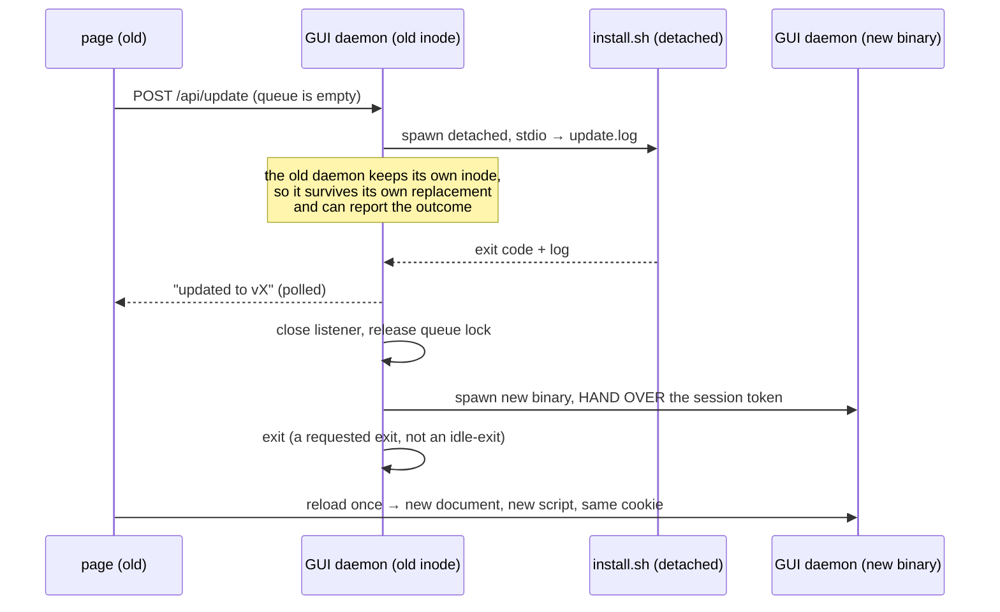

# ADR-0016 — ytdl owns its dependency versions, and the update is one axis the user can see and apply

- **Status:** accepted (gate A of Cycle 6-plus, 2026-08-12; revised 2026-08-13 by
  the maintainer's dependency ruling, which changed §2–§4, §7 and §9–§10). These
  are *rulings*, not a design: the interfaces, endpoints, DOM and tests they imply
  are produced by this cycle's design phase, which this document constrains.
- **Context:** the Cycle 6-plus analysis (2026-08-12), which the roadmap required
  to settle the probe, when it runs, consent, and where it lives — before any of
  it was built; plus the maintainer's ruling of 2026-08-13 that yt-dlp's version
  is ytdl's decision and never the user's.
- **Amends:** [ADR-0008](0008-daemon-lifecycle.md) — the daemon gains a third
  exit cause (§9). [ADR-0005](0005-macos-floor-and-single-engine.md) — the
  installer stops fetching `latest` and fetches what ytdl pins (§2), and becomes
  idempotent (§11); it remains the single provisioning path.
- **Builds on:** [ADR-0010](0010-cycle3-web-gui.md) (the local API, its session
  token and its CSP), [ADR-0008](0008-daemon-lifecycle.md) (the daemon is
  session-scoped and an open SSE connection keeps it alive), and the golden argv
  contract (`internal/core` is byte-frozen).
- **Constrains:** Cycle 6-launch (the launcher starts the same daemon and inherits
  §9's handover), and every future release, which now carries a dependency
  attestation.

## Context

`ytdl --update` has existed since Cycle 1 and works: it re-runs `install.sh`
through `curl … | bash`, and the installer is the single place that fetches and
verifies anything. **Applying an update was never the gap.** The gap is that
nothing *detects* one, and that the GUI — the surface built for the audience that
does not open a Terminal — has no update surface at all. It does not even display
which version it is.

That became urgent on 2026-08-12, when ytdl was installed for its first user who
is not the maintainer, and it exposed a second, deeper gap on 2026-08-13: **ytdl
does not control the versions of the tools it drives.** The installer fetches
`yt-dlp/releases/latest` and an ffmpeg `latest` redirect, so what a user ends up
running is decided by when they happened to install, and no combination is
recorded, tested or reproducible. ytdl builds a fixed yt-dlp command line — that
argv is a frozen contract enforced by golden tests — so which yt-dlp is
compatible is a **property of ytdl**, not a user preference.

## Decisions

### 1. The probe reads two sources, and both comparisons are string equality

`HEAD https://github.com/<slug>/releases/latest` answers `302` with the tag in
`Location`. No API, no rate limit, no token. `api.github.com` is rejected: 60
unauthenticated requests per hour **per IP** is fragile behind shared NAT, and it
buys nothing this needs.

Measured on 2026-08-12, and the reason the second half of this ruling is possible:

| probe | answer |
|---|---|
| `HEAD github.com/alergyonthestage/ytdl/releases/latest` | `302 → …/releases/tag/v2.1.0` |
| `HEAD github.com/yt-dlp/yt-dlp/releases/latest` | `302 → …/releases/tag/2026.07.04` |
| `buildinfo.Version` (release build) | `v2.1.0` — the same `GITHUB_REF_NAME` |
| `yt-dlp --version` | `2026.07.04` — byte-identical to its tag |

Both components already carry, locally, the exact string their tag carries. So
**the comparison is string equality, not version ordering**: no semver parser, no
date parser, no `v`-prefix handling, and none of the bug class that ordering
brings with it.

The second source is `deps.json` (§2), fetched from the same
`raw.githubusercontent.com/<slug>/<branch>/` the installer itself comes from. It
answers "which yt-dlp should this machine be running", which after §2 is a
different question from "what is the newest yt-dlp".

A build whose `Version` is `"dev"` is **never** checked and never reported stale.

### 2. ytdl pins the versions of its dependencies

The user updates **ytdl**. Which yt-dlp and which ffmpeg that implies is ytdl's
decision, recorded and testable — never something the user is asked to arbitrate,
and never something that changes under them because upstream cut a release.

The pin lives in **`deps.json` at the repository root**, beside `install.sh`:
the exact yt-dlp tag, the exact (versioned) ffmpeg build URLs, and the checksums
for both. The installer reads it and installs exactly that.

**Why a file in the repo and not a constant in the binary.** The honest objection
to pinning is that it trades a *certain* failure for a *rare* one: yt-dlp breaks
whenever YouTube changes — [distribution.md](../distribution.md) calls the update
path "the single most important durability decision in the plan" for exactly that
reason — while a yt-dlp release breaking ytdl's argv has never happened here. A
pin compiled into the binary would mean every YouTube change strands every user
until the maintainer cuts, builds and publishes a release. Putting the pin in a
file the installer fetches makes re-pinning cost **one commit**, applied to
everyone on their next update, with no new binary and no tag. The cure stays
cheaper than the disease.

The binary also embeds, at build time, the versions it was verified against. It
uses them as a **floor** for runtime honesty, not as the source of truth: a ytdl
running on a yt-dlp older than the one it was tested with can say so.

### 3. Compatibility is a maintainer obligation with a CI guard

§2 only works if "does the new yt-dlp still accept our command line?" is a signal
rather than a hope. CI therefore exercises ytdl's golden argv against **both** the
pinned yt-dlp and the newest one, asserting that neither rejects an option. The
newest-version job is allowed to be informational, but it must be *visible*: it
is what tells the maintainer that re-pinning is safe, before a user finds out
that it was not.

The obligation this creates is explicit and belongs to the maintainer: when
yt-dlp ships something ytdl needs — or when YouTube changes — verify, bump
`deps.json`, commit. Nothing in ytdl hides that this is a human step.

### 4. ytdl runs its own copies of its dependencies, never the system's

`run.PrependLocalBin` prepends `~/.local/bin` to `$PATH` **only when it is absent
from it**; when it is already present but ordered after, say, `/opt/homebrew/bin`,
a Homebrew yt-dlp wins the `LookPath`. So today a user with their own yt-dlp can
silently have ytdl driving a binary ytdl never installed and never tested —
precisely the situation §2 exists to prevent.

Ruling: ytdl resolves `~/.local/bin/yt-dlp` and `~/.local/bin/ffmpeg` **by
absolute path** when they exist, and falls back to `$PATH` only when they do not,
in which case the surface says so rather than pretending the pin holds. A yt-dlp
the user installed for their own purposes is neither touched nor used; ytdl does
not fight the user's system, it simply does not borrow from it.

This is legal against the parity gate, verified: the golden files contain **no
`argv[0]`** — they start at the first flag — and the program name lives in
`internal/run`, outside the frozen `internal/core`.

### 5. The check runs at startup, never as a poll

Recurrence comes from the user starting ytdl again, not from a timer. There is no
periodic wake-up, no schedule, and nothing that runs while ytdl is idle.

A probe is **never** on a hot path. Every surface reads a *cached verdict* — a
file read — and the refresh runs off the critical path, writing the cache for the
*next* invocation. If the process exits before the probe finishes, nothing is
written and nothing is lost.

### 6. Consent is a config key, `update_check`, defaulting to on

It is an outbound call on someone else's machine, so it gets its own whitelist key
and can be turned off from the config file and from the GUI.

It defaults to **on**, because the person this cycle exists for will never open a
settings screen to switch it on, and a default of off would make the cycle
deliver nothing to them. The honesty cost of that default is paid in §8: the
notice says the check exists and where to turn it off.

The key governs the **automatic** probe only. A user who turns it off keeps the
manual check and `ytdl --update`: consent is about the machine phoning home on
its own, not about the user's right to ask.

### 7. Both channels get the notice; the CLI's is automatic, not manual-only

The tempting shortcut — "the CLI user is technical, let them run `ytdl --update`
when they feel like it" — fails on the actual failure mode. yt-dlp breaks when
YouTube changes, in both channels equally, and nobody goes looking for an update
before something breaks. A manual-only check serves only the user who already
suspects.

So the CLI reads the same cached verdict and prints **one line**, and
[ux-principles.md](../ux-principles.md) §7's rule (a capability lands in both
channels) is satisfied rather than waived.

### 8. One axis, and a surface that never claims certainty it does not have

After §2 the user has exactly one question — *is there a newer ytdl for me?* —
and the answer is one verdict with one action, whether what actually changed is
the ytdl binary, the pinned yt-dlp, or both. The dependency versions are shown as
**attributes of the install**, never as a second thing to decide.

Three verdict states exist and stay distinct, because the machine may be offline
or behind a captive portal:

- **an update is available** — the probe succeeded and something differs;
- **up to date** — the probe succeeded and everything matches, *stated with the
  date it was checked*;
- **not verified** — the probe failed or never ran, *stated as such*, with the
  last known result and its date if there is one.

A failed probe is **silent**: never an error dialog, never a red banner, never a
line on stderr about a thing the user did not ask for. It is also never rounded
up to "up to date" — that is [ux-principles.md](../ux-principles.md) §5 and the
whole reason Cycle 5's gate C existed.

The installed versions are *local* facts and are always shown, in both channels,
whether or not the probe ever succeeds.

### 9. The GUI applies an update by handing over to the new binary

No live in-place upgrade, no hot process refresh. The maintainer's ruling is that
the update may cost the process and the page, provided the user never opens a
Terminal.

Four properties make it work, and each is load-bearing:

- **The old daemon survives the installer.** `install.sh` replaces the binary with
  an atomic `mv`; the running process keeps its open inode. That is what lets the
  page be *told* whether the update succeeded, instead of the server vanishing
  mid-operation.
- **The session token is handed to the child.** Each GUI daemon generates a fresh
  token and the browser holds it as a `SameSite=Strict` cookie. A naive restart
  would answer every API call with `401 … riapri l'interfaccia con \`ytdl gui\`` —
  a Terminal, i.e. exactly the acceptance test's failure. `app.js` already
  documents this scenario in its SSE reconnect comment. The handover therefore
  passes the token to the new process, and the outgoing daemon must **not** delete
  the token file it no longer owns.
- **The daemon exits because it was asked to.** [ADR-0008](0008-daemon-lifecycle.md)'s
  lifetime rule — alive while the queue has work OR a GUI client is connected —
  would keep this daemon alive forever, since the tab watching the update *is* a
  connected client. This ADR adds a third exit cause: an **explicit user request**,
  which does not wait for the exit test. It is not an idle-exit and does not
  weaken the clause it sits beside.
- **An empty queue gates the action, not the news.** Ruled by the maintainer, twice
  and in both directions: the update *starts* only when nothing is pending or
  running — which removes the whole class of "what happens to a download in
  flight" — but the **notice is never withheld**. A user with a full queue is told
  there is an update and told what to do about it ("l'aggiornamento parte a coda
  vuota"). Emptiness is re-checked server-side at the click, not only when the
  button was drawn.

### 10. The post-update reload is the one legitimate reload

`spa_test.go` forbids `location.reload(` in `app.js`: "the document must never
reload". That rule is right and stays — with exactly one exception, at the one
moment where the document is *stale by definition*, because the server that will
answer its next request is a different build from the one that served it.

The alternative is worse: a page running the old script against the new server,
looking updated without being it. `handleIndex` already sends `Cache-Control:
no-store` for precisely this pairing, so the reload genuinely fetches the new
document and the new script.

The test is **narrowed, not deleted**: one reload, in the update handover path,
and the prohibition holds everywhere else.

### 11. The installer becomes idempotent, and only now can be

Ruled by the maintainer on 2026-08-13: install and update must not re-fetch what
is already correct. This is a *consequence* of §2 and was not expressible before
it — with `latest` on both ends, "already at the right version" has no meaning,
because the right version is whatever the server says today.

With a pin it is exact. Each component is compared against `deps.json` and
skipped when it already matches; what was actually installed is recorded in a
marker file so the answer survives across runs and can be shown. A `--force`
path reinstalls regardless, which is what a retry after a failed update uses.

The payoff is not only bandwidth: the common update — a re-pinned yt-dlp, or a
new ytdl binary alone — becomes seconds instead of minutes, which is what makes
an update from the GUI a reasonable thing to ask a non-technical user to sit
through.

### 12. ffmpeg gets a checksum after all

The previous revision recorded, as a finding for its own cycle, that
`install_ffmpeg` never calls `verify_checksum` — the upstream (martin-riedl)
publishes no sums we consume, so the roadmap's claim that the installer
"checksum-verifies each" component was false for ffmpeg.

§2 dissolves that. Pinning requires a versioned, immutable URL, and the redirect
does resolve to one (verified 2026-08-13:
`…/download/macos/<arch>/<build>_<version>/ffmpeg.zip`). The maintainer therefore
records **its** sha256 in `deps.json`, and the installer verifies against that
like it already does for the other two.

The honest caveat, which the ADR records rather than glosses: this is the
maintainer's attestation of a build they fetched and tested, not an upstream
signature. It guarantees *immutability* — every user gets the identical artefact
the maintainer verified — not provenance. That is strictly more than today, and
it is the most this channel can offer.

## Consequences

- A new package owns detection (`internal/update`), and **`internal/core` and
  `internal/daemon` are untouched**: the daemon takes everything by injection from
  `cmd/ytdl`, so the periodic-check question the roadmap raised is answered
  without amending the parity constraint. The handover in §9 is composition-root
  work in `cmd/ytdl`; the dependency resolution in §4 is `internal/run`.
- **`install.sh` is now in scope** (§11), reversing this ADR's first revision. It
  is the most safety-critical file in the repository, so its existing pure-bash
  test suite (`tests/test-installer.sh`) grows with it — the idempotence and the
  `deps.json` parsing are testable without a network and must be tested.
- **Every release now carries a dependency attestation.** `deps.json` is part of
  the release ritual, and the CI guard of §3 is what keeps it from becoming a lie.
- `ux-principles.md` gains nothing new: §5 (never a claim that is not true), §7
  (a capability lands in both channels) and §4 (an action that cannot work is
  disabled with a reason) already decide the surface.
- The acceptance test is a person who is not the maintainer: from "there is an
  update" to "I am on it", from the GUI alone, with nobody at their keyboard.
