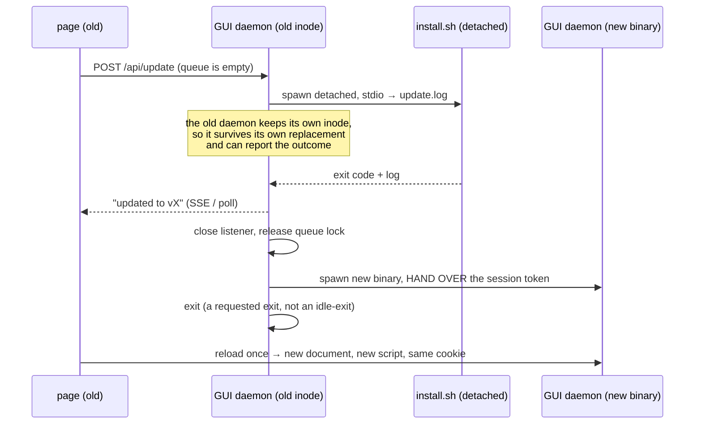

# ADR-0016 — Update detection is a cached verdict, and the GUI applies an update by handing over to the new binary

- **Status:** accepted (gate A of Cycle 6-plus, 2026-08-12). These are *rulings*,
  not a design: the interfaces, endpoints, DOM and tests they imply are produced
  by this cycle's design phase, which this document constrains.
- **Context:** the Cycle 6-plus analysis (2026-08-12), which the roadmap required
  to settle the probe, when it runs, consent, and where it lives — before any of
  it was built. The analysis read the code behind every one of those questions,
  and four rulings below exist because of what it found there.
- **Amends:** [ADR-0008](0008-daemon-lifecycle.md) — the daemon gains a third
  exit cause (§7), which its lifetime rule does not name.
- **Builds on:** [ADR-0005](0005-macos-floor-and-single-engine.md) (the installer
  is the single provisioning path; no second download-and-verify path in Go),
  [ADR-0010](0010-cycle3-web-gui.md) (the local API, its session token and its
  CSP), [ADR-0008](0008-daemon-lifecycle.md) (the daemon is session-scoped and an
  open SSE connection keeps it alive).
- **Constrains:** Cycle 6-launch (the desktop launcher starts the same daemon and
  inherits §7's handover), and any future cycle that touches `install.sh`.

## Context

`ytdl --update` has existed since Cycle 1 and works: it re-runs `install.sh`
through `curl … | bash`, and the installer is the single place that fetches and
verifies anything. **Applying an update was never the gap.** The gap is that
nothing *detects* one, and that the GUI — the surface built for the audience that
does not open a Terminal — has no update surface at all. It does not even display
which version it is.

That became urgent on 2026-08-12, when ytdl was installed for its first user who
is not the maintainer. Until this cycle ships, every future release means
physically returning to that machine, and the only update signal that user has is
a download that has started failing.

## Decisions

### 1. The probe is the `releases/latest` redirect, and the comparison is string equality

`HEAD https://github.com/<slug>/releases/latest` answers `302` with the tag in
`Location`. No API, no rate limit, no token, no User-Agent privileges.
`api.github.com` is rejected: 60 unauthenticated requests per hour **per IP** is
fragile behind shared NAT, and it buys nothing this needs.

Measured on 2026-08-12, and the reason the second half of this ruling is possible:

| probe | answer |
|---|---|
| `HEAD github.com/alergyonthestage/ytdl/releases/latest` | `302 → …/releases/tag/v2.1.0` |
| `HEAD github.com/yt-dlp/yt-dlp/releases/latest` | `302 → …/releases/tag/2026.07.04` |
| `buildinfo.Version` (release build) | `v2.1.0` — the same `GITHUB_REF_NAME` |
| `yt-dlp --version` | `2026.07.04` — byte-identical to its tag |

Both components already carry, locally, the exact string their tag carries. So
**the comparison is string equality, not version ordering**: no semver parser, no
date parser, no `v`-prefix handling, and none of the bug class that ordering
brings with it. The verdict is worded as a fact rather than a judgement — *the
latest version is X, you have Y* — which stays true even for a user who is
somehow ahead.

A build whose `Version` is `"dev"` is **never** checked and never reported stale.

### 2. The check runs at startup, never as a poll

Recurrence comes from the user starting ytdl again, not from a timer. There is no
periodic wake-up, no schedule, and nothing that runs while ytdl is idle.

A probe is **never** on a hot path. Every surface reads a *cached verdict* — a
file read — and the refresh runs off the critical path, writing the cache for the
*next* invocation. If the process exits before the probe finishes, nothing is
written and nothing is lost.

### 3. Consent is a config key, `update_check`, defaulting to on

It is an outbound call on someone else's machine, so it gets its own whitelist key
and can be turned off from the config file and from the GUI.

It defaults to **on**, because the person this cycle exists for will never open a
settings screen to switch it on, and a default of off would make the cycle
deliver nothing to them. The honesty cost of that default is paid in §5: the
notice says the check exists and where to turn it off.

### 4. Both channels get the notice; the CLI's is automatic, not manual-only

The tempting shortcut — "the CLI user is technical, let them run `ytdl --update`
when they feel like it" — fails on the actual failure mode. yt-dlp breaks when
YouTube changes, in both channels equally, and nobody goes looking for an update
before something breaks. A manual-only check serves only the user who already
suspects.

So the CLI reads the same cached verdict and prints **one line**, and
[ux-principles.md](../ux-principles.md) §7's rule (a capability lands in both
channels) is satisfied rather than waived.

### 5. A surface never claims certainty it does not have

Three states exist and are distinct, because the machine may be offline or behind
a captive portal:

- **an update is available** — the probe succeeded and the strings differ;
- **up to date** — the probe succeeded and they match, *stated with the date it
  was checked*;
- **not verified** — the probe failed or has never run, *stated as such*, with
  the last known result and its date if there is one.

A failed probe is **silent**: never an error dialog, never a red banner, never a
line on stderr about a thing the user did not ask for. It is also never rounded
up to "up to date" — that is [ux-principles.md](../ux-principles.md) §5 and the
whole reason Cycle 5's gate C existed.

The installed version is a *local* fact and is always shown, in both channels,
whether or not the probe ever succeeds.

### 6. Two components are reported, one action applies them

Detection distinguishes ytdl from yt-dlp; the installer does not — it is
all-or-nothing by design (§8). Both truths are shown, and the single action names
what it will actually do, so the button is not surprising when it updates the
other component too.

### 7. The GUI applies an update by handing over to the new binary

No live in-place upgrade, no hot process refresh. The maintainer's ruling is that
the update may cost the process and the page, provided the user never opens a
Terminal. That permits the simplest correct sequence, and each step of it exists
because of something the analysis found:

Four properties make it work, and each is load-bearing:

- **The old daemon survives the installer.** `install.sh` replaces the binary with
  an atomic `mv`; the running process keeps its open inode. That is what lets the
  page be *told* whether the update succeeded, instead of the server vanishing
  mid-operation.
- **The session token is handed to the child.** Each GUI daemon generates a fresh
  token and the browser holds it as a `SameSite=Strict` cookie. A naive restart
  would answer every API call with `401 … riapri l'interfaccia con \`ytdl gui\`` —
  a Terminal, i.e. exactly the acceptance test's failure. `app.js` already
  documents this scenario in its SSE reconnect comment. The handover therefore
  passes the token to the new process, and the outgoing daemon must **not** delete
  the token file it no longer owns.
- **The daemon exits because it was asked to.** [ADR-0008](0008-daemon-lifecycle.md)'s
  lifetime rule — alive while the queue has work OR a GUI client is connected —
  would keep this daemon alive forever, since the tab watching the update *is* a
  connected client. This ADR adds a third exit cause: an **explicit user request**,
  which does not wait for the exit test. It is not an idle-exit and does not
  weaken the clause it sits beside.
- **The update requires an empty queue.** Ruled by the maintainer, and it removes
  the entire class of "what happens to a download in flight". The action is
  offered only when nothing is pending or running, checked again at the moment of
  the click and not only when the button was drawn.

### 8. The post-update reload is the one legitimate reload

`spa_test.go` forbids `location.reload(` in `app.js`: "the document must never
reload". That rule is right and stays — with exactly one exception, at the one
moment where the document is *stale by definition*, because the server that will
answer its next request is a different build from the one that served it.

The alternative is worse: a page running the old script against the new server,
looking updated without being it. `handleIndex` already sends `Cache-Control:
no-store` for precisely this pairing, so the reload genuinely fetches the new
document and the new script.

The test is **narrowed, not deleted**: one reload, in the update handover path,
and the prohibition holds everywhere else.

### 9. `install.sh` is not touched by this cycle

The roadmap's non-negotiable stands: the update *is* the installer, and the
installer is the only thing that verifies checksums. It refetches everything on
every run — yt-dlp, ffmpeg, ffprobe and ytdl — even when a component is current.
That is minutes of waiting, not a correctness defect, and it is not worth risking
the one path that provisions the whole tool.

The consequence is a UX obligation, not a code one: the wait must be **legible**
(§7's page states what is happening and that it takes a few minutes), never a
mute spinner.

Making the installer version-aware is a cycle of its own, if it is ever wanted.

### 10. Recorded, not fixed: ffmpeg is downloaded without checksum verification

`install_ffmpeg` downloads and unpacks; it never calls `verify_checksum`, because
the upstream (martin-riedl) publishes no sums we consume. The roadmap's claim
that the installer "checksum-verifies each" component is therefore **false for
ffmpeg**, and this cycle corrects the sentence rather than the behaviour.

It matters more after this cycle than before it: an update path turns that
unverified fetch from a one-time event into a recurring one. It is registered as
a finding for its own cycle; changing the fetch here would violate §9.

## Consequences

- A new package owns detection (`internal/update`), and **`internal/core` and
  `internal/daemon` are untouched**: the daemon takes everything by injection from
  `cmd/ytdl`, so the periodic-check question the roadmap raised is answered
  without amending the parity constraint. The handover in §7 is composition-root
  work in `cmd/ytdl`, not daemon work.
- `ux-principles.md` gains nothing new: §5 (never a claim that is not true), §7
  (a capability lands in both channels) and §4 (an action that cannot work is
  disabled with a reason) already decide the surface. This cycle is a test of
  whether those principles are load-bearing yet.
- The acceptance test is a person who is not the maintainer: from "there is an
  update" to "I am on it", from the GUI alone, with nobody at their keyboard.
