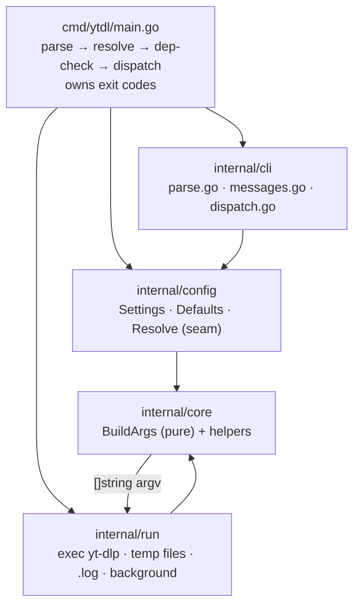
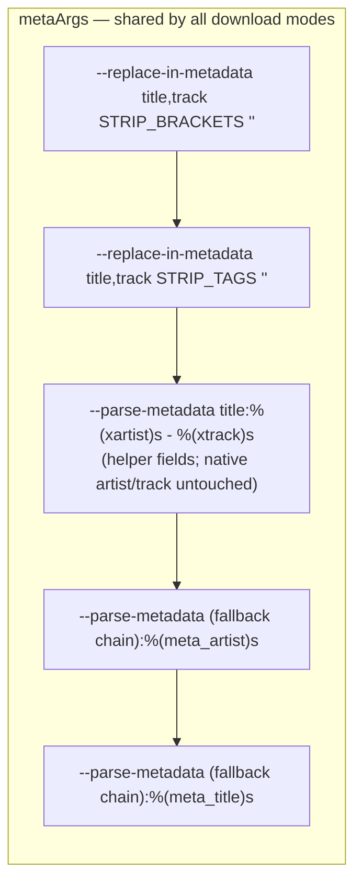

# Design — Cycle 1 Core: Go Engine Foundations & Parity

**Status:** approved at Gate B (2026-07-22) — design only, no implementation yet
**Scope:** roadmap items 3.3 (yt-dlp arg builder + metadata pipeline + golden tests)
and 3.4 (thin CLI at flag parity), plus the shared-core scaffolding (`JobSpec`,
runner, package layout) and the config **seam**.
**Out of scope (Session 2 design):** config file parsing + whitelist (3.5), full
precedence with a real file (3.6), CI cross-compile (3.1), installer changes (3.2).
**Inputs:** [go-port-parity-contract.md](go-port-parity-contract.md),
[golden-test-design.md](golden-test-design.md), [ADR-0003](decisions/0003-engine-language-go.md).

This design supersedes two sketches in the input docs: the package layout
(`golden-test-design.md` §7/§11 put everything in `package main`) and the golden
file format (`golden-test-design.md` §2 used newline-delimited). See
[Reconciliation](#reconciliation-with-input-docs).

---

## 1. Objective & definition of done

Reproduce the Bash `ytdl` behaviour exactly in a single Go binary: same flags, same
five execution modes, same `yt-dlp` argument vectors, same Italian user-facing text,
same exit codes, same `.log` failure behaviour. The metadata pipeline (the
`xartist`/`xtrack` helper-field ordering) is guarded by **golden tests** asserting
that Go's argv equals the Bash reference argv when run with default settings.

**Done when:** the Go `ytdl` reproduces the Bash tool's behaviour (golden tests
green), and the shared core is structured so the future daemon (Phase 4) and web UI
(Phase 6) import the same builder — "one engine, two front-ends" ([ADR-0003](decisions/0003-engine-language-go.md)).

## 2. Package layout (Gate B decision: Option B)

`package main` is not importable, so putting the arg builder there would force the
Phase-4 daemon and Phase-6 web server to either duplicate the crown jewel (two
sources of truth) or shell out to the CLI (making the CLI pointless) — exactly what
ADR-0003 rejects. The core therefore lives in importable `internal/` packages.

Module: `github.com/alergyonthestage/ytdl` (matches `YTDL_REPO`), Go 1.22+, standard
library only.



```
go.mod
cmd/ytdl/main.go                  entrypoint; owns os.Exit codes
internal/cli/parse.go             hand-written single-pass parser (parity + C3)
internal/cli/messages.go          all Italian strings, verbatim from the Bash source
internal/cli/dispatch.go          mode selection + per-mode user I/O
internal/config/config.go         Settings, Defaults(), Resolve() (file/session layers no-op now)
internal/core/args.go             BuildArgs + metaArgs/playlistArgs/baseArgs/reExecArgs (pure)
internal/core/args_test.go        table-driven golden test, byte comparison, -update
internal/core/testdata/*.args     NUL-delimited golden files (13 min → 20-25 target)
internal/run/runner.go            runtime behaviours the goldens don't cover
tests/harness/capture-goldens.sh  Bash harness + fake yt-dlp/ffmpeg shims → writes testdata
```

The decision is recorded as [ADR-0004](decisions/0004-go-engine-package-layout.md).

## 3. Core data structures

```go
// internal/config
type Settings struct {
    OutputDir       string // default: $HOME/Music/ytdl
    Format          string // default: "mp3"
    AudioQuality    string // default: "0"
    PlaylistDefault bool   // default: false (single track)
    NameTemplate    string // default: %(artist,creator,xartist,uploader)s - %(track,xtrack,title)s
    StripBrackets   string // default: the STRIP_BRACKETS constant
    StripTags       string // default: the STRIP_TAGS constant
    EmbedThumbnail  bool   // default: true
    EmbedMetadata   bool   // default: true
}

func Defaults() Settings                    // values copied verbatim from ytdl lines 31-41,196
func Resolve(flags FlagValues, env Env) Settings
// Precedence: flag > env > (session) > (config file) > default.
// This session wires flag > env > default; the session and config-file
// layers are present but NO-OP, reserved for Session 2 (3.5/3.6) and the GUI.

// internal/cli
type Mode int // Default, DryRun, Verbose, Silent, Background, Help, Version, Update
type Options struct {
    Mode             Mode
    URL              string
    Settings         config.Settings
    PlaylistExplicit bool
}

// internal/core — the crown jewel: pure, golden-tested, no I/O and no exec
func BuildArgs(o Options) []string
func ReExecArgs(o Options, self string) []string // background: -s -f FMT -o DIR [-p] URL
```

## 4. The metadata pipeline & the parity hazards

`BuildArgs` composes the shared helpers in the contract's exact order:
`metaArgs(s)` (the 5 elements, built from `s.StripBrackets/StripTags/NameTemplate`)
→ `playlistArgs(playlist)` → `baseArgs(s, playlist)` for silent/default → the
per-mode print/skip flags. Three hazards are encoded as explicit branches, not left
to chance:



1. **Two distinct `before_dl` templates.** Silent mode prints
   `before_dl:%(artist,creator,uploader)s - %(track,title)s` — it **omits** the
   `xartist`/`xtrack` helper fields that the filename template and the default-mode
   `before_dl` include. Reusing the filename template in silent mode is a silent
   parity break. Encoded in the silent vs default branches separately.
2. **`--no-simulate` is load-bearing and mode-specific.** Present only in `baseArgs`
   (silent + default), never in dry-run/verbose. Without it, `--print`/`--print-to-file`
   with a `before_dl` key implies `--simulate` (no download).
3. **No album tag.** `meta_args` writes only `meta_artist`/`meta_title`. The script
   header comment and `architecture.md` mention "album", but it is not implemented —
   parity must **not** add it. (Documentation drift, to be corrected separately.)

**Config/golden interlock:** golden tests call `BuildArgs` with `config.Defaults()`,
so the asserted invariant is "default settings reproduce the Bash argv". A few extra
cases exercising a non-default `name_template`/`format` prove the wiring without
needing Bash goldens for them.

## 5. Execution modes → argv

| Mode | `base_args`? | Distinctive flags | Exit |
|---|---|---|---|
| dry-run | no | `--no-warnings … --skip-download --print "TPL.FMT"` (no `mkdir`) | 0 / yt-dlp rc |
| verbose | no | `-x --audio-format … --embed-* meta playlist -o …` (no `--no-simulate`, no print) | 0 / yt-dlp rc |
| silent | yes | `--quiet --no-warnings --no-progress --print-to-file before_dl(simple)/after_move` | yt-dlp rc |
| default | yes | `--quiet --no-warnings --progress --print before_dl(full) --print-to-file after_move` | yt-dlp rc |
| background | n/a | native detach, then runs the silent path (see §7) | 0 |

## 6. Golden tests (Gate B decision: NUL-delimited, byte compare)

- **Capture:** `tests/harness/capture-goldens.sh` puts fake `yt-dlp`/`ffmpeg` shims
  earlier on `PATH`; each shim writes its args with `printf '%s\0'` and exits 0. The
  driver runs `ytdl` across the matrix with a pinned `HOME`/output dir, then
  normalizes those absolute paths to `{{HOME}}`/`{{OUTPUT_DIR}}`.
- **Format:** golden files are **NUL-delimited**; the Go test compares with
  `bytes.Split(data, []byte{0})` + `slices.Equal`. This is chosen over newline
  because the pipeline passes an empty-string argument (`--replace-in-metadata … ""`),
  which a newline format cannot represent unambiguously (trailing/interior empties).
  No `tr` conversion is needed — the shim output is the golden byte stream.
- **`-update`** regenerates the goldens by invoking the harness.
- **Matrix (13 minimum → 20-25):** each mode × {mp3, flac, m4a} × {single, `-p`} ×
  {`-o` flag, `$YTDL_OUT_DIR`, default} + dry-run print. The silent/default
  `before_dl` divergence is a mandatory case. Full registry in
  [golden-test-design.md](golden-test-design.md) §4.
- **Environment:** this container lacks `go`, `yt-dlp`, `ffmpeg`, `bats`; the shim
  approach needs none of them, but Session 3 must provision the Go toolchain.

## 7. Runner — behaviours the goldens don't cover

`internal/run` reproduces the runtime layer: `mktemp`→`os.CreateTemp`+`defer`
cleanup; `--print-to-file after_move` parsing (skip empties, count, first path → the
1-file/N-file/0-file report); the silent-mode `.log` writer (last line of the title
file, `tr '/:' '__'`, `ytdl-failed-YYYYMMDD-HHMMSS` fallback, exact Italian header);
`$HOME/.local/bin` prepended to `PATH` at startup; and yt-dlp `rc` propagated to the
process exit code.

**Background (Gate A decision: native fire-and-forget).** `exec.Command(self,
ReExecArgs(...)...)` with `SysProcAttr{Setsid: true}`, stdio to `/dev/null`, then
`Start` and return immediately — the `nohup … &` equivalent. Unbounded concurrency
(U5) is preserved for parity and superseded by the Cycle 2 queue; because the argv
is built once by `ReExecArgs`, the Bash flaw C4 (manual re-exec flag list) does not
recur.

**Dependency check (Gate A decision: parity).** Require both `yt-dlp` and `ffmpeg`;
hard-fail with the verbatim `missing_dep` message. "Is ffmpeg always needed?" stays
an open question and does not block this cycle.

## 8. CLI parser & the baked-in fixes

Hand-written single-pass parser mirroring the Bash `while/case` (lines 146-166):
post-URL flags still parse, `--` takes the remainder as the URL, missing `-o`/`-f`
arguments and unknown flags error the same way. Stdlib `flag` is rejected — it stops
at the first non-flag token and cannot match this behaviour.

Gate A approved baking in the safe C-fixes (deliberate, documented divergences from
Bash — the goldens use valid single-URL inputs and stay green):

| Fix | Behaviour | Where |
|---|---|---|
| **C1** | validate `-f` against `mp3\|flac\|m4a\|opus\|wav`; invalid → exit 1 with a clear message (Bash forwarded it to yt-dlp) | `config.Resolve`, before `BuildArgs` |
| **C3** | **reject** a second positional argument instead of silently keeping the last | `internal/cli/parse.go` |
| **C5** | sanitize the `.log` filename to a conservative charset (beyond `tr '/:' '__'`) | `internal/run/runner.go` |

## 9. Risks & mitigations

| Risk | Mitigation |
|---|---|
| Metadata-pipeline divergence (highest value) | golden reference precedes and gates the Go code; byte-exact compare; the two-template and `--no-simulate` hazards are explicit test cases |
| Flag-parity drift from stdlib `flag` | hand-written parser with a matrix incl. post-URL flags and `--` |
| Background detach differs from `nohup` | `Setsid` + `/dev/null` stdio + `Start`/return; a golden captures the re-exec argv, plus a manual smoke test that the parent returns immediately |
| Italian text untested by goldens | `messages.go` centralizes every string verbatim; runner tests assert the load-bearing ones |
| "session override" precedence layer ambiguity | implement `Resolve` with the layer present but empty, reserved for the GUI; ordering is stable now |

## 10. Implementation plan (Session 3, not this session)

Ordered so the golden reference exists before the code it checks:

1. Bash capture harness + shims → NUL-delimited goldens in `internal/core/testdata/`.
2. `go.mod` + `internal/config` (`Settings`, `Defaults`, `Resolve` flag>env>default).
3. `internal/core/args.go` (`metaArgs`, `playlistArgs`, `baseArgs`, per-mode
   `BuildArgs`, `ReExecArgs`) — encode the two `before_dl` templates and mode-specific
   `--no-simulate`.
4. `internal/core/args_test.go` — table-driven golden test, byte compare, `-update`;
   `go test ./internal/core/...` green = the parity gate for the crown jewel.
5. `internal/cli` — hand-written parser (+ C1/C3), `messages.go` verbatim, `dispatch.go`.
6. `internal/run/runner.go` — five mode behaviours, temp files, `.log` writer (+ C5),
   native background detach, PATH prepend, exit-code propagation, dependency check.
7. `cmd/ytdl/main.go` — wire parse → resolve → dep-check → dispatch → `os.Exit`.
8. Runner behaviour tests (help/version/no-URL/unknown-flag/`.log`/1-N-0 reporting).

Session-2 items (CI 3.1, installer 3.2, config file 3.5/3.6) are designed separately.

## Reconciliation with input docs

- **Package layout:** authoritative here (Option B, `internal/` core). Supersedes
  `golden-test-design.md` §7/§11 and §8 Stage-2 sketch, which used `package main` and
  `cmd/ytdl/testdata`. Goldens live in `internal/core/testdata/`.
- **Golden format:** authoritative here (NUL-delimited, byte compare). Supersedes the
  newline-delimited format in `golden-test-design.md` §2/§7.
- The parity contract ([go-port-parity-contract.md](go-port-parity-contract.md))
  stands unchanged as the behavioural reference.
