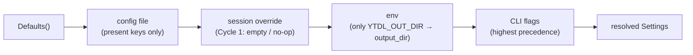
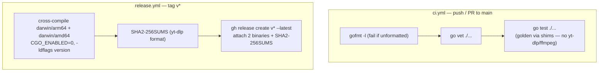

# Design — Cycle 1 Remaining: config, release CI, installer

**Status:** approved at Gate B (2026-07-22) — design only, no implementation yet
**Scope:** roadmap items **3.5** (persistent config file, strict `key=value` parse —
never `source`), **3.6** (precedence: flag > env > session > config > default),
**3.1** (Go module + CI cross-compile + checksum publication), **3.2** (installer
provisions the `ytdl` binary from a release). Completes the Cycle 1 design begun in
[design-cycle1-core.md](design-cycle1-core.md).
**Out of scope:** the core arg builder / golden tests / CLI parser / runner (done in
[design-cycle1-core.md](design-cycle1-core.md)); all Cycle 2/3 config keys and features.
**Inputs:** [design-cycle1-core.md](design-cycle1-core.md),
[improvements.md](improvements.md#u4), [distribution.md](distribution.md),
[ADR-0003](decisions/0003-engine-language-go.md),
[ADR-0004](decisions/0004-go-engine-package-layout.md),
[ADR-0005](decisions/0005-macos-floor-and-single-engine.md).

This design assumes the **10.15 floor / single Go engine / no Python** decision of
[ADR-0005](decisions/0005-macos-floor-and-single-engine.md); the installer section
below is written against that simplified target.

---

## 1. Objective & relationship to the core design

The core design left the config layer as a **seam**: `internal/config` ships
`Settings`, `Defaults()`, and a `Resolve` that wires `flag > env > default` with the
*session* and *config-file* layers present but no-op. This design makes the
**config-file layer real** (3.5/3.6) and specifies the **release + installer**
mechanics (3.1/3.2) that get the compiled binary onto a user's machine.

Nothing here changes `BuildArgs` or the golden reference: golden tests call
`BuildArgs(Defaults())`, and an **absent** config file resolves to exactly
`Defaults()`, so the argv is unchanged. Config parsing and precedence are validated
by **separate unit tests** in `internal/config`, not by the golden argv tests.

## 2. Config file (3.5)

### 2.1 Location & lifecycle

- Path: `${XDG_CONFIG_HOME:-$HOME/.config}/ytdl/config`.
- **Read-if-present.** Absent → all defaults, no warning, **no file is created**.
  There is no `ytdl config` subcommand in Cycle 1 (parity-focused); the GUI writes
  the file in Cycle 3, and it is safe to do so precisely because it is parsed with a
  whitelist, never `source`d.
- Lives in `internal/config` (new `file.go`); `Resolve` is extended (§4).

### 2.2 Grammar — parse, not `source`

Line-oriented, deliberately minimal so the parser is small and total:

- First non-space character `#` → comment, skip. Blank / whitespace-only → skip.
- Split on the **first** `=`. `key` = left, trimmed; `value` = right, trimmed of
  surrounding whitespace only. **No inline comments, no unquoting, no escaping** —
  the value is the raw remainder. This is mandatory: `strip_brackets`, `strip_tags`
  and `name_template` contain spaces, `()`, `\`, and `(?i:…)`; any `#`-stripping or
  unquoting would corrupt them.
- A line with no `=`, or an empty key → **malformed → warn, skip that line**.
- A key not in the active whitelist → **warn, ignore** (forward/backward
  compatibility: a config written by a newer GUI must not brick an older binary).

This is the **minimal + tolerant** policy chosen at Gate A: recognise only the keys
Cycle 1 actually uses, and never abort on an unrecognised or malformed line.

### 2.3 Active whitelist (9 keys)

Exactly the keys backing the core `Settings` struct. The other U4 keys
(`concurrency`, `notify*`, `log*`, `breadcrumb_on_failure`, `open_folder_on_done`,
`overwrites`, `archive`) belong to Cycle 2/3 features that do not exist yet;
`overwrites`/`archive` would additionally change the yt-dlp argv and **break
parity**, so they are excluded here.

| Key | `Settings` field | Type / validation |
|---|---|---|
| `output_dir` | `OutputDir` | string; expand a leading `~/` or bare `~` to `$HOME`; **no** `$VAR` expansion |
| `format` | `Format` | enum `mp3\|flac\|m4a\|opus\|wav` (C1) |
| `audio_quality` | `AudioQuality` | numeric string `0`–`9` |
| `playlist_default` | `PlaylistDefault` | bool `true\|false` (case-insensitive) |
| `name_template` | `NameTemplate` | raw string |
| `strip_brackets` | `StripBrackets` | raw string (regex) |
| `strip_tags` | `StripTags` | raw string (regex) |
| `embed_thumbnail` | `EmbedThumbnail` | bool |
| `embed_metadata` | `EmbedMetadata` | bool |

### 2.4 Invalid value on a known key

Consistent with the tolerant policy: a **known key with an invalid value**
(`format=bogus`, `playlist_default=maybe`, `audio_quality=x`) → **warn, ignore that
key**, so it falls through to the next-lower precedence layer.

This is a deliberate, documented **asymmetry** with the CLI flag:

| Source | Invalid value | Behaviour | Why |
|---|---|---|---|
| `-f bogus` (flag) | invalid format | **exit 1** (fail-fast) | explicit, immediate, single-shot intent |
| `format=bogus` (config) | invalid format | **warn + fall through** | persistent background config; must never brick the tool |

## 3. Precedence (3.6)

`flag > env > session > config file > built-in default`, resolved **per key** — a
`-o` on the command line wins for `output_dir` only; `format` still falls through
`env → config → default` independently.



- **env layer**: only `YTDL_OUT_DIR → output_dir` (parity with the Bash tool; no
  `YTDL_FORMAT` etc. — a general `YTDL_<KEY>` scheme is deferred, out of scope).
- **session layer**: present but **empty (no-op)** in Cycle 1. It is a GUI/daemon
  concept ("per-session output dir"); the seam stays so ordering is stable for
  Cycle 3.

### 3.1 Resolution model — per-field overlay

Each layer contributes a **partial** settings value (only the fields it specifies);
`Resolve` overlays them low-to-high onto `Defaults()`:

```go
// internal/config

// Partial: one optional value per Settings field. nil = "this layer says nothing".
type Partial struct {
    OutputDir      *string
    Format         *string
    AudioQuality   *string
    PlaylistDefault *bool
    NameTemplate   *string
    StripBrackets  *string
    StripTags      *string
    EmbedThumbnail *bool
    EmbedMetadata  *bool
}

// LoadFile parses the config file into a Partial. Missing file -> zero Partial, no
// error. Unknown keys, malformed lines and invalid values -> a Warning each, and
// that key is simply left unset (nil) so it falls through.
func LoadFile(path string) (Partial, []Warning)

func Resolve(flags, session, file Partial, env Env) (Settings, []Warning) {
    s := Defaults()
    apply(&s, file)     // 1. config file
    apply(&s, session)  // 2. session override (empty in Cycle 1)
    applyEnv(&s, env)   // 3. env: only YTDL_OUT_DIR
    apply(&s, flags)    // 4. CLI flags (win)
    return s, warnings
}
```

`apply(&s, p)` sets `s.X = *p.X` for every non-nil field of `p`. Validation
(C1 format, `audio_quality` numeric, bool parse) happens **when a layer is built**,
not at the end: `LoadFile` drops an invalid value to `nil` (with a warning) so it
cannot win; the flag layer validates fail-fast (`-f bogus` → exit 1). A final
defensive `validate(&s)` asserts the resolved value is well-formed.

### 3.2 Config / golden interlock

`Resolve(_, _, Partial{}, Env{})` (no flags, no session, empty file, no env) returns
`Defaults()` byte-for-byte → `BuildArgs` argv unchanged → **golden tests stay
green**. The file/precedence logic is covered by dedicated `internal/config` unit
tests:

- **parser**: comments, blanks, whitespace, first-`=` split, raw regex values with
  parentheses, `~/` expansion, case-insensitive bool, unknown-key warning,
  malformed-line warning, invalid-value-on-known-key warning + fallthrough;
- **precedence**: table-driven per field across all flag/env/file/default
  combinations, plus the session-layer no-op.

## 4. Release CI (3.1)

Module and layout are already fixed by [ADR-0004](decisions/0004-go-engine-package-layout.md):
`github.com/alergyonthestage/ytdl`, Go 1.22+, standard library only,
`CGO_ENABLED=0` (static binary). This section specifies the pipeline that builds and
publishes it. `.github/` is greenfield.



### 4.1 `ci.yml` — on push / PR to `main`

- Runner `ubuntu-latest`, a single pinned Go version (1.22.x).
- Steps: `gofmt -l` (fail on any unformatted file) → `go vet ./...` → `go test ./...`.
- **No real yt-dlp/ffmpeg needed**: the golden tests use fake shims (core design §6),
  so the test job is pure Go.

### 4.2 `release.yml` — on tag `v*`

- Cross-compile from Linux (no macOS runner, no `lipo`), `CGO_ENABLED=0`,
  `GOOS=darwin` × `GOARCH={arm64, amd64}`:
  - `-ldflags "-s -w -X github.com/alergyonthestage/ytdl/internal/buildinfo.Version=${GITHUB_REF_NAME}"`
  - outputs: **`ytdl_macos_arm64`**, **`ytdl_macos_amd64`**.
- **`SHA2-256SUMS`** in yt-dlp's exact format (`<sha256>␠␠<name>`, bare filenames),
  produced with `sha256sum` in the asset directory — so the installer's existing
  `verify_checksum` (`awk '$2 == name'`) consumes it **unchanged**.
- `gh release create ${TAG} ytdl_macos_arm64 ytdl_macos_amd64 SHA2-256SUMS`,
  marked **latest** — which enables the `releases/latest/download/…` no-pin URLs the
  installer uses.

### 4.3 Version

- `internal/buildinfo`: `var Version = "dev"` (default for local builds), overwritten
  at build time via `-ldflags`. `ytdl --version` reads it.
- **Scheme: the Go engine starts at `2.0.0`** — a clean break from the Bash `1.x`
  (opaque binary, config file, new engine). Low-stakes; can be revisited before the
  first tag.

## 5. Installer (3.2, simplified per ADR-0005)

The installer stops fetching the raw Bash script and instead downloads the compiled
binary from the release, verifying it the same way it already verifies yt-dlp and
ffmpeg. Per [ADR-0005](decisions/0005-macos-floor-and-single-engine.md) the legacy
tier and Python path are removed at the same time.

### 5.1 `detect_platform` — floor 10.15

`TIER` collapses to `supported` / `unsupported`:

- `major ≥ 11` → supported; `major == 10 && minor ≥ 15` → supported; otherwise
  **unsupported** → abort with an updated message (floor is Catalina 10.15, no longer
  High Sierra).

### 5.2 Removals (Python out of the project)

- Delete `python_is_new_enough`, `find_python`, `require_python`, `MIN_PYTHON`,
  `PYTHON_DOWNLOAD_URL`, and the `[ "$TIER" = "legacy" ] && require_python` call.
- `install_ytdlp`: keep **only** the standalone `yt-dlp_macos` branch + checksum;
  drop the zipimport branch and its generated wrapper.
- `ffmpeg_url_for`: drop the **evermeet** (legacy Intel) branch; keep the signed
  martin-riedl arm64/amd64 builds, which cover every supported target.

### 5.3 `install_ytdl` — the core 3.2 change

```bash
ytdl_asset_for() {                     # new, unit-testable (mirrors ffmpeg_url_for)
  case "$ARCH" in
    arm64) echo "ytdl_macos_arm64" ;;
    *)     echo "ytdl_macos_amd64" ;;
  esac
}
```

Flow: download `releases/latest/download/$(ytdl_asset_for)` **and**
`releases/latest/download/SHA2-256SUMS` → `verify_checksum` (**reused unchanged**) →
`mv` into `$INSTALL_DIR/ytdl` + `chmod +x` → strip any `com.apple.quarantine` xattr
(consistent with ffmpeg).

- The `head -1 | grep '^#!'` shebang sanity check is **removed** (it is a binary);
  integrity is the checksum plus the `verify_install` `--version` smoke test.
- The `YTDL_BRANCH` / raw-`githubusercontent` mechanism is retained **only** for
  fetching `install.sh` itself (the one-liner and `--update`), not for `ytdl`.
  `REPO_BRANCH` becomes unused inside `install.sh` and is removed.

### 5.4 `--update` and replacing a running binary

`--update` (the core's `Update` mode) re-runs `curl install.sh | bash`, which now
installs the binary. Replacing a running executable via `mv`/rename is safe on macOS
— the running process keeps its open inode until it exits.

### 5.5 Tests (`tests/test-installer.sh`)

- Platform detection: 10.13 / 10.14 now → **unsupported / abort**; 10.15 / 11 / 15 /
  26 → supported. Remove the legacy-tier assertions.
- Remove the evermeet ffmpeg-source test.
- Add `ytdl_asset_for` tests: `arm64 → ytdl_macos_arm64`, `x86_64 → ytdl_macos_amd64`.
- Checksum-verification tests unchanged.

### 5.6 To verify during implementation (non-blocking)

martin-riedl's **amd64** build floor ≤ 10.15 — already used for modern Intel today,
so removing evermeet introduces **no new risk**; confirm upstream when implementing.

## 6. Risks & mitigations

| Risk | Mitigation |
|---|---|
| A config value silently corrupts a raw field (regex/template) | value = raw remainder, no unquoting/comment-stripping; parser unit tests cover parenthesised regexes |
| Tolerant parsing masks a real user typo | every ignored key/line/value emits a `Warning`, surfaced to the user; only *invalid* input is tolerated, never *silently dropped* |
| Config file changes the default argv → golden drift | absent file ⇒ `Defaults()` ⇒ identical argv; asserted by a `Resolve == Defaults` unit test |
| Checksum file format mismatch breaks verification | CI emits the exact yt-dlp `SHA2-256SUMS` format; installer reuses the proven `verify_checksum` unchanged |
| Dropping evermeet strands a 10.15 Intel user | martin-riedl amd64 already serves modern Intel; floor confirmed at implementation (§5.6) |
| Raising the floor strands the one legacy user | ADR-0005: most likely already on 10.15; back-compat cheap to resurrect from git history if not |

## 7. Implementation plan (Session 3, not this session)

1. `internal/config`: `file.go` (`LoadFile` parser + warnings) → extend `Resolve`
   (`Partial`/overlay, env = `YTDL_OUT_DIR`, session no-op) → unit tests
   (parser + precedence). Assert `Resolve(empty) == Defaults()`.
2. `internal/buildinfo` (`Version`); `.github/workflows/ci.yml` + `release.yml`.
3. `install.sh`: collapse legacy/Python (§5.1–5.2), add `ytdl_asset_for`, rewrite
   `install_ytdl` to fetch from the release (§5.3); update `tests/test-installer.sh`.
4. User-facing docs flip **with** the installer change: `README.md` and
   `guida-installazione.md` lose the Mojave/Python steps, `1.0.0 → 2.0.0`.

Sequenced so config lands independently of the release/installer track; the two are
orthogonal and can be built in parallel by the Session-3 workflow.

## 8. Reconciliation with prior docs

- **Config seam**: this design realises the file layer the
  [core design](design-cycle1-core.md) §3 reserved; `Resolve`'s signature gains the
  `session` and `file` `Partial` arguments (previously described as "present but
  no-op"). No change to `Settings`, `Defaults`, `BuildArgs`, or the goldens.
- **Installer & floor**: written against
  [ADR-0005](decisions/0005-macos-floor-and-single-engine.md); supersedes the
  Mojave/Python installer design in [distribution.md](distribution.md), which is
  revised alongside this document.
- **Golden format / package layout**: unchanged from
  [ADR-0004](decisions/0004-go-engine-package-layout.md) and the core design.
