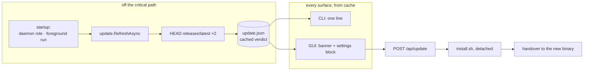
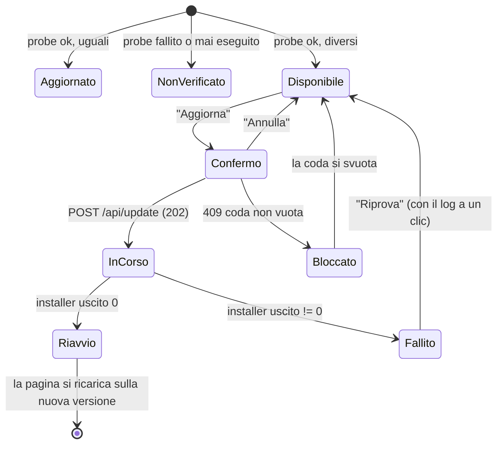
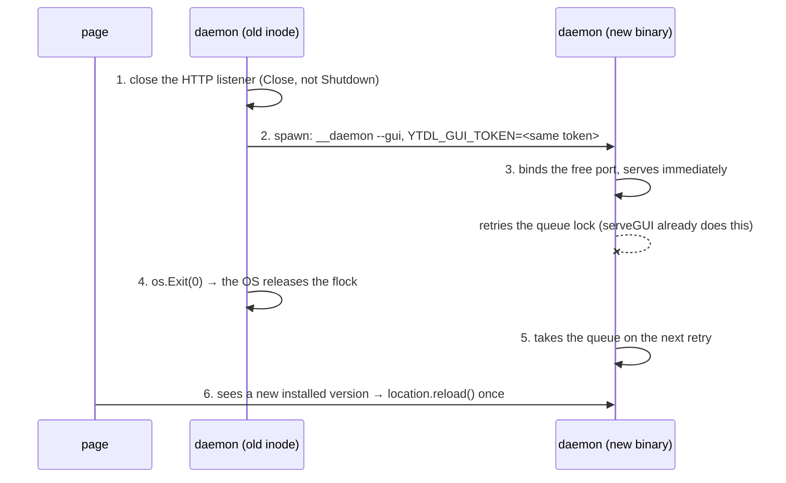

# Design — Cycle 6-plus, the update path

Design phase of Cycle 6-plus. It implements
[ADR-0016](decisions/0016-cycle6plus-update-path.md) and changes none of its
rulings; where this document had to choose something the ADR left open, the
choice is marked **(design choice)** and carries its reason.

Normative background: [ux-principles.md](ux-principles.md) §4 (an action that
cannot work is disabled with a reason), §5 (a surface never states something
untrue), §7 (a capability lands in both channels).

## 1. Shape

Detection and application are separate concerns with a file between them. Nothing
probes the network on a path a user is waiting on.



## 2. New package: `internal/update`

It owns detection, the cache, and launching the installer. It imports
`buildinfo`, `config` and the standard library only. **`internal/core` and
`internal/daemon` are not touched**; the daemon receives everything by injection
from `cmd/ytdl`, which is what makes that possible.

### 2.1 Data model

```go
// Status is what is known about one component. Both fields are literal version
// strings, compared for equality and never parsed (ADR-0016 §1).
type Status struct {
	Installed string `json:"installed,omitempty"` // "" = could not be read
	Latest    string `json:"latest,omitempty"`    // "" = the probe did not answer
}

// Verdict is one check round, as cached.
type Verdict struct {
	CheckedAt time.Time `json:"checked_at"`
	Ytdl      Status    `json:"ytdl"`
	Ytdlp     Status    `json:"yt_dlp"`
}
```

`Stale` is **derived, never stored** — the same discipline the history record's
id follows:

```go
// Stale reports whether this component is behind. It is false whenever the
// answer is not known, and false for a "dev" build, which is never nagged.
func (s Status) Stale() bool {
	return s.Installed != "" && s.Latest != "" &&
		s.Installed != buildinfo.DevVersion && s.Installed != s.Latest
}

// Known reports whether the probe answered for this component at all — the
// difference between "up to date" and "not verified" (ADR-0016 §5).
func (s Status) Known() bool { return s.Latest != "" }
```

**(design choice)** Storing `Stale` would let a stale cache contradict the
binary that reads it — after an update the installed version changes while the
file does not. Deriving it makes that impossible.

### 2.2 Probe

```go
// Probe returns the tag of a repository's latest release by reading the redirect
// that github.com answers to releases/latest. It deliberately does NOT follow
// it: the redirect target IS the answer, which is why this needs no API, no
// token and no rate-limit budget (ADR-0016 §1).
func Probe(ctx context.Context, c *http.Client, slug string) (string, error)
```

- The client is passed in, and `releasesBase` is a package var, so tests point
  both at an `httptest.Server` — the repo has no outbound-HTTP test pattern to
  copy, so this cycle establishes one.
- `CheckRedirect` returns `http.ErrUseLastResponse`; a non-3xx answer, a missing
  `Location`, or a `Location` that does not end in `/releases/tag/<tag>` is an
  error, not a guess.
- Hard timeout (10 s) and an explicit `User-Agent: ytdl/<version>`.
- The repo slug comes from `YTDL_REPO` exactly as `run.Update()` reads it, so a
  fork updates from its own releases and probes its own releases.

```go
// Local reads the installed versions: buildinfo.Version, and `yt-dlp --version`
// for the yt-dlp binary on PATH. A missing or unresponsive yt-dlp yields "",
// which reads as "not known" everywhere — never as an error.
func Local(ctx context.Context) (ytdl, ytdlp string)
```

### 2.3 Cache

`${XDG_STATE_HOME:-~/.local/state}/ytdl/update.json`, beside `queue/`, `logs/`,
`daemon.log` and `gui.token`.

```go
func Load(stateDir string) (Verdict, bool)          // missing/corrupt = (zero, false)
func Save(stateDir string, v Verdict) error         // temp file + rename, 0600
func (v Verdict) Fresh(now time.Time, ttl time.Duration) bool
const DefaultTTL = 24 * time.Hour
```

A corrupt or unreadable cache is **never** an error a caller must handle — it is
simply "no verdict", which renders as "not verified". Writing is atomic so a
process that dies mid-write cannot leave a half-file that reads as a verdict.

**(design choice) TTL = 24 h.** The check is startup-only (ADR-0016 §2), so the
TTL exists to stop a user in a shell loop probing GitHub once per command, not to
schedule anything. A day means a release is noticed on the first use of the next
day at the latest.

### 2.4 Refresh

```go
// RefreshAsync runs one check round in the background when checking is enabled
// and the cache has expired. It never blocks the caller, never delays exit, and
// writes nothing when the process dies first.
func RefreshAsync(stateDir string, enabled bool, now time.Time)
```

Two call sites, both in `cmd/ytdl`, both at startup:

| call site | covers |
|---|---|
| `runDaemon`, before `daemon.Serve` | `ytdl -b`, `ytdl gui`, `again`, `retry`, a resumed queue |
| `realMain`, on the run action | the plain foreground `ytdl <url>` — the command the installer itself tells the user to type |

The foreground case is why the second site exists: a user who only ever runs
`ytdl <url>` would otherwise never refresh. The probe runs while the download
does, and its result surfaces on the *next* invocation.

## 3. Consent: the `update_check` key

An ordinary whitelist key, `bool`, default `true` (ADR-0016 §3). The mechanical
inventory, all of it load-bearing:

| file | change |
|---|---|
| `internal/config/config.go` | `UpdateCheck bool` on `Settings`, default `true` |
| `internal/config/file.go` | `case "update_check"` in the assign switch |
| `internal/config/save.go` | one line in the emitter, in whitelist order |
| `internal/webui/handlers.go` | `settingsDTO` + both mappers |
| `internal/webui/assets/app.js` | `SETTING_IDS` |
| `internal/webui/assets/index.html` | the settings control |
| `internal/cli/help.go` | the config key documentation |

The key governs the **automatic** probe only. A user who turns it off keeps the
manual "Controlla ora" button and `ytdl --update`: consent is about the machine
phoning home on its own, not about the user's right to ask.

## 4. CLI surface

One pure renderer, three call sites, no existing signature changed:

```go
// RenderUpdateNotice renders the cached verdict as at most one line per stale
// component, or "" when there is nothing worth saying.
func RenderUpdateNotice(v update.Verdict, known bool, now time.Time) string
```

```
! Aggiornamento disponibile: ytdl v2.2.0 (hai v2.1.0) · yt-dlp 2026.08.02 (hai 2026.07.04)
  Aggiorna con:  ytdl --update          (per non ricevere più questo avviso: update_check = false)
```

Rules that make it tolerable rather than nagging:

- It is printed **after** the command's own output, never before it — burying
  what the user asked for under a notice is how the notice gets hated.
- It appears on a run action (success **and** failure — a stale yt-dlp is *more*
  relevant when a download just failed, though the line never claims to be the
  cause), and always in `ytdl --version` and `ytdl status`.
- It never appears when there is nothing stale, when checking is off, or for a
  `dev` build.
- The "how to turn it off" clause is what pays for the default-on ruling.

`ytdl --version` additionally gains the *known* state even when current, since
that screen is where a user goes to ask:

```
ytdl v2.1.0
yt-dlp 2026.07.04
Aggiornamenti: sei aggiornato · verificato il 12/08/2026
```

…or `Aggiornamenti: non verificati (nessuna connessione all'ultimo tentativo)`,
or `Aggiornamenti: controllo automatico disattivato`. Three distinct states,
never collapsed (ADR-0016 §5).

## 5. GUI surface

### 5.1 The capability seam

`webui` stays a front-end: it gets the capability injected and never shells out
itself.

```go
// Updater is the update capability. A nil Updater means the capability is
// absent, and NO update control is rendered at all — never a dead one
// (ux-principles.md §4).
type Updater interface {
	Verdict() (update.Verdict, bool)                  // from cache
	Check(ctx context.Context) (update.Verdict, error) // on demand, bounded
	Start() error                                      // launch the installer
	Progress() update.Progress                         // of the running/last run
}
```

`Deps.Updater` joins `Resolve`, `DaemonRunning` and `Spool`; tests inject a fake
and never touch the network.

### 5.2 Endpoints

| route | method | behaviour |
|---|---|---|
| `/api/state` | GET | gains an `update` object (below) |
| `/api/update/check` | POST | runs one probe round now, returns the fresh verdict. Bounded; this is a user-initiated wait, so it may block |
| `/api/update` | POST | starts the update. `409` when the queue is not empty, or when one is already running |
| `/api/update/status` | GET | `{state, target, startedAt, endedAt, logTail}` |

```jsonc
// stateDTO.update
{
  "enabled": true,                    // update_check
  "checkedAt": "2026-08-12T14:02:11Z",// absent = never checked
  "busy": false,
  "ytdl":  {"installed": "v2.1.0", "latest": "v2.2.0", "stale": true},
  "ytDlp": {"installed": "2026.07.04", "latest": "2026.07.04"}
}
```

**(design choice) the update panel polls `/api/update/status`; it does not use
SSE.** The SSE connection dies at the handover by construction, and a transport
that disappears exactly when the news matters is the wrong transport. Independent
polls fail during the gap and succeed after it, which is precisely the signal the
page needs.

### 5.3 What the user sees

Two surfaces, because the two jobs are different: *noticing* and *checking*.

- **A banner**, above the view container so it shows on all three views, rendered
  **only** when something is stale. It states what is stale and carries the
  primary action. It is dismissible for the tab, and comes back on the next one.
- **A block in Impostazioni — "Versione e aggiornamenti" — always present**,
  because "which version am I on?" must be answerable when nothing is stale. It
  carries: both installed versions; the verdict with its date (or "non
  verificato"); **Controlla ora**; the `update_check` toggle; and the same
  primary action when there is something to apply.



The confirmation step is **inline, not a browser `confirm()`** — it must say what
it costs: *«L'aggiornamento chiude e riapre l'interfaccia, e richiede qualche
minuto perché riscarica anche yt-dlp e ffmpeg. I download devono essere finiti.»*
That sentence is the entire payment for ADR-0016 §9.

When the queue is not empty the action is **disabled with the reason and the
count** ("2 download in corso — l'aggiornamento parte a coda vuota"), never
hidden and never silently ignored. The emptiness is re-checked server-side at the
click, so a job enqueued between render and click is still refused.

## 6. Applying the update

### 6.1 Launching the installer

```go
// Start launches install.sh detached and returns immediately. The child is
// setsid'd with its stdio on update.log, so it outlives the process that
// launched it — including the binary it is about to replace.
func (r *Runner) Start() error
```

- The command is built exactly like `run.Update()`: a `curl` process piped into a
  `bash` process, **never a shell string with the URL interpolated into it** —
  the slug is `YTDL_REPO`-controlled, and that is why the existing code is
  written that way.
- Refuses when `Progress().State == Running`.
- A goroutine `Wait()`s and records the outcome; the daemon survives the
  installer (its own inode) so this is the normal path, not a lucky one.

`${state}/update-run.json` (state, startedAt, endedAt, target, exitCode) plus
`${state}/update.log` (the installer's own output, truncated per run). The state
file is what lets the *reloaded* page confirm the outcome after the handover: the
new daemon reports "just updated" when `state == ok`, `target ==
buildinfo.Version` and `endedAt` is within a few minutes. No acknowledgement
endpoint, no extra round trip.

### 6.2 The handover



Each step exists because of a specific finding:

1. **`Close`, not `Shutdown`.** `Shutdown` waits for active connections, and an
   SSE connection never ends — it would block forever. `Close` frees the port
   deterministically before the child is even spawned, so there is no bind race
   to lose. (Today `startWebUI` treats a failed bind as a silent degradation to
   headless; this design never depends on that path, and the cycle makes it say
   so instead of failing mute.)
2. **The token travels in the environment.** Without it the child answers `401 …
   riapri l'interfaccia con ytdl gui` — a Terminal, i.e. the acceptance test
   failing. `runDaemon` reads `YTDL_GUI_TOKEN` and uses it instead of generating,
   *only* when set; an ordinary `ytdl gui` still gets a fresh token. The variable
   is readable only by the same user (0600 token file, same-user process
   environment), so it adds no exposure class the token file does not already
   have.
3. **The outgoing daemon must not delete `gui.token`.** Its `defer
   os.Remove(...)` would delete the file the child has just written with the same
   value. `os.Exit` skips defers, which is the mechanism — stated explicitly here
   because it is otherwise an accident waiting to be "cleaned up".
4. **The flock needs no explicit release.** It is held on an open fd inside
   `daemon.Serve`, which `cmd/ytdl` cannot reach — and does not need to: process
   exit releases it. The child's `serveGUI` *already* retries the lock while
   serving the UI, because Cycle 3 built it for the "a headless daemon holds the
   queue" case. The handover reuses that, unchanged.

This is the third exit cause ADR-0016 §7 adds to ADR-0008: the daemon exits
because it was **asked to**, not because it went idle.

### 6.3 When it goes wrong

| failure | what the user is told |
|---|---|
| installer exits non-zero | «L'aggiornamento non è riuscito. ytdl è rimasto quello di prima.» + **Vedi il dettaglio** (the tail of `update.log`, as `textContent`) + **Riprova** |
| the interface does not come back within 60 s | «L'aggiornamento è riuscito, ma non sono riuscito a riaprire l'interfaccia da solo.» + how to reopen it. The one place a Terminal is named — and Cycle 6-launch removes even that |
| the probe fails | nothing. Silence, and the last known verdict keeps its date |
| the daemon dies mid-install | the installer is setsid'd and finishes anyway; the run state stays `running` and the page says it cannot tell how it went, pointing at the log. It never guesses |

A partial installer failure is **never** summarised as "yt-dlp updated" or
similar: what is reported is the exit code and the log, because the installer is
the only thing that knows what it got through.

## 7. Test plan

| area | test |
|---|---|
| `internal/update` | probe: `302` + `Location` parsed; non-3xx, missing/garbage `Location`, timeout, network error → error, never a guess |
| | `Stale()`/`Known()`: equal, different, `dev`, empty either side |
| | cache: round trip, TTL boundary, corrupt file = no verdict, atomic write leaves no partial |
| | refresh: disabled → no probe; fresh cache → no probe |
| `internal/config` | `update_check` round-trips through `LoadFile`/`Save`; default is on; a garbage value warns and falls back (the established asymmetry) |
| `internal/cli` | the notice renders the three states and empty when nothing is stale, off, or `dev` |
| `internal/webui` | `/api/state` carries `update`; nil `Updater` → no update fields **and** no control; `POST /api/update` → `409` + reason with a non-empty queue, `409` when already running, `202` otherwise; `/api/update/status` shape |
| `spa_test.go` | the reload prohibition is **narrowed**: exactly one `location.reload(` and it is in the update handover path; every other navigation rule and the `innerHTML` ban unchanged |
| `spa_behaviour_test.go` | the banner appears only when stale; the action is disabled with a reason on a non-empty queue; the panel renders in-progress / done / failed |
| `cmd/ytdl` | `YTDL_GUI_TOKEN` is honoured when set and ignored when empty; a fresh token is generated otherwise |
| gate | `git diff main -- internal/core/ internal/daemon/` is empty; `go test -race ./...`; `gofmt -l .` empty |

## 8. What this cycle does not do

- It does not touch `install.sh` (ADR-0016 §9) — so an update still refetches
  everything, and the design pays for that in the wait's legibility, not in code.
- It does not add checksum verification for ffmpeg (ADR-0016 §10) — it corrects
  the roadmap sentence that says otherwise and registers the finding.
- It does not touch `internal/core` or `internal/daemon`.
- It does not add a launcher: starting the GUI without a Terminal is Cycle
  6-launch, which runs next and inherits this handover.
