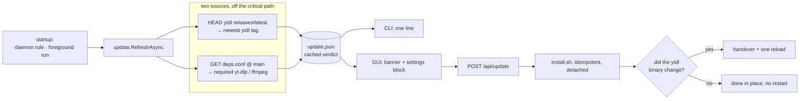
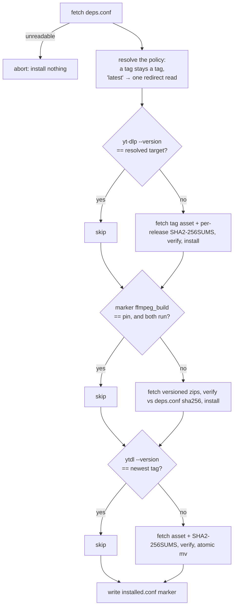
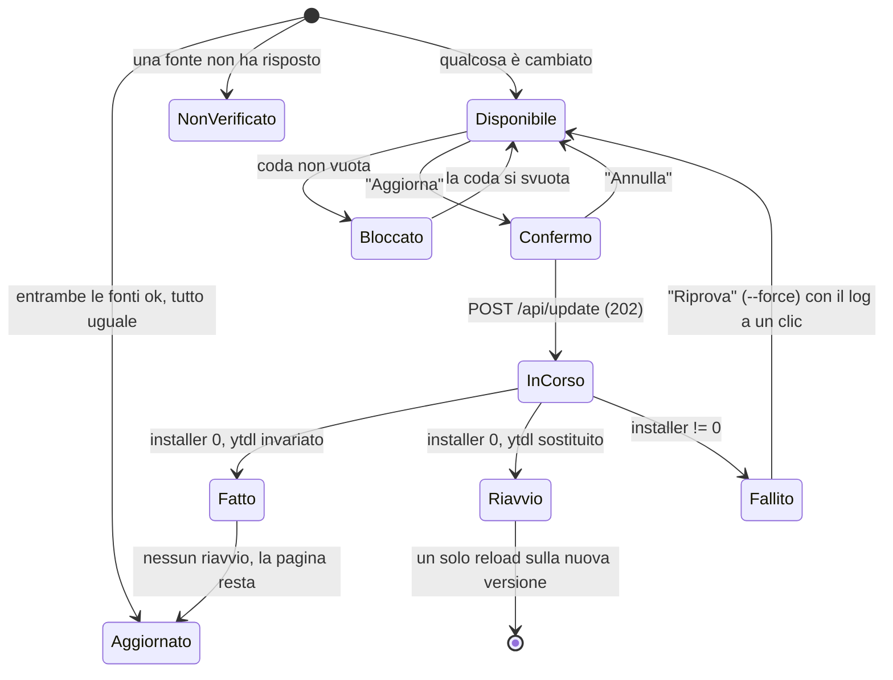
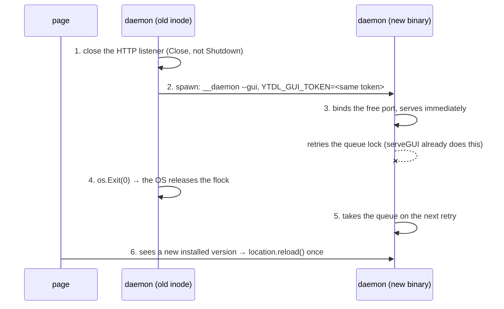

# Design — Cycle 6-plus, the update path

Design phase of Cycle 6-plus. It implements
[ADR-0016](decisions/0016-cycle6plus-update-path.md) and changes none of its
rulings; where this document had to choose something the ADR left open, the
choice is marked **(design choice)** and carries its reason.

Revised 2026-08-13 for the dependency ruling (ADR-0016 §2–§4, §11–§12): ytdl pins
what it drives, the installer becomes idempotent, and the user is left with one
update axis.

Normative background: [ux-principles.md](ux-principles.md) §4 (an action that
cannot work is disabled with a reason), §5 (a surface never states something
untrue), §7 (a capability lands in both channels).

## 1. Shape

Detection and application are separate concerns with a cache file between them.
Nothing probes the network on a path a user is waiting on, and the *pin* — not
upstream's newest — is what the machine is compared against.



## 2. The pin: `deps.conf`

At the repository root, beside `install.sh`, fetched by the installer from the
same `raw.githubusercontent.com/<slug>/<branch>/` it comes from itself.

```
# What ytdl requires — maintainer-managed (ADR-0016 §2).
# yt_dlp_version accepts "latest" (the current policy) or an exact tag; writing a
# tag here is the rollback lever, and it reaches every installation within a day.
yt_dlp_version              = latest
ffmpeg_build                = 1785863997_9.0
ffmpeg_sha256_arm64_ffmpeg  = <hex>
ffmpeg_sha256_arm64_ffprobe = <hex>
ffmpeg_sha256_amd64_ffmpeg  = <hex>
ffmpeg_sha256_amd64_ffprobe = <hex>
```

`latest` is resolved — by the installer and by the probe alike — with the same
redirect read used for ytdl's own tag, so everything downstream compares two
concrete version strings and never a placeholder. **ffmpeg has no `latest`**: it
is always an exact build, because that is what makes its checksum meaningful
(ADR-0016 §12).

**(design choice) `key = value`, not JSON.** `install.sh` must parse this on a
stock Mac, where `jq` does not exist and hand-rolled JSON parsing in bash is how
installers get subtle. The project already has a strict `key = value` format that
is **never `source`d** — the U4 security property of the config file — and this
reuses that discipline: read with `awk`, whitelist the keys, reject anything else.

yt-dlp needs no checksum here: its release publishes a per-release
`SHA2-256SUMS`, verified reachable at
`releases/download/<tag>/SHA2-256SUMS`. ffmpeg does, because its host publishes
none — ADR-0016 §12.

**Fetching `deps.conf` fails closed.** If it cannot be read or a key is missing,
the installer aborts with a message; it never falls back to `latest`, because a
silent fallback is exactly the unpinned behaviour §2 removes.

## 3. New package: `internal/update`

Owns detection, the cache, and launching the installer. Imports `buildinfo`,
`config` and the standard library only. **`internal/core` and `internal/daemon`
are not touched.**

### 3.1 Data model

```go
// Pin is what deps.conf declares, already RESOLVED: "latest" never survives this
// far, so every comparison downstream is between two concrete version strings.
type Pin struct {
	YtDlp  string `json:"yt_dlp,omitempty"`  // exact tag, "" = not answered
	FFmpeg string `json:"ffmpeg,omitempty"`  // exact build id
}

// Installed is what this machine actually has, read locally.
type Installed struct {
	Ytdl   string   `json:"ytdl,omitempty"`
	YtDlp  string   `json:"yt_dlp,omitempty"`
	FFmpeg string   `json:"ffmpeg,omitempty"`
	Foreign []string `json:"foreign,omitempty"` // deps resolved outside our bin dir
}

// Verdict is one check round, as cached.
type Verdict struct {
	CheckedAt  time.Time `json:"checked_at"`
	LatestYtdl string    `json:"latest_ytdl,omitempty"` // "" = probe unanswered
	Pin        Pin       `json:"pin"`
	Installed  Installed `json:"installed"`
}
```

Everything a surface asks is **derived, never stored** — the same discipline the
history record's id follows, and the reason a stale cache can never contradict
the binary reading it:

```go
// Known reports whether both sources answered. It is the difference between
// "up to date" and "not verified" (ADR-0016 §8).
func (v Verdict) Known() bool

// Available reports whether anything DIFFERS — never "is newer". A pin may name
// an older yt-dlp than the one installed (the rollback lever, ADR-0016 §2), and
// that is an update to apply like any other. One axis, whatever moved.
func (v Verdict) Available() bool

// Changes lists what would change, for the surface that shows the detail.
func (v Verdict) Changes() []Change  // {Component, From, To}
```

A `dev` build is never compared and never reported stale.

### 3.2 Probes

```go
// LatestTag returns a repository's newest release tag by reading the redirect
// github.com answers to releases/latest. It deliberately does NOT follow it: the
// redirect target IS the answer, which is why this needs no API and no
// rate-limit budget (ADR-0016 §1).
func LatestTag(ctx context.Context, c *http.Client, slug string) (string, error)

// FetchPin reads deps.conf from the branch the installer comes from and returns
// it RESOLVED: a yt_dlp_version of "latest" is turned into a concrete tag by the
// same redirect read, so no caller ever has to know which policy is in force.
func FetchPin(ctx context.Context, c *http.Client, slug, branch string) (Pin, error)
```

- Client and base URLs are injected (package vars), so tests point them at an
  `httptest.Server`. The repo has no outbound-HTTP test pattern to copy, so this
  cycle establishes one.
- `CheckRedirect` returns `http.ErrUseLastResponse`; a non-3xx answer, a missing
  `Location`, or a `Location` that is not `…/releases/tag/<tag>` is an error, not
  a guess. 10 s timeout, explicit `User-Agent: ytdl/<version>`.
- Slug and branch come from `YTDL_REPO` / `YTDL_BRANCH`, exactly as `run.Update()`
  reads them, so a fork probes and updates from its own repository.

### 3.3 Cache

`${XDG_STATE_HOME:-~/.local/state}/ytdl/update.json`, beside `queue/`, `logs/`,
`daemon.log` and `gui.token`.

```go
func Load(stateDir string) (Verdict, bool)   // missing/corrupt = (zero, false)
func Save(stateDir string, v Verdict) error  // temp file + rename, 0600
func (v Verdict) Fresh(now time.Time, ttl time.Duration) bool
const DefaultTTL = 24 * time.Hour
```

A corrupt cache is never an error a caller must handle — it is "no verdict",
which renders as "not verified". The write is atomic, so a process dying
mid-write cannot leave a half-file that reads as a verdict.

**(design choice) TTL = 24 h.** The check is startup-only (ADR-0016 §5), so the
TTL only stops a user in a shell loop from probing once per command.

### 3.4 Refresh

```go
// RefreshAsync runs one check round in the background when checking is enabled
// and the cache has expired. It never blocks the caller, never delays exit, and
// writes nothing when the process dies first.
func RefreshAsync(stateDir string, enabled bool, now time.Time)
```

Two call sites, both in `cmd/ytdl`, both at startup: `runDaemon` before
`daemon.Serve` (covers `-b`, `gui`, `again`, `retry`), and the foreground run
action (covers the plain `ytdl <url>` the installer itself tells users to type —
without it, a foreground-only user would never refresh).

## 4. Dependency resolution (`internal/run`)

```go
// toolPath resolves a dependency ytdl drives: OUR copy under the install dir
// when it exists, else whatever $PATH offers — in which case ours is false and
// the surface says so instead of pretending the pin holds.
func toolPath(name string) (path string, ours bool)
```

This replaces the bare `const ytDlp = "yt-dlp"` at the six call sites in
`internal/run`. The install dir is `$YTDL_BIN_DIR` or `~/.local/bin`; the
override exists so the golden/integration tests can point it at their shim
directory.

Why it is needed, and why it is legal:

- `PrependLocalBin` prepends `~/.local/bin` **only when absent from `$PATH`**
  (`runner.go:62-66`). A Mac whose `.zprofile` runs Homebrew's `shellenv` after
  the installer's line has `/opt/homebrew/bin` first, so a Homebrew yt-dlp wins
  the `LookPath` and ytdl silently drives a binary it never installed.
- Verified: the golden files contain **no `argv[0]`** — they begin at the first
  flag — and the program name lives in `internal/run`, outside the frozen
  `internal/core`. The parity gate is untouched.
- Existing tests keep working: with no `~/.local/bin/yt-dlp` in the test
  environment, resolution falls back to `$PATH` and finds the shim exactly as
  today.

## 5. The idempotent installer

`install.sh` gains a pin-aware, skip-what-is-current pass. The order is
unchanged; only the "do I need to?" question is new.



- **The policy is resolved once, before anything is fetched.** `latest` costs one
  redirect read — the same one the ytdl comparison already makes. An unreadable
  `deps.conf` **aborts and installs nothing**: falling back to `latest` would be
  indistinguishable from the policy currently being `latest`, and the day the
  maintainer pins a rollback, that silent equivalence would quietly ignore it.
- **yt-dlp** is self-describing: `yt-dlp --version` is byte-identical to its tag,
  so no marker is needed. The comparison is equality, so a **downgrade** to a
  pinned older tag is handled by the same path as an upgrade.
- **ffmpeg** is not: `ffmpeg -version` reports `9.0`, while the pin is a build id
  (`1785863997_9.0`). The marker file is what makes the comparison exact, and it
  is also what lets ytdl *show* which ffmpeg it has.
- **ytdl** compares against the newest tag, read with the same redirect the Go
  probe uses.
- **`--force` / `YTDL_FORCE=1`** reinstalls everything regardless — what a retry
  after a failed update uses, and what the maintainer uses to reproduce.

Marker: `${XDG_STATE_HOME:-~/.local/state}/ytdl/installed.conf`, same
`key = value` format (`ytdl_version`, `yt_dlp_version`, `ffmpeg_build`,
`installed_at`).

**Consequence for the GUI (design choice):** when the installer skips ytdl
itself — the common "the maintainer re-pinned yt-dlp" update — **no handover and
no reload happen at all.** The page reports the update done and stays exactly
where it was. Only a changed ytdl binary costs the restart of §7.2.

## 6. Surfaces

### 6.1 CLI

One pure renderer, three call sites, no existing signature changed:

```go
// RenderUpdateNotice renders the cached verdict as at most two lines, or "" when
// there is nothing worth saying.
func RenderUpdateNotice(v update.Verdict, now time.Time) string
```

```
! Aggiornamento disponibile per ytdl v2.2.0 (hai v2.1.0), con yt-dlp 2026.08.02.
  Aggiorna con:  ytdl --update      (per non ricevere più questo avviso: update_check = false)
```

One axis: the line names ytdl and mentions what comes with it. When only the
dependency moved, it still reads as one update — *«Aggiornamento disponibile per
ytdl: richiede yt-dlp 2026.08.02 (hai 2026.07.04).»*

The wording is **version-neutral**, never "più recente": after a rollback the
required yt-dlp is *older* than the installed one, and the sentence must still be
true. "richiede X (hai Y)" is true in both directions; "è disponibile una
versione più recente" would not be.

A separate, distinct message exists for the §4 case, because it is a different
problem with a different remedy:

```
! ytdl sta usando yt-dlp da /opt/homebrew/bin/yt-dlp, che non ha installato lui.
  La versione verificata con questo ytdl è 2026.07.04.  Ripristina con:  ytdl --update
```

Placement rules that make it tolerable rather than nagging: printed **after** the
command's own output, never before it; on a run action (success and failure — a
stale dependency is *more* relevant when a download just failed, though the line
never claims to be the cause); always in `ytdl --version` and `ytdl status`;
never when nothing differs, when checking is off, or for a `dev` build.

`ytdl --version` shows the whole truth, since that screen is where a user goes to
ask:

```
ytdl v2.1.0
yt-dlp 2026.07.04   (verificata con questo ytdl)
ffmpeg 9.0
Aggiornamenti: sei aggiornato · verificato il 12/08/2026
```

…or `non verificati (nessuna connessione all'ultimo tentativo)`, or `controllo
automatico disattivato`. Three states, never collapsed (ADR-0016 §8).

### 6.2 GUI

`webui` stays a front-end and gets the capability injected:

```go
// Updater is the update capability. A nil Updater means the capability is
// absent, and NO update control is rendered at all — never a dead one
// (ux-principles.md §4).
type Updater interface {
	Verdict() (update.Verdict, bool)                   // from cache
	Check(ctx context.Context) (update.Verdict, error) // on demand, bounded
	Start(force bool) error                            // launch the installer
	Progress() update.Progress
}
```

| route | method | behaviour |
|---|---|---|
| `/api/state` | GET | gains an `update` object |
| `/api/update/check` | POST | one probe round now, returns the fresh verdict (a user-initiated wait, so it may block) |
| `/api/update` | POST | starts it. `409` when the queue is not empty, or one is already running |
| `/api/update/status` | GET | `{state, changed, startedAt, endedAt, logTail}` |

```jsonc
// stateDTO.update
{
  "enabled": true,
  "checkedAt": "2026-08-12T14:02:11Z",   // absent = never checked
  "known": true, "available": true, "busy": false,
  "installed": {"ytdl": "v2.1.0", "ytDlp": "2026.07.04", "ffmpeg": "9.0"},
  "changes": [{"component": "ytdl", "from": "v2.1.0", "to": "v2.2.0"},
              {"component": "yt-dlp", "from": "2026.07.04", "to": "2026.08.02"}],
  "foreign": ["yt-dlp"],                  // absent when everything is ours
  "blocked": {"reason": "queue", "pending": 2}   // absent when it can start
}
```

**(design choice) the update panel polls `/api/update/status`; it does not use
SSE.** The SSE connection dies at the handover by construction, and a transport
that disappears exactly when the news matters is the wrong transport. Independent
polls fail during the gap and succeed after it, which is precisely the signal the
page needs.

Two surfaces, because noticing and checking are different jobs:

- **A banner**, above the view container so it shows on all three views, rendered
  **whenever an update is available — never gated by the queue** (ADR-0016 §9).
  A user with a full queue is told there is an update *and* what to do about it.
- **A block in Impostazioni — "Versione e aggiornamenti" — always present**,
  because "which version am I on?" must be answerable when nothing is stale. It
  carries both installed dependency versions, the verdict with its date (or "non
  verificato"), **Controlla ora**, the `update_check` toggle, the `changes` table,
  and the action.



When the queue is not empty the **action** is disabled with the reason and the
count — *«2 download in corso: l'aggiornamento parte a coda vuota»* — while the
notice itself stays. The emptiness is re-checked server-side at the click, so a
job enqueued between render and click is still refused.

The confirmation names its cost honestly, and after §5 that cost is usually
small: *«Aggiorna ytdl alla v2.2.0 e yt-dlp alla 2026.08.02. L'interfaccia si
chiude e si riapre da sola. I download devono essere finiti.»* When ytdl itself
is not changing, the sentence drops the restart clause, because there will not be
one.

## 7. Applying the update

### 7.1 Launching the installer

```go
// Start launches install.sh detached and returns immediately. The child is
// setsid'd with its stdio on update.log, so it outlives the process that
// launched it — including the binary it is about to replace.
func (r *Runner) Start(force bool) error
```

- Built exactly like `run.Update()`: a `curl` process piped into a `bash` process,
  **never a shell string with the URL interpolated** — the slug is
  `YTDL_REPO`-controlled, which is why the existing code is written that way.
- Refuses when one is already running.
- A goroutine `Wait()`s and records the outcome; the daemon survives the installer
  (its own inode), so this is the normal path, not a lucky one.

`${state}/update-run.json` (state, startedAt, endedAt, exitCode, and whether the
ytdl binary changed) plus `${state}/update.log` (the installer's output,
truncated per run). The run file is what lets a *reloaded* page confirm the
outcome after a handover, with no acknowledgement endpoint: the new daemon
reports "just updated" when the run ended ok within the last few minutes and its
own `buildinfo.Version` matches what was installed.

### 7.2 The handover — only when the ytdl binary changed



Each step exists because of a specific finding:

1. **`Close`, not `Shutdown`.** `Shutdown` waits for active connections and an SSE
   connection never ends — it would block forever. `Close` frees the port
   deterministically *before* the child is spawned, so there is no bind race to
   lose. (Today `startWebUI` degrades to headless silently on a failed bind; this
   design never relies on that path, and the cycle makes it say so instead of
   failing mute.)
2. **The token travels in the environment.** Without it the child answers `401 …
   riapri l'interfaccia con ytdl gui` — a Terminal, i.e. the acceptance test
   failing. `runDaemon` reads `YTDL_GUI_TOKEN` and uses it instead of generating,
   *only* when set; an ordinary `ytdl gui` still gets a fresh token. The variable
   is readable only by the same user, so it adds no exposure class the 0600 token
   file does not already have.
3. **The outgoing daemon must not delete `gui.token`.** Its `defer os.Remove(...)`
   would delete the file the child just wrote with the same value. `os.Exit` skips
   defers, which is the mechanism — stated here because it is otherwise an
   accident waiting to be "cleaned up".
4. **The flock needs no explicit release.** It is held on an fd inside
   `daemon.Serve`, which `cmd/ytdl` cannot reach — and does not need to: process
   exit releases it. The child's `serveGUI` *already* retries the lock while
   serving the UI, because Cycle 3 built it for the "a headless daemon holds the
   queue" case. The handover reuses that, unchanged.

This is the third exit cause ADR-0016 §9 adds to ADR-0008: the daemon exits
because it was **asked to**.

### 7.3 When it goes wrong

| failure | what the user is told |
|---|---|
| installer exits non-zero | «L'aggiornamento non è riuscito. ytdl è rimasto quello di prima.» + **Vedi il dettaglio** (the tail of `update.log`, as `textContent`) + **Riprova** (which uses `--force`) |
| `deps.conf` unreadable | the installer aborts before touching anything; the page reports it as a failed update with the log. Never a silent fall back to `latest` |
| the interface does not return within 60 s | «L'aggiornamento è riuscito, ma non sono riuscito a riaprire l'interfaccia da solo.» + how to reopen it. The one place a Terminal is named — and Cycle 6-launch removes even that |
| the probe fails | nothing. Silence, and the last known verdict keeps its date |
| the daemon dies mid-install | the installer is setsid'd and finishes anyway; the run state stays `running` and the page says it cannot tell how it went, pointing at the log. It never guesses |

A partial installer failure is **never** summarised: what is reported is the exit
code and the log, because the installer is the only thing that knows how far it
got.

## 8. Test plan

| area | test |
|---|---|
| `internal/update` | tag probe: `302` + `Location` parsed; non-3xx, missing/garbage `Location`, timeout → error, never a guess |
| | pin fetch: valid, missing key, unknown key rejected, unreachable |
| | `Known`/`Available`/`Changes` across the matrix: ytdl moved, pin moved, both, neither, `dev`, either source silent |
| | cache: round trip, TTL boundary, corrupt file = no verdict, atomic write leaves no partial |
| | refresh: disabled → no probe; fresh cache → no probe |
| `internal/run` | resolution prefers our copy, falls back to `$PATH`, reports `Foreign`; the golden argv is unchanged either way |
| `internal/config` | `update_check` round-trips through `LoadFile`/`Save`; default on; a garbage value warns and falls back |
| `internal/cli` | the notice renders each verdict state, the foreign-dependency message, and "" when there is nothing to say |
| `internal/webui` | `/api/state` carries `update`; nil `Updater` → no fields **and** no control; `POST /api/update` → `409` + reason on a non-empty queue, `409` when already running, `202` otherwise; the notice is present in state **while** blocked |
| `tests/test-installer.sh` | `deps.conf` parsing (valid, missing, garbage, unknown key, `latest`); skip-when-current per component; a pinned **older** tag reinstalls (downgrade); `--force` reinstalls; the marker is written; an unreadable `deps.conf` aborts and installs nothing. All pure bash, no network |
| CI — canary (ADR-0016 §3) | a scheduled job runs ytdl **end to end** against the newest yt-dlp and against the resolved pin: a fixture media file over local HTTP (yt-dlp's `generic` extractor), ffmpeg from the runner, asserting the produced filename, the written ID3 tags, that `--print-to-file after_move:` returned the path, and that the `--progress-template` lines still parse. Red ⇒ the maintainer is emailed. Recorded limit: the extractor is not YouTube's, so the metadata **fallback chain** is not what this exercises |
| `spa_test.go` | the reload prohibition is **narrowed**: exactly one `location.reload(`, in the handover path; every other navigation rule and the `innerHTML` ban unchanged |
| `spa_behaviour_test.go` | the banner appears whenever available, **including with a non-empty queue**; the action is disabled with a reason; the panel renders in-progress / done-without-restart / done-with-restart / failed |
| `cmd/ytdl` | `YTDL_GUI_TOKEN` honoured when set, ignored when empty, fresh token otherwise |
| gate | `git diff main -- internal/core/ internal/daemon/` empty; `go test -race ./...`; `gofmt -l .` empty |

## 9. The break-glass, and what this cycle still does not do

The stranded case — downloads failing because the extractor is behind what YouTube
now needs — is served by **one hint**, in the catalogue that already exists
(`internal/jobs/hint.go`): a failure whose signature matches an outdated extractor
gets a line naming the update as the next step. With the policy at `latest` that
update is genuinely there to take, which is what makes the hint honest.

It is deliberately not a flag, a config key or a GUI control: those would hand the
user back the decision ADR-0016 §2 removed. A hint fires only when the user is
already stuck and says the one thing that helps.

What the cycle does **not** do:

- It does not let anyone choose a yt-dlp version — neither the user (a hint is not
  a choice) nor the installer (an unreadable `deps.conf` aborts rather than
  guessing).
- It does not touch `internal/core` or `internal/daemon`.
- It does not add a launcher: starting the GUI without a Terminal is Cycle
  6-launch, which runs next and inherits this handover.
