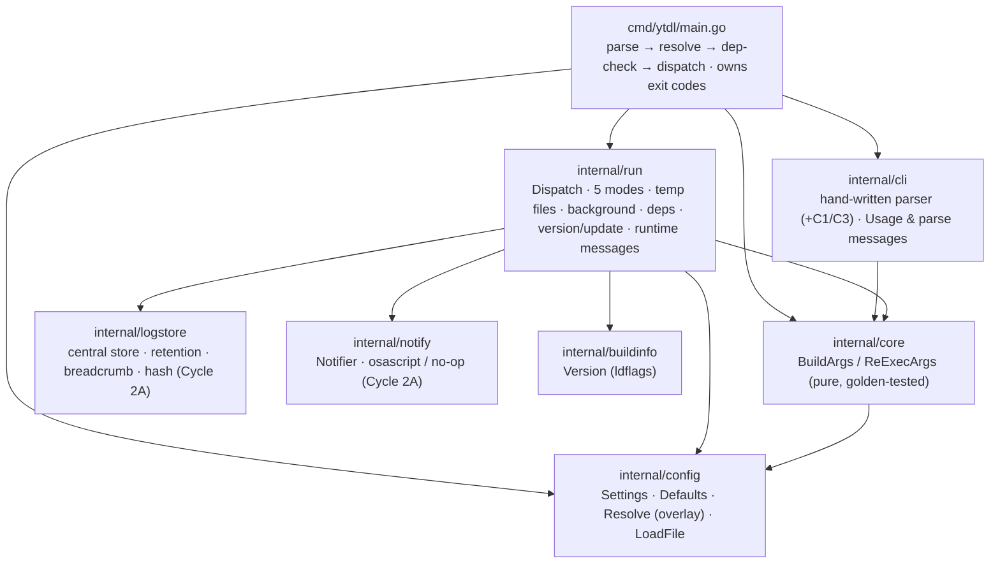

# ytdl — Go Engine Architecture (as-built)

Status: **as-built**, Cycle 1 (Session 3, 2026-07-22). Describes the compiled Go
`ytdl` that supersedes the Bash script at parity. The Bash tool's as-built design
is in [architecture.md](architecture.md) (still the golden **reference**); the
exact behaviour this engine reproduces is [go-port-parity-contract.md](go-port-parity-contract.md).
Decisions: [ADR-0003](decisions/0003-engine-language-go.md) (Go),
[ADR-0004](decisions/0004-go-engine-package-layout.md) (layout),
[ADR-0005](decisions/0005-macos-floor-and-single-engine.md) (10.15 floor).

## One engine, thin front-ends

The download logic — the fragile metadata pipeline that builds yt-dlp's argument
vector — lives once in an importable `internal/` core. The Cycle-1 CLI is the first
front-end; the Phase-4 daemon (`ytdld`) and Phase-6 web UI import the **same**
`core.BuildArgs`, never duplicating or shelling out to it (ADR-0003/0004).

Module `github.com/alergyonthestage/ytdl`, **Go 1.22+, standard library only,
`CGO_ENABLED=0`** (static binary).

## Package layout & dependency direction



- **`internal/config`** (leaf) — the 9-key `Settings`, `Defaults()`, `Resolve()` (the
  per-field overlay: flag > env > session > config file > default), and `LoadFile()`
  (the tolerant `key=value` parser — **parse, never `source`**). `ConfigPath()` is
  `${XDG_CONFIG_HOME:-~/.config}/ytdl/config`.
- **`internal/core`** — `BuildArgs(Options)` (the crown jewel: pure, no I/O, no exec)
  and `ReExecArgs` for background. Golden-tested for byte-exact argv parity.
- **`internal/cli`** — `Parse()` mirrors the Bash `while/case` (mode priority
  dry-run > background > verbose > silent > default), plus `Usage` and parse-error text.
- **`internal/run`** — the runtime the goldens don't cover: `Dispatch`, the five mode
  behaviours, temp files, native background detach (`Setsid` + `/dev/null`), PATH
  prepend, dependency check, `--version`, `--update`, and all runtime user-facing
  strings. In Cycle 2A it also records every job to the central store, drops/cleans
  the in-destination failure breadcrumb, and fires completion notifications.
- **`internal/logstore`** (leaf, Cycle 2A) — the central log store + age retention
  (`Record`/`Prune`), the in-destination failure breadcrumb (`WriteBreadcrumb`/
  `RemoveBreadcrumb`, keyed by `Hash(NormalizeURL(url))`), and per-item playlist
  reconciliation. All I/O is best-effort; it is off the golden argv path.
- **`internal/notify`** (leaf, Cycle 2A) — the completion-notification `Notifier`
  abstraction: an `osascript` backend on macOS, a no-op elsewhere (so CI and the
  Linux container exercise the same path). Best-effort, timeout-bounded.
- **`cmd/ytdl`** — wires it together and owns `os.Exit` codes.

Runtime strings live in `run`, parse strings in `cli` — so `run` does not import
`cli` and there is no cycle (a minor consolidation of the design's `cli/dispatch.go`).

## The parity gate (golden tests)

`core.BuildArgs` is pinned to the Bash reference by **golden tests**:
`internal/core/testdata/*.args` are **NUL-delimited** byte streams (newline can't
represent the empty-string `--replace-in-metadata` argument), captured from a live
run of the real Bash `ytdl` by `tests/harness/capture-goldens.sh` (fake
`yt-dlp`/`ffmpeg`/`nohup` shims + a normalizer). Absent config ⇒ `Defaults()` ⇒
identical argv, so config/precedence is tested separately in `internal/config`, not
via goldens.

Runtime temp-file paths (`--print-to-file … <tempfile>`) are injected into
`Options.TitleFile`/`SavedFile` by the runner and normalized to
`{{TITLEFILE}}`/`{{SAVEDFILE}}` in the goldens, keeping `BuildArgs` pure.

## Build, test, release

```bash
go build ./...
go test ./...                     # add -race in CI/locally
go vet ./... && gofmt -l .        # gofmt output must be empty
go test ./internal/core -update   # regenerate goldens from the Bash ytdl
bash tests/test-installer.sh      # installer logic (pure bash, runs in CI too)
```

Requires a **Go 1.22+ toolchain** (not always present in a fresh dev container —
provision it if `go version` fails; stdlib-only, no modules to download).

Release (`.github/workflows/release.yml`, on a `v*` tag): cross-compiles from Linux,
`CGO_ENABLED=0 GOOS=darwin GOARCH={arm64,amd64}`, `-trimpath`,
`-ldflags "-s -w -X …/internal/buildinfo.Version=$TAG"`, publishes
`ytdl_macos_{arm64,amd64}` + a yt-dlp-format `SHA2-256SUMS`, marked `--latest`.
Versioning starts at **2.0.0**.

## Deliberate divergences from the Bash tool (documented, not bugs)

| # | Behaviour | Where |
|---|---|---|
| C1 | `-f` validated against `mp3\|flac\|m4a\|opus\|wav`; invalid flag → exit 1 (config `format` warns + falls through — the asymmetry) | `cmd/ytdl/main.go` |
| C3 | a second positional URL is rejected, not silently dropped | `internal/cli` |
| C5 | the failure-marker filename is sanitised beyond the Bash `tr '/:' '_'` | `internal/logstore` |
| D1 | with `$HOME` unresolvable a **download** fails fast rather than writing to a CWD-relative dir; `-h`/`-V` stay permissive; an absolute `-o` is honoured | `cmd/ytdl/main.go` |
| D2 | (Cycle 2A) the always-on title-derived `<title>.log` is **replaced** by the central log store (always) + an opt-out in-destination breadcrumb `"<title> — FALLITO.<hash8>.log"`; fixes the M2 title collision and keys auto-cleanup by hash. See [ADR-0006](decisions/0006-cycle2a-logs-breadcrumbs-notifications.md). | `internal/run`, `internal/logstore` |

New capabilities beyond Bash (config-driven, off the golden path): the config file
itself, the `embed_metadata`/`embed_thumbnail` toggles, and — Cycle 2A — the central
log store, the failure breadcrumb, and completion notifications. None read into
`core.BuildArgs`, so the argv and goldens are unaffected; the per-item playlist
breadcrumb's extra yt-dlp print sinks are appended by the runner *after* `BuildArgs`,
keeping the parity gate intact.

## Parity hazards to preserve (do not "clean up")

- **Two `before_dl` templates.** Silent mode prints `%(artist,creator,uploader)s -
  %(track,title)s` — it **omits** the `xartist`/`xtrack` helpers that the filename
  template and the default-mode `before_dl` include. Encoded as separate branches.
- **`--no-simulate` is mode-specific** — present only in silent + default (`base_args`).
- **No album tag** — `meta_args` writes only `meta_artist`/`meta_title` (parity).
- The Bash `ytdl` stays in the repo as the golden **reference** (retired as a shipped
  tool, kept for `-update` golden regeneration).

## Extension points for Cycle 2+ (backend, phase 4)

- **Config:** the log/notify keys landed in Cycle 2A (`log_dir`,
  `log_retention_days`, `breadcrumb_on_failure`, `notify`, `notify_on`,
  `notify_foreground`, `notify_sound`). Still deferred to Cycle 2B: `concurrency`
  and `open_folder_on_done`. `overwrites`/`archive` stay excluded — they would
  change the yt-dlp argv and break parity.
- **Logs/notify (Cycle 2A, done):** the central store, the failure breadcrumb and
  completion notifications live in `internal/logstore` + `internal/notify`, wired
  through `internal/run`, all off the golden argv path. The central store is the
  history the Cycle 2B queue/daemon will read; `NormalizeURL`/`Hash` give a stable
  job identity.
- **Queue/daemon (Cycle 2B, planned):** the queue + `ytdld` daemon reuse
  `core.BuildArgs` and the `logstore`/`notify` primitives. Background mode's current
  unbounded detach (U5) is superseded by the bounded queue.
- **Session precedence layer** in `Resolve` is present but empty (no-op) today — it is
  the GUI/daemon "per-session output dir" seam, so precedence ordering is already stable.
