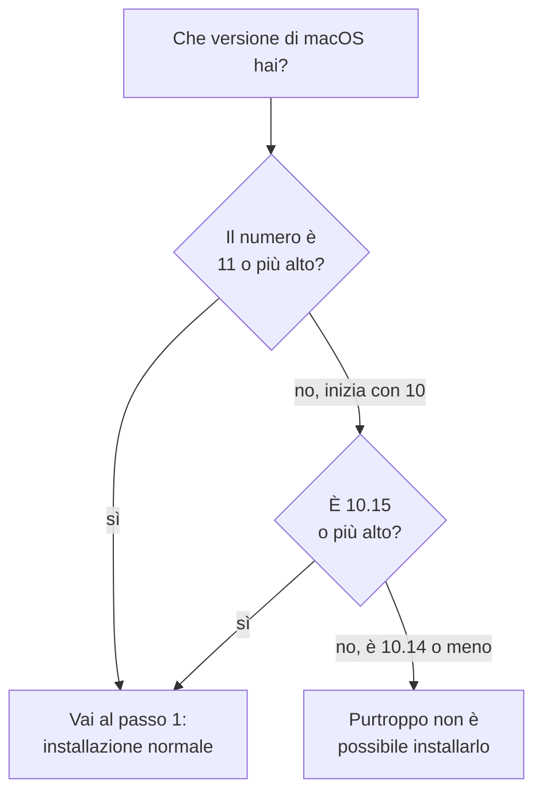

# Guida all'installazione

Questa guida ti accompagna passo passo. Non serve sapere niente di programmazione:
si tratta di copiare e incollare una riga.

Tempo necessario: circa 5 minuti.

## Prima di iniziare

Ti serve:

- un Mac con macOS 10.15 Catalina o più recente
- una connessione a internet

Non ti serve la password di amministratore: viene installato tutto dentro la tua
cartella utente, senza toccare il sistema.

### Che versione di macOS ho?

Clicca sulla **mela** in alto a sinistra → **Informazioni su questo Mac**.
Il numero che vedi (per esempio `14.5`, `12.7` o `10.15.7`) è la tua versione.



## Passo 1 — Apri il Terminale

Il Terminale è un'app già presente su ogni Mac.

1. Premi **⌘ (Command) + barra spaziatrice**: si apre una barra di ricerca al
   centro dello schermo
2. Scrivi `Terminale` e premi **Invio**

Si apre una finestra con del testo e un cursore che lampeggia. È normale che
sembri spoglia: è lì che incollerai il comando.

## Passo 2 — Incolla il comando

Copia questa riga **per intero**:

```
curl -fsSL https://raw.githubusercontent.com/alergyonthestage/ytdl/main/install.sh | bash
```

Torna sulla finestra del Terminale, incolla con **⌘ + V** e premi **Invio**.

Vedrai scorrere del testo per un minuto o due, mentre vengono scaricati i
componenti necessari. Alla fine comparirà:

```
✓ Done.
```

## Passo 3 — Apri una finestra nuova

**Chiudi il Terminale e riaprilo.** Questo passaggio serve davvero: la finestra
già aperta non conosce ancora il comando appena installato.

Poi scrivi:

```
ytdl --version
```

Se vedi due righe — la versione di `ytdl` (per esempio `ytdl v2.1.0`) e quella di
`yt-dlp` — l'installazione è riuscita. Puoi passare alla [guida all'uso](guida-uso.md).

## Se qualcosa non funziona

### «command not found: ytdl»

Hai saltato il Passo 3: chiudi completamente il Terminale e riaprilo.

Se il problema resta anche dopo aver riaperto, prova a scrivere:

```
~/.local/bin/ytdl --version
```

Se questo funziona, scrivimi: significa che il comando è installato correttamente
ma il Mac non lo sta trovando da solo.

### L'installazione si ferma con un messaggio di errore

Ogni errore dell'installatore dice cosa fare. Il più comune è:

- **macOS troppo vecchio** — sotto 10.15 Catalina non è purtroppo possibile
  installarlo.

### «Checksum mismatch»

Il download si è corrotto. Rilancia il comando del Passo 2. Se compare di nuovo,
fermati e scrivimi invece di insistere.

### Non trovo il Terminale

Puoi aprirlo anche da **Finder** → **Applicazioni** → **Utility** → **Terminale**.

## Come aggiornare

Ogni tanto YouTube cambia qualcosa e i download smettono di funzionare. Non è un
guasto del tuo Mac: succede a tutti e si risolve in trenta secondi con

```
ytdl --update
```

Vale la pena provare questo comando **prima** di segnalare qualsiasi problema.

## Come disinstallare

Nel Terminale:

```
rm -f ~/.local/bin/ytdl ~/.local/bin/yt-dlp
rm -f ~/.local/bin/ffmpeg ~/.local/bin/ffprobe
```

La musica che hai già scaricato non viene toccata.
