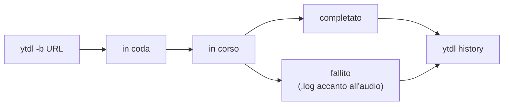

# Guida all'uso

Come usare `ytdl` per scaricare musica. Se non l'hai ancora installato, parti
dalla [guida all'installazione](guida-installazione.md).

## Il primo download

Apri il Terminale (⌘ + barra spaziatrice → `Terminale`), poi scrivi `ytdl`, uno
spazio, e incolla l'indirizzo del video **tra virgolette**:

```
ytdl "https://youtu.be/dQw4w9WgXcQ"
```

Premi Invio. Vedrai il titolo del brano e una barra di avanzamento. Alla fine ti
viene detto dove è stato salvato il file.

### ⚠️ Le virgolette sono obbligatorie

Gli indirizzi di YouTube contengono il carattere `&`, che per il Terminale
significa «esegui in background». Senza virgolette il comando viene troncato e
scarica la cosa sbagliata, o niente.

Sbagliato: `ytdl https://youtube.com/watch?v=XXX&list=YYY`
Giusto: `ytdl "https://youtube.com/watch?v=XXX&list=YYY"`

Prendi l'abitudine di metterle sempre, anche quando sembrano superflue.

## Dove finisce la musica

Nella cartella **Musica → ytdl** della tua cartella utente.

I file escono già con il nome giusto (`Artista - Titolo.mp3`) e con artista,
titolo e copertina incorporati, pronti per essere trascinati nella tua libreria
musicale.

Per salvare altrove **solo per questa volta**:

```
ytdl -o ~/Desktop "https://youtu.be/XXXX"
```

Per cambiare la cartella **per sempre**, vedi [più avanti](#cambiare-la-cartella-di-destinazione).

## Le cose che userai davvero

### Scaricare una playlist intera

Di default viene scaricato solo il brano indicato, anche se l'indirizzo fa parte
di una playlist. Per scaricare tutta la playlist aggiungi `-p`:

```
ytdl -p "https://youtube.com/playlist?list=YYYY"
```

### Scegliere il formato

Il formato predefinito è `mp3`, che va bene ovunque. Se vuoi qualità senza
perdita usa `flac`:

```
ytdl -f flac "https://youtu.be/XXXX"
```

Formati disponibili: `mp3`, `flac`, `m4a`, `opus`, `wav`.

### Vedere i nomi prima di scaricare

Utile con le playlist, per controllare che i titoli vengano puliti bene:

```
ytdl -n "https://youtube.com/playlist?list=YYYY"
```

Non scarica niente, mostra solo i nomi che verrebbero usati.

### Scaricare in background

Per playlist lunghe: il comando torna subito e il download continua per conto
suo, anche se chiudi il Terminale.

```
ytdl -b "https://youtube.com/playlist?list=YYYY"
```

I download in background vengono messi **in coda** ed eseguiti alcuni alla volta,
così non intasano la connessione. In questa modalità non vedi l'avanzamento nel
Terminale, ma puoi controllare tutto con i comandi della sezione seguente. Se un
brano fallisce, oltre alla cronologia trovi anche un file `.log` accanto al punto
in cui sarebbe finito l'audio, con la spiegazione.

### Combinare le opzioni

Le opzioni si sommano liberamente:

```
ytdl -p -f flac -o ~/Desktop "https://youtube.com/playlist?list=YYYY"
```

Playlist intera, in FLAC, sul Desktop.

## Coda, stato e cronologia

Quando scarichi in background (`-b`), tre comandi ti dicono cosa sta succedendo.



**Cosa c'è in coda adesso** — i download in attesa e in corso:

```
ytdl queue
```

Aggiungi `--watch` per vederli aggiornare dal vivo: la vista si ridisegna **sul
posto** (niente muri di testo che si accumulano) e si chiude da sola quando la
coda è finita. Premi Ctrl-C per uscire prima.

```
ytdl queue --watch
```

**Come va in generale** — se il servizio di download è attivo, più un riepilogo
recente:

```
ytdl status
```

**Cosa ho scaricato** — la cronologia, i brani più recenti in cima. A differenza
della coda, include **anche i download in primo piano**, non solo quelli in
background:

```
ytdl history
```

Solo i falliti, oppure solo gli ultimi N:

```
ytdl history --failed
ytdl history --limit 50
```

Il riepilogo di `status` e la cronologia coprono un periodo (di default gli ultimi
30 giorni); l'etichetta accanto ai numeri te lo ricorda sempre.

### Annullare un download

Per fermare un download **in corso o in attesa**, lancia `ytdl cancel` senza
argomenti: mostra la lista numerata. Poi indica il numero:

```
ytdl cancel        # mostra la lista
ytdl cancel 2      # annulla il numero 2
ytdl cancel --all  # annulla tutto
```

Un download in attesa viene rimosso subito; uno già in corso viene interrotto (con
anche l'eventuale conversione), **senza lasciare file a metà** nella cartella.

### Riprovare un download fallito

`ytdl retry` (senza argomenti) elenca i download falliti; indica il numero per
rimetterlo in coda:

```
ytdl retry         # mostra i falliti
ytdl retry 1       # riprova il numero 1
ytdl retry --all   # riprova tutti
```

> Il numero riflette la lista **in quel momento**. Se scrivi degli script, usa il
> prefisso dell'identificatore (l'`id` che vedi nella lista) invece del numero: è
> stabile nel tempo.

### Fermare i download troppo lunghi

Di norma non c'è un limite di durata (un album grosso o una connessione lenta non
vengono interrotti). Se vuoi un tetto, imposta `job_timeout` (in secondi) nel file
di configurazione: un download che lo supera viene interrotto e segnato come
fallito. `0` (default) significa nessun limite.

## L'interfaccia grafica (senza Terminale)

Se preferisci non usare il Terminale, ytdl ha un'interfaccia nel browser. Aprila
una volta sola così:

```
ytdl gui
```

Si apre una pagina web (sul tuo computer, non su internet) dove puoi:

- **incollare un link e scaricare**, scegliendo formato, playlist e cartella;
- **vedere la barra di avanzamento** dei download in corso, dal vivo;
- consultare la **coda** e la **cronologia** recente;
- **cambiare le impostazioni** (cartella predefinita, formato, e tutto il resto)
  senza modificare file a mano.

La pagina resta la tua finestra su ytdl finché la tieni aperta; quando la chiudi
e non ci sono download in coda, il motore si spegne da solo. Se chiudi la pagina
con dei download ancora in coda, il browser ti avvisa prima di uscire.

L'interfaccia è **solo tua e solo locale**: risponde unicamente sul tuo computer
(`127.0.0.1`) e ogni sessione è protetta da un codice, quindi nessun sito web che
visiti può comandarla. La cartella per la sessione corrente si imposta dalla
pagina stessa, senza toccare la configurazione permanente.

> Se la porta predefinita è occupata, scegline un'altra:
> `YTDL_GUI_PORT=8790 ytdl gui`

## Cambiare la cartella di destinazione

Per cambiarla stabilmente, incolla nel Terminale (sostituendo il percorso con il
tuo):

```
echo 'export YTDL_OUT_DIR="/Users/tuonome/Musica/Scaricati"' >> ~/.zprofile
```

Poi chiudi e riapri il Terminale.

Un modo semplice per ottenere il percorso corretto: trascina la cartella dal
Finder dentro la finestra del Terminale, e il percorso viene scritto da solo.

## Quando qualcosa non funziona

### I download hanno smesso di funzionare

È la situazione più comune, e quasi sempre non è colpa tua: YouTube cambia
qualcosa e lo strumento che scarica va aggiornato. Succede ogni pochi mesi.

```
ytdl --update
```

Prova **sempre** questo prima di ogni altra cosa.

### «Nessun file scaricato»

Nella quasi totalità dei casi mancano le virgolette attorno all'indirizzo.
Ricontrolla il comando.

### «Opzione sconosciuta»

Hai scritto male un'opzione, oppure hai messo l'indirizzo senza virgolette e il
Terminale ha interpretato un pezzo dell'URL come opzione.

### Il nome del file è sbagliato

`ytdl` prova a ricavare artista e titolo dai dati del brano, e quando non ci sono
li deduce dal titolo del video. Se il video ha un titolo scritto in modo insolito,
il risultato può essere impreciso. Puoi sempre rinominare il file a mano.

## Tutte le opzioni

Per l'elenco completo, sempre aggiornato:

```
ytdl --help
```

| Opzione | Cosa fa |
|---|---|
| `-o CARTELLA` | Salva in una cartella diversa, solo per questa volta |
| `-p` | Scarica l'intera playlist |
| `-f FORMATO` | Formato audio: `mp3`, `flac`, `m4a`, `opus`, `wav` |
| `-n` | Mostra i nomi senza scaricare |
| `-b` | Scarica in background e restituisce subito il controllo |
| `-v` | Mostra tutti i dettagli tecnici (utile per capire un errore) |
| `--update` | Aggiorna ytdl e i suoi componenti |
| `--version` | Mostra le versioni installate |
| `--help` | Elenco completo delle opzioni |

### Comandi della coda

| Comando | Cosa fa |
|---|---|
| `ytdl queue [--watch]` | Download in attesa e in corso (con `--watch` si aggiorna dal vivo e si chiude a coda finita) |
| `ytdl status` | Stato del servizio di download + riepilogo recente |
| `ytdl history [--failed] [--limit N]` | Cronologia dei download, anche in primo piano |
| `ytdl cancel [<n> \| --all]` | Annulla un download in corso o in attesa (senza argomenti: lista numerata) |
| `ytdl retry [<n> \| --all]` | Rimette in coda un download fallito (senza argomenti: lista numerata) |
| `ytdl gui` | Apre l'interfaccia grafica nel browser |
