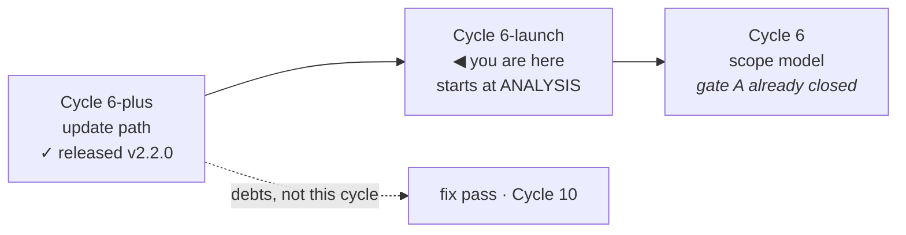

# Handoff — Cycle 6-launch, the app entry point

**Transient**, like the four before it: deleted when this cycle closes. Nothing is
decided here. Everything normative is in
[roadmap.md § Cycle 6-launch](roadmap.md#cycle-6-launch--the-desktop-launcher-f--after-the-update-path),
the ADRs, and [ux-principles.md](ux-principles.md).

## Where the project is

**v2.2.0 is released, merged and installed.** Cycle 6-plus is closed.

| | |
|---|---|
| `main` | merged `--no-ff`, pushed, tagged **`v2.2.0`**, release published |
| the maintainer's Mac | re-installed from `main`; `installed.conf` exists for the first time |
| `deps.conf` | **now on `main`** — a commit to it reaches every installation within a day |
| suite · vet · gofmt · parity gate | green · clean · clean · empty |
| `tests/test-installer.sh` | 103/103, under bash 5 **and** a real bash 3.2 |

Gate C passed on 2026-08-23 after four by-hand sittings. Its outcome, including
what was **not** run, is
[improvements.md § Gate C — esito](improvements.md#cycle6plus-gatec-esito).

## This cycle starts at ANALYSIS

No design exists. The protocol is the project's usual one and no phase advances
without the maintainer saying so:

**analysis → gate A → design → gate B → implementation → review → gate C → docs.**

The roadmap section is the scope. **Read it before anything else** — it already
lists what the analysis must settle, and it was extended on 2026-08-23 with the
maintainer's clarification of what this cycle is actually for.

### The clarification, because it is the thing most likely to be misread

> «Con "desktop launcher" non intendo che l'icona viva per forza sul Desktop.
> Intendo che l'utente veda ytdl come un'app, quindi icona in Application folder,
> inseribile in dock, Desktop o location arbitraria.»

The cycle's name names the **destination** — the desktop metaphor — not a
directory. What is being delivered is **ytdl as an application**: something that
appears in the Applications folder, that the user can drag to the Dock, to the
Desktop, or into a folder of their own, and that keeps working wherever they put
it.

That narrows the artefact question and opens others; all of them are written out
in the roadmap. The three worth knowing before opening a file:

- **A `.command` file is effectively ruled out** — it is not an app, and
  double-clicking it opens a Terminal, which is the one thing this cycle exists to
  remove.
- **`/Applications` needs admin, `~/Applications` does not**, and the installer
  has never used `sudo` — that is ADR-0001's whole shape.
- **Gatekeeper is the decisive unknown, and it must be verified, not assumed.**
  ADR-0001 rejected `.pkg`/`.dmg`/`.app` precisely because Gatekeeper blocks
  unsigned *downloaded* bundles, and deferred the notarization question. The claim
  this cycle rests on is that a bundle **generated on the machine** (`osacompile`
  at install time) carries no quarantine attribute and is therefore a different
  case. If that holds, ADR-0001 gets an amendment or a successor saying so; if it
  does not, the cycle's premise is gone and the analysis has to say so early.

## What Cycle 6-plus hands over that changes this cycle's problem

Three things are new since the roadmap section was written, and each one bears
directly on the launcher.

1. **`install.sh` now runs on every UPDATE, not only on first install.** Whatever
   the installer does to the bundle it does again every time the user updates.
   Deleting and recreating it would churn the Dock entry, the Spotlight index and
   any alias the user made. "Leave it alone when it has not changed" is probably
   right, and it has to be a decision.
2. **The update replaces `~/.local/bin/ytdl` underneath a running daemon**, and
   the daemon re-execs `os.Executable()`. A launcher that hardcodes anything about
   the binary other than its path will go stale on the first update.
3. **`C2`, the acceptance test, passed with exactly one exception** — the update
   itself needed no Terminal, but *opening the interface* still did. This cycle is
   that exception. When it closes, ADR-0016's acceptance test is met without a
   footnote.

Two facts worth having to hand, both verified:

- `ytdl gui` **reuses a daemon that is already listening** and only spawns one
  when nothing is (`cmd/ytdl/main.go`, `guiProbe`). The launcher's idempotence
  question is partly already answered by that path.
- The documented uninstall today is three `rm -f` lines in
  [guida-installazione.md](guida-installazione.md) § *Come disinstallare*. A
  launcher adds a fourth, and that file is user-facing Italian.

## Debts carried, and they are NOT this cycle

Recorded so they are not lost and not accidentally picked up here.

**A fix pass — independent of this cycle, and `V25` argues for doing it first**,
because every full suite run until then costs 91 GB of disk and has taken the
container down twice:

| # | | |
|---|---|---|
| [`V23`](improvements.md#V23) | a `set -u` abort is still recorded as a **successful** run; the hardening that was applied is inert under bash 3.2 | a proven fix is written down |
| [`V25`](improvements.md#V25) | one `go test -race ./...` leaves 1715 `/tmp/_MEI*` — **91 GB** — and takes 4 m 26 s | make `versionTimeout` injectable |
| [`V28`](improvements.md#V28) | an install that installs nothing costs **45 s**: seven `yt-dlp --version` execs for one answer | same cause as `V25` |

**Cycle 10, as one decision rather than three** — the page treats an update in
flight as the state of a *panel* when it is the state of the *document*:
[`V26`](improvements.md#V26) · [`V27`](improvements.md#V27) ·
[`V29`](improvements.md#V29), plus [`V22`](improvements.md#cycle6plus-gatec).

> **`V27` is a normative debt, not a preference.** With an unattested ffmpeg the
> page prints the tool twice, the first time as «versione non registrata» while
> the marker holds its build and the CLI prints it correctly — a surface stating
> something untrue, which `ux-principles.md` §5 and `CLAUDE.md` #5 forbid
> outright. Deferred by the maintainer's decision on 2026-08-23. **Cycle 10 does
> not start without it**, and that is pinned in the roadmap.

## Two lessons the last cycle paid for, that apply here immediately

**1 · The container is not the target platform, and this cycle is entirely about
the target platform.** Three times Cycle 6-plus got a truthful answer to the wrong
question: a warm process where the Mac is cold (`V20`), bash 5 where the Mac is 3.2
(`V21`), and — widest — the working tree where the network serves `origin`
(`V24`), which cost three whole sittings. **Nothing about `osacompile`, Gatekeeper,
Launchpad, the Dock or `~/Applications` can be established here.** Expect this
cycle to need the Mac earlier and more often than the last one, and write the
by-hand checklist as you go rather than at gate C.

**2 · A skipped test looks exactly like a passing one.** Twice in gate C a check
"passed" while proving nothing — once because the block never took effect, once
because the installer skipped the step under test. Both ended without errors. Put
in every expectation the line that proves the work was **attempted**, not only the
absence of failure.

## Container gotchas, unchanged

- git and `go build` want
  `GIT_CONFIG_COUNT=1 GIT_CONFIG_KEY_0=safe.directory GIT_CONFIG_VALUE_0=/workspace/yt-download`
  on **every** invocation.
- No credentials for `origin`: pushes are the maintainer's, from the Mac. `gh` is
  not authenticated here and **not installed on the Mac**.
- `.cco/` is mounted read-only, so `checkout`/`merge` fail here on any ref that
  touches it — merges happen on the Mac.
- After any full suite run: `find /tmp -maxdepth 1 -name '_MEI*' -type d -print0 | xargs -0 -r rm -rf`
- The container **can** build bash 3.2 in two minutes; recipe and its honest limit
  in [improvements.md § bash 3.2](improvements.md#bash32).
