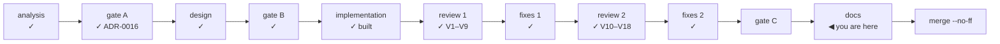

# Handoff — Cycle 6-plus, the documentation phase

**Transient document.** It exists to start the documentation session with no prior
context, and is **deleted at the cycle's close**, when the roadmap and the ADRs
carry whatever survived. It replaces `handoff-cycle6plus-fixes.md`, which the fix
session consumed. Everything normative is in the documents it points at;
**nothing is decided here.**

## Where the cycle is



The cycle was built on 2026-08-13, reviewed on 2026-08-18, fixed, **reviewed
again — this time the fix session itself** — and fixed again on 2026-08-19. The
second review is the reason this phase matters more than usual: it found that
four of the first pass's fixes had introduced regressions, and that **three
normative documents now say the opposite of the code**.

**Branch `feat/update-path/implementation`, NOT merged.** `main` is untouched.
Last commit: `f86857e`.

| Check | State on 2026-08-19, re-verified without the test cache |
|---|---|
| `go build ./...` · `go vet ./...` · `gofmt -l .` | clean |
| `go test -race -count=1 ./...` | green, every package |
| `bash tests/test-installer.sh` | **101 assertions, 0 failed** |
| `git diff main -- internal/core/ internal/daemon/` | **empty** |
| `location.reload(` in `app.js` · `innerHTML` in code | 1 · 0 |

The `internal/update` package was additionally run five times cold under `-race`:
the flakiness the second review attributed to a race in `finish` is gone.

## Gate C first, and it should be a short read

The maintainer directed this session at the documentation phase. Gate C is the
cycle's own rule (`CLAUDE.md` non-negotiable 6), so it is worth the ten minutes:
its question is *does any surface state something untrue*, and this cycle failed
that question twice before catching it.

The evidence is assembled and needs no re-derivation:

- [improvements.md § Review findings](improvements.md#cycle6plus-review) —
  `V1`–`V9`, the implementation's defects, all fixed.
- [improvements.md § Fix-session review](improvements.md#cycle6plus-fixreview) —
  `V10`–`V18`, what fixing them cost, all fixed; **plus a "confirmed sound"
  section and seven findings deliberately deferred with the reason for each.**

Every finding in both registers was reproduced by execution, and every fix was
run against the code *before* it to prove the test fails there. Three ratified
decisions are recorded below; they are the only things gate C is being asked to
bless that are not already a document.

## What this session does

**The documentation phase, and nothing else.** No code. If the docs reveal a code
defect — which is how `V17` was found — record it in the register and stop; do
not fix it here.

Two obligations, in this order.

### 1. Bring the normative documents back in line with the code

The second review established these by execution or citation. They are not
opinions and they are not optional: `ux-principles.md`'s own header and
non-negotiable 6 say a cycle **conforms to the normative document or amends it in
its ADR**.

| Document | What is now false, and where |
|---|---|
| [decisions/0008-daemon-lifecycle.md](decisions/0008-daemon-lifecycle.md):41 | The lifetime rule is stated as a two-way union — «daemon alive ⟺ (a GUI client is connected) OR (the queue has pending/running work)». It is now **three-way**: `daemonAlive` (`cmd/ytdl/update.go`) adds "OR an installer this process launched is still running". ADR-0016 §9 carefully recorded the *exit* cause it added and argued it did not weaken the clause beside it; the new **keep-alive** clause is recorded nowhere. The mermaid at :65 is affected too |
| [design-cycle6plus-update.md](design-cycle6plus-update.md):506 | §7.3's last row still reads «the run state **stays `running`** and the page says it cannot tell how it went». The state is now derived as `abandoned` (`update.Run.Abandoned`), never written, and the page reaches it from `applyUpdate` on load — which is what `V16` was |
| [ux-principles.md](ux-principles.md) §7 | The `abandoned` state is **GUI-only** (`grep -rn StateAbandoned` finds `internal/update` and `internal/webui`, nothing on the CLI side). §7 requires both channels **or an ADR that records the asymmetry and its reason**. The asymmetry is defensible and the argument is already made — see "Decisions to record" below — but no document makes it |

### 2. Write the user- and maintainer-facing documentation, which does not exist

**This is the larger half.** The audit below was run on 2026-08-19; the counts are
occurrences of each term in each file.

```
                            update_check  deps.conf  internal/update
docs/guida-uso.md                      0          0                0
docs/guida-installazione.md            0          0                0
docs/cli-reference.md                  0          0                0
docs/go-engine.md                      0          0                0
README.md                              0          0                0
```

The whole cycle is invisible to every reader who is not reading the ADR. Per
file, precisely:

- **`CHANGELOG.md`** — there is **no `[Unreleased]` section at all**; the file
  jumps straight to `[2.1.0] — 2026-08-09`. Cycle 5 updated four documents and
  forgot the changelog entry, and the lesson was recorded so it would not repeat.
  Note the two behaviour changes a user can observe: a notice printed on **stderr**
  after a download (so a script parsing stdout is unaffected), and an ffmpeg that
  may now read `non verificata`.
- **`README.md`** — nothing about updating at all. It needs the shape, not the
  detail: ytdl checks at startup, tells you in whichever channel you are using,
  and the GUI can apply it without a Terminal.
- **`docs/guida-uso.md`** (Italian, for the audience) — has `--update` and
  `--version` in the options table at :291 and the "YouTube è cambiato" section at
  :243, which is still true but now only half the story. **Missing entirely:** the
  automatic check and how to turn it off (`update_check`), the notice that appears
  after a download, and **the whole GUI update surface** — the banner, the panel,
  *Aggiorna*, *Riprova*, what «l'aggiornamento parte a coda vuota» means, and the
  fact that the interface closes and reopens by itself when ytdl itself changed.
  Also the three vocabulary items a user will now meet: `non verificata`, `non
  installato da ytdl`, and the abandoned panel.
- **`docs/guida-installazione.md`** (Italian) — «Come aggiornare» at :105 predates
  all of this. The «Checksum mismatch» section at :96 predates the ffmpeg pin and
  should now distinguish the two cases the installer treats differently: a
  **mismatch aborts** (it is not a withdrawal, and only a withdrawal falls back),
  while a **withdrawn build** installs the current one and says so. `deps.conf` is
  worth one paragraph in the audience's terms: ytdl decides which yt-dlp and which
  ffmpeg it drives, and that decision is not the user's.
- **`docs/cli-reference.md`** — :73 says `ytdl -V` prints «`ytdl X` + `yt-dlp Y`»,
  which is **wrong**: it prints ytdl, yt-dlp *and* ffmpeg, each with its state
  (`verificata con questo ytdl` / `non verificata: …` / `da <path> — non installata
  da ytdl` / `versione non registrata` / `non installato`), followed by the update
  state line. `update_check` belongs with the other config keys; the notice-after-a-
  download belongs in §3 (Output conventions), including that it goes to **stderr**.
- **`docs/go-engine.md`** — the package layout mermaid and the prose list have no
  `internal/update`. Its dependency direction is the point worth stating: it
  imports `buildinfo`, `config` and the stdlib only, and **everything the daemon
  uses arrives by injection from `cmd/ytdl`** — which is why `internal/daemon`
  stayed untouched. The `internal/run` node still claims "version/update"; say what
  moved. `StateAbandoned` and `StaleAfter` are new public API.

## Decisions to record

Three were taken during the fix sessions and **ratified by the maintainer on
2026-08-18** after the second review supplied the evidence. They belong in
ADR-0016 as an amendment section (§16), in the style §14 and §15 already
established.

1. **An abandoned run is recognised by PID, with a clock backstop — not by the
   clock alone.** The run record gains `pid` (`omitempty`, so records written
   before it fall back to the clock and nothing needs migrating), and the
   `abandoned` state is **derived at read time and never written**, the same
   discipline the history record's id follows. The reason for pid-first is not
   elegance: a clock-only rule would declare a *live* installer abandoned, and the
   second review reproduced exactly what that costs — a second `install.sh`
   launched over one that is still replacing binaries with `mv`. `StaleAfter` is
   two hours and exists only for a pid handed to some other process.
2. **The GUI panel gains a fifth state.** Not new scope: design §7.3 already
   promised it and there was no state for it to live in. It states only what is
   known — an earlier draft named a *cause* the surface does not have — and it
   claims neither success nor failure, which a test enforces.
3. **The V3 fix costs one ffmpeg download** on machines carrying
   `ffmpeg_pinned = false`. Ratified **with proof**: the review walked all four
   branches and showed the fix only bites when the marker's build equals the pin
   *and* records `false`, so it converges in exactly one download; in every other
   branch the pre-V3 build-id comparison already forced a re-fetch. Against
   ADR-0016 §15's "the maintainer takes on no recurring obligation": the
   maintainer's single action — re-pinning — now **terminates** the degraded state
   instead of freezing it.

A fourth needs recording because `ux-principles.md` §7 demands it:

4. **The `abandoned` state is GUI-only, and that is legitimate.** `ytdl --update`
   is `run.Update()`: synchronous, streaming `install.sh` straight to the
   terminal, and it never writes `update-run.json`. The CLI therefore has no run
   it could fail to follow. The record belongs to the asynchronous apply that
   ADR-0016 §9 gives the GUI alone, and `cli-reference.md` already assigns the CLI
   only "re-run installer". Write the reason down; §7 accepts an asymmetry that an
   ADR explains and refuses one that just happened.

## Hard constraints — still in force

- **`internal/core` byte-unchanged, `internal/daemon` untouched.** Verify with
  `git diff main -- internal/core/ internal/daemon/`; it must print nothing.
- **`install.sh` is the only thing that downloads and verifies** (ADR-0005).
- **No `innerHTML` / `outerHTML` / `insertAdjacentHTML`** in `app.js`, and
  **exactly one `location.reload(`**, in the handover path. `spa_test.go` enforces
  the count and the location.
- **User-facing text is Italian**; code, comments, identifiers and documentation
  are English — `docs/guida-*.md` are the deliberate exceptions, by audience.
- **A surface never states something untrue.** The three verdict states
  (available / up to date with its date / not verified) never collapse into two.
  This is the clause the cycle broke twice; the documentation must not reintroduce
  it by simplifying.

## What is still NOT exercised

Unchanged by two review passes, and recorded so "reviewed twice" is not read as
"exercised":

- **The handover has never run end to end anywhere.** `handOver` calls `os.Exit`,
  so no test executes it. Two preconditions *were* confirmed: the bare `fetch`
  calls authenticate through the `SameSite=Strict` cookie, and
  `DefaultFirstClientGrace` (2 min) comfortably covers the page's 60 s
  `RESTART_TIMEOUT_MS`.
- **`install.sh` has never run against the real network on a real Mac**, and the
  **withdrawn-build fallback has never fired** — no build has been withdrawn yet.
  It can be forced by pinning a build id that does not exist.
- **The canary workflow has never executed.**
- **No browser has ever rendered this GUI.** Every assertion about it comes from
  node running the real functions against fake DOM nodes, or from curl against a
  live daemon. That includes the two surfaces this cycle added last: the
  `abandoned` panel and the run adopted on page load.
- **`YTDL_GUI_TOKEN` is inherited by every child the daemon spawns**, yt-dlp
  included. ADR-0016 §9 accepts this; neither review reopened it.

## Two things only the maintainer can close

- **The four ffmpeg `sha256` values in `deps.conf` were COMPUTED in the container,
  not attested.** The whole value of ADR-0016 §12 is that the sum means *someone
  checked*. **This must not ship unverified.** A *wrong* sum is worse than a
  missing one: it is a checksum mismatch, which **aborts** the install — and a
  mismatch is not a withdrawal, so it does not fall back.
- **The acceptance test itself.** «A person who is not the maintainer goes from
  "there is an update" to "I am on it" from the GUI alone, with nobody at their
  keyboard.» It is verified when the maintainer opens the page on macOS.

## Environment

- **No ffmpeg and no browser, by design.** **node is present** — the SPA behaviour
  tests need it.
- **git needs an explicit `safe.directory` on every invocation** after the image
  rebuild, because `~/.gitconfig` is mounted read-only and the ownership changed:
  ```bash
  export GIT_CONFIG_COUNT=1 GIT_CONFIG_KEY_0=safe.directory \
         GIT_CONFIG_VALUE_0=/workspace/yt-download
  ```
  `go build` needs it too, for VCS stamping.
- **`gh` is not authenticated.** A session cannot watch a workflow or confirm a
  release.
- **`.cco/` is mounted read-only**, so `git checkout`/`merge` fail on any ref that
  rewrites a file under it. Branches touching only `docs/`, `internal/`, `cmd/`,
  `tests/`, `install.sh` and `deps.conf` switch and merge normally.
- **If you spawn review agents:** make them write their report to a file
  **incrementally**, and forbid them from writing inside the repository. Four
  agents died mid-response to API errors in the last session; the four reports
  survived only because they were being written as they went, and one agent left a
  scratch `_test.go` in the repo despite being told not to.

## Start here

```bash
cd /workspace/yt-download
export GIT_CONFIG_COUNT=1 GIT_CONFIG_KEY_0=safe.directory \
       GIT_CONFIG_VALUE_0=/workspace/yt-download
git status --short                                 # only ` M .cco/Dockerfile`
go build ./... && go test -race -count=1 ./...
go vet ./... && gofmt -l .
bash tests/test-installer.sh                       # 101 assertions
git diff main -- internal/core/ internal/daemon/   # must be empty
```

Then read, in this order: the two finding registers in
[improvements.md](improvements.md), [ADR-0016](decisions/0016-cycle6plus-update-path.md)
§9 · §14 · §15, [ux-principles.md](ux-principles.md) §4 · §5 · §7, and
[roadmap.md](roadmap.md) § Cycle 6-plus.

## After the documentation phase

- **This file is deleted**, and so is nothing else — the two registers stay.
- The cycle merges to `main` with **`--no-ff`**.
- The release is the maintainer's: it needs a Mac, and it needs the four `sha256`
  attested first.
- Then **Cycle 6-launch** (the desktop launcher) starts from its own analysis,
  inheriting this handover — an icon the user double-clicks, so that the one place
  a Terminal is still named disappears.
