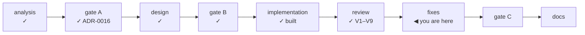

# Handoff — Cycle 6-plus, the fix session

**Transient document.** It exists to start the fix session with no prior context,
and is deleted at the cycle's close, when the roadmap and the ADR carry whatever
survived. It replaces `handoff-cycle6plus-review.md`, which the review session
consumed. Everything normative is in the documents it points at; **nothing is
decided here.**

## Where the cycle is

Gate A closed 2026-08-12, gate B and the implementation on 2026-08-13, and the
**review on 2026-08-18**. The review produced nine findings, two of them
blocking, and they get their own session before gate C.



**Branch `feat/update-path/implementation`, NOT merged.** `main` is untouched.
Last commit of the review: `f647922` (docs only).

| Check | State on 2026-08-18, re-verified without the test cache |
|---|---|
| `go build ./...` · `go vet ./...` · `gofmt -l .` | clean |
| `go test -race -count=1 ./...` | green, every package |
| `bash tests/test-installer.sh` | 92 assertions, 0 failed |
| `git diff main -- internal/core/ internal/daemon/` | **empty** |

So the baseline is sound: **every finding below is in what this cycle added, none
is a regression in the frozen surface.**

## What this session does

**Fix `V1`–`V9`, registered in
[improvements.md](improvements.md#cycle6plus-review)** — that register is the
normative list, with the verified cause of each. This file carries only what the
register cannot: the reproductions, so the session can watch the two blockers
fail before touching them.

Order: `V1`, `V2`, `V3` first — they are the ones misinforming the user or
breaking the acceptance test — then the minors and the nits, which are cheap.

**Verify before fixing.** Two findings were reproduced by execution and two
scripts are below; the rest were established by reading, so re-check each against
the code before acting on it. The review's own method is the one to keep: a
finding you cannot make fail is a finding you do not yet understand.

## Reproduce the two blockers

Both scripts are **throwaway**: write, run, delete. Neither belongs in the
repository — the fixes bring their own regression tests, written against the
behaviour the ruling requires rather than against these harnesses.

### V2 — the CLI compares an ffmpeg that must stay uncompared

Write this as `cmd/ytdl/zz_reviewprobe_test.go`, run it, delete it. It fails on
the current branch and must pass after the fix.

```go
package main

import (
	"os"
	"path/filepath"
	"testing"
	"time"

	"github.com/alergyonthestage/ytdl/internal/buildinfo"
	"github.com/alergyonthestage/ytdl/internal/cli"
	"github.com/alergyonthestage/ytdl/internal/update"
)

// ADR-0016 §15: an unattested copy is UNCOMPARED, not stale.
func TestReviewProbeUnattestedFFmpegIsUncomparedOnTheCLI(t *testing.T) {
	base := t.TempDir()
	state := filepath.Join(base, "ytdl")
	bin := filepath.Join(base, "bin")
	for _, d := range []string{state, bin} {
		if err := os.MkdirAll(d, 0o700); err != nil {
			t.Fatal(err)
		}
	}
	// Our own ffmpeg copy, so Resolve reports ours=true.
	if err := os.WriteFile(filepath.Join(bin, "ffmpeg"), []byte("#!/bin/sh\n"), 0o755); err != nil {
		t.Fatal(err)
	}
	t.Setenv("XDG_STATE_HOME", base)
	t.Setenv(update.BinDirEnv, bin)
	t.Setenv("PATH", bin)

	old := buildinfo.Version
	buildinfo.Version = "v2.1.0" // a release build; "dev" is never compared
	t.Cleanup(func() { buildinfo.Version = old })

	// The installer fell back: it installed the CURRENT build and recorded that
	// this copy is not the attested one.
	marker := "ffmpeg_build = 1799999999_9.1\nffmpeg_pinned = false\n"
	if err := os.WriteFile(filepath.Join(state, update.MarkerName), []byte(marker), 0o600); err != nil {
		t.Fatal(err)
	}

	in := update.InstalledFrom(update.Dependencies(state, true))
	t.Logf("InstalledFrom -> FFmpeg=%q Unattested=%v", in.FFmpeg, in.Unattested)
	v := update.Verdict{
		CheckedAt:  time.Now(),
		LatestYtdl: "v2.1.0",
		Pin:        update.Pin{YtDlp: "2026.07.04", FFmpeg: "1785863997_9.0"},
		Installed:  in,
	}
	if v.Available() {
		t.Fatalf("the cached verdict itself already reports a change: %+v", v.Changes())
	}
	if err := update.Save(state, v); err != nil {
		t.Fatal(err)
	}

	view := updateSurface(true, false)
	t.Logf("after updateSurface -> Installed.FFmpeg=%q changes=%+v",
		view.Verdict.Installed.FFmpeg, view.Verdict.Changes())
	if view.Verdict.Available() {
		t.Errorf("phantom update: %+v", view.Verdict.Changes())
	}
	if notice := cli.RenderUpdateNotice(view); notice != "" {
		t.Errorf("phantom notice printed after a download:\n%s", notice)
	}
	t.Logf("status line: %s", cli.RenderUpdateState(view))
}
```

What it printed on 2026-08-18, before any fix:

```
InstalledFrom      -> FFmpeg="" Unattested=[ffmpeg]          <- correct
after updateSurface -> FFmpeg="1799999999_9.1"
                       changes=[{ffmpeg 1799999999_9.1 -> 1785863997_9.0}]

! Aggiornamento disponibile per ytdl: richiede ffmpeg 9.0 (hai 9.1).
  aggiornamenti: disponibile un aggiornamento · ytdl --update
```

Note what the message asks for: a **downgrade to a build that no longer exists**,
after every download, for ever, that applying can never resolve — the installer
would simply fall back again.

### V3 — a skipped ffmpeg is promoted to "verificata"

`install.sh` is sourceable as a library, which is what makes this testable with
no network. Run it from anywhere:

```bash
#!/bin/bash
# Does a SKIPPED ffmpeg keep the "not attested" fact? (ADR-0016 §15)
set -uo pipefail
sandbox="$(mktemp -d)"
export HOME="$sandbox"
export XDG_STATE_HOME="$sandbox/state"
export YTDL_INSTALL_DIR="$sandbox/bin"
export YTDL_INSTALLER_LIB=1
mkdir -p "$YTDL_INSTALL_DIR" "$XDG_STATE_HOME/ytdl"

source /workspace/yt-download/install.sh

# This machine fell back once: the current build is installed, recorded as NOT
# attested.
cat > "$XDG_STATE_HOME/ytdl/installed.conf" <<'MARKER'
ytdl_version = v2.1.0
yt_dlp_version = 2026.07.04
ffmpeg_build = 1799999999_9.1
ffmpeg_pinned = false
MARKER
for t in ffmpeg ffprobe; do printf '#!/bin/sh\n' > "$YTDL_INSTALL_DIR/$t"; chmod +x "$YTDL_INSTALL_DIR/$t"; done
printf '#!/bin/sh\necho "ytdl v2.1.0"\n' > "$YTDL_INSTALL_DIR/ytdl";   chmod +x "$YTDL_INSTALL_DIR/ytdl"
printf '#!/bin/sh\necho 2026.07.04\n'    > "$YTDL_INSTALL_DIR/yt-dlp"; chmod +x "$YTDL_INSTALL_DIR/yt-dlp"

# The maintainer has since re-pinned deps.conf to the build the fallback installed.
ARCH_KEY=arm64; FORCE=0; FFMPEG_TARGET="1799999999_9.1"

echo "marker before: $(marker_get ffmpeg_pinned)"
ffmpeg_is_current && echo "ffmpeg_is_current: yes (install_ffmpeg returns early)"
echo "FFMPEG_PINNED after the skip path: $FFMPEG_PINNED"
write_marker
echo "marker after write_marker: $(marker_get ffmpeg_pinned)"
rm -rf "$sandbox"
```

What it printed on 2026-08-18, before any fix:

```
marker before: false
ffmpeg_is_current: yes (install_ffmpeg returns early)
FFMPEG_PINNED after the skip path: 1
marker after write_marker: true
```

**The trigger is the intended remedy.** Upstream withdraws build X, users fall
back to Y, the maintainer re-pins `deps.conf` to Y — which is exactly what a
maintainer would do — and at the next update every one of those machines skips
ffmpeg and starts calling an unverified copy "verificata". The better fix is
therefore **not to skip** when the marker says `ffmpeg_pinned = false`: that
re-fetches the copy and actually obtains the attestation, instead of merely
carrying the doubt forward.

### V1 has no script, and that is the finding

The stuck-`running` state cannot be produced by a unit test, because it needs a
process to die between `Start` and `finish`. Establish it by reading instead —
the chain is short:

```bash
grep -n "LiveClients\|\.Running()" cmd/ytdl/main.go internal/webui/*.go | grep -v _test
grep -rn "SaveRun(" --include=*.go . | grep -v _test
```

The first shows that the only thing keeping the daemon alive is the SSE client;
`Runner.Running()` is consulted by nobody. The second shows that only `Start` and
`finish` ever write the record — **nothing ages a stale one out.**

Two fixes are needed and they are not alternatives: keeping the daemon alive for
the duration of a run stops the state being *created*, and ageing out a stale
record is what recovers the machines where it already exists (a reboot
mid-install produces it too, and no liveness rule can prevent that).

## Read these first, in this order

| # | Document | Why |
|---|---|---|
| 1 | [improvements.md § Review findings](improvements.md#cycle6plus-review) | The nine findings with their verified cause. **The normative list** |
| 2 | [decisions/0016-cycle6plus-update-path.md](decisions/0016-cycle6plus-update-path.md) | The rulings each finding contradicts — §9 for V1, §15 for V2 and V3, §14 for why the probe and the installer legitimately differ |
| 3 | [ux-principles.md](ux-principles.md) §4, §5, §7 | Normative: an action that cannot work is disabled **with a reason**; a surface never states something untrue; a capability lands in both channels |
| 4 | [roadmap.md](roadmap.md) § Cycle 6-plus | Scope, "done when", and why the ffmpeg pin creates no standing obligation |
| 5 | `/workspace/.claude/CLAUDE.md` | The six project non-negotiables |

## Hard constraints — still in force

- **`internal/core` byte-unchanged, `internal/daemon` untouched.** Verify with
  `git diff main -- internal/core/ internal/daemon/`; it must print nothing. V1's
  fix touches daemon *configuration* from `cmd/ytdl` — the composition root — and
  must not touch `internal/daemon` itself.
- **`install.sh` is the only thing that downloads and verifies.** No second
  download-and-verify path in Go (ADR-0005).
- **No `innerHTML` / `outerHTML` / `insertAdjacentHTML`** in `app.js`.
- **Exactly one `location.reload(`**, in the handover path. `spa_test.go` enforces
  the count and the location; the prohibition was narrowed, never deleted.
- **User-facing text is Italian**; code, comments, identifiers and docs are
  English (`docs/guida-*.md` are the Italian exceptions).
- **A surface never states something untrue** — the three verdict states
  (available / up to date with its date / not verified) never collapse into two.
  V2 and V3 are both breaches of exactly this.

## What the review did NOT establish

Do not read "reviewed" as "exercised". These were the likeliest bug sites
according to the session that built the cycle, and the review left them where it
found them:

- **The handover has never run end to end anywhere** — `handOver` calls
  `os.Exit`, so no test executes it. Two of its preconditions *were* confirmed:
  the bare `fetch` calls in `pollUpdate`/`newBuildIsServing` authenticate through
  the `SameSite=Strict` cookie (`tokenOK` accepts cookie **or** header), and
  `DefaultFirstClientGrace` (2 min) comfortably covers the page's 60 s
  `RESTART_TIMEOUT_MS`, so the incoming daemon cannot idle-exit while the browser
  reconnects. `os.Executable()` after an `mv` replacement is correct on macOS; on
  Linux it resolves to a `(deleted)` path, which matters only if the handover is
  ever exercised in CI.
- **`install.sh` has never run against the real network on a real Mac**, and the
  **withdrawn-build fallback has never fired** — no build has been withdrawn yet.
  It can be forced by pinning a build id that does not exist. That path is what
  keeps ytdl installable, and it is entirely untested against reality.
- **The canary workflow has never executed.**
- **`YTDL_GUI_TOKEN` is inherited by every child the daemon spawns**, yt-dlp
  included. ADR-0016 §9 accepts this; the review did not reopen it. Decide
  whether you still agree, now that it is real.
- **All DOM ids referenced by `app.js` exist in `index.html`** (checked by
  difference), so the new surface cannot crash on a missing element — but no
  browser has ever rendered it.

## Two things only the maintainer can close

Unchanged from the review handoff, and neither is affected by the fixes:

- **The four ffmpeg `sha256` values in `deps.conf` were COMPUTED in the container,
  not attested.** They were produced by downloading the pinned zips and hashing
  them here. The whole value of ADR-0016 §12 is that the sum means *someone
  checked*; until they are verified on the Mac they mean "some machine downloaded
  this". **This must not ship unverified.** Note that a *wrong* sum is worse than
  a missing one: it is a checksum mismatch, which **aborts** the install — a
  mismatch is not a withdrawal, and only a withdrawal falls back.
- **The GUI has never been opened in a browser.** The banner, the settings block,
  the update panel and the handover reload were exercised by node and by curl
  against a live daemon, never by a rendering engine. There is no ffmpeg here
  either, so no real conversion has run.

## Environment

- **No ffmpeg and no browser, by design.** **node v22 is present** — the SPA
  behaviour tests need it.
- **`gh` is not authenticated.** A session cannot watch a workflow or confirm a
  release; verify from git and hand the rest to the maintainer.
- **`.cco/` is mounted read-only**, so `git checkout`/`merge` fail on any ref that
  rewrites a file under it. Branches touching only `docs/`, `internal/`, `cmd/`,
  `tests/`, `install.sh` and `deps.conf` switch and merge normally.
- **Known, not blocking:** `TestRunQueuedCancelKillsProcessGroup`
  (`internal/run`) has flaked under container load on a cold-cache `-race` run.
  Pre-existing timing fragility, headed for the deferred Phase-5 hardening cycle.
  Re-run before investigating.

## Start here

```bash
cd /workspace/yt-download
git checkout feat/update-path/implementation
go build ./... && go test -race -count=1 ./...
go vet ./... && gofmt -l .
bash tests/test-installer.sh
git diff main -- internal/core/ internal/daemon/   # must be empty
```

Then reproduce V2 and V3 with the two scripts above, **before** changing
anything.

## After the fixes

Gate C, then the **documentation phase**, which must reach **all** of:

- `CHANGELOG.md` — Cycle 5 updated four documents and forgot the changelog entry.
  Do not repeat it.
- `README.md`
- `docs/guida-uso.md` — the update surface, in Italian, for the audience.
- `docs/guida-installazione.md` — `deps.conf`, and what a failed pin looks like.
- `docs/cli-reference.md` — `update_check`, and the new `--version` screen.
- `docs/go-engine.md` — `internal/update` in the as-built layout and the
  dependency direction.
- **This file is deleted** at the cycle's close.

Then the cycle merges to `main` with `--no-ff`, and **Cycle 6-launch** (the
desktop launcher) starts from its own analysis, inheriting this handover.
