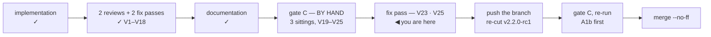

# Handoff — Cycle 6-plus, gate C in progress

**Transient**, like the handoff it replaces (`handoff-cycle6plus-docs.md`, which
the documentation session consumed). Deleted at the cycle's close. Nothing is
decided here; everything normative is in the documents it points at.

## Where the cycle is



The documentation phase is **done**. Gate C is being run **by hand on macOS by the
maintainer**, at their explicit request ("i test passano, ma voglio verificare a
mano"), and it has already justified itself: **five findings in three sittings,
two of them blocking and both now fixed**, none of which the suite could have
reached.

**Branch `feat/update-path/implementation`, NOT pushed and NOT merged.** `main`
untouched. `origin` is at `0b33f33`, the working tree eight commits ahead — which
is finding `V24` and the reason this handoff exists. Last commit: see
`git log -1`.

| Check | State |
|---|---|
| `go build` · `go vet` · `gofmt -l` | clean |
| `go test -race -count=1 ./...` | green |
| `bash tests/test-installer.sh` | **103/103** (two added by the `V21` fix) |
| `git diff main -- internal/core/ internal/daemon/` | **empty** |

## Start here, in this order

1. **[verifica-cycle6plus.md § Ripresa](verifica-cycle6plus.md#ripresa)** — the
   corrected sequence to restart from, what is still live on the machine and on
   GitHub, and the four lines that confirm `V24` on the Mac while the evidence is
   still there. Then `Setup` and the five Prerequisites — **`P3` was rewritten**,
   and it is the one that let three sittings run against the wrong code.
2. **[improvements.md § Gate-C findings](improvements.md#cycle6plus-gatec)** —
   `V19`–`V23`, with what is established and what still needs the Mac.
3. **[dev-testing.md](dev-testing.md)** — the sandbox, permanent reference.

## The one thing to know: nothing was ever under test

**`V24`, established 2026-08-22 in the container.** The update runner does not
run `install.sh` from the working tree — it fetches it from
`raw.githubusercontent.com/<slug>/<branch>/install.sh`, that is **from
`origin`** — and `origin` is eight commits behind:

```
local  HEAD                              8d3a20e
origin feat/update-path/implementation   0b33f33
```

The file the network actually serves still has `$YTDLP_TARGET…` on line 541 and
still has `cleanup(){ …; return 0; }`. **So every *Aggiorna* the maintainer
pressed ran the pre-`V21` installer.** It aborted under bash 3.2, the old trap
turned the status into 0, and the page said «Aggiornato. Non serve riavviare
nulla.» three times over an install that installed nothing. There is no new
defect in that session: it is `V21` and `V23`, unfixed, because the fixes were
never published.

`V21`'s fix, `V23`'s hardening and `V20`'s branch code have therefore **never
been exercised on the Mac**. The `v2.2.0-rc1` release binary is the exception —
its tag was pushed and points at `8b80b66`, so the release and the branch
describe different code.

## What no longer needs the Mac

Both open experiments were run in the container, against **GNU bash 3.2 built
from source** (two minutes; the recipe is in the register).

**`V23`'s mechanism is proven.** bash 3.2 enters the `EXIT` trap with `$? = 0`
after a `set -u` abort — and only after that one; `set -e`, an explicit `exit N`
and `command not found` all preserve the status in 3.2 exactly as in 5.2. **Do
not run the three-line experiment** the previous handoff asked for; it is
answered.

**The applied hardening does not fix it.** `local rc=$?` *is* 0 under bash 3.2 in
that case, so `exit "$rc"` still exits 0. And the test that pins the invariant
aborts through `fail()` — an explicit `exit 1`, the row 3.2 gets right — so it
passes over an installer that still loses the status. A fix that works under both
shells is measured and written down (a completion flag).

**`curl.Wait()` before `sh.Wait()` is ruled out.** The parent never reads the
pipe, so the ordering is harmless; the status is lost inside bash, not in Go.

**`V25`** answers where the `/tmp/_MEI*` directories came from, which `V20` left
open: a *killed* `yt-dlp` never removes its PyInstaller extraction, and the 30 s
budget makes `cmd/ytdl`'s tests kill it in bulk. One suite run leaves **1715
directories, 91 GB**, and takes **4 m 26 s** — not the 87 s recorded here before.
That is what took the container down twice, and it makes the injectable-budget
item blocking for the merge rather than merely tidy.

## What happens next, in order

1. **A fix pass, in the container** — `V23`'s real fix and `V25`'s injectable
   budget. It needs the maintainer's go-ahead: gate C does not make code changes.
2. **The maintainer pushes the branch.** The container has no credentials for
   `origin`. `~/Scripts/yt-download` is the same directory as
   `/workspace/yt-download`, so its `HEAD` is already the commit to push.
3. **P3's content check**, which is the step that was missing:
   `diff <(curl -fsSL "$RAW/install.sh") install.sh` must be silent.
4. **Delete and re-cut `v2.2.0-rc1`** from the new head — release *and* tag, in
   the web UI. Pushing a tag the remote already has does not re-run `release.yml`.
5. **A1b from its step 2**, and then the rest of the checklist.

All five are written out in
[verifica-cycle6plus.md § Ripresa](verifica-cycle6plus.md#ripresa).

## What gate C has produced so far

| # | What | State |
|---|---|---|
| `V19` | `internal/update`'s package comment claims an import it does not have | cosmetic, **not fixed** by choice |
| `V20` | a cold `yt-dlp --version` exceeds the read budget; the surface then says «versione non registrata» and, worse, reports «sei aggiornato» while unable to compare yt-dlp at all | **fixed** (`8b80b66`) |
| `V21` | `install.sh` aborted on macOS's bash 3.2 (an unbraced expansion before `…`); the GUI update therefore looped for ever | **fixed** (`70368cd`) |
| `V22` | right after an update the verdict reads «nessun controllo ancora eseguito» | open, minor |
| `V23` | that aborted install was recorded as `done, exit 0` — a failure presented as a successful no-op | **mechanism proven**; the applied hardening does **not** fix it; a fix is measured and unwritten |
| `V24` | the branch was never pushed, so the update path ran the pre-`V21` installer every time — **none of the fixes were ever under test** | **open, blocking**, needs a push |
| `V25` | one `go test -race ./...` costs 4 m 26 s and leaves 91 GB of `/tmp/_MEI*`; a killed `yt-dlp` never cleans up | **open, blocking for the merge** |

**Three findings, one lesson, and the third one is the widest.** `V24` is the
same shape as the two below, one level up: the container answered "is the fix
committed?" truthfully, and the question that mattered was "is it published?".
For anything the update path reaches over the network — `install.sh`,
`deps.conf`, the release assets — **the artefact under test is the published
one**, and a local commit is invisible to it. The check is a `diff` against what
the network serves, and it belongs before every run.

**And the two below, which are about this container.** `V20`'s 3-second
budget came from a real 650 ms measurement taken here, where the invocation was
warm. `V21` survived 101 green assertions because bash 5 parses a line that
bash 3.2 does not. Both times the container answered a question truthfully and the
question was not the one that mattered: **it is not the target platform, and for
anything touching the shell or a cold process it cannot stand in for one.**

## Open cost, carried from the V20 fix — settle before merging

**Re-measured 2026-08-22 and it is worse than recorded — see `V25`.** Under
`-race`: `cmd/ytdl` **252 s**, the whole suite **4 m 26 s**, against the "~12 s"
`CLAUDE.md` advertises. And the cost is not only time: the run leaves **1715
`/tmp/_MEI*` directories, 91 GB**, because a killed `yt-dlp` never removes its
PyInstaller extraction. That is what turned the filesystem read-only twice.

The 30-second budget is production-correct; the suite should not pay it. Fix:
make it injectable (a package variable, or a field beside `BinDirEnv`) so tests
set something small while the shipped default stays generous. Anything that stops
the tests from *killing* yt-dlp fixes both symptoms at once. Sweep meanwhile:

```bash
find /tmp -maxdepth 1 -name '_MEI*' -type d -print0 | xargs -0 -r rm -rf
```

## The environment, and the two traps that cost the most time

**The `ytdl` on the Mac's `$PATH` is the released v2.1.0**, not the branch. Two
lines of `--version` means the wrong binary. Everything runs through
`hack/ytdl-dev.sh` and a sandbox at `~/.ytdl-dev`.

- **A rebuild does not replace a RUNNING daemon.** `ytdl gui` reuses whatever is
  already listening, so the old binary keeps serving and the page keeps reporting
  the old version — which reads exactly like a build that did nothing. Use
  `hack/ytdl-dev.sh stop`. This silently invalidated a whole attempt.
- **Testing the handover needs `hack/ytdl-dev.sh install`.** The daemon re-execs
  `os.Executable()` and `install.sh` replaces `$YTDL_INSTALL_DIR/ytdl`; unless
  those are the same file the handover restarts the old build and fails on the
  60-second timeout for a reason unrelated to the code.

Container gotchas:

- git and `go build` need
  `GIT_CONFIG_COUNT=1 GIT_CONFIG_KEY_0=safe.directory GIT_CONFIG_VALUE_0=/workspace/yt-download`
  on **every** invocation.
- **`/tmp` fills and takes the container down.** It reached 100 % twice in two
  sessions, the second time turning the filesystem read-only mid-edit — at which
  point even the harness could not write. The symptom does not look like a full
  disk: `mktemp -d` fails, and `tests/test-installer.sh` dies with
  `line 159: /SHA2-256SUMS: Permission denied`. Remedy:
  ```bash
  find /tmp -maxdepth 1 -name '_MEI*' -type d -print0 | xargs -0 -r rm -rf
  ```
  11,442 such directories were found the first time. **Their origin is now
  established (`V25`)**: one `go test -race ./...` leaves 1715 of them, ~91 GB,
  because `cmd/ytdl` kills the real `yt-dlp` and a killed PyInstaller bundle never
  removes its extraction directory. A run allowed to finish leaves none, which is
  why three `--version` runs looked innocent. The maintainer also reports the
  project image at ~80 GB, to be investigated after the cycle; that stays a
  separate question, since `/tmp` lives in the container's writable layer and not
  in the image.
- `gh` is not authenticated in the container, and not installed on the Mac.

## Still not exercised

Unchanged, and recorded so "gate C in progress" is not read as "verified":

- **The handover has never completed.** `V21` was why; the fix has still never
  run, because it was never pushed (`V24`). A1b is the next thing to run and it
  is still unproven.
- `install.sh` **has** now run against the real network on a real Mac (A2 is the
  first time), but the **withdrawn-build fallback** has never fired.
- The **canary workflow** has never executed.
- The four ffmpeg `sha256` in `deps.conf` are **computed, not attested**
  (checklist C1). A wrong sum aborts an install, so this must not ship unverified.
- `release.yml` ran for the first time for the `v2.2.0-rc1` tag.

## After gate C

- These findings are fixed in a code session, gate C is re-run for the parts they
  touch, and only then does the cycle merge with `--no-ff`.
- This file and `verifica-cycle6plus.md` are deleted at the close; the registers
  stay.
- The release is the maintainer's: a Mac, plus C1 attested first.
- Then **Cycle 6-launch** (the desktop launcher), from its own analysis.
