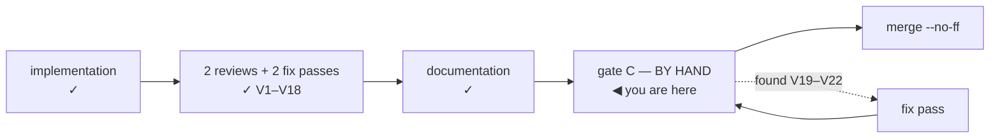

# Handoff — Cycle 6-plus, gate C in progress

**Transient**, like the handoff it replaces (`handoff-cycle6plus-docs.md`, which
the documentation session consumed). Deleted at the cycle's close. Nothing is
decided here; everything normative is in the documents it points at.

## Where the cycle is



The documentation phase is **done**. Gate C is being run **by hand on macOS by the
maintainer**, at their explicit request ("i test passano, ma voglio verificare a
mano"), and it has already justified itself: **four findings in two sittings, two
of them blocking**, none of which the suite could have reached.

**Branch `feat/update-path/implementation`, pushed, NOT merged.** `main` untouched.
Last commit at handoff: see `git log -1`.

| Check | State |
|---|---|
| `go build` · `go vet` · `gofmt -l` | clean |
| `go test -race -count=1 ./...` | green |
| `bash tests/test-installer.sh` | 101/101 |
| `git diff main -- internal/core/ internal/daemon/` | **empty** |

## Start here, in this order

1. **[verifica-cycle6plus.md](verifica-cycle6plus.md)** — the by-hand checklist.
   Read `Setup` and the five Prerequisites before anything: four assumptions that
   are *not* true by default, each of which silently invalidated an attempt.
2. **[improvements.md § Gate-C findings](improvements.md#cycle6plus-gatec)** —
   `V20`–`V22`, with what is established and what still needs the Mac.
3. **[dev-testing.md](dev-testing.md)** — the sandbox, permanent reference.

## The immediate job: V21

**`V21` is where the maintainer stopped**, and it is the one thing blocking the
rest of gate C. The GUI applies an update, reports «Aggiornato. Non serve
riavviare nulla.», changes nothing, and offers the same update again — for ever.

The register has the full analysis. In one line: the panel's wording means
`state == done && !changed`, `shouldHandOver` needs `Changed`, and `Changed` is
inferred in `Runner.finish` from the installer's marker — so it is false in
exactly two cases, **the installer skipped ytdl** or **the marker recorded no
version**.

**Do not start by reading code.** The next step is four commands on the Mac, run
after an *Aggiorna* that ends in «Non serve riavviare nulla»:

```bash
cat ~/.ytdl-dev/state/ytdl/installed.conf
cat ~/.ytdl-dev/state/ytdl/update-run.json
~/.ytdl-dev/bin/ytdl --version
tail -60 ~/.ytdl-dev/state/ytdl/update.log
```

They decide between the two branches in one pass — the register says how to read
them. Reproduce before reporting is this cycle's own rule, and it has already
saved it twice.

**A `v2.2.0-rc1` release must exist on the real repo** for any of this to be
reachable; the maintainer publishes and deletes it (checklist A1b step 1 and step
9). `gh` is **not installed on the Mac either** — the release was deleted through
the GitHub web UI.

## What gate C has produced so far

| # | What | State |
|---|---|---|
| `V19` | `internal/update`'s package comment claims an import it does not have | cosmetic, **not fixed** by choice |
| `V20` | a cold `yt-dlp --version` exceeds the read budget; the surface then says «versione non registrata» and, worse, reports «sei aggiornato» while unable to compare yt-dlp at all | **fixed** (`8b80b66`) |
| `V21` | the GUI update loops; no handover, nothing changes | **open, BLOCKING** |
| `V22` | right after an update the verdict reads «nessun controllo ancora eseguito» | open, minor, may be a consequence of `V21` |

`V20` is worth remembering for method: the 3-second budget came from a real
measurement (650 ms) taken in this container, where the invocation was warm. The
measurement was true and the conclusion did not describe the target platform.

## Open cost, carried from the V20 fix — settle before merging

**`cmd/ytdl` went from ~13 s to 87 s**, `TestRealMainStatusNoDaemon` accounting for
~49 s. The 30-second budget is production-correct, but the suite pays it whenever
a test dependency never answers. `CLAUDE.md` advertises "~12 s" for the whole
suite.

Fix: make the budget injectable (a package variable, or a field beside
`BinDirEnv`) so tests set something small while the shipped default stays
generous. Not done because the container's filesystem went read-only mid-session.

## The environment, and the two traps that cost the most time

**The `ytdl` on the Mac's `$PATH` is the released v2.1.0**, not the branch. Two
lines of `--version` means the wrong binary. Everything runs through
`hack/ytdl-dev.sh` and a sandbox at `~/.ytdl-dev`.

- **A rebuild does not replace a RUNNING daemon.** `ytdl gui` reuses whatever is
  already listening, so the old binary keeps serving and the page keeps reporting
  the old version — which reads exactly like a build that did nothing. Use
  `hack/ytdl-dev.sh stop`. This silently invalidated a whole attempt.
- **Testing the handover needs `hack/ytdl-dev.sh install`.** The daemon re-execs
  `os.Executable()` and `install.sh` replaces `$YTDL_INSTALL_DIR/ytdl`; unless
  those are the same file the handover restarts the old build and fails on the
  60-second timeout for a reason unrelated to the code.

Container gotchas:

- git and `go build` need
  `GIT_CONFIG_COUNT=1 GIT_CONFIG_KEY_0=safe.directory GIT_CONFIG_VALUE_0=/workspace/yt-download`
  on **every** invocation.
- **`/tmp` fills and takes the container down.** It reached 100 % twice in two
  sessions, the second time turning the filesystem read-only mid-edit — at which
  point even the harness could not write. The symptom does not look like a full
  disk: `mktemp -d` fails, and `tests/test-installer.sh` dies with
  `line 159: /SHA2-256SUMS: Permission denied`. Remedy:
  ```bash
  find /tmp -maxdepth 1 -name '_MEI*' -type d -print0 | xargs -0 -r rm -rf
  ```
  11,442 such directories were found the first time. **Their origin is not
  established** — three `yt-dlp --version` runs here leave none. The maintainer
  also reports the project image at ~80 GB, to be investigated after the cycle;
  note those are two different questions, since `/tmp` lives in the container's
  writable layer and not in the image.
- `gh` is not authenticated in the container, and not installed on the Mac.

## Still not exercised

Unchanged, and recorded so "gate C in progress" is not read as "verified":

- **The handover has never completed.** `V21` is exactly this.
- `install.sh` **has** now run against the real network on a real Mac (A2 is the
  first time), but the **withdrawn-build fallback** has never fired.
- The **canary workflow** has never executed.
- The four ffmpeg `sha256` in `deps.conf` are **computed, not attested**
  (checklist C1). A wrong sum aborts an install, so this must not ship unverified.
- `release.yml` ran for the first time for the `v2.2.0-rc1` tag.

## After gate C

- These findings are fixed in a code session, gate C is re-run for the parts they
  touch, and only then does the cycle merge with `--no-ff`.
- This file and `verifica-cycle6plus.md` are deleted at the close; the registers
  stay.
- The release is the maintainer's: a Mac, plus C1 attested first.
- Then **Cycle 6-launch** (the desktop launcher), from its own analysis.
