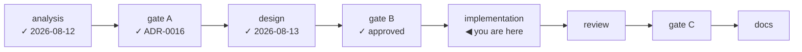

# Handoff — Cycle 6-plus, implementation

**Transient document.** It exists to start the implementation session with no
prior context and is deleted at the cycle's close, when the roadmap and the ADR
carry whatever survived. Everything normative is in the documents it points at;
nothing is decided here.

## Where the cycle is

Gate A closed 2026-08-12, gate B closed 2026-08-13. **Analysis and design are
done and approved; implementation has not started.** No production code has been
written for this cycle — every commit so far is documentation.



## Read these first, in this order

| # | Document | Why |
|---|---|---|
| 1 | [decisions/0016-cycle6plus-update-path.md](decisions/0016-cycle6plus-update-path.md) | The rulings. Thirteen of them. **Do not re-open any**; if one looks wrong, stop and say so rather than deviating |
| 2 | [design-cycle6plus-update.md](design-cycle6plus-update.md) | The design being implemented: types, signatures, endpoints, DOM, failure table, test plan |
| 3 | [ux-principles.md](ux-principles.md) §4, §5, §7 | Normative for every surface this cycle adds |
| 4 | [roadmap.md](roadmap.md) § Cycle 6-plus | Scope and "done when" |
| 5 | `/workspace/.claude/CLAUDE.md` | The six project non-negotiables |

The two facts that decide most arguments, both measured rather than assumed:

- `HEAD github.com/<slug>/releases/latest` → `302` with the tag in `Location`;
  `buildinfo.Version` and `yt-dlp --version` are byte-identical to their tags. So
  **every version comparison is string equality** — no semver parser, no date
  parser, and comparisons are *neutral*, never "is newer" (a pinned rollback
  legitimately names an older yt-dlp than the installed one).
- The golden files carry **no `argv[0]`**, and the program name lives in
  `internal/run`. Resolving dependencies by absolute path is therefore legal
  against the parity gate.

## Hard constraints

- **`internal/core` byte-unchanged, `internal/daemon` untouched.** Verify with
  `git diff main -- internal/core/ internal/daemon/` — it must print nothing, at
  every commit. Everything this cycle needs from the daemon arrives by injection
  from `cmd/ytdl`.
- **`install.sh` is the only thing that downloads and verifies.** No second
  download-and-verify path in Go (ADR-0005).
- **No `innerHTML` / `outerHTML` / `insertAdjacentHTML`** in `app.js` — a test
  enforces it, and it stays enforced.
- **One `location.reload(`**, in the update handover path only. `spa_test.go`'s
  prohibition is *narrowed*, not deleted (ADR-0016 §10).
- **User-facing text is Italian**; code, comments, identifiers and docs are
  English. `docs/guida-*.md` are the Italian exceptions.
- **A surface never states something untrue** — the three verdict states (available
  / up to date with its date / not verified) never collapse into two.

## Suggested commit sequence

Each step leaves the tree green (`go build ./... && go test -race ./...`), and
each is one commit. Steps 1–4 deliver working value on their own if the session
runs out of room.

| # | Step | Notes |
|---|---|---|
| 1 | `internal/update`: probe, `deps.conf` fetch + policy resolution, cache, `Verdict` derivation | Pure, no callers yet. Establishes the repo's first outbound-HTTP test pattern (`httptest`, injected client and base URLs) |
| 2 | `update_check` config key | `config.go`, `file.go`, `save.go`, `cli/help.go`. Default on |
| 3 | `internal/run`: resolve `yt-dlp`/`ffmpeg` by absolute path, report `Foreign` | Independent of the rest; closes the `$PATH` hole in `PrependLocalBin`. Keep `$YTDL_BIN_DIR` overridable so the shim-based tests still work |
| 4 | CLI surface: `cli.RenderUpdateNotice` + the three call sites + `RefreshAsync` at its two startup sites | Notice printed *after* the command's own output, never before |
| 5 | `deps.conf` + the idempotent installer + `tests/test-installer.sh` | The most delicate file in the repo. Pure-bash tests, no network. An unreadable `deps.conf` **aborts**; it never falls back to `latest` |
| 6 | `update.Runner`: detached installer, `update.log`, `update-run.json` | Two-process `curl | bash`, never a shell string with an interpolated URL |
| 7 | `webui`: the `Updater` seam, `/api/state.update`, the three routes | A nil `Updater` renders **no** control at all |
| 8 | GUI assets: banner, settings block, update panel, polling, the one reload; narrow `spa_test.go`; extend `spa_behaviour_test.go` | The banner shows whenever an update is available, **including with a non-empty queue** — emptiness gates the action, never the news |
| 9 | `cmd/ytdl`: the handover (`Close` not `Shutdown`, token via `YTDL_GUI_TOKEN`, spawn, `os.Exit`) | Only when the ytdl binary itself changed; a dependency-only update needs no restart |
| 10 | `internal/jobs/hint.go`: the stranded-extractor hint | One pattern, one message |
| 11 | The CI canary workflow | See below |

## Two things the container cannot do, and how to handle them

- **The ffmpeg checksums in `deps.conf` are a trust anchor.** They attest a build
  the *maintainer* fetched. The session may compute candidate values (download the
  pinned zips and hash them) but must present them for the maintainer to confirm
  before they are treated as attested — say so in the commit rather than implying
  an attestation that did not happen. The build resolved on 2026-08-13 was
  `1785863997_9.0` (`…/download/macos/<arch>/<build>/ffmpeg.zip`); re-resolve it,
  do not copy it blindly.
- **The canary fixture must not be a committed binary.** Generate it in the
  workflow with the runner's own ffmpeg (a couple of seconds of synthetic audio
  named so the metadata pipeline has something to chew on), serve it over local
  HTTP, and let yt-dlp's `generic` extractor fetch it. Nothing to commit, nothing
  to license.

## Environment

- **No ffmpeg and no browser here, by design.** Real conversions and the GUI are
  verified by the maintainer on macOS. **node v22 is present** — the SPA behaviour
  tests need it.
- **`gh` is not authenticated.** A session cannot watch a workflow or confirm a
  release; verify from git and hand the rest to the maintainer.
- **`.cco/` is mounted read-only**, so `git checkout`/`merge` fail on any ref that
  rewrites a file under it. Branches touching only `docs/`, `internal/`, `cmd/`,
  `tests/` and `install.sh` switch and merge normally.
- **Known, not blocking:** `TestRunQueuedCancelKillsProcessGroup` (`internal/run`)
  has flaked once under container load on a cold-cache `-race` run. Pre-existing
  timing fragility, headed for the deferred Phase-5 hardening cycle. If it fails,
  re-run before investigating.

## Start here

```bash
cd /workspace/yt-download
git checkout main && git pull --ff-only 2>/dev/null || true
git checkout -b feat/update-path/implementation
go build ./... && go test -race ./...          # baseline must be green first
git diff main -- internal/core/ internal/daemon/   # must be empty, now and always
```

## Done when

Every row of the design's §8 test plan passes; `go vet ./...` and `gofmt -l .` are
clean; the parity gate is empty; and the cycle's own acceptance test holds — a
person who is not the maintainer goes from "there is an update" to "I am on it"
from the GUI alone, with nobody at their keyboard.

Then: review → gate C → the documentation phase, which must reach `CHANGELOG.md`,
`README.md`, `docs/guida-uso.md`, `docs/guida-installazione.md` and
`docs/cli-reference.md`. Cycle 5 updated four documents and forgot the changelog
entry; do not repeat it.
