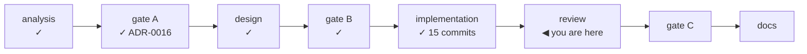

# Handoff — Cycle 6-plus, review

**Transient document.** It exists to start the review session with no prior
context, and is deleted at the cycle's close, when the roadmap and the ADR carry
whatever survived. It replaces `handoff-cycle6plus-implementation.md`, which the
implementation session consumed. Everything normative is in the documents it
points at; nothing is decided here.

## Where the cycle is

Gate A closed 2026-08-12, gate B closed 2026-08-13, and **the implementation was
built the same day**. All eleven steps of the previous handoff are done.



**Branch `feat/update-path/implementation`, 15 commits, NOT merged.** `main` is
untouched and still 11 commits ahead of `origin/main` (docs only).

| Check | State |
|---|---|
| `go build ./... && go test -race ./...` | green |
| `go vet ./...` · `gofmt -l .` | clean |
| `git diff main -- internal/core/ internal/daemon/` | **empty at every commit** |
| `bash tests/test-installer.sh` | 92 assertions, 0 failed (was 21) |
| Coverage | update 84% · cli 98% · webui 83% · run 84% · jobs 94% |

## Read these first, in this order

| # | Document | Why |
|---|---|---|
| 1 | [decisions/0016-cycle6plus-update-path.md](decisions/0016-cycle6plus-update-path.md) | The rulings, **including §14–§15 added after building** — three corrections the implementation forced, and the ruling that the ffmpeg pin must create no standing obligation |
| 2 | [design-cycle6plus-update.md](design-cycle6plus-update.md) | What was built. Its header lists the three places the design was wrong and now says so |
| 3 | [ux-principles.md](ux-principles.md) §4, §5, §7, §9 | Normative for every surface this cycle added |
| 4 | [roadmap.md](roadmap.md) § Cycle 6-plus | Scope, "done when", and why the ffmpeg pin creates no standing obligation |
| 5 | `/workspace/.claude/CLAUDE.md` | The six project non-negotiables |
| 6 | `git log --oneline main..HEAD` | Each commit's message states its reasoning; they are the design rationale for anything the documents do not cover |

## What the review is for

The cycle's acceptance test is **a person who is not the maintainer, going from
"there is an update" to "I am on it" from the GUI alone, with nobody at their
keyboard.** Everything below is in service of asking whether that actually holds,
and whether anything here can hurt someone.

This is a **safety-critical cycle** in a way the previous ones were not: it
changes what gets installed on other people's machines, and it can replace a
running binary. Weight the review accordingly.

## Where the bugs are most likely

Written by the session that built it, in descending order of worry. This is not a
checklist to tick — it is where to spend the adversarial effort.

1. **The handover** (`cmd/ytdl/update.go`, `handOver`). It calls `os.Exit`, so no
   test executes it, and it has **never run end to end anywhere**. Its four steps
   are individually argued in the code, but the sequence is unverified: the grace
   sleep racing the page's poll; `os.Executable()` after the binary underneath was
   replaced; the child failing to bind because `Close` had not finished; a second
   handover chaining off the first.
2. **`YTDL_GUI_TOKEN` is inherited by every child the daemon spawns**, yt-dlp
   included. ADR-0016 §9 accepts this ("no exposure class the 0600 token file does
   not already have"). Decide whether you still agree, now that it is real.
3. **`install.sh`** is the most safety-critical file in the repository and it grew
   a lot: policy resolution, three skip decisions, a marker, `--force`, a new
   checksum path, and the withdrawn-build fallback. The pure-bash tests cover the
   logic; **nothing has run the real installer against the real network on a real
   Mac.** A wrong skip means a user keeps a broken dependency and is told
   everything is fine.
   - The **fallback path has never fired**, because no build has been withdrawn
     yet. It can be forced by pinning a build id that does not exist and running
     the installer on a Mac — worth doing once, since it is the path that keeps
     ytdl installable and it is entirely untested against reality.
4. **`update.Runner.finish` runs on a goroutine that dies with the process.** The
   "daemon died mid-install" path (record stays `running`) is reasoned about but
   not tested — it cannot easily be.
5. **The GUI poll loop** (`pollUpdate`). Two defects were already found here after
   the fact and fixed in the last commit; treat the rest of the function with the
   same suspicion. Re-entrancy between a retry and an in-flight poll is not
   covered.
6. **`guiUpdater.Check` caches only a `Known()` round**, while `refreshOnce`
   also keeps a partial one when nothing was cached. The asymmetry is defensible
   but was not deliberate — decide which is right.
7. **The canary workflow has never run.** Its assumptions were checked by hand
   (`yt-dlp_linux` exists in `SHA2-256SUMS`, the awk parses the real `deps.conf`,
   the fixture serving works) but the job itself has not executed.

## A lesson from the implementation, worth applying to the review

The two GUI defects fixed in the final commit were invisible to the grep-based
SPA tests, and one of them was **actively hidden by the node harness**, which
stubbed `ROUTES` in exactly the shape the buggy code assumed. A harness may
replace what a function *talks to*; replacing what it *reasons about* turns the
test into a copy of the bug.

So: when a test here looks like it proves something, check what it stubbed.

## Hard constraints — still in force

- **`internal/core` byte-unchanged, `internal/daemon` untouched.** Verify with
  `git diff main -- internal/core/ internal/daemon/`; it must print nothing.
- **`install.sh` is the only thing that downloads and verifies.** No second
  download-and-verify path in Go (ADR-0005).
- **No `innerHTML` / `outerHTML` / `insertAdjacentHTML`** in `app.js`.
- **Exactly one `location.reload(`**, in the handover path. `spa_test.go` enforces
  the count and the location; the prohibition was narrowed, never deleted.
- **User-facing text is Italian**; code, comments, identifiers and docs are
  English (`docs/guida-*.md` are the Italian exceptions).
- **A surface never states something untrue** — the three verdict states
  (available / up to date with its date / not verified) never collapse into two.

## Two things only the maintainer can close

- **The four ffmpeg `sha256` values in `deps.conf` were COMPUTED in the container,
  not attested.** They were produced by downloading the pinned zips and hashing
  them here. The entire value of ADR-0016 §12 is that the sum means *someone
  checked*; until they are verified on the Mac, they mean "some machine
  downloaded this". **This must not ship unverified.**
  - Note that a *wrong* sum is now worse than a missing one: it is a checksum
    mismatch, which **aborts** the install (a mismatch is not a withdrawal). Only
    a withdrawn build falls back.
- **The GUI has never been opened in a browser.** The banner, the settings block,
  the update panel and the handover reload were exercised by node and by curl
  against a live daemon, never by a rendering engine. There is no ffmpeg here
  either, so no real conversion has run.

## Environment

- **No ffmpeg and no browser, by design.** **node v22 is present** — the SPA
  behaviour tests need it.
- **`gh` is not authenticated.** A session cannot watch a workflow or confirm a
  release; verify from git and hand the rest to the maintainer.
- **`.cco/` is mounted read-only**, so `git checkout`/`merge` fail on any ref that
  rewrites a file under it. Branches touching only `docs/`, `internal/`, `cmd/`,
  `tests/`, `install.sh` and `deps.conf` switch and merge normally.
- **Known, not blocking:** `TestRunQueuedCancelKillsProcessGroup`
  (`internal/run`) has flaked under container load on a cold-cache `-race` run.
  Pre-existing timing fragility, headed for the deferred Phase-5 hardening cycle.
  Re-run before investigating.

## Start here

```bash
cd /workspace/yt-download
git checkout feat/update-path/implementation
go build ./... && go test -race ./...
go vet ./... && gofmt -l .
bash tests/test-installer.sh
git diff main -- internal/core/ internal/daemon/   # must be empty
git log --oneline main..HEAD                        # 15 commits
git diff main --stat
```

## After the review

Gate C, then the **documentation phase**, which must reach **all** of:

- `CHANGELOG.md` — Cycle 5 updated four documents and forgot the changelog entry.
  Do not repeat it.
- `README.md`
- `docs/guida-uso.md` — the update surface, in Italian, for the audience.
- `docs/guida-installazione.md` — `deps.conf`, and what a failed pin looks like.
- `docs/cli-reference.md` — `update_check`, and the new `--version` screen.
- `docs/go-engine.md` — `internal/update` in the as-built layout and the
  dependency direction.
- **This file is deleted** at the cycle's close.

Then the cycle merges to `main` with `--no-ff`, and **Cycle 6-launch** (the
desktop launcher) starts from its own analysis, inheriting this handover.
