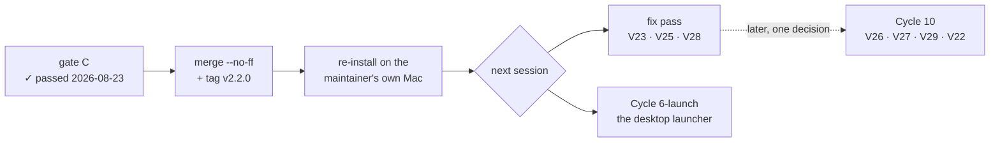

# Handoff — after Cycle 6-plus

**Transient**, like the two it replaces (`handoff-cycle6plus-gatec.md` and
`verifica-cycle6plus.md`, both deleted at this cycle's close). Nothing is decided
here; everything normative is in the documents it points at.

## Where the project is



**Cycle 6-plus is verified.** Gate C ran by hand over four sittings on real
hardware and passed on 2026-08-23. The outcome, with what was **not** run and what
was **deferred with a reason**, is
[improvements.md § Gate C — esito](improvements.md#cycle6plus-gatec-esito).

| Check | State at handoff |
|---|---|
| `go build` · `go vet` · `gofmt -l` | clean |
| `go test -race -count=1 ./...` | green, every package (4 m 26 s — see `V25`) |
| `bash tests/test-installer.sh` | 103/103, under bash 5 **and** a real bash 3.2 |
| `git diff main -- internal/core/ internal/daemon/` | empty — the parity gate holds |
| Nothing outside `docs/` changed after the last green run | verified with `git diff --name-only` |

## What is owed, and to whom

**Three defects go to Cycle 10 as one decision, not three.** They are the same
defect seen from three sides: the page treats an update in flight as the state of
a *panel* when it is the state of the *document*.

| # | | |
|---|---|---|
| [`V26`](improvements.md#V26) | *Conferma* stays clickable through the whole install | one line, but subsumed |
| [`V27`](improvements.md#V27) | an unattested ffmpeg is printed twice, once as «versione non registrata» — **untrue** | **normative debt** |
| [`V29`](improvements.md#V29) | *Controlla ora* is never disabled, and its answer can put *Aggiorna* back | reproduce before fixing |

> **`V27` is a deliberate deferral of a rule the project calls non-negotiable.**
> `ux-principles.md` §5 and `CLAUDE.md` #5 say a surface never states something
> untrue. The maintainer decided on 2026-08-23 to treat it with the other two,
> because the honest fix is the same scope decision — the page must stop reusing
> the COMPARISON shape for DISPLAY. It manifests only with an unattested ffmpeg,
> which no installation is in today; upstream is already at 9.0.1, so that will
> change. **Cycle 10 must not start without it.**

**Three go to a fix pass**, and it is not a UX one:

| # | | |
|---|---|---|
| [`V23`](improvements.md#V23) | a `set -u` abort is still recorded as a successful run; the applied hardening is **inert** under bash 3.2 | a proven fix is written down (a completion flag) |
| [`V25`](improvements.md#V25) | one suite run leaves **91 GB** of `/tmp/_MEI*` and takes 4 m 26 s | make `versionTimeout` injectable |
| [`V28`](improvements.md#V28) | an install that installs nothing costs **45 s**, seven `yt-dlp --version` execs for one answer | same cause as `V25`; `installed.conf` already records the version and nothing reads it |

`V25` and `V28` are one change. `V23` is independent and small.

## Two things the next session must not re-derive

**1 · The container is not the target platform — three times, three ways.**
`V20` measured a warm process where the Mac is cold. `V21` parsed under bash 5
what bash 3.2 refuses. `V24` was the widest: **the working tree is not what the
update path runs** — `install.sh` and `deps.conf` are fetched from `origin`, so an
unpushed commit is invisible, and three whole sittings measured the old code
believing they measured the new. The check is a `diff` against what the network
serves, before every run.

**2 · The container CAN run bash 3.2, and it is worth keeping.** Built from
source in two minutes; the recipe and its honest limit are in
[improvements.md § bash 3.2](improvements.md#bash32). It proved `V23` and proved
the applied hardening does not fix it — neither of which any bash 5 test can show.
It does **not** reproduce `V21`, which is macOS's libc, not bash's version.
Whether it becomes part of `.cco/Dockerfile` is a decision for the fix pass.

## Closing this cycle — the procedure

Run on the **Mac**: `.cco/` is mounted read-only in the container, so `checkout`
and `merge` fail there on any ref that touches those files.

### 1 · Merge

```bash
cd ~/Scripts/yt-download
git checkout feat/update-path/implementation
git push origin feat/update-path/implementation      # the closing commit

git checkout main
git merge --no-ff feat/update-path/implementation
git push origin main
```

From this moment `deps.conf` is on `main`, and it is the lever that reaches every
installation within a day.

### 2 · Release

The changelog already carries `## [2.2.0] — 2026-08-23`.

```bash
git tag -a v2.2.0 -m "v2.2.0 — update path"
git push origin v2.2.0
```

`release.yml` fires on the tag, cross-compiles both architectures and publishes
with `--latest`. **Wait for the Action to finish**, then:

```bash
curl -sI https://github.com/alergyonthestage/ytdl/releases/latest | \
  awk 'tolower($1)=="location:"{print $2}'          # expect …/tag/v2.2.0
```

### 3 · Re-install on the maintainer's own machine

The installed v2.1.0 **has no update path** — that is the gap this cycle closes —
so the only way forward is the installer. It is the last manual install: from here
the machine updates itself from the GUI.

**Open a brand-new Terminal window** and prove it is clean, because a single
leftover sandbox variable would install into `~/.ytdl-dev` again:

```bash
env | grep -E '^(YTDL_|XDG_STATE_HOME|XDG_CONFIG_HOME)'     # must print NOTHING
```

Close the real GUI if it is open — the installer replaces the binary under the
daemon — then:

```bash
curl -fsSL https://raw.githubusercontent.com/alergyonthestage/ytdl/main/install.sh | bash
```

Expected: yt-dlp downloaded (the machine is on 2026.07.04), ffmpeg downloaded and
**checksum-verified** (this ffmpeg predates the marker and has no recorded build),
the ytdl asset downloaded, `✓ Done.`

```bash
ytdl --version                              # four lines, ytdl v2.2.0
cat ~/.local/state/ytdl/installed.conf      # exists for the first time, ffmpeg_pinned = true
```

> The «installation that predates the marker» specimen is consumed here. It was
> already observed and recorded (finding `V12`), so nothing is lost.

### 4 · Delete this file

It and the registers part ways: the registers stay, this is transient.

## Then

**Cycle 6-launch — the desktop launcher**, from its own analysis. It is the last
thing standing between a non-maintainer user and never needing a Terminal: today
the GUI still has to be started from one, which is the single exception `C2`
recorded when it passed.

The fix pass (`V23` · `V25` · `V28`) can go before or after it. `V25` argues for
before: every full suite run until then costs 91 GB of disk and has taken the
container down twice.
