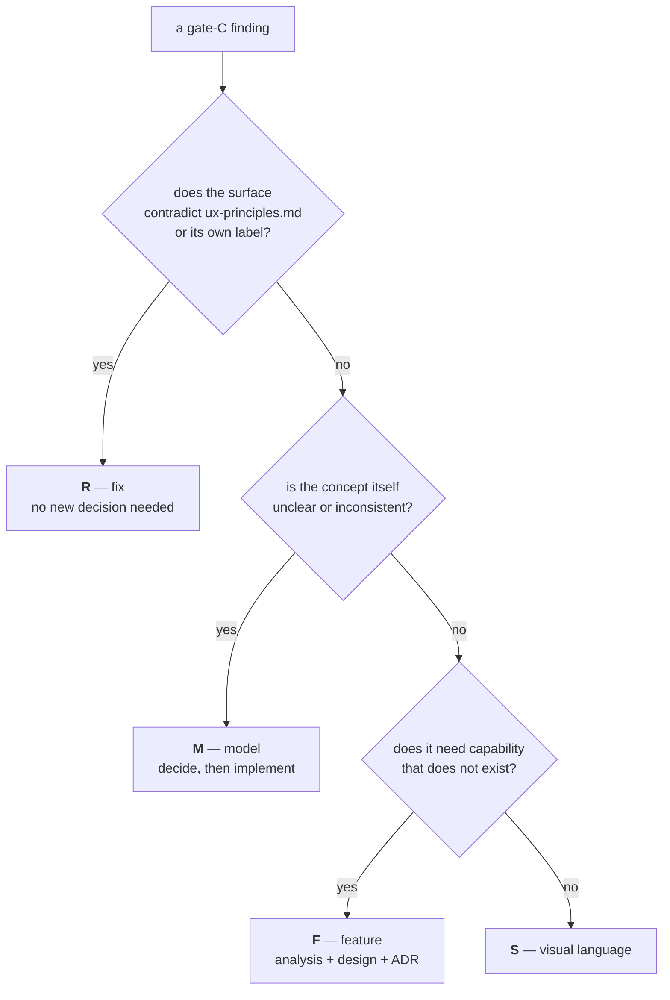
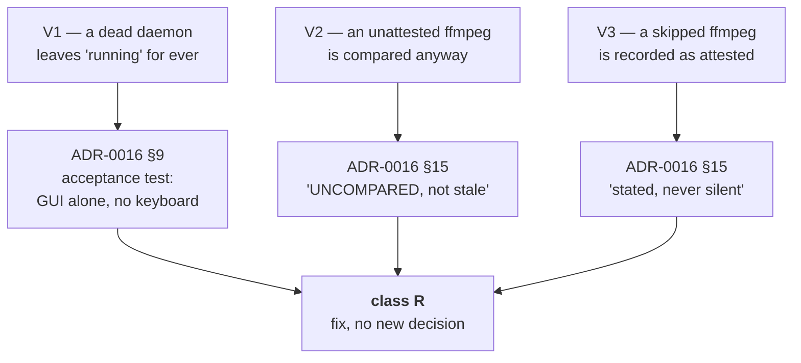

# Improvements & Evolutions

Findings from the initial analysis of `ytdl`, plus the evolutions requested by
the maintainer. Sequencing lives in [roadmap.md](roadmap.md).

Two registers live here: the **initial analysis** (findings `C*`, `U*`, `M*` and
the requested evolutions `E*`) and the **Cycle 5 gate-C findings** (`G*`, from
the maintainer's hands-on verification of the GUI) at the end of the document.
The `G*` register continues past gate C: findings turned up by a later cycle's
analysis are numbered in the same sequence and collected in the last section.

Status since the initial analysis: **E1 (distribution) is essentially done**
(phase 1), and the engine will be rebuilt as a single Go binary — see
[ADR-0003](decisions/0003-engine-language-go.md). That decision re-homes several
findings below: the queue (U5), notifications (U6) and persistent logs (U7) are
delivered by the Go engine, and the maintainability item M2 (one yt-dlp call site)
is satisfied by the Go core rather than a Bash refactor.

Severity is about *impact on a non-developer user*, which is the audience the
distribution work targets.

## Correctness & robustness

| # | Finding | Severity | Notes |
|---|---|---|---|
| C1 | `-f/--format` is never validated | medium | Help advertises `mp3\|flac\|m4a\|opus\|wav`, but any string is forwarded to yt-dlp, which fails with an opaque error. A `case` guard is a three-line fix. |
| C2 | `--embed-thumbnail` on `m4a`/`mp4` needs AtomicParsley | medium | Undeclared and unchecked dependency; only `mp3` is safe with ffmpeg alone. Must be confirmed against current yt-dlp behaviour before acting. |
| C3 | Only one URL per invocation | low | `*) URL="$1"` silently overwrites: `ytdl a b` downloads only `b`, with no warning. Either loop over URLs or reject extra arguments. |
| C4 | `-b` rebuilds its argument list by hand | low | The re-exec at line 174 enumerates flags manually, so every new flag must be added in two places. A `--` forwarding scheme or an internal env marker is sturdier. |
| C5 | Failure-log filename derived from raw title | low | `tail -n1 \| tr '/:' '__'` leaves `..` and stray whitespace intact. Sanitise to a conservative charset. |

## User experience

| # | Finding | Severity | Notes |
|---|---|---|---|
| U1 | No `--version` | **high** | Nothing identifies the installed build. This blocks self-update, blocks support ("which version do you have?"), and is a prerequisite for any distribution channel. |
| U2 | No update path for `ytdl` **or** yt-dlp | **high** | yt-dlp breaks periodically when YouTube changes; a non-developer left on a stale binary sees an incomprehensible error and no way forward. Any installer must ship an update mechanism, not just a first install. |
| U3 | Dependency errors assume Homebrew | **high** | `brew install yt-dlp` is useless advice to someone without Homebrew — exactly the target audience. Messages must point at whatever the installer actually provisioned. |
| U4 | No persistent configuration | medium | Output directory is flag-or-environment only. Setting `YTDL_OUT_DIR` permanently requires editing a shell profile, which the target audience will not do. Explicitly required by the GUI work (global output dir). |
| U5 | No queue; `-b` spawns unbounded concurrency | medium | Five `-b` invocations start five simultaneous downloads. Required by the GUI work (queued executions). |
| U6 | Silent/background success is invisible | medium | No completion signal. macOS `osascript -e 'display notification …'` is a cheap, dependency-free improvement. |
| U7 | Failure logs pile up in the output directory | low | `.log` files sit next to the audio with no rotation or cleanup. A dedicated log location would keep the music folder clean. |

## Maintainability

| # | Finding | Severity | Notes |
|---|---|---|---|
| M1 | No tests | medium | Argument parsing, format validation and mode selection are testable cheaply (e.g. bats). The metadata pipeline is only meaningfully testable end-to-end against real URLs. |
| M2 | Four separate `yt-dlp` invocations | low | dry-run, background, verbose, silent/normal each build their own call. Flags drift apart over time; consolidating behind one builder reduces that risk. |
| M3 | No README, no licence | low | Needed before sharing the repository or publishing releases. |
| M4 | Interface language is Italian | — | Help text and messages are Italian, comments and identifiers partly so. Fine for the current audience; revisit only if distribution widens beyond it. |

## Backend evolution detail

<a id="u4"></a>

### U4 — persistent configuration & useful settings

A config file at `${XDG_CONFIG_HOME:-$HOME/.config}/ytdl/config`, parsed as strict
`key=value` with a **whitelist — never `source`d** (it will be written by the GUI;
sourcing user-writable shell is an injection risk). Precedence:
`flag > env > session override > config file > built-in default`.

| Group | Key | Purpose |
|---|---|---|
| Output | `output_dir` | default download directory |
| | `format` | `mp3\|flac\|m4a\|opus\|wav` (validated, C1) |
| | `audio_quality` | `0` = best |
| | `playlist_default` | download whole playlists by default |
| Naming | `name_template` | today hardcoded `%(artist,…)s - %(track,…)s`; the requested custom title formatting |
| | `strip_brackets` / `strip_tags` | cleanup regexes, today constants in the script |
| Behaviour | `background_default` | always run in background (requested) |
| | `concurrency` | max parallel downloads (see U5) |
| | `open_folder_on_done` | reveal the folder when finished |
| Notifications | `notify` / `notify_on` / `notify_sound` | see U6 |
| Logs | `log_dir` / `log_retention_days` / `breadcrumb_on_failure` | see U7 |
| Metadata | `embed_thumbnail` / `embed_metadata` / `overwrites` / `archive` | `archive` avoids re-downloading playlist items already fetched |

### U5 — queue & concurrency

A filesystem spool under `~/.local/state/ytdl/queue/{pending,running,done,failed}/`,
with **atomic `mv` state transitions** (maildir-style, no locks), driven by the Go
daemon `ytdld`. The spool *is* the state, so both the CLI and the GUI inspect it
directly. Default concurrency cap **3**: `unlimited` is allowed but discouraged
because parallel connections invite YouTube throttling/429s and saturate bandwidth
and ffmpeg CPU (a resolved concurrency that is `unlimited` or well above the default
draws an advisory warning).

**Shipped in Cycle 2B-core** ([ADR-0007](decisions/0007-cycle2b-queue-daemon.md)):
the daemon is **on-demand** — the same `ytdl` binary self-exec'd into a hidden
`__daemon` role, holding an exclusive `flock` (single instance), draining under the
cap, and idle-exiting when the queue empties; there is no always-on service or
launchd agent (deferred to the GUI cycle). `ytdl -b` enqueues (superseding the old
unbounded `Setsid` detach); `ytdl queue [--watch]` and `ytdl status` inspect the
spool, and `ytdl queue` also restarts a stalled daemon.

**Done in Cycle 2B-plus** ([ADR-0011](decisions/0011-cycle2b-plus-cancel-retry-hardening.md)):
`ytdl cancel`/`retry` (index or stable id-prefix, `--all`), a per-job execution
timeout (`job_timeout`, default off), a daemon diagnostics log, and a "no residue in
the destination" guarantee for failed/cancelled downloads. **Still deferred to a
dedicated Phase-5 cycle:** automatic retries/backoff and YouTube rate-limit handling.

### U6 — completion notification

`osascript -e 'display notification …'` on macOS — zero dependency. Config:
`notify` on/off, `notify_on=success|failure|both`, `notify_sound`. **Known limit:**
`display notification` is attributed to the calling app (Script Editor/terminal),
not "ytdl", and cannot attach a click action (e.g. open the folder) without
`terminal-notifier` (a dependency, avoided) or a signed `.app`. MVP is a plain
banner; the notification abstraction (`notify-send` on Linux later) keeps this
open/closed.

### U7 — persistent logs & failure-log auto-cleanup

Two levels: a **central persistent store** (`~/.local/state/ytdl/logs/`, every job,
retained by age) and an **in-destination breadcrumb** on failure. The maintainer's
auto-cleanup rule — "a later successful download of the same URL into the same
folder deletes the stale `.log`" — requires identifying which breadcrumb maps to
which URL. The old name derived from the *title* (fragile, C5) and did not encode
the URL. Fix: name the breadcrumb after **hash(normalised URL)** (the URL is stable
across retries, the title is not); on success, compute `hash(url)` and delete the
matching breadcrumb. Playlists: one breadcrumb per failed item, keyed by item id;
the item's success removes its own.

> **As built (Cycle 2A, [ADR-0006](decisions/0006-cycle2a-logs-breadcrumbs-notifications.md)):**
> the breadcrumb ships **on by default** (opt-out `breadcrumb_on_failure=true`), not
> off — auto-cleanup makes it self-limiting (the folder shows only *unresolved*
> failures) and it is the CLI walk-away user's only in-place signal. Its name keeps a
> readable title **plus** a `hash8` suffix, so it fixes the M2 title collision while
> preserving at-a-glance discovery. Retention is by **age** (`log_retention_days`,
> default 30; `0` = keep forever). The breadcrumb is scoped to silent/background
> modes; foreground already shows the error live.

## Requested evolutions

### E1 — Distribution (primary objective)

Ship `ytdl` to non-developer macOS users with a fast, low-friction install that
provisions yt-dlp and ffmpeg into a user-writable location, works on older macOS
(Mojave 10.14 is the stated floor), and fails with actionable messages — ideally
falling back to older or alternative builds rather than erroring out.

Design and constraints: [distribution.md](distribution.md).

### E2 — GUI for non-developer users (high value, last priority)

A GUI so users who do not know the Terminal can:

- start a **foreground** download from a link and watch live progress,
- pick format and other available settings,
- change the output directory **per run / per session / as a global setting**,
- edit user settings from the GUI (not by hand-editing the config file),
- launch **background** downloads and view the queue and in-progress jobs.

Runtime is settled by [ADR-0003](decisions/0003-engine-language-go.md): a **web UI
served by the Go daemon** (`net/http` + SSE for live progress) — no extra runtime,
no signing, no payment. Delivered in two stages (roadmap phase 6): an AppleScript
MVP (paste/drop URL, pick folder, enqueue) for immediate zero-dependency value,
then the full web UI.

The GUI is a **front-end over the engine**, not a reimplementation: it depends on
U4 (config) and U5 (queue) existing first. Editing settings from the GUI is safe
because the config is parsed with a whitelist, not `source`d (see U4).

## Gate-C findings — Cycle 5 verification (2026-08-03)

<a id="gate-c"></a>

Cycle 5 shipped the three-view GUI and the actionable history, then stopped at
**gate C**, whose whole purpose is the maintainer using the result on real
hardware. They did, and produced a findings list. This section is that list,
verified against the code, classified, and mapped onto cycles. Sequencing —
which cycle runs when — lives in [roadmap.md](roadmap.md).

Two cross-cutting decisions came out of the same review and settle roughly half
of the list on their own; they are recorded in
[ADR-0014](decisions/0014-ux-scope-model-and-partial-outcome.md) and are now
normative in [ux-principles.md](ux-principles.md).

### How a finding is classified

The class decides *where the work goes*, not how important it is. A finding that
contradicts a document we have already declared normative is not a feature
request — it is a defect, and it outranks everything additive.



> The class letters `R` / `M` / `F` / `S` are **not** the finding-ID prefixes used
> by the initial-analysis register above (`C`/`U`/`M`/`E`). Gate-C findings are
> numbered `G1…G26`; `M` as a *class* means "model decision", never
> "maintainability".

Order of execution, decided by the maintainer (2026-08-03): **R → M → F → S**.
Fixes first because they are the ones actively misinforming the user; additive
work last.

### R — the surface contradicts itself (Cycle 5 closing, no new decisions)

| # | Finding | Severity | Verified cause |
|---|---|---|---|
| G1 | The queue never says **where** a job will land | medium | `queue.Job.Settings` already carries the resolved `OutputDir`, frozen at enqueue; only `jobDTO` fails to expose it. The history row shows `location`, so the same row component says it in one list and not the other. `ytdl queue` omits it too — both channels. |
| G2 | The session-folder field can display a value that is **not in force** | **high** | Only the "Applica alla sessione" button issues the `PUT /api/session`; there is no auto-apply. But nothing marks the field dirty — while the settings form immediately below it has a sticky unsaved-changes bar. Type without pressing, then download: the file goes to the old folder while the field shows the new one. |
| G3 | "Vale solo per questo download" is **false** | **high** | The API is right (per-request dir wins for that request only); the SPA clears only the URL field after a submit, never the folder field, and leaves the disclosure open. The label promises one-shot, the UI delivers sticky. |
| G4 | The playlist checkbox never returns to its default | **high** | Initialised from `playlist_default` and never reset. See G14 for why the consequence is worse than "one unwanted playlist". |
| G5 | `open_folder_on_done` is a **dead control in the GUI** | medium | It applies to foreground downloads only, and *every* GUI download is enqueued — so the setting can never do anything for a GUI-only user, yet it is rendered live in the GUI's Download group. `ux-principles.md` §4 forbids exactly this. |
| G6 | "Vedi errore" can appear to do nothing | low | The log panel sits above the list; opening it from a row far down reveals it off-screen, with no scroll into view. |
| G7 | `audio_quality` accepts 0-9; yt-dlp's scale is **0-10** | low | The validator tests a single character, so `10` is unrepresentable; help and docs repeat "0-9". yt-dlp: *"a value between 0 (best) and 10 (worst) for VBR or a specific bitrate like 128K (default 5)"*. |
| G8 | A failure says what went wrong, never **what to do** | **high** | `Entry.Error` is yt-dlp's last stderr line, in English, capped at 200 runes — the observed record ends mid-URL (`…github.com/yt-dl…`). `ux-principles.md` §5 requires the next step. Fixable with a **render-time** hint derived from the stored raw line: no schema change, and it works on records already written. Ships only with remedies that exist today; the age/bot remedy waits for G25. |
| G9 | "Mostra nel Finder" is offered on Linux | low | **Ruled 2026-08-04** ([ADR-0014](decisions/0014-ux-scope-model-and-partial-outcome.md) §3): the label names the folder on every platform — "Mostra nella cartella", with its neighbour becoming "Apri la cartella". §3 is already amended; the strings still have to follow in `app.js` (+ `spa_test.go`), `cli/messages.go`, `cli/help.go`. "Finder" stays in the macOS guides, which mean the application. |
| G10 | `beforeunload` implies that closing the tab cancels the queue | low | "Vuoi uscire? Hai download in coda." — the daemon keeps draining, by design (ADR-0008). Wording only. |
| G11 | *(deferred to Cycle 6)* "Riprova" is normative vocabulary with **no surface** | low | §3 lists it as a GUI label, but `queueDTO` exposes only `pending` and `running`: a job that failed in the spool is invisible in the GUI. **Ruled 2026-08-04** ([ADR-0014](decisions/0014-ux-scope-model-and-partial-outcome.md) §4): the asymmetry is recorded per §7 and the surface lands in **Cycle 6**, which reworks that view anyway — showing failed spool jobs needs a decision (the same job also sits in the history under a different verb), and the closing session takes no decisions. **Decided 2026-08-12** ([ADR-0015](decisions/0015-cycle6-tab-scope-and-faithful-reruns.md) §4): **no new row** — the *history* row gains Riprova as its primary action while the spool still holds the job, because a spool-built row cannot state why the job failed (`queue.Job` has no failure reason; `Attempts`/`LastError` are reserved for the Phase-5 cycle). Needs the spool id on `logstore.Entry` (`omitempty`, no migration) since nothing links the two today. Riscarica is demoted to the overflow, not retired. |

#### R — delivered (2026-08-04, branch `feat/ux/cycle5-unified-ux`)

Ten of the eleven, one atomic commit each; **G11 is out by ADR-0014 §4** and lands
in Cycle 6. The register above keeps the *causes* — this is what shipped.

| # | Shipped as |
|---|---|
| G1 | `jobDTO.Location` + both GUI queue rows, and a `cartella:` line under each `ytdl queue` row. Both channels say **the same words**, from the dir frozen at enqueue — what *this* job will do, not what the settings would do now. `RenderQueue` took a `QueueView{Full,Width,Home}`, the shape `HistoryView` already had, so `$HOME` stays at the edge |
| G2 | The unsaved-changes pattern on the session field (`ux-principles.md` §8.4): a pending note whenever it disagrees with what is in force, where "in force" is the **server's echo**. A state refresh neither overwrites an edit in progress nor makes a pending one look applied |
| G3 | The one-shot controls return to their resolved default after a **successful** submit; a failed one keeps what the user typed |
| G4 | The playlist box returns to the **configured default**, not to unticked — and follows a default just changed in Impostazioni |
| G5 | Not disabled: the CLI honours the key and this form is its only editor (`ytdl config set` deferred by ADR-0013). Moved behind the Download group's *Avanzate* disclosure (§2 tier 3), relabelled to name the channel, and genuinely disabled-with-a-reason where the platform has no launcher |
| G6 | The log panel is scrolled to **and focused** before the fetch, so it is on screen while it loads |
| G7 | One home for the domain (`config.ValidAudioQuality` + `MaxAudioQuality`), the API's hand-rolled copy deleted. Found on the way: the GUI select stopped at 9 while the server took 10, so a config set to 10 **lost its value** at the first save |
| G8 | `jobs.FailureHint` — derived at render time from the stored line, so pre-catalogue records get it too; one function, therefore identical text in both channels. Age/bot matches a deliberately **empty** first entry until Cycle 9 |
| G9 | The two labels of §3 exactly, in `app.js`, `cli/messages.go`, `cli/help.go` — and in `ytdl config`, the surface the first pass missed. "Finder" survives only in the macOS guides and in comments about macOS behaviour |
| G10 | Wording only; ADR-0008 quoted the replaced string, so it carries the correction |

**Reviewed adversarially (2026-08-04)** — three reviewers (SPA · Go · this
document), every finding re-verified by the lead before acting, each fix
confirmed to fail with the fix reverted. Seven further commits. What the ten had
got wrong:

- **G8's hint was clipped** at terminal width: at 80 columns the ffmpeg one read
  `ytdl --updat…`, an instruction that cannot be run — the very defect §5 names.
  Fixed by `term.Wrap`, the counterpart to `Clip`: a title may be cut, an
  instruction may not. The test that missed it passed `Width: 0`.
- **Three hints pointed at the wrong remedy.** yt-dlp reports a full disk and an
  unwritable folder as *postprocessing* errors, and the generic needle sat above
  both — "reinstall the dependencies" onto the full disk that caused it. A 404
  also says "unable to download webpage", so a permanently dead link sent the
  user to check their network.
- **Three holes in G2 itself**: a stale `/api/state` frame (they arrive on every
  reconnect) undid a just-applied override *with no marker*; the success branch
  discarded typing done while the PUT was in flight; the trim comparison pinned
  the marker on for ever on an untouched field.
- **`showLog` had no sequence guard**, so one download's log could land under
  another's title — and, since G8, next to another's remedy.
- **A new untruth introduced by G5's own hint**: it promised a completion
  notification unconditionally, while `notify` is editable two sections below.

### M — the concept is unclear (Cycle 6, analysis first)

**Ruled at gate A (2026-08-12,
[ADR-0015](decisions/0015-cycle6-tab-scope-and-faithful-reruns.md)).** The
analysis is closed and every finding below has its decision; what remains is
Cycle 6's design phase. The ruling per finding is in the last column — the rest
of each row keeps the *cause*, which is what the register is for.

| # | Finding | Severity | Notes |
|---|---|---|---|
| G12 | Three folder scopes, no visible model | **high** | Default (config) · session (GUI-only) · this download. Nothing on screen says which is in force, and §3 has no words for them. Settled in principle by [ADR-0014](decisions/0014-ux-scope-model-and-partial-outcome.md) decision 1; the surface work is Cycle 6. **Ruled:** the three scopes stay, the middle one becomes **"in questa scheda"** and is held in the page (ADR-0015 §2); the effective value and its scope are stated in the Download view, and promotion happens there (§8.3). Presets do **not** retire it (§1). |
| G13 | Format, playlist and folder are all per-request, with three different implicit behaviours | **high** | The folder claims one-shot and is sticky (G3); the checkbox is sticky and claims nothing (G4); the format is sticky and nobody ever mentioned it. One rule, applied identically to all three. **Ruled:** one rule for all three, format included — the reset the closing cycle deliberately left out (`app.js:700`) lands here, together with the promotion affordance that makes a durable choice possible on purpose. |
| G14 | The playlist control does not know whether the link **is** a playlist | **high** | The dangerous case is not a bare video — `--yes-playlist` is a no-op there. It is the link YouTube hands you when you click a track inside a playlist or a mix: it carries `v=…&list=…`, and a forgotten checkbox turns one track into the whole list. **Ruled:** unchanged in substance — the control reads `list=` from the pasted link and says what it found. Design detail for the cycle; no ADR-0015 ruling was needed. |
| G15 | Audio quality exposes an ffmpeg VBR scale to a non-technical user, and is applied to lossless formats | medium | `--audio-quality` is passed for `flac`/`wav` too, where it means nothing. Proposal: named steps (massima/alta/media/compatta) mapped onto values, hidden or disabled with a reason for lossless formats. Default stays `0`, so no behaviour changes. **Ruled** (ADR-0015 §6): **not** four named steps — a **stepped slider over the whole 0–10 domain**, each step showing its number *and* a word (`3 · alta`), so every valid value stays reachable and no "custom" case exists. On `flac`/`wav` the control is **disabled with its reason** in both the Download view and Impostazioni; the argv is untouched (`internal/core` is byte-frozen), which is exactly why the fix must be a surface one. |
| G16 | The session override is never validated | medium | Non-existent or unwritable paths are accepted; the first download then silently `MkdirAll`s a new folder somewhere the user did not intend. **Wider than reported:** the *per-download* folder is unvalidated too (`handlers.go:480-500`), so this is about every destination a user can type. **Ruled** (ADR-0015 §7): one shared validator (absolute · exists · directory · writable) used by GUI, CLI and config reader; a missing folder is **refused with an explicit offer to create it**, never created as a side effect; a **relative** path is refused at input and never rewritten — one already in a config file is displayed as written and marked as resolved by the engine. |
| G17 | Completion produces no feedback in the view the user is looking at | medium | The row leaves the queue and reappears under "Ultimi download". The system notification comes from the daemon; the GUI itself says nothing, and does not offer "Apri" on the thing that just finished. **Ruled** (ADR-0015 §8): announced in the current view, **derived on the client** from a job leaving the running set — no new SSE event, no protocol change, `internal/daemon` untouched. |
| G18 | History filters and search are not in the URL hash | low | A reload loses them, and Back moves between views but not between filter states. **Ruled** (ADR-0015 §8): filters and search go in the hash; chips **push** a history entry, typing **replaces** it. The router must split the route from its query — it matches the whole hash exactly today (`app.js:78-86`), so `#/cronologia?q=x` would resolve to no view at all. |

### F — capability that does not exist yet

**Cycle 7 — partial outcome and playlists per track** (ADR-0014 decision 2):

| # | Finding | Severity | Notes |
|---|---|---|---|
| G19 | A partially-failed playlist is recorded as a **total failure** | **high** | `success := rc == 0 && count > 0`, and yt-dlp returns a non-zero code when any item failed even under `-i`. The maintainer's own record is the proof: ✗, "21 tracce", and the error line of the single age-restricted track — while 21 files sit on disk. The record states something untrue about work that succeeded. |
| G20 | Per-item data is collected and then thrown away | medium | The runner already captures attempted (`id\ttitle`) and succeeded (`id`) items and feeds them to `ReconcilePlaylist` for the per-item breadcrumbs — then discards them. Nothing reaches the history record, so there is no per-track detail and a retry re-downloads everything. Collection is also gated on `breadcrumb_on_failure` and on silent/background mode. |
| G21 | `log_retention_days = 0` leaves `history.jsonl` unbounded, and every history operation is a full-file scan | medium | Deferred at gate C. Per-item arrays multiply record size, so this stops being theoretical in the same cycle that adds them. |
| G22 | Offset paging can duplicate or skip a row | low | Deferred at gate C. Inherent to offset paging; the fix is cursor paging (`?before=<id>`), which is a design change. |
| G23 | `Append`'s doc cites a concurrent stress test that is not in the repo | low | Deferred at gate C. The test was written during the Cycle 5 review and passes; it just never landed. |

**Cycle 8 — destination presets:**

| # | Finding | Severity | Notes |
|---|---|---|---|
| G24 | The only way to choose a folder is to type an absolute path into a browser text field | medium | Requested: named presets, recalled instead of retyped. Config is strict `key=value` with a whitelist, so a list needs a scheme (proposal: a `preset_<name>` prefix rule — one document, diffable, hand-editable). Related: a browser cannot obtain a real path, so a **native picker** driven by the daemon (`osascript -e 'choose folder'` / `zenity`) is the only way; `internal/open` already owns desktop actions. ~~May retire the session override entirely~~ — **answered 2026-08-12** ([ADR-0015](decisions/0015-cycle6-tab-scope-and-faithful-reruns.md) §1): it does not. A preset is a *value*, a scope is a *duration*; they are orthogonal and compose, so this cycle inherits a preset × scope matrix and adds no fourth scope. |

**Cycle 9 — authentication and error remedies:**

| # | Finding | Severity | Notes |
|---|---|---|---|
| G25 | Age- and bot-restricted videos have no remedy path | **high** | The real fix is `--cookies-from-browser`, i.e. a validated `cookies_from_browser` config key appended off the golden argv path. Sensitive by nature: off by default, plainly labelled, and its own failure modes anticipated (Full Disk Access for Safari, a keychain prompt for Chrome). Completes the G8 hint catalogue. |

### S — visual language (Cycle 10)

| # | Finding | Severity | Notes |
|---|---|---|---|
| G26 | The GUI has no visual language | medium | Not sloppy — anaemic, and the causes are nameable: no type scale (everything sits between 0.78 and 1rem; `h2` is *smaller* than the URL field, so headings do not read as headings); no spatial rhythm (1rem padding everywhere); the download form, the app's whole reason to exist, weighs the same as the log section; and one green means primary action, success **and** selected chip. The deliverable is a written `docs/ux-visual-language.md` (type scale, spacing scale, radii, elevation, colour **semantics** split from the action colour, density, focus, motion) applied afterwards. Hard constraints: no external assets (CSP `script-src 'self'`, self-contained binary → no CDN fonts, inline icons only), no `innerHTML`, dark mode, one document. |

### Post-gate-C findings — Cycle 6 analysis (2026-08-12)

Not from the gate-C session: found by reading the code behind G11–G18. Numbered
in the same sequence, and both **ruled in
[ADR-0015](decisions/0015-cycle6-tab-scope-and-faithful-reruns.md)**, so both land
in Cycle 6 alongside the findings that exposed them.

| # | Finding | Severity | Verified cause |
|---|---|---|---|
| G27 | **"Riscarica" does not re-download where the original went** | **high** | `jobs.Again` reuses the record's format and playlist flag but resolves the folder from *today's* settings (`settingsForRun(nil, nil)`). A job enqueued into a one-shot folder comes back somewhere else, with nothing said — the same class as G3, one step further down the flow. **Ruled** (§3): Riscarica takes the record's own `Dir` — never `filepath.Dir(Path)`, which for a playlist is yt-dlp's own subfolder and would nest one level deeper per re-run. A record with no `Dir` (pre-Cycle-5) falls back to the default **and says so before the click**. |
| G28 | **The "session" scope is neither a session nor scoped** | medium | It is a field of the `ytdl gui` *process* (`webui.Server.sessOut`), so every tab pointed at that process shares one value — change it in one tab and the others follow, unannounced — it survives closing the tab that set it, and it vanishes when the process idle-exits per ADR-0008, which can happen while a tab is merely disconnected (a sleeping laptop); the field then blanks silently on the next state frame. Three behaviours, none of them visible, and the label promised a fourth. **Ruled** (§2): the scope becomes the **tab**, named "in questa scheda", held in the page — `Server.sessOut`, `PUT /api/session` and the `sessionEpoch` reconciliation all retire with it. |

## Review findings — Cycle 6-plus verification (2026-08-18)

<a id="cycle6plus-review"></a>

Cycle 6-plus (the update path) was built on 2026-08-13 and **reviewed on
2026-08-18**, against `feat/update-path/implementation` at `0dedb13`. This
section is that review's output: nine findings, verified against the code, three
of them by **executing a reproduction** rather than by reading. Sequencing lives
in [roadmap.md](roadmap.md). All nine were fixed on 2026-08-18, in six commits;
what that cost is the second register below. The two blocking reproductions were
carried verbatim in the fix session's handoff, which has since been consumed —
the causes recorded here are what survives it.

The baseline was verified before anything else, and held: `go build`, `go vet`
and `gofmt -l .` clean, `go test -race -count=1 ./...` green on every package
**without the test cache**, `bash tests/test-installer.sh` 92/92, and the parity
gate `git diff main -- internal/core/ internal/daemon/` **empty**. Nothing below
is a regression in the frozen surface; every finding is in what this cycle added.

> **A new ID prefix, deliberately.** `C`/`U`/`M`/`E` belong to the initial-analysis
> register and `G1…G28` to the gate-C findings. These are neither: they come from
> reviewing one cycle's implementation before its own gate C, so they are `V`
> (verification). The class letters `R`/`M`/`F`/`S` are unaffected — every finding
> below is class `R`, a surface or a mechanism contradicting a document already
> declared normative.

### What makes these `R` and not opinions

Each of the three serious findings contradicts a clause that ADR-0016 wrote for
exactly that case. That is the test: not "could this be better", but "does the
code do the opposite of what the ruling says".



### V — the mechanism contradicts its own ruling (fix session, before gate C)

| # | Finding | Severity | Verified cause |
|---|---|---|---|
| V1 | **A run record left at `running` disables the GUI update path permanently** | **blocker** | Nothing keeps the daemon alive for the duration of an installer run: `cfg.LiveClients = srv.HasClients` (`cmd/ytdl/main.go:307`) is only the SSE client, and `Runner.Running()` is consulted by nobody. Close the tab mid-update → SSE drops → empty queue → the daemon idle-exits after `DefaultIdleTimeout` (20 s) → the `setsid`'d installer finishes anyway → `Runner.finish` (`internal/update/runner.go:185`) never runs. Only `Start` and `finish` write the record and **nothing ages it out**, so `updateBlocked` (`internal/webui/update.go:133`) answers `{reason:"running"}` and `Busy` stays true for ever: the banner hides, `renderUpdateAction` empties the slot, `POST /api/update` answers 409. The failure is **silent and deferred** — invisible until the next real update, when the user reads "È disponibile un aggiornamento" and is offered no control and no reason (`ux-principles.md` §4). A reboot mid-install produces the same state. The design's claim that the surface "says it cannot tell how it went and points at the log" is not implemented: there is no rendering for a `running` record whose process is gone. The webui tests inject a fake `Updater`, so they assert that `running` blocks and never that one can get out. |
| V2 | **A permanent phantom update on the CLI, for an unattested ffmpeg** | **blocker** | `updateSurface` (`cmd/ytdl/main.go:177`) assigns `v.Installed.FFmpeg = dependencyVersion(deps, …)` — the marker's build id — **undoing `InstalledFrom`'s deliberate emptying** of that field for a copy the pin does not vouch for. The comparison it was excluded from therefore runs, against a build that no longer exists, so it can never converge: applying the update makes the installer fall back again. Exactly what ADR-0016 §15 forbids ("an unattested copy is UNCOMPARED, not stale"). The same line also attributes the marker's build id to a **foreign** ffmpeg, so `ytdl --version` prints our recorded version next to somebody else's binary path. The GUI is correct (`guiUpdater.Verdict` uses `local()`), so the two channels disagree (`ux-principles.md` §7). **Reproduced by execution** — see the handoff. |
| V3 | **A never-verified ffmpeg is promoted to "verificata"** | **major** | `install_ffmpeg` returns at the skip test (`install.sh:549`) *before* the `FFMPEG_PINNED=1` on line 568, but the global is already `1` from line 59 — so `write_marker` records `ffmpeg_pinned = true`. The trigger is the intended remedy itself: upstream withdraws build X, users fall back to Y, the maintainer re-pins `deps.conf` to Y; at the next update ffmpeg is skipped as already current and bytes that were never checksummed against anything become "verificata con questo ytdl". Contradicts ADR-0016 §15 ("the degradation is stated, never silent"). **Reproduced by execution** — see the handoff. |
| V4 | The doc comment on `parseKeyValue` states the opposite of the code | minor | `internal/update/parse.go:29` still says "deps.conf is strict — it fails closed", which is the design as it stood *before* ADR-0016 §14.2. The only deps.conf caller passes `strict=false` (`probe.go:215`), and `probe.go:168` argues the opposite at length. The stale half sits on the shared helper, which is what a reader reaches first; the half about the marker is correct. |
| V5 | `ffmpeg_current_build` downloads the whole zip to learn a URL | minor | `install.sh:534` runs `curl -sL -o /dev/null -w '%{url_effective}'` under `--max-time 30` purely to read the effective URL. On a slow link it times out, `FFMPEG_TARGET` ends up empty, and the marker records no ffmpeg build at all — after which every surface shows ffmpeg with no version. A `--head` or a `-r 0-0` range request answers the same question. |
| V6 | `run.Version` is filled in for a **failed** run | minor | `internal/update/runner.go:214` reads the marker regardless of state, so `updateStatusDTO.Version` carries a version for a run that installed nothing. Latent, not visible: `showUpdatePanel`'s `failed` branch ignores it today. |
| V7 | `/api/state` reads the run record and tails the log twice | minor | `internal/webui/update.go:92` (`Busy`) and `:114` (`updateBlocked`) each call `u.Progress()`, which opens the run file and reads up to 8 KB of `update.log`. `/api/state` is on the page's load path. |
| V8 | Both arms of a ternary are identical | nit | `internal/webui/assets/app.js:1086`: `n === 1 ? " download in corso" : " download in corso"`. Harmless in Italian, where the noun is invariant, but it reads as a pluralisation left unfinished. |
| V9 | A leftover `_ = js` | nit | `internal/webui/spa_test.go:449`, residue from moving the "Riprova" assertion into `TestRiprovaStaysOffHistoryRows`. |

### What the review did NOT establish

Recorded so the fix session does not mistake "reviewed" for "exercised". These
were listed as the likeliest bug sites by the session that built the cycle, and
the review did not clear them — it read them and found nothing provable either
way:

- **The handover has still never run end to end anywhere.** `handOver` calls
  `os.Exit`, so no test executes it. The review did confirm the two properties it
  depends on: the bare `fetch` calls in `pollUpdate`/`newBuildIsServing`
  authenticate via the `SameSite=Strict` cookie (`tokenOK` accepts cookie *or*
  header), and `DefaultFirstClientGrace` is 2 minutes against the page's 60 s
  `RESTART_TIMEOUT_MS`, so the incoming daemon cannot idle-exit while the browser
  reconnects. `os.Executable()` after the binary was replaced by `mv` is correct
  on macOS; on Linux it would resolve to a `(deleted)` path, which does not matter
  in production and would matter if the handover is ever exercised in CI.
- **`install.sh` has never run against the real network on a real Mac**, and the
  withdrawn-build fallback **has never fired** — no build has been withdrawn yet.
  It can be forced by pinning a build id that does not exist.
- **The canary workflow has never executed.**
- **All DOM ids referenced by `app.js` exist in `index.html`** (checked by
  difference), so the new surface cannot crash on a missing element — but no
  browser has rendered it.

## Fix-session review — Cycle 6-plus, second pass (2026-08-18)

<a id="cycle6plus-fixreview"></a>

The session that fixed `V1`–`V9` was itself reviewed, against
`feat/update-path/implementation` at `3fa1870`, by four independent lenses (the
V1 mechanism, the V2 semantics, the installer's bash, and the surface plus
conformance). Every finding below was **reproduced by execution**; none is
reported from reading alone.

Four of them are **regressions the fix session introduced**. That is the reason
this register exists rather than a line in a commit message: a fix that creates a
defect of the class it was fixing has to be visible to the gate, not buried in
the change that caused it.

The baseline still holds — `git diff main -- internal/core/ internal/daemon/` is
empty, `internal/core` is byte-unchanged and the installer suite is 95/95 — so
nothing here touches the frozen surface either.

> **Prefix continued, not restarted.** These come from reviewing the same cycle
> before the same gate C, so they carry on the `V` sequence rather than opening a
> new one. `V1`–`V9` are the first pass; `V10`–`V18` are what fixing them cost.

### V — what the fixes broke, and what they left standing

| # | Finding | Severity | Verified cause |
|---|---|---|---|
| V10 | **A successful update reads as `abandoned` at the end of every run** | **blocker** | `finish` (`internal/update/runner.go:269`) clears `r.running` under the mutex and only writes the terminal record ~200 µs later, after `LoadMarker` and `Invalidate`. Throughout that window the record on disk still says `running`, `Running()` is already false, and `sh.Wait()` has reaped the installer so `processAlive` answers gone — every branch of `Abandoned` is satisfied for a run that succeeded. `Start` does not have the defect: it holds `r.mu` across its own `SaveRun`. **Reproduced: 1309 abandoned frames in 515504 samples over 40 runs; window measured 137–392 µs.** Three consequences, all confirmed: a GUI poll landing there takes `app.js`'s terminal `abandoned` branch, which **stops the poll timer**, prints a sentence that is false, and for a `changed` run means the one legitimate reload never happens — leaving the old script against the new server, which ADR-0016 §10 names as worse than reloading; a `POST /api/update` in the same window passes both `updateBlocked` and `Runner.Start` and **launches a second installer** while the first is still replacing binaries with `mv` (reproduced first attempt); and `settle()` returns at the *start* of the window, so `TestRunnerRunsTheInstallerAndRecordsSuccess`, `TestRunnerDetectsThatTheYtdlBinaryChanged` and `TestAFailedRunRecordsNoVersion` are genuinely flaky, not unlucky. Introduced by `98e3572`. |
| V11 | **The marker still attests bytes nothing checksummed, and this time it never heals** | **blocker** | `write_marker` is the last call in `main` (`install.sh:770`), while `extract_binary` replaces `ffmpeg` and `ffprobe` *inside* `install_ffmpeg`'s loop. Any abort in between — the ytdl asset 404s, `verify_install` fails, the disk fills, Ctrl-C — leaves a marker describing a copy that is no longer on disk, and the copy on disk is the **unverified fallback** one. Reachable today: the GUI's *Riprova* passes `--force` (`internal/update/runner.go:215`), which bypasses the skip and runs the ffmpeg path. Because the recorded build id still equals the pin, every later run then skips ffmpeg and re-asserts `ffmpeg_pinned = true`. **V3 closed the skip door; this is the second door, and unlike V3's route it converges on the lie instead of self-correcting.** The invariant V3's fix depends on — the marker never describes bytes other than the ones on disk — is not held. ADR-0016 §15, "the degradation is stated, never silent". Pre-existing; V3 made it the only remaining route to a false `true`. |
| V12 | **The GUI tells a user with a Homebrew ffmpeg that ffmpeg is not installed** | **blocker** | `renderUpdateVersions` (`internal/webui/assets/app.js:1047`) renders a falsy version as the literal `"non installato"`. `23bc7e1` correctly emptied `Installed.FFmpeg` for a foreign copy — that shape is the one built for *comparison* — and `omitempty` then drops the key from `/api/state`. The screen contradicts itself in adjacent rows: «ffmpeg — non installato» directly above «ffmpeg — non installato **da ytdl**: la versione verificata non è quella in uso», which only means anything if one is installed. The CLI on the same machine prints `ffmpeg (versione non registrata) (da /opt/homebrew/bin/ffmpeg — non installata da ytdl)`, so this is also a fresh `ux-principles.md` §7 disagreement — the very clause V2 was raised under. Two neighbouring shapes have the same symptom and are older: an **unattested** copy (since `3e140c2`) and an *ours* copy whose marker carries no `ffmpeg_build` — the state V5 says a timed-out `ffmpeg_current_build` produces. Foreign case introduced by `23bc7e1`. |
| V13 | **`serveGUI` never consults the new lifetime rule** | **blocker** | The liveness test exists **twice** in the composition root and `6dd1d5d` fixed one. `daemon.drain` reads it through `cfg.LiveClients` and gets the installer clause; `serveGUI` (`cmd/ytdl/main.go:356`) asks `srv.HasClients()` directly. On the contended-lock path — an earlier `ytdl -b` left a headless daemon holding the queue, so the GUI process serves the UI and retries the lock — clicking *Aggiorna* and closing the tab makes the process return within one second, with the `setsid`'d installer still running and nobody left to call `finish`. That is V1's symptom minus its permanence, on a path `6dd1d5d`'s own message claims to have closed ("stated once, as `daemonAlive`" — it is stated twice). |
| V14 | **`6dd1d5d`'s only real content is untested** | major | Reverting `cmd/ytdl/main.go:304` to the pre-V1 `cfg.LiveClients = srv.HasClients` leaves **the entire suite green**. `TestTheDaemonOutlivesTheUpdateItLaunched` exercises a one-line pure `||` and nothing asserts it is connected to anything, so a revert or a refactor that drops the second argument ships silently. Related: `TestAnAbandonedRunDoesNotBlockTheUpdatePath` and `TestUpdateStatusCarriesAnAbandonedRun` still pass when the derivation at `runner.go:352` is deleted — they pin the seam through a fake `Updater`, so `webui` would not notice the engine losing the state. |
| V15 | **A `StartedAt` in the future defeats the backstop entirely** | major | `Abandoned` (`internal/update/runner.go:107`) tests `now.Sub(r.StartedAt) >= StaleAfter`, which is negative and therefore never true for a future timestamp; and a record written before `V1`'s fix has no pid at all, which is exactly the population the clock half exists to rescue. A state dir restored from a backup, a clock corrected by NTP, or a VM resumed with a wrong RTC then re-creates the permanent block V1 exists to end — for a 48 h skew, two days of a GUI refusing every update. The code's own argument covers it: a record that cannot age out on the clock is the one shape that gets no benefit of the doubt, and a future start time is that same shape. |
| V16 | **The fifth panel state is unreachable from a page load, which is its canonical case** | major | `showUpdatePanel` has exactly two callers, `startUpdate` and `pollUpdate`, and `pollUpdate` is only ever scheduled by `startUpdate`; `applyUpdate`/`loadState` never call it, and `#updatePanel` is `hidden` in the markup. So of the ways a record becomes abandoned — reboot mid-install, daemon killed, backstop fires — **none reaches the user**, and the only path that does is V10's window, where the sentence is false. V1's blocking half is genuinely fixed; V1's other complaint (design §7.3: "the page says it cannot tell how it went and points at the log") is still not discharged for the cause §7.3 names. |
| V17 | **Reload the page during a real update and V1's §4 symptom returns in full** | major | `renderUpdateBanner` (`app.js:1093`) and `renderUpdateAction` (`:1112`) both test `updateInfo.busy` **before** `updateInfo.blocked`, and the two are derived from the same run state (`internal/webui/update.go:96`, `:143`) — perfectly correlated, so the `blocked` branch is unreachable while an update runs. A second tab, or any reload, then shows «È disponibile un aggiornamento» with **no control and no reason**, which is V1's own sentence verbatim (`ux-principles.md` §4). `blockedText`'s `reason === "running"` branch is dead code the server still computes and ships, and `TestTheBlockedReasonNamesTheCountInEveryCase` pins a string no user can see. |
| V18 | **The new Italian string over-claims a cause and offers no next step** | major | «Non so come sia andato questo aggiornamento: ytdl si è chiuso prima che finisse» (`app.js:1250`). The sentence refuses to guess the outcome and then guesses the **cause**: after a reboot the machine went down and took ytdl with it, after a `kill` or an OOM it was killed, after a crash it did not *close* — and in the `StaleAfter` case the installer may still be running, so ytdl neither closed nor finished. It also stops at what went wrong: the sibling `failed` branch one line below says «ytdl è rimasto quello di prima», which is what makes its *Riprova* a decision rather than a gamble, while this branch offers a `--force` reinstall to a user who cannot tell whether it is needed. |

### Deferred to a later cycle, with the reason

Recorded rather than fixed, by the maintainer's scoping decision on 2026-08-18.
None is a regression and none is reachable without an unusual precondition:

- **`-r 0-0` can restore V5's own symptom** against a front end that answers `400`
  to a ranged request (proven locally; RFC 9110 says a server *should* ignore a
  `Range` it does not support, so it needs a non-conformant CDN in front of
  `ffmpeg.martin-riedl.de`, which cannot be tested from the container). The
  in-file precedent for the same question is `latest_tag`'s `-sSI`, which
  downloads zero bytes on every server; the cheap hardening is one retry without
  the range.
- **A mixed run records a build id the installed ffmpeg is not.** If ffmpeg
  verifies at the pin and ffprobe falls back, `FFMPEG_TARGET` is overwritten for
  the pair, so `ytdl --version` shows the fallback build beside a pinned ffmpeg.
  The `ffmpeg_pinned` half stays honest. Needs a partial upstream state, both
  zips living in the same directory.
- **The cheap CLI path speaks for a yt-dlp that is absent or foreign**
  (`cmd/ytdl/main.go:186`). Structurally V2 one field over — the flattener leaves
  `YtDlp` empty and the edge re-fills it from a previous round without checking
  the round still describes the copy that is there. Fixable for free with what
  `Dependencies` already resolved; **pre-existing, fails identically on `30ae9ef`**.
- **`Dependency.Attested` no longer matches its doc comment** for a foreign copy:
  the value is right (a foreign copy is described by `Foreign`, not dragged into
  `Unattested`) but the field now means "no claim to the contrary", which is only
  meaningful when `Ours`.
- **`install_ffmpeg` is not re-entrant**: `FFMPEG_TARGET` is consumed in place by
  the fallback, so a second call in one shell would check the fallback build
  against the pinned build's sha256. A hard `fail`, not a false attestation, and
  `main` calls it once.
- **Two marker-parsing divergences between bash and Go**, both requiring a
  hand-edited marker: a duplicated key (first wins in bash, last in Go), and an
  unparseable file (the installer fails closed and re-fetches, Go fails open and
  claims attestation).
- **`pollUpdate` polls for ever on any state that is not `done`/`failed`/
  `abandoned`**, including `idle` — the state `Progress` returns for a missing or
  corrupt run file.

### What this pass confirmed sound

Recorded because a review that only lists defects tells the gate half the truth:

- **`V4`–`V9` are all fully and correctly fixed**, verified individually.
- **`V2`'s core fix is right and its evidence holds**: both new tests fail on the
  parent commit, and the CLI's rich path and the GUI produce an **identical**
  `Installed` across all 45 combinations of marker state × ffmpeg provenance ×
  yt-dlp provenance. The two channels cannot drift.
- **`V3`'s re-download converges in exactly one extra download** and creates no
  recurring obligation: the fix only bites when the marker's build equals the pin
  *and* records `false`, and in every other branch the pre-V3 build-id comparison
  already forced a re-fetch. The maintainer's single action — re-pinning — now
  terminates the degraded state instead of freezing it.
- **`processAlive` is correct**: `errors.Is` works on the bare `syscall.Errno`
  that `syscall.Kill` returns, `pid <= 0` is guarded, and EPERM answering "alive"
  is the conservative direction.
- **`--ffmpeg-location` (ADR-0016 §14.3) is untouched**, `internal/core` is
  byte-unchanged, and the parity gate is empty.
- **The marker's `true`/`false` vocabulary agrees exactly between bash and Go**
  for every value `write_marker` can actually produce, including the absent-key
  case that predates ADR-0016 §15.

### Obligations this pass hands to the documentation phase

- **ADR-0008's lifetime rule is now a three-way union.** ADR-0016 §9 recorded the
  *exit* cause it added; the new **keep-alive** clause is recorded nowhere.
- **design §7.3 now says the opposite of the code**: "the run state stays
  `running`" — it is derived as `abandoned`.
- **The `abandoned` state is GUI-only**, and `ux-principles.md` §7 requires either
  both channels or an ADR that records the asymmetry and its reason. The
  asymmetry is defensible — `ytdl --update` is synchronous and never writes a run
  record, so the CLI has no run it could fail to follow — but ADR-0016 does not
  say so.
- `StateAbandoned` and `StaleAfter` are new public API of `internal/update`;
  `docs/go-engine.md` and `CHANGELOG.md` do not mention them.

<a id="cycle6plus-docs"></a>

## Documentation phase — Cycle 6-plus (2026-08-21)

The phase the two review passes handed their obligations to. It wrote no code, by
the handoff's rule: a defect the documentation reveals is **recorded here and
left**, which is how `V17` was found and how `V19` below was.

### The obligations, discharged

Each of the four the second pass handed over:

| Obligation | Where it landed |
|---|---|
| ADR-0008's lifetime rule is a three-way union | [ADR-0008](decisions/0008-daemon-lifecycle.md) — the rule restated, the mermaid given the third branch and the dotted exit edge, and a "Cycle 6-plus" section separating the **keep-alive** clause from the **exit** cause, which are easy to confuse |
| design §7.3 says the opposite of the code | [design-cycle6plus-update.md](design-cycle6plus-update.md) §7.3 — the row corrected to `abandoned`, with what it used to say and why it was wrong kept in place rather than erased |
| the GUI-only asymmetry is recorded nowhere | [ADR-0016](decisions/0016-cycle6plus-update-path.md) §16.4, and registered as a table in [ux-principles.md](ux-principles.md) §7 so the rule carries its own register |
| `StateAbandoned` / `StaleAfter` are undocumented public API | [go-engine.md](go-engine.md) — a full `internal/update` entry; `CHANGELOG.md` gained the `[Unreleased]` section it did not have at all |

The four decisions ratified on 2026-08-18 are now **ADR-0016 §16**. §16.1 is
stated as the code implements it rather than as the handoff summarised it: the
pid decides *within* the backstop, while a start time that is absent or in the
future is abandoned at once — which is `V15`, and which a "pid first, clock
second" reading would lose.

### V19 — a package comment claims an import the package does not have

**Found by writing `go-engine.md`'s dependency direction, 2026-08-21.**
Severity: cosmetic. **Not fixed** — it is a code change, and this phase does not
make them.

`internal/update/update.go:3` states the package "imports buildinfo, config and
the standard library only". It imports **`buildinfo` and the standard library**;
`internal/config` is not among its imports:

```bash
$ for f in internal/update/*.go; do case "$f" in *_test.go) continue;; esac; \
    grep -H alergyonthestage "$f"; done
internal/update/install.go:  .../internal/buildinfo
internal/update/probe.go:    .../internal/buildinfo
internal/update/refresh.go:  .../internal/buildinfo
internal/update/runner.go:   .../internal/buildinfo
```

The comment is wrong in the **safe** direction — the package is *more* isolated
than advertised, because the state dir arrives as a parameter rather than being
resolved from config — so nothing depends on it and no surface is affected.
`go-engine.md` documents what the code does, not what the comment says.

The one-line fix belongs to whichever code session comes next; ADR-0016 never
made the claim, so nothing normative needs amending.

### What this phase deliberately did not do

- **It did not fix `V19`**, nor any of the seven findings deferred above.
- **It assigned no version number.** `[Unreleased]` stays unreleased: the release
  needs a Mac and needs the four `sha256` attested first.
- **It did not verify anything by hand.** The by-hand pass is the maintainer's,
  and [verifica-cycle6plus.md](verifica-cycle6plus.md) is the checklist written
  for it — including the recipes that force the states nothing has ever reached
  (the withdrawn build, the abandoned run, a failed probe).

<a id="cycle6plus-gatec"></a>

## Gate-C findings — Cycle 6-plus, by hand on real hardware (2026-08-21)

The maintainer's by-hand pass, on a MacBook Pro (arm64) carrying an installation
that predates the cycle. It found in its first ten minutes what two review passes,
a green `-race` suite and 101 installer assertions did not — because the defect
needs a real yt-dlp on a real filesystem, and the container has neither.

### V20 — a slow `yt-dlp` silently disables half the update path, and the surface says «sei aggiornato» — **BLOCKING**

**Reproduced by measurement and by execution, 2026-08-21.**

`update.toolVersion` bounds `yt-dlp --version` with `versionTimeout = 3s`
(`internal/update/install.go:26`). On the maintainer's Mac that call takes:

```
$ time ~/.local/bin/yt-dlp --version
2026.07.04
real 0m7.436s   user 0m0.611s   sys 0m0.252s   exit 0
```

**7.4 s, exit 0, stdout a clean `2026.07.04\n`, stderr empty.** The parse is fine
and the tool is fine; ytdl simply gives up before it answers.

**Corrected 2026-08-21, same day.** This entry first said the 7.4 s applied to
*every* run. It does not, and the correction matters because it changes when the
defect bites. Only `user`+`sys` = 0.86 s of that 7.4 s was work; the rest was
waiting — a cold page cache and macOS's first-run Gatekeeper verification. Once
warm, the same machine reads the version fine, which the maintainer's next
`--version` demonstrated. Measured in this container for comparison: **~800 ms**
warm, three runs in a row.

So the defect is **intermittent, not permanent**, and its trigger is a *cold*
invocation — the first after an install, a copy, a reboot, or cache eviction.
That is not a mitigation: the first `ytdl --version` a new user ever runs is cold
by definition, and so is the first startup probe after a machine is switched on.
It does mean a warm machine can look fine and hide it, which is exactly how it
survived to this point.

(Also corrected: the 11,442 leftover `/tmp/_MEI*` directories found in the
container are real, but this entry attributed them to `--version`, and that is not
established — three `--version` runs here left **none**. Their origin is an open
question for whoever looks at the container image.)

**Where the 3 s came from.** It was measured in this container — `yt-dlp
--version` costs about 650 ms here — where the bundle was already extracted, and
where the 11,442 leftover `/tmp/_MEI*` directories found on 2026-08-21 are the
evidence of how many times that had happened. The measurement was real and the
conclusion drawn from it was not: it did not describe the target platform.

**It is a regression this cycle introduced.** `main`'s `run.ShowVersion` calls
`exec.Command(ytDlp, "--version").Output()` with **no context and no timeout**,
so the released v2.1.0 waits the 7.4 s and prints the version — which is exactly
what the maintainer's terminal shows it doing, beside the branch build failing.

#### Two harms, and the second is the blocking one

**1. The surface states something untrue.** `toolVersion` returns `""` on any
failure, and `""` already means "nobody recorded a version" — the legitimate
state of an ffmpeg installed before the marker existed. So a timeout renders as:

```
yt-dlp (versione non registrata)
```

about a tool that is installed, working, and reports its version on demand.
"Nobody wrote it down" and "I asked and gave up" are different facts with
different remedies, and the surface cannot tell them apart.

**2. The comparison hole.** `Installed.YtDlp` is empty, and `appendChange`
deliberately skips a component with an empty side — "an empty side is a question
nobody answered, never a licence to guess". But `Known()` tests the **pin**, not
the installed facts, so it stays true. Executed:

```
Known()     = true
Available() = false
Changes()   = []
=> the surface renders: "sei aggiornato"
=> but the pin requires yt-dlp 2026.08.99 and nothing compared it
```

On every Mac where yt-dlp is slower than 3 s, **ytdl reports "sei aggiornato"
while structurally unable to see its own yt-dlp version.** ADR-0016 §2's whole
purpose — ytdl owns the versions it drives, and one commit to `deps.conf` reaches
the fleet — is silently inert, and §8's rule that the three states never collapse
is broken in the worst direction: a machine that cannot answer is reported as one
that is current.

#### Why nothing caught it

- The suite injects shim dependencies that answer instantly.
- `tests/test-installer.sh` is pure bash and never execs the real yt-dlp.
- Both review passes read this code and found `V2`/`V12` around it — the empty
  `YtDlp` field was examined *as a flattening question* and its timeout origin
  was never considered.
- The container cannot reproduce it: the same binary prints `yt-dlp 2026.07.04`
  here.

This is the case for a by-hand gate C, and it is worth recording as such: the
maintainer's stated reason for wanting one — "i test passano, ma voglio
verificare a mano" — was correct.

#### The fix — ratified and applied 2026-08-21, **not yet committed**

The maintainer authorised leaving the documentation phase to fix this, and
ratified part 3 below (a separate clause; the three verdict states stay three).
The change is in the working tree across `internal/update`, `internal/cli` and
`internal/webui`; see "Open cost" at the end, which must be settled before it is
committed.

1. **Remove the regression.** 3 s does not describe real hardware. The budget has
   to cover a PyInstaller bundle on a machine that may also be running antivirus,
   while still bounding a genuine hang. Measure on macOS, not here.
2. **Separate "asked and failed" from "never recorded".** A new, distinct state
   on `Dependency`, rendered as what actually happened rather than borrowed from
   the ffmpeg case.
3. **A local fact that could not be obtained must not read as "sei aggiornato".**
   Deliberately uncompared (an unattested ffmpeg, ADR-0016 §15) and
   *unobtainable* are different, and only the first may be silent. This is the
   part that needs a ruling, and probably an ADR-0016 §16.5.

An optimisation worth weighing at the same time, **not** as a substitute for the
above: the installer already records `yt_dlp_version` in `installed.conf`, and
nothing reads it. Using the marker as the fast answer for a copy that is ours,
with the exec as the authority off the critical path, would remove the 7 s from
`ytdl --version` entirely. It carries its own staleness question (a user running
`yt-dlp -U` behind ytdl's back), which is why it is a separate decision.
Deliberately **not** taken as part of this fix: it would have answered the
honesty question with a guess.

#### What was verified before the container died

Run and green, in this order:

- `go build` · `go vet` · `gofmt -l` clean.
- The new tests pass, and — the discipline this cycle exists for — they were
  **run against the code before the fix and shown to fail there**, with exactly
  the defect's own strings: `"yt-dlp (versione non registrata)\n"` and
  `"  aggiornamenti: sei aggiornato · verificato il 21/08/2026\n"`.
- `go test -race -count=1 ./...` **green, every package**.

One earlier full-suite run reported `TestRunQueuedCancelKillsProcessGroup`
failing. It is **not** a regression: it passes in isolation both with and without
the fix, and the run that failed was contending with a `sleep 300` and a shim
`yt-dlp` left behind by a `go test` the harness had killed on a timeout. Recorded
because "a test failed once" must not be discovered later and mistaken for one.

#### Open cost — settle before committing

**`cmd/ytdl` went from ~13 s to 87 s**, and `TestRealMainStatusNoDaemon` alone
accounts for ~49 s of it. The cause is this fix: that test runs `ytdl status`,
which walks the dependencies **with versions**, and a tool that never answers now
costs the full 30 s instead of 3 s. The suite is correct, just slow — but
`CLAUDE.md` advertises "~12 s" for the whole suite, and CI pays this on every
run.

The fix is to stop tests paying a production timeout: make the budget injectable
(a package variable, or a field beside `BinDirEnv`) so the suite sets something
small, while the shipped default stays generous. That was **not** done here
because the container's filesystem went read-only mid-investigation — `/tmp`
filled with yt-dlp's PyInstaller extractions again — and an unverified change is
exactly what this cycle's register keeps warning about.

### V21 — the GUI update loops: "Aggiornato. Non serve riavviare nulla." while nothing changed — **BLOCKING**

**Observed on the Mac, 2026-08-22**, in the first A1b run that got far enough to
press *Aggiorna*. The sandbox was correct: the page showed `ytdl v2.0.9` and
*Cosa cambia* `v2.0.9 → v2.2.0-rc1`, so both builds were the intended pair.

What happened instead of a handover:

1. *Aggiorna* → the panel ends at **«Aggiornato. Non serve riavviare nulla.»**
2. The versions block still reads `ytdl v2.0.9`, and the banner «È disponibile un
   aggiornamento» never goes away.
3. *Controlla ora* → the same update is offered again.
4. Pressing *Aggiorna* again during the run answers «un aggiornamento è già in
   corso»; afterwards it loops back to step 1.

So the update can be applied indefinitely and never completes.

#### What is established

«Aggiornato. Non serve riavviare nulla.» is the page's rendering of
`state == "done" && !changed`, so the installer **exited 0** and
`Run.Changed` was **false**. `shouldHandOver` requires `Changed`, so no handover
was attempted — which is consistent with everything else observed: the daemon
kept its old inode, `Installed.Ytdl` is `buildinfo.Version` of the *running*
build, and the banner is therefore correct rather than stuck.

`Changed` is derived in `Runner.finish`:

```go
if m, ok := LoadMarker(r.StateDir); ok { run.Version = m[markerYtdlVersion] }
if run.Version != "" && run.Version != buildinfo.Version { run.Changed = true }
```

Exercised, to enumerate the possibilities exhaustively:

| marker `ytdl_version` | `Changed` | handover |
|---|---|---|
| same as the running build | false | **no** |
| empty | false | **no** |
| any other value | true | yes |

So exactly two things can produce what was seen: **the installer skipped ytdl**
(marker still records the old version), or **`write_marker` recorded no version at
all**. `write_marker` fills that key with `$(ytdl_version "$INSTALL_DIR/ytdl")`,
which execs the freshly installed binary — so a binary that was replaced but could
not be run yields an empty marker value and a permanently "unchanged" update.

#### The design fragility underneath, independent of which case bit

**`Changed` is inferred from the marker rather than from what the installer did.**
The marker is written by a separate process, at the end of a run, by exec'ing the
new binary; every one of those steps can fail while the install itself succeeded.
When it does, the failure mode is not an error — it is a silent, repeatable
"nothing changed" that no surface can distinguish from a genuine no-op update.
Whatever the immediate cause turns out to be, that inference is worth revisiting:
the installer knows whether it replaced ytdl, and could say so directly.

#### The diagnostic that settles it — needs the Mac

Run **after** an *Aggiorna* that ends in «Non serve riavviare nulla», before
pressing anything else:

```bash
cat ~/.ytdl-dev/state/ytdl/installed.conf      # what ytdl_version did the marker get?
cat ~/.ytdl-dev/state/ytdl/update-run.json     # state, changed, version, pid
~/.ytdl-dev/bin/ytdl --version                 # which build is actually ON DISK now?
tail -60 ~/.ytdl-dev/state/ytdl/update.log     # did install_ytdl run, skip, or fail?
```

The four together decide it in one pass:

- `ytdl --version` reporting **v2.2.0-rc1** ⇒ the binary WAS replaced, and the
  fault is in the marker or in reading it.
- reporting **v2.0.9** ⇒ the installer never replaced it; `update.log` says
  whether it skipped (`ytdl … is already the newest`) or never reached that step.
- `installed.conf` with an empty or absent `ytdl_version` is the second case
  above, and points straight at `ytdl_version` failing on the new binary.

### V22 — immediately after an update, the page says "nessun controllo ancora eseguito"

Same session, lower severity, and possibly a consequence of `V21` rather than a
defect of its own — recorded separately so it is not lost if `V21` is fixed.

After *Aggiorna* the verdict line read:

> Aggiornamenti non verificati: nessun controllo ancora eseguito.

while the panel beside it said «Aggiornato.» That is `Runner.finish`'s
`Invalidate(r.StateDir)` doing exactly what it says — the cached verdict now
describes a machine that no longer exists, so it is discarded — but the *sequence*
a user reads is "I updated" followed by "nothing has ever been checked", which
invites precisely the conclusion the maintainer drew: that the update had not
worked.

Discarding the cache is right. What is missing is that nothing replaces it: no
round is run, and the surface has no state for "the machine just changed and has
not been re-examined". Either the finish should trigger a check, or the page
should say what actually happened. Worth deciding with `V21`, since a successful
handover reloads the page and may hide it.
