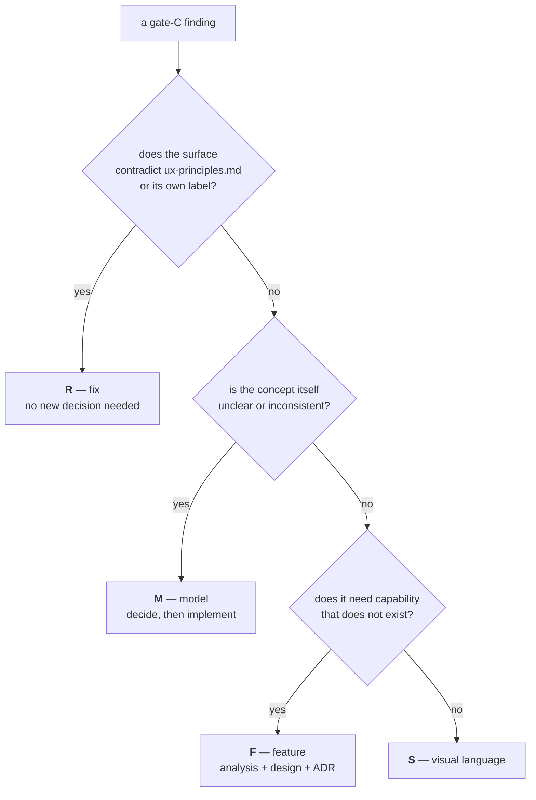

# Improvements & Evolutions

Findings from the initial analysis of `ytdl`, plus the evolutions requested by
the maintainer. Sequencing lives in [roadmap.md](roadmap.md).

Two registers live here: the **initial analysis** (findings `C*`, `U*`, `M*` and
the requested evolutions `E*`) and the **Cycle 5 gate-C findings** (`G*`, from
the maintainer's hands-on verification of the GUI) at the end of the document.

Status since the initial analysis: **E1 (distribution) is essentially done**
(phase 1), and the engine will be rebuilt as a single Go binary — see
[ADR-0003](decisions/0003-engine-language-go.md). That decision re-homes several
findings below: the queue (U5), notifications (U6) and persistent logs (U7) are
delivered by the Go engine, and the maintainability item M2 (one yt-dlp call site)
is satisfied by the Go core rather than a Bash refactor.

Severity is about *impact on a non-developer user*, which is the audience the
distribution work targets.

## Correctness & robustness

| # | Finding | Severity | Notes |
|---|---|---|---|
| C1 | `-f/--format` is never validated | medium | Help advertises `mp3\|flac\|m4a\|opus\|wav`, but any string is forwarded to yt-dlp, which fails with an opaque error. A `case` guard is a three-line fix. |
| C2 | `--embed-thumbnail` on `m4a`/`mp4` needs AtomicParsley | medium | Undeclared and unchecked dependency; only `mp3` is safe with ffmpeg alone. Must be confirmed against current yt-dlp behaviour before acting. |
| C3 | Only one URL per invocation | low | `*) URL="$1"` silently overwrites: `ytdl a b` downloads only `b`, with no warning. Either loop over URLs or reject extra arguments. |
| C4 | `-b` rebuilds its argument list by hand | low | The re-exec at line 174 enumerates flags manually, so every new flag must be added in two places. A `--` forwarding scheme or an internal env marker is sturdier. |
| C5 | Failure-log filename derived from raw title | low | `tail -n1 \| tr '/:' '__'` leaves `..` and stray whitespace intact. Sanitise to a conservative charset. |

## User experience

| # | Finding | Severity | Notes |
|---|---|---|---|
| U1 | No `--version` | **high** | Nothing identifies the installed build. This blocks self-update, blocks support ("which version do you have?"), and is a prerequisite for any distribution channel. |
| U2 | No update path for `ytdl` **or** yt-dlp | **high** | yt-dlp breaks periodically when YouTube changes; a non-developer left on a stale binary sees an incomprehensible error and no way forward. Any installer must ship an update mechanism, not just a first install. |
| U3 | Dependency errors assume Homebrew | **high** | `brew install yt-dlp` is useless advice to someone without Homebrew — exactly the target audience. Messages must point at whatever the installer actually provisioned. |
| U4 | No persistent configuration | medium | Output directory is flag-or-environment only. Setting `YTDL_OUT_DIR` permanently requires editing a shell profile, which the target audience will not do. Explicitly required by the GUI work (global output dir). |
| U5 | No queue; `-b` spawns unbounded concurrency | medium | Five `-b` invocations start five simultaneous downloads. Required by the GUI work (queued executions). |
| U6 | Silent/background success is invisible | medium | No completion signal. macOS `osascript -e 'display notification …'` is a cheap, dependency-free improvement. |
| U7 | Failure logs pile up in the output directory | low | `.log` files sit next to the audio with no rotation or cleanup. A dedicated log location would keep the music folder clean. |

## Maintainability

| # | Finding | Severity | Notes |
|---|---|---|---|
| M1 | No tests | medium | Argument parsing, format validation and mode selection are testable cheaply (e.g. bats). The metadata pipeline is only meaningfully testable end-to-end against real URLs. |
| M2 | Four separate `yt-dlp` invocations | low | dry-run, background, verbose, silent/normal each build their own call. Flags drift apart over time; consolidating behind one builder reduces that risk. |
| M3 | No README, no licence | low | Needed before sharing the repository or publishing releases. |
| M4 | Interface language is Italian | — | Help text and messages are Italian, comments and identifiers partly so. Fine for the current audience; revisit only if distribution widens beyond it. |

## Backend evolution detail

### U4 — persistent configuration & useful settings

A config file at `${XDG_CONFIG_HOME:-$HOME/.config}/ytdl/config`, parsed as strict
`key=value` with a **whitelist — never `source`d** (it will be written by the GUI;
sourcing user-writable shell is an injection risk). Precedence:
`flag > env > session override > config file > built-in default`.

| Group | Key | Purpose |
|---|---|---|
| Output | `output_dir` | default download directory |
| | `format` | `mp3\|flac\|m4a\|opus\|wav` (validated, C1) |
| | `audio_quality` | `0` = best |
| | `playlist_default` | download whole playlists by default |
| Naming | `name_template` | today hardcoded `%(artist,…)s - %(track,…)s`; the requested custom title formatting |
| | `strip_brackets` / `strip_tags` | cleanup regexes, today constants in the script |
| Behaviour | `background_default` | always run in background (requested) |
| | `concurrency` | max parallel downloads (see U5) |
| | `open_folder_on_done` | reveal the folder when finished |
| Notifications | `notify` / `notify_on` / `notify_sound` | see U6 |
| Logs | `log_dir` / `log_retention_days` / `breadcrumb_on_failure` | see U7 |
| Metadata | `embed_thumbnail` / `embed_metadata` / `overwrites` / `archive` | `archive` avoids re-downloading playlist items already fetched |

### U5 — queue & concurrency

A filesystem spool under `~/.local/state/ytdl/queue/{pending,running,done,failed}/`,
with **atomic `mv` state transitions** (maildir-style, no locks), driven by the Go
daemon `ytdld`. The spool *is* the state, so both the CLI and the GUI inspect it
directly. Default concurrency cap **3**: `unlimited` is allowed but discouraged
because parallel connections invite YouTube throttling/429s and saturate bandwidth
and ffmpeg CPU (a resolved concurrency that is `unlimited` or well above the default
draws an advisory warning).

**Shipped in Cycle 2B-core** ([ADR-0007](decisions/0007-cycle2b-queue-daemon.md)):
the daemon is **on-demand** — the same `ytdl` binary self-exec'd into a hidden
`__daemon` role, holding an exclusive `flock` (single instance), draining under the
cap, and idle-exiting when the queue empties; there is no always-on service or
launchd agent (deferred to the GUI cycle). `ytdl -b` enqueues (superseding the old
unbounded `Setsid` detach); `ytdl queue [--watch]` and `ytdl status` inspect the
spool, and `ytdl queue` also restarts a stalled daemon.

**Done in Cycle 2B-plus** ([ADR-0011](decisions/0011-cycle2b-plus-cancel-retry-hardening.md)):
`ytdl cancel`/`retry` (index or stable id-prefix, `--all`), a per-job execution
timeout (`job_timeout`, default off), a daemon diagnostics log, and a "no residue in
the destination" guarantee for failed/cancelled downloads. **Still deferred to a
dedicated Phase-5 cycle:** automatic retries/backoff and YouTube rate-limit handling.

### U6 — completion notification

`osascript -e 'display notification …'` on macOS — zero dependency. Config:
`notify` on/off, `notify_on=success|failure|both`, `notify_sound`. **Known limit:**
`display notification` is attributed to the calling app (Script Editor/terminal),
not "ytdl", and cannot attach a click action (e.g. open the folder) without
`terminal-notifier` (a dependency, avoided) or a signed `.app`. MVP is a plain
banner; the notification abstraction (`notify-send` on Linux later) keeps this
open/closed.

### U7 — persistent logs & failure-log auto-cleanup

Two levels: a **central persistent store** (`~/.local/state/ytdl/logs/`, every job,
retained by age) and an **in-destination breadcrumb** on failure. The maintainer's
auto-cleanup rule — "a later successful download of the same URL into the same
folder deletes the stale `.log`" — requires identifying which breadcrumb maps to
which URL. The old name derived from the *title* (fragile, C5) and did not encode
the URL. Fix: name the breadcrumb after **hash(normalised URL)** (the URL is stable
across retries, the title is not); on success, compute `hash(url)` and delete the
matching breadcrumb. Playlists: one breadcrumb per failed item, keyed by item id;
the item's success removes its own.

> **As built (Cycle 2A, [ADR-0006](decisions/0006-cycle2a-logs-breadcrumbs-notifications.md)):**
> the breadcrumb ships **on by default** (opt-out `breadcrumb_on_failure=true`), not
> off — auto-cleanup makes it self-limiting (the folder shows only *unresolved*
> failures) and it is the CLI walk-away user's only in-place signal. Its name keeps a
> readable title **plus** a `hash8` suffix, so it fixes the M2 title collision while
> preserving at-a-glance discovery. Retention is by **age** (`log_retention_days`,
> default 30; `0` = keep forever). The breadcrumb is scoped to silent/background
> modes; foreground already shows the error live.

## Requested evolutions

### E1 — Distribution (primary objective)

Ship `ytdl` to non-developer macOS users with a fast, low-friction install that
provisions yt-dlp and ffmpeg into a user-writable location, works on older macOS
(Mojave 10.14 is the stated floor), and fails with actionable messages — ideally
falling back to older or alternative builds rather than erroring out.

Design and constraints: [distribution.md](distribution.md).

### E2 — GUI for non-developer users (high value, last priority)

A GUI so users who do not know the Terminal can:

- start a **foreground** download from a link and watch live progress,
- pick format and other available settings,
- change the output directory **per run / per session / as a global setting**,
- edit user settings from the GUI (not by hand-editing the config file),
- launch **background** downloads and view the queue and in-progress jobs.

Runtime is settled by [ADR-0003](decisions/0003-engine-language-go.md): a **web UI
served by the Go daemon** (`net/http` + SSE for live progress) — no extra runtime,
no signing, no payment. Delivered in two stages (roadmap phase 6): an AppleScript
MVP (paste/drop URL, pick folder, enqueue) for immediate zero-dependency value,
then the full web UI.

The GUI is a **front-end over the engine**, not a reimplementation: it depends on
U4 (config) and U5 (queue) existing first. Editing settings from the GUI is safe
because the config is parsed with a whitelist, not `source`d (see U4).

## Gate-C findings — Cycle 5 verification (2026-08-03)

Cycle 5 shipped the three-view GUI and the actionable history, then stopped at
**gate C**, whose whole purpose is the maintainer using the result on real
hardware. They did, and produced a findings list. This section is that list,
verified against the code, classified, and mapped onto cycles. Sequencing —
which cycle runs when — lives in [roadmap.md](roadmap.md).

Two cross-cutting decisions came out of the same review and settle roughly half
of the list on their own; they are recorded in
[ADR-0014](decisions/0014-ux-scope-model-and-partial-outcome.md) and are now
normative in [ux-principles.md](ux-principles.md).

### How a finding is classified

The class decides *where the work goes*, not how important it is. A finding that
contradicts a document we have already declared normative is not a feature
request — it is a defect, and it outranks everything additive.

> The class letters `R` / `M` / `F` / `S` are **not** the finding-ID prefixes used
> by the initial-analysis register above (`C`/`U`/`M`/`E`). Gate-C findings are
> numbered `G1…G26`; `M` as a *class* means "model decision", never
> "maintainability".

Order of execution, decided by the maintainer (2026-08-03): **R → M → F → S**.
Fixes first because they are the ones actively misinforming the user; additive
work last.

### R — the surface contradicts itself (Cycle 5 closing, no new decisions)

| # | Finding | Severity | Verified cause |
|---|---|---|---|
| G1 | The queue never says **where** a job will land | medium | `queue.Job.Settings` already carries the resolved `OutputDir`, frozen at enqueue; only `jobDTO` fails to expose it. The history row shows `location`, so the same row component says it in one list and not the other. `ytdl queue` omits it too — both channels. |
| G2 | The session-folder field can display a value that is **not in force** | **high** | Only the "Applica alla sessione" button issues the `PUT /api/session`; there is no auto-apply. But nothing marks the field dirty — while the settings form immediately below it has a sticky unsaved-changes bar. Type without pressing, then download: the file goes to the old folder while the field shows the new one. |
| G3 | "Vale solo per questo download" is **false** | **high** | The API is right (per-request dir wins for that request only); the SPA clears only the URL field after a submit, never the folder field, and leaves the disclosure open. The label promises one-shot, the UI delivers sticky. |
| G4 | The playlist checkbox never returns to its default | **high** | Initialised from `playlist_default` and never reset. See G14 for why the consequence is worse than "one unwanted playlist". |
| G5 | `open_folder_on_done` is a **dead control in the GUI** | medium | It applies to foreground downloads only, and *every* GUI download is enqueued — so the setting can never do anything for a GUI-only user, yet it is rendered live in the GUI's Download group. `ux-principles.md` §4 forbids exactly this. |
| G6 | "Vedi errore" can appear to do nothing | low | The log panel sits above the list; opening it from a row far down reveals it off-screen, with no scroll into view. |
| G7 | `audio_quality` accepts 0-9; yt-dlp's scale is **0-10** | low | The validator tests a single character, so `10` is unrepresentable; help and docs repeat "0-9". yt-dlp: *"a value between 0 (best) and 10 (worst) for VBR or a specific bitrate like 128K (default 5)"*. |
| G8 | A failure says what went wrong, never **what to do** | **high** | `Entry.Error` is yt-dlp's last stderr line, in English, capped at 200 runes — the observed record ends mid-URL (`…github.com/yt-dl…`). `ux-principles.md` §5 requires the next step. Fixable with a **render-time** hint derived from the stored raw line: no schema change, and it works on records already written. Ships only with remedies that exist today; the age/bot remedy waits for G25. |
| G9 | "Mostra nel Finder" is offered on Linux | low | **Ruled 2026-08-04** ([ADR-0014](decisions/0014-ux-scope-model-and-partial-outcome.md) §3): the label names the folder on every platform — "Mostra nella cartella", with its neighbour becoming "Apri la cartella". §3 is already amended; the strings still have to follow in `app.js` (+ `spa_test.go`), `cli/messages.go`, `cli/help.go`. "Finder" stays in the macOS guides, which mean the application. |
| G10 | `beforeunload` implies that closing the tab cancels the queue | low | "Vuoi uscire? Hai download in coda." — the daemon keeps draining, by design (ADR-0008). Wording only. |
| G11 | "Riprova" is normative vocabulary with **no surface** | low | §3 lists it as a GUI label, but `queueDTO` exposes only `pending` and `running`: a job that failed in the spool is invisible in the GUI. **Ruled 2026-08-04** ([ADR-0014](decisions/0014-ux-scope-model-and-partial-outcome.md) §4): the asymmetry is recorded per §7 and the surface lands in **Cycle 6**, which reworks that view anyway — showing failed spool jobs needs a decision (the same job also sits in the history under a different verb), and the closing session takes no decisions. |

### M — the concept is unclear (Cycle 6, analysis first)

| # | Finding | Severity | Notes |
|---|---|---|---|
| G12 | Three folder scopes, no visible model | **high** | Default (config) · session (GUI-only) · this download. Nothing on screen says which is in force, and §3 has no words for them. Settled in principle by [ADR-0014](decisions/0014-ux-scope-model-and-partial-outcome.md) decision 1; the surface work is Cycle 6. |
| G13 | Format, playlist and folder are all per-request, with three different implicit behaviours | **high** | The folder claims one-shot and is sticky (G3); the checkbox is sticky and claims nothing (G4); the format is sticky and nobody ever mentioned it. One rule, applied identically to all three. |
| G14 | The playlist control does not know whether the link **is** a playlist | **high** | The dangerous case is not a bare video — `--yes-playlist` is a no-op there. It is the link YouTube hands you when you click a track inside a playlist or a mix: it carries `v=…&list=…`, and a forgotten checkbox turns one track into the whole list. |
| G15 | Audio quality exposes an ffmpeg VBR scale to a non-technical user, and is applied to lossless formats | medium | `--audio-quality` is passed for `flac`/`wav` too, where it means nothing. Proposal: named steps (massima/alta/media/compatta) mapped onto values, hidden or disabled with a reason for lossless formats. Default stays `0`, so no behaviour changes. |
| G16 | The session override is never validated | medium | Non-existent or unwritable paths are accepted; the first download then silently `MkdirAll`s a new folder somewhere the user did not intend. |
| G17 | Completion produces no feedback in the view the user is looking at | medium | The row leaves the queue and reappears under "Ultimi download". The system notification comes from the daemon; the GUI itself says nothing, and does not offer "Apri" on the thing that just finished. |
| G18 | History filters and search are not in the URL hash | low | A reload loses them, and Back moves between views but not between filter states. |

### F — capability that does not exist yet

**Cycle 7 — partial outcome and playlists per track** (ADR-0014 decision 2):

| # | Finding | Severity | Notes |
|---|---|---|---|
| G19 | A partially-failed playlist is recorded as a **total failure** | **high** | `success := rc == 0 && count > 0`, and yt-dlp returns a non-zero code when any item failed even under `-i`. The maintainer's own record is the proof: ✗, "21 tracce", and the error line of the single age-restricted track — while 21 files sit on disk. The record states something untrue about work that succeeded. |
| G20 | Per-item data is collected and then thrown away | medium | The runner already captures attempted (`id\ttitle`) and succeeded (`id`) items and feeds them to `ReconcilePlaylist` for the per-item breadcrumbs — then discards them. Nothing reaches the history record, so there is no per-track detail and a retry re-downloads everything. Collection is also gated on `breadcrumb_on_failure` and on silent/background mode. |
| G21 | `log_retention_days = 0` leaves `history.jsonl` unbounded, and every history operation is a full-file scan | medium | Deferred at gate C. Per-item arrays multiply record size, so this stops being theoretical in the same cycle that adds them. |
| G22 | Offset paging can duplicate or skip a row | low | Deferred at gate C. Inherent to offset paging; the fix is cursor paging (`?before=<id>`), which is a design change. |
| G23 | `Append`'s doc cites a concurrent stress test that is not in the repo | low | Deferred at gate C. The test was written during the Cycle 5 review and passes; it just never landed. |

**Cycle 8 — destination presets:**

| # | Finding | Severity | Notes |
|---|---|---|---|
| G24 | The only way to choose a folder is to type an absolute path into a browser text field | medium | Requested: named presets, recalled instead of retyped. Config is strict `key=value` with a whitelist, so a list needs a scheme (proposal: a `preset_<name>` prefix rule — one document, diffable, hand-editable). Related: a browser cannot obtain a real path, so a **native picker** driven by the daemon (`osascript -e 'choose folder'` / `zenity`) is the only way; `internal/open` already owns desktop actions. May retire the session override entirely — see the Cycle 6 entry in the roadmap. |

**Cycle 9 — authentication and error remedies:**

| # | Finding | Severity | Notes |
|---|---|---|---|
| G25 | Age- and bot-restricted videos have no remedy path | **high** | The real fix is `--cookies-from-browser`, i.e. a validated `cookies_from_browser` config key appended off the golden argv path. Sensitive by nature: off by default, plainly labelled, and its own failure modes anticipated (Full Disk Access for Safari, a keychain prompt for Chrome). Completes the G8 hint catalogue. |

### S — visual language (Cycle 10)

| # | Finding | Severity | Notes |
|---|---|---|---|
| G26 | The GUI has no visual language | medium | Not sloppy — anaemic, and the causes are nameable: no type scale (everything sits between 0.78 and 1rem; `h2` is *smaller* than the URL field, so headings do not read as headings); no spatial rhythm (1rem padding everywhere); the download form, the app's whole reason to exist, weighs the same as the log section; and one green means primary action, success **and** selected chip. The deliverable is a written `docs/ux-visual-language.md` (type scale, spacing scale, radii, elevation, colour **semantics** split from the action colour, density, focus, motion) applied afterwards. Hard constraints: no external assets (CSP `script-src 'self'`, self-contained binary → no CDN fonts, inline icons only), no `innerHTML`, dark mode, one document. |
