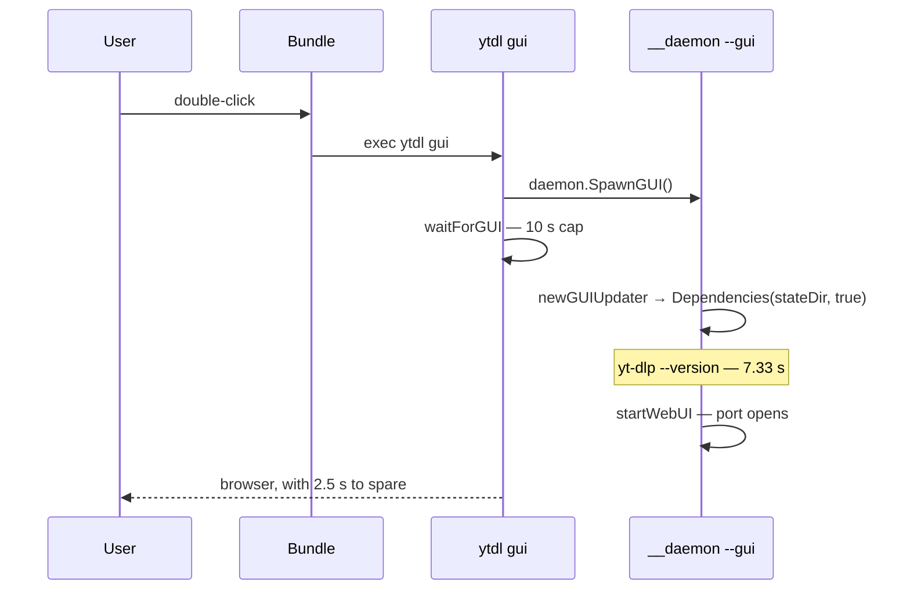
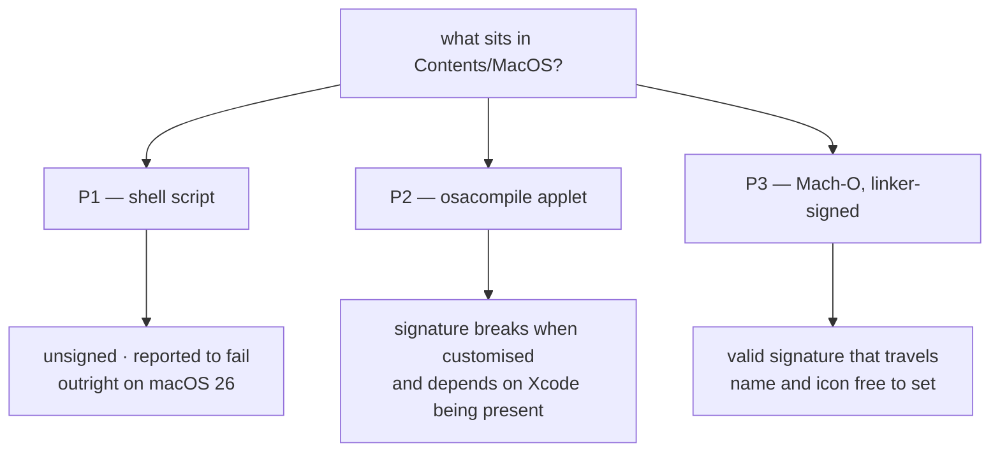

# Cycle 6-launch — the desktop launcher: what the hardware said

- **Status:** **approved** — gate A closed 2026-08-26. Its two decisions were taken
  and are recorded in [ADR-0018](../decisions/0018-desktop-launcher-app-bundle.md):
  the artefact is **P3**, and the cold-start defect **enters this cycle's scope**.
- **Date:** 2026-08-26
- **Lens:** tech-choice
- **Scope input:** [roadmap § Cycle 6-launch](../../roadmap.md#cycle-6-launch)
- **Decides nothing itself.** It measured; the decisions it surfaced in §7 are the
  ADR's. Historical from here: what it asserts is what the hardware said on that day.

## 1. The question

`ytdl gui` is the only way to open the interface and it needs a Terminal — the one
thing the GUI exists to avoid. This cycle delivers an icon the user double-clicks.

The roadmap set one unknown above all others: **Gatekeeper**.
[ADR-0001](../decisions/0001-distribution-channel.md) rejected `.pkg`/`.dmg`/`.app`
because Gatekeeper blocks unsigned **downloaded** bundles; the cycle rests on the
claim that a bundle **generated on the machine** is a different case. That claim had
to be verified before any design rested on it.

It was verified. It holds. But the verification found something else, which §6
argues matters more.

## 2. Method

The container cannot answer any of this: it is not the target platform
([ADR-0017 §3](../../foundation/decisions/0017-dev-container-oracle.md)). Three
probes were run on the maintainer's Mac on 2026-08-26/27, each building candidate
bundles side by side and recording its diagnostics **including the failures** — a
check whose failure is discarded proves nothing.

The probe scripts live in `scratchpad/`, which is gitignored and does not travel.
**Every number this document relies on is therefore reproduced here**, not linked.

| Machine | value |
|---|---|
| macOS | **15.6** (build 24G84) — *not* 26 |
| Architecture | arm64 |
| bash | 3.2.57 |
| Xcode | **installed**, at `/Applications/Xcode.app` |
| Spotlight | **indexing disabled** on `/` |

Three candidate bundles were built in `~/Applications`:

| Probe | What sits in `Contents/MacOS` |
|---|---|
| **P1** | the shell script itself |
| **P2** | `osacompile`'s applet stub, with the script as a resource |
| **P3** | an ad-hoc signed Mach-O, cross-built from the dev container |

## 3. Finding F1 — the premise holds

**No bundle created on the machine carried `com.apple.quarantine`.** All three:
`xattr -p com.apple.quarantine` → *no such xattr*. All three launched from Finder,
opened the browser, and **never showed a Terminal window**. All three worked after
being dragged to the Desktop, to an arbitrary folder, and to the Dock.

The premise of the cycle is verified rather than assumed, and
[ADR-0001](../decisions/0001-distribution-channel.md) needs an amendment or a
successor: its rejection of bundles is sound **for downloaded ones** and does not
reach one generated in place.

That this is the whole load-bearing structure is visible from the other side:

```
P1  spctl -a -vv → rejected: no usable signature          [exit 3]
P2  spctl -a -vv → invalid Info.plist                     [exit 1]
P3  spctl -a -vv → code has no resources but signature…   [exit 1]
```

**`spctl` rejects all three.** Were any of them ever to acquire the quarantine
attribute, it would be blocked — and on macOS Tahoe the right-click → Open escape
hatch that earlier versions offered is gone. The design must therefore treat "this
bundle is never downloaded" as an invariant to protect, not a happy accident.

## 4. Finding F2 — the signature landscape, and why it eliminates `osacompile`

```
P1  codesign -dv → code object is not signed at all
P2  codesign -dv → flags=0x2(adhoc)             Identifier=YTDL-p2-applet
P3  codesign -dv → flags=0x20002(adhoc,linker-signed)   Identifier=a.out
```

Two measurements decide against P2, and each is independently sufficient.

**F2a — customising it breaks its signature.** The probe signed, then patched
`CFBundleName`, then re-verified:

```
before the patch:  valid on disk / satisfies its Designated Requirement   [exit 0]
after the patch:   invalid Info.plist (plist or signature have been modified)  [exit 1]
```

The cycle's whole point is an app the user recognises — a name and an icon. On an
applet, setting either ships a bundle whose signature is *invalid*, which is a worse
category than *absent* and is precisely what recent macOS releases have been
tightening.

**F2b — and the signature is an artifact of this Mac.** `osacompile` emitted
`.: replacing existing signature` and produced an ad-hoc signature because **this
machine has Xcode**. `codesign` on stock macOS can verify but not sign: it needs
`codesign_allocate`, which ships with Xcode or the Command Line Tools. The audience
for this project has neither. What `osacompile` produces on their Mac is unknown
from here, and could be an unsigned bundle — i.e. P1 with extra steps.

> **The lesson widens by one machine.** Cycle 6-plus recorded three times that the
> container answers truthfully to questions that do not matter. F2b is the same
> shape one level up: **the maintainer's Mac is not the user's Mac either.** A Mac
> with Xcode on it cannot certify a property that depends on Xcode being absent.

P3's ad-hoc signature, by contrast, is applied by the **Go linker at build time**
and travels with the binary. It was confirmed on a binary cross-built from the Linux
container: `LC_CODE_SIGNATURE` present, blob `0xfade0cc0`, 19090 bytes. No developer
tooling is needed anywhere — not in CI, not on the user's machine.

## 5. Finding F3 — Spotlight is not answerable on this machine

All three bundles returned `kMDItemContentType = (null)` and no `mdfind` hit. That is
**not** a property of the bundles: `mdutil -s /` reports *Indexing disabled*.

The discriminator settles it. `mdfind -onlyin ~/Applications` still returns
`Chrome Apps`, `Macs Fan Control` and — to the point — **`Claude Code URL Handler.app`,
itself a locally generated bundle**. `~/Applications` is indexed, and locally created
bundles land in that index. The roadmap's claim stands.

**Consequence:** discoverability by name is **not verifiable on this Mac** and moves
to gate C, on a machine with indexing on — which is the user's.

## 6. Finding F4 — the defect that outweighs the artefact question

### 6.1 What was observed

The first click on the first bundle ever installed **failed silently**: a bounce in
the Dock, then nothing. Its captured stderr — invisible to anyone launching from
Finder — read:

```
✗ Il motore non ha aperto l'interfaccia in tempo.
```

That is `waitForGUI(addr, 10*time.Second)` in `cmd/ytdl/main.go` expiring.
`runGUICmd` then returns 1 **without opening the browser**, although the daemon does
come up moments later — which is why every subsequent click was instant.

The maintainer confirms the same failure occurs from the CLI, sporadically, with no
pattern found.

### 6.2 What it is not

An initial hypothesis — that a binary replaced by `--update` pays a first-run
security assessment — was **falsified**. A fresh inode is not slower:

| | installed binary | fresh copy (new inode) |
|---|---|---|
| run 1 | 7.4 s | 7.7 s |
| run 2 | 7.6 s | 7.6 s |

Nor is it the shape of the bundle. The same daemon answers in **0.80 s** in the dev
container. And the stability itself is the clue: a security check varies, whereas
**7.5 s repeated to a tenth is deterministic work**.

### 6.3 What it is, measured

```
0.02s  ytdl (no args — parses argv and exits)
7.37s  ytdl --version (probes yt-dlp)
7.34s  yt-dlp --version          <<<
7.33s  yt-dlp --version   (second run — NOT faster)
0.05s  ffmpeg -version
0.01s  /bin/echo   (baseline)
```

**One `yt-dlp --version` costs 7.33 s on this Mac, warm or cold**, because yt-dlp
there is the PyInstaller one-file bundle that unpacks itself on every invocation.
The arithmetic closes: 0.02 s + 7.33 s ≈ the 7.4–7.7 s measured for the daemon to
open its port.

And it sits on the startup path by construction:



`newGUIUpdater` (`cmd/ytdl/update.go:66`) calls `update.Dependencies(stateDir, true)`
**synchronously**, and `runDaemon` calls it **before** `startWebUI`. The margin
against the 10 s cap is 2.5 s — about 25% — which is exactly the profile of a defect
that strikes sometimes and shows no pattern.

### 6.4 Two documented claims this contradicts

- **`Dependencies`' own doc comment** states: *"A probe is never on a path a user is
  waiting on, and neither is that exec — so the surfaces that interrupt a download
  pass false … while the screens the user deliberately opened pass true."* On the
  daemon startup path it passes `true`, and that path **is** one a user is waiting
  on. The invariant is stated in the code and violated by it.
- **`versionTimeout`'s comment** already records the 7.4 s cold measurement from
  `V20` — but models it as *cold vs warm*, holding that warm costs "well under a
  second, ~800 ms measured in the container". On macOS **there is no warm path**:
  7.34 s then 7.33 s back to back. The unpack happens every time. The container's
  800 ms describes the container.

### 6.5 The authority already exists on disk

`installed.conf` already records `yt_dlp_version` (`markerYtDlpVersion`). The exec is
answering a question a file read could answer.

This is exactly the merit on which **`T4` was deferred rather than deleted** —
*"an exec on the critical path is authority the marker could answer"*
([roadmap-history](../../roadmap-history.md)). Its deferral rested on a stated
premise: *"`T4`'s saving is now milliseconds rather than gigabytes"*. That premise
was measured **in the container, on the zipapp** (263 ms). On the target platform the
saving is **7.33 seconds**, and it is the difference between the launcher working and
failing silently on first use.

> `T4`'s deferral is not wrong; its premise is platform-specific and this is the
> platform it did not cover. Reopening it is recorded as a maintainer call, and §7
> puts it there.

## 7. The two decisions for gate A

### D1 — the artefact



**Recommended: P3.** It is the only candidate whose signature is valid, survives the
customisation the cycle exists to deliver, and depends on no tooling on the user's
machine. Two sub-questions remain for the design, and neither blocks gate A:

- whether the Mach-O is **`ytdl` itself** (no new artefact, no new checksum, +9.5 MB
  on disk, refreshed by the installer exactly when `ytdl` changes) or a **dedicated
  2.2 MB launcher** (a second release asset to build, checksum and version);
- two defects of the probe build to carry over: it reports `Identifier=a.out`, and it
  is **thin arm64** where `install.sh` already handles both architectures for `ytdl`.

P1 is not recommended even though it worked here: it is unsigned, and the failure
reported against it is on **macOS 26**, which this machine is not — and machines
update themselves.

### D2 — scope: does the cold start enter this cycle?

**This analysis takes no position on scope**, but it must state the dependency
plainly: the cycle's *Done when* — a non-developer starting ytdl as an app **twice in
a row** — is not reachable while the first launch loses a race 25% of the time and
reports nothing. From a Terminal the user reads the error and retries; from an icon
there is nothing to read.

It also engages [ADR-0016 §15](../decisions/0016-cycle6plus-update-path.md) and the
normative rule that a surface never states something untrue
([ux-principles](../../ux/design/ux-principles.md)): a double-click that appears to
do nothing is such a surface.

Three shapes of remedy, for the design rather than for this document:

| | What | Cost |
|---|---|---|
| a | pass `false` and fill versions lazily — the doctrine the code already states | small, local |
| b | answer from `installed.conf` — **`T4` reopened** | small, and closes a deferred entry |
| c | make yt-dlp itself cheap on macOS, as [ADR-0017](../../foundation/decisions/0017-dev-container-oracle.md) did for the container | ⚠️ the zipapp needs Python, which [ADR-0005](../../foundation/decisions/0005-macos-floor-and-single-engine.md) deliberately removed |
| d | raise the cap | treats the symptom; the 7.3 s remains |

(c) is listed because it is the container's own fix, and rejected on sight would be
worse than rejected in writing: it reintroduces a dependency an ADR removed.

## 8. What this changes elsewhere

| Document | What |
|---|---|
| [ADR-0001](../decisions/0001-distribution-channel.md) | needs an amendment or successor: bundles are rejected **as downloaded artefacts**, and one generated in place is a different case (F1) |
| [roadmap § Cycle 6-launch](../../roadmap.md#cycle-6-launch) | the `.command` exclusion stands; the artefact question resolves to P3 (D1); the Spotlight claim stands and moves to gate C (F3) |
| `internal/update` | two comments assert what the measurements contradict (6.4) — recorded here, not corrected: analysis does not touch code |
| [roadmap-history](../../roadmap-history.md) | `T4`'s deferral premise does not cover the target platform (6.5) |
| [guida-installazione](../../../users/guides/guida-installazione.md) | § *Come disinstallare* grows a fourth line, whatever D1 resolves to |

## 9. What could not be verified, and belongs to gate C

- **Spotlight and Launchpad discoverability** — indexing is off on this Mac (F3).
- **`osacompile` without developer tooling** — unknowable from a Mac with Xcode (F2b).
- **macOS 26 behaviour** — this machine is 15.6; the failure reported against P1 is
  on 26 (D1).
- **A machine that is not the maintainer's.** Every number here comes from one Mac,
  which has Xcode, has Spotlight disabled, and has run ytdl for months.
