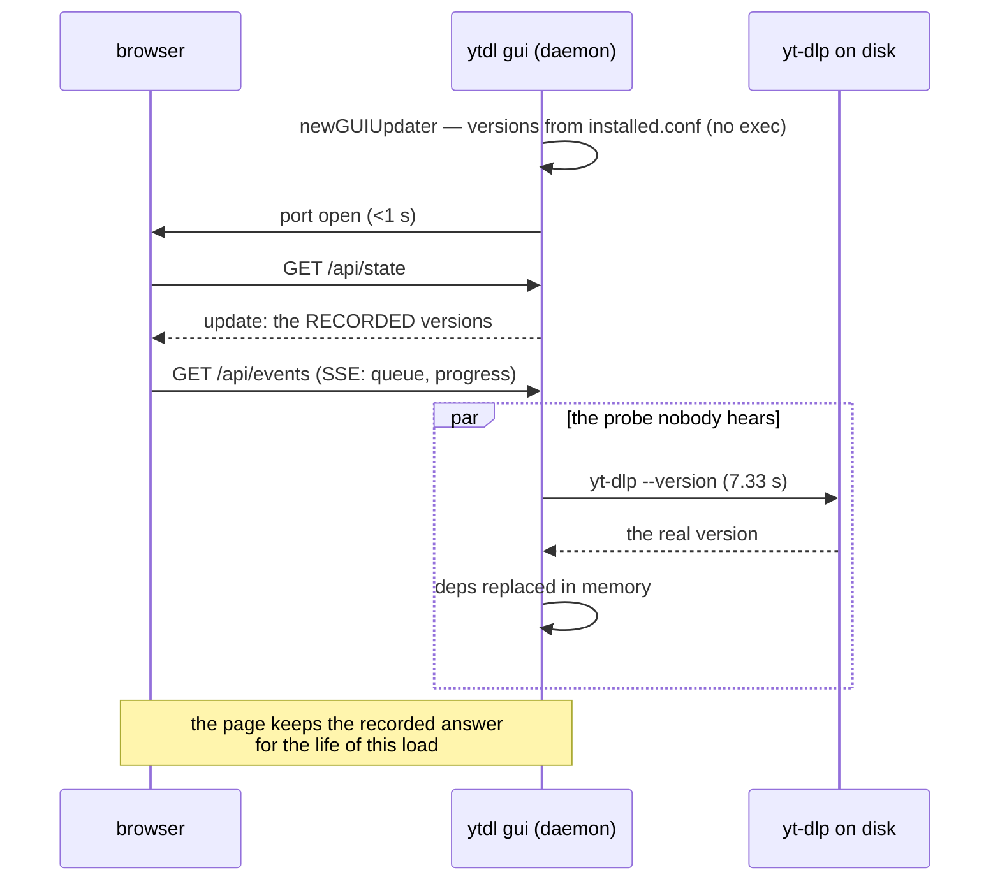
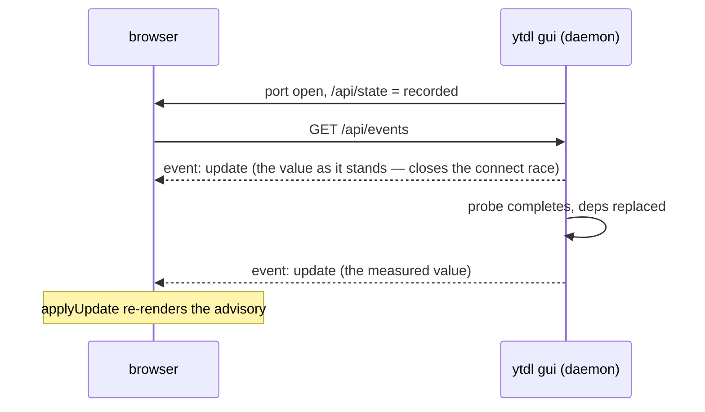

# `V32` — the probe reaches the daemon, not the page

Analysis written **2026-08-27** on `feat/launch/implementation` at `da74e81`, to
decide the question [review 005](../reviews/005-cycle6launch-implementation.md#v32)
escalated and [review 006](../reviews/006-cycle6launch-documentation.md) carried
forward unchanged. **Lens: tech-choice.** It decides nothing: it measures what is
there, prices four ways out, and recommends one.

It exists because the cycle's own fix created it. `f77d54e` moved the version probe
to **after** the port is bound — that is what turned a 7.5 s cold start into a
sub-second one — and in doing so made the daemon learn something the page had
already been told the old answer to.

## What is actually there

Measured in the code, not recalled:

| Fact | Where |
|---|---|
| The updater is constructed from the **installer's record** and execs nothing | `cmd/ytdl/update.go:68` → `update.RecordedDependencies` |
| The **probe** replaces those versions in the daemon's memory | `cmd/ytdl/update.go:90`, `update.Dependencies(stateDir, true)` |
| It is scheduled **after** the listener is up, on its own goroutine | `cmd/ytdl/main.go:333` — `go upd.refreshLocal()` |
| One `yt-dlp --version` costs **7.33 s on macOS**, cold or warm (0.80 s in the container, where ADR-0017 put the zipapp) | gate A, ADR-0019 §2 |
| The page is handed the advisory **once**, inside the state it loads with | `app.js:625`, `applyUpdate(s.update)` inside `applyState` |
| …and once more only if the user asks | `app.js:1329`, the *Controlla aggiornamenti* button, which also runs a **remote** round |
| The SSE stream carries **`queue`** and **`progress`**, nothing else | `handlers.go:997`, `webui.go:240` |
| The state DTO's update half is already a single call | `handlers.go:312`, `s.buildUpdateDTO()` |

**What the two answers actually differ by.** Not much, and never for the common
case: with a yt-dlp ytdl installed itself and a marker that is current, recorded and
probed are the same string and nothing is lost. They diverge for a copy the record
cannot vouch for — a Homebrew yt-dlp, a tool installed before the marker existed, a
marker gone stale — where the record carries **no version** and the probe finds one.
The page then renders *"versione non registrata"* (`app.js:1090`) about a tool whose
version the daemon, in that same second, knows.

There is a second, smaller consequence: *"non sono riuscito a leggerla"*
(`app.js:1088`) can only be produced by a probe, so today it can never appear at
first paint at all — only after the user presses the button.

**None of this is a false statement**, which is why review 005 did not call it a
blocker: *"versione non registrata"* is true of the record. It is **less than what
is known**, and `ux-principles.md` §5 is about surfaces that state the untrue, not
about surfaces that under-report. That is the whole reason this is a decision and
not a defect.

## The four ways out

### A — an SSE `update` event

The daemon pushes the advisory when it changes; the page applies it.

- **Mechanics:** `Server.buildUpdateDTO()` already exists and is what `/api/state`
  serves, so the frame is the shape `applyUpdate` already consumes — no new DTO, no
  new endpoint. `hub.broadcast` already fans out `progress` the same way. About
  **15 lines of Go** (a `PublishUpdate` method, one `sendUpdate()` on connect beside
  the existing `sendQueue()`, one call after `refreshLocal`) and **~6 of JS** (one
  `addEventListener`, plus the guard below).
- **The race it must close.** The page fetches `/api/state` and *then* opens the
  stream (`app.js:647` before `:651`). A probe finishing between those two calls
  would be broadcast to a client that is not connected yet, and the page would keep
  the stale value with no second chance. Sending one `update` frame **on connect**,
  exactly as `sendQueue()` already does, removes the window entirely — it is one
  line, and without it option A is only *mostly* right.
- **The guard it must carry.** `applyUpdate` re-renders the banner, the versions and
  the action control. A push arriving while the user is inside that section — a
  confirmation open, a run in flight — would rebuild the control under their hands.
  The queue already has this rule written down (`app.js:256`: *the control the user
  is aiming at survives*); the event must obey it, or defer to the next idle moment.
- **Pro:** no guessing. The page learns when the fact changes, not on a timer that
  is either too early or wasteful. It reuses the transport that is already open and
  already load-bearing (an open SSE connection **is** the daemon's liveness clause,
  ADR-0008) — no new connection, no new endpoint, no new failure mode. It is the
  only option that keeps **both** things the cycle bought: a port open in under a
  second **and** a page that shows what is known. It generalises: any later
  advisory — the periodic check, an update another window started — has a channel.
- **Contra:** the largest of the four in code and, more to the point, in **test**
  surface: a new event type on the Go side, a listener and a guard on the JS side,
  both of which the suite pins. It is a live re-render of a user surface: numbers
  can change on screen a few seconds after opening, which is correct but is a
  behaviour nobody has approved yet. And it needs one sentence in the design so it
  is not read as contradicting §6.2, which says the update **panel** polls rather
  than listening — a rule about the *handover*, where the server is replaced by
  construction; there is no handover here, so the two do not collide.

### B — probe before the port, but only for what the record cannot vouch for

Keep the fast start for the ordinary machine; pay the 7.33 s only where the record
is silent, so the first paint is already right.

- **Pro:** the page needs no change whatever — no event, no listener, no guard, no
  new test on the JS side. The answer is right at first paint for everyone.
- **Contra:** it reintroduces gate A's defect for **exactly the population it is
  trying to serve**. A Homebrew yt-dlp is what makes the record silent, so a Homebrew
  user gets the 7.5 s cold start back — against the launcher's 10 s cap, which is
  the failure this cycle exists to remove. It also does not close the case it is
  aimed at: a marker that is *present and wrong* is not silent, so nothing probes it
  and the page is then confidently wrong rather than quietly incomplete — worse than
  today by the standard that matters.

### C — the page asks again by itself

One delayed re-fetch of `/api/state`, or a re-fetch on tab focus.

- **Pro:** the smallest change of the three that change anything: no server work at
  all, ~5 lines of JS, and `/api/state` is cheap now that the deps are in memory.
- **Contra:** it replaces a fact with a **guess** — the delay has to be picked
  against a probe that costs 7.33 s on the maintainer's Mac and is bounded, not
  fixed. Too short and it re-reads the same stale value and stops; too long and the
  page is stale for no reason. A focus-triggered re-fetch is worse: it fires
  constantly, and never at all for the user who opens the tab and watches it.

### D — accept it, and write it down

No code. The advisory is what the record said at load; *Controlla aggiornamenti*
refreshes it on demand.

- **Pro:** free, and defensible: nothing untrue is displayed, the gap closes the
  moment the user asks, and the population that sees any difference is the one
  running a yt-dlp ytdl did not install.
- **Contra:** ADR-0019 §2 says the probe *"replaces the recorded answer with the
  measured one"*, and end to end that is not what happens — so the ADR needs a dated
  addition either way, saying it replaces it **in the daemon**. And it leaves the
  cycle having made a surface slightly less informative than it was before, with the
  reason living only in a review report.

## Side by side

| | A · SSE event | B · narrow pre-probe | C · re-fetch | D · accept |
|---|---|---|---|---|
| Cold start stays <1 s | **yes** | **no**, for foreign copies | yes | yes |
| Page right without the user asking | **yes** | yes, at first paint | eventually, if the delay guesses right | no |
| Catches a **stale** marker too | **yes** | no | yes | no |
| Code | ~15 Go + ~6 JS | ~10 Go | ~5 JS | 0 |
| New test surface | Go + JS | Go | JS | none |
| Touches a user surface | yes (live re-render) | no | yes (silent re-render) | no |
| `internal/core` / `internal/daemon` | untouched | untouched | untouched | untouched |
| Needs a doc change | design §6.2 + ADR-0019 | ADR-0019 | ADR-0019 | ADR-0019 |

## Recommendation

**A, with the connect frame and the guard**, and it is not a close call against C
and D — the ranking is A, then D, then C, then B.

The argument is not that A is cheap, though it nearly is. It is that A is the only
one that does not trade one of the two properties this cycle paid for against the
other. B buys a correct first paint with the cold start the cycle exists to remove,
and buys it for precisely the users who cause the problem. C keeps both properties
but replaces a known event with a guessed delay, and a guess against a bounded probe
is the kind of thing that is right on the maintainer's Mac and wrong on the user's.
D is honest and free, and is the right answer *if* the maintainer judges the
divergence too narrow to spend a user-surface change on — a defensible reading,
since the whole population affected is people running a yt-dlp ytdl did not install.

What tips it to A is that the mechanism is already built. `buildUpdateDTO` is one
call, `hub.broadcast` already fans out a second event type, and the browser is
already listening on that stream for its own liveness. The event is not new
plumbing; it is one more name on plumbing that runs regardless.

**If A is chosen**, three things belong in the same unit and none is optional:

1. the `update` frame **on connect**, or the race above leaves it only mostly right;
2. the mid-flow guard, so a push never rebuilds a control under the user's hands;
3. one sentence in design §6.2 distinguishing the **advisory** (pushed) from the
   **run panel** (polled, because the handover kills the stream by construction).

**If D is chosen**, one thing is still owed: a dated addition to ADR-0019 §2 saying
the probe replaces the recorded answer **in the daemon**, and that a page already
loaded keeps the recorded one until it is asked. That sentence is owed under every
option, A included — it is only its content that changes.

## The gate

- **What is suspended:** nothing. `V32` does not block `L10`; the branch is
  mergeable either way. What it blocks is ADR-0019 §2 being true as written.
- **The evidence:** this document, plus
  [review 005 `V32`](../reviews/005-cycle6launch-implementation.md#v32) and the
  measurements in the table above.
- **What unblocks it:** the maintainer picks A, B, C or D.
- **The exact question:** does the page learn the measured versions **by itself**
  (A, recommended) — or does it keep the recorded ones until asked (D), with the
  ADR corrected to say so?
- **Independently of the answer:** gate C gains one step — open the Aggiornamenti
  view on a Mac with a Homebrew yt-dlp, which is the only machine where any of this
  is visible.

---

## Dated addition — 2026-08-27: the maintainer chose A

**A — the SSE `update` event** — chosen the same day this was written, and built as
`L9b`, with the two conditions this document made part of the option: the frame on
connect, and the guard that yields while the user is inside the update flow. The
decision itself is recorded where decisions live: the
[dated addition to ADR-0019](../decisions/0019-launcher-mach-o-and-recorded-versions.md).
The three rejected options keep their reasoning above, unedited.
