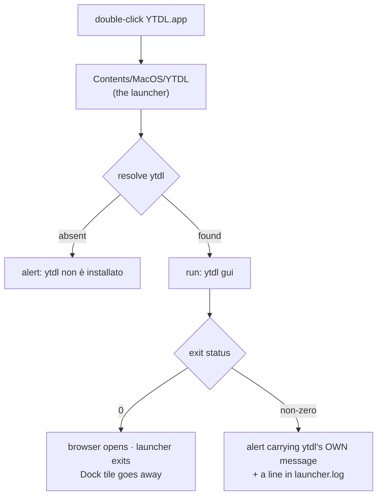
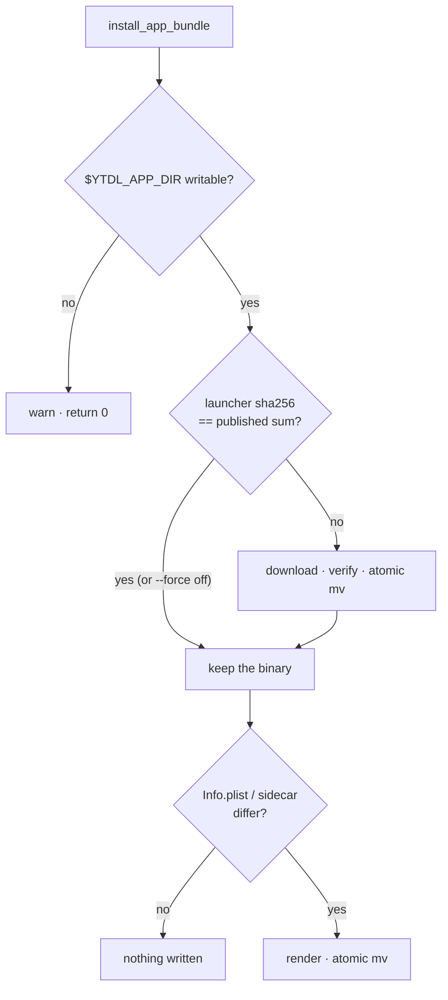
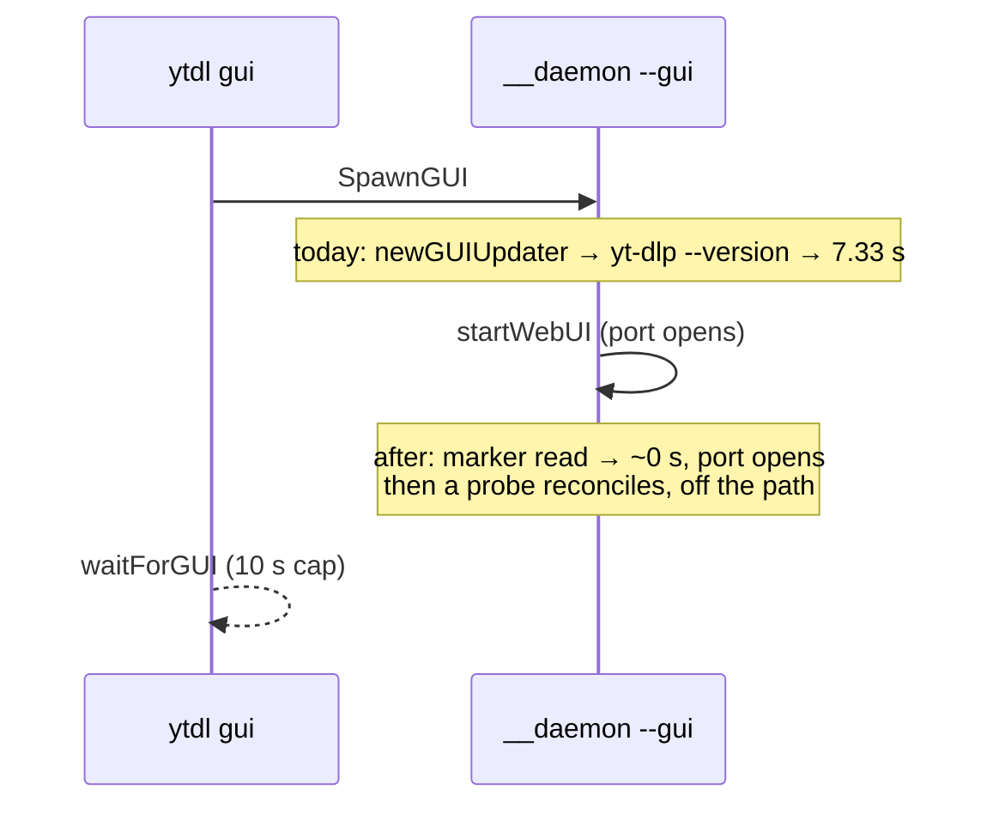

# Design — Cycle 6-launch, the desktop launcher

Design phase of Cycle 6-launch. It implements
[ADR-0018](../decisions/0018-desktop-launcher-app-bundle.md) and changes none of
its rulings; the two questions that ADR deferred to this gate are decided in
[ADR-0019](../decisions/0019-launcher-mach-o-and-recorded-versions.md), and this
document builds what both decide. Where it had to choose something no ADR
settles, the choice is marked **(design choice)** and carries its reason.

Measurements are the [gate-A analysis](../analysis/2026-08-26-tech-choice-desktop-launcher.md)'s.
Normative background: [ux-principles.md](../../ux/design/ux-principles.md) §4 (an
action that cannot work is disabled with a reason), §5 (a surface never states
something untrue), §7 (a capability lands in both channels).

## 0. The gate this document is measured against

The acceptance criteria were closed by the maintainer on **2026-08-26** and are
recorded here so gate B measures against a fixed target rather than a
remembered one:

1. **Traceability** — every requirement traces to ADR-0018 or to the analysis.
   The artefact *kind*, Gatekeeper, and the name `YTDL` are ruled on hardware
   measurements and are not reopened.
2. **Four questions, each with a decision and a reason** — (i) which Mach-O
   fills `Contents/MacOS`, with the probe's two defects resolved; (ii) the
   cold-start remedy, with candidate (c) refused **in writing**; (iii) the
   installer's idempotence, since it runs on every update; (iv) an error path
   that is **visible from Finder**.
3. **The three scope items still open in the roadmap** — a headless daemon
   holding the queue lock, the port taken by another program, and what "quit"
   means.
4. **Every file created or modified is named by path** (Appendix B).
5. **Ordered steps, each independently verifiable, each with its own oracle**
   (§8).
6. **Tests derive from this design, not from the code**, each with the contract
   it asserts (§7, Appendix C).
7. **What only gate C can settle is declared** (§9).
8. **Explicit non-goals** (§10).
9. **Non-negotiable:** `internal/core` byte-invariant and `internal/daemon`
   intact. Anything added to yt-dlp's command line is appended **after**
   `core.BuildArgs` — this cycle appends nothing at all.

## 1. Shape

The user double-clicks an icon. A 2 MB Mach-O inside the bundle runs
`~/.local/bin/ytdl gui` — the same command the Terminal user types — waits for
it, and either disappears or shows what went wrong.



Three properties hold this together, and each answers something ADR-0018 or the
roadmap asked for:

- **The launcher decides nothing.** It resolves a path, runs one fixed argv, and
  transports the result. Every rule about ports, tokens, daemons and browsers
  stays in `ytdl gui`, where both channels already read it (ux-principles §7).
- **It resolves `ytdl` by absolute path**, so the bundle survives being dragged
  to the Dock, the Desktop or anywhere else (ADR-0018 decision 1).
- **It is a launcher, not a resident.** It exits as soon as `ytdl gui` returns,
  so nothing sits in the Dock offering a *Quit* that quits nothing (§6.3).

## 2. Which Mach-O fills `Contents/MacOS`

**Decision: a dedicated launcher, built from `cmd/ytdl-launch`, published per
architecture as a release asset, and installed into the bundle by `install.sh`.**
Recorded as [ADR-0019 §1](../decisions/0019-launcher-mach-o-and-recorded-versions.md).
The alternative — `ytdl` itself copied into the bundle — was rejected for three
reasons, in decreasing order of weight.

**It would put a second meaning on the same binary.** LaunchServices runs
`Contents/MacOS/<CFBundleExecutable>` with **no arguments**, and `ytdl` with no
arguments is a usage error that exits in 0.02 s. Making it launch the GUI
instead requires dispatching on `argv[0]` — behaviour `ytdl --help` cannot show,
that changes with the file's *name*, and that no other part of this project has.

**It would create version skew with a sharp edge.** `daemon.spawn` self-exec's
`os.Executable()`. A copy of `ytdl` inside the bundle that served the GUI in
process would spawn its daemon from the *bundle's* binary — the one the last
update did not replace. Avoiding that means the bundle copy may only ever
`exec` the installed `ytdl`, which is 9.5 MB of engine doing a 30-line
launcher's job.

**It would make "left alone when unchanged" false by construction.** ADR-0018's
consequence is that the bundle is created when absent and left alone when
unchanged, because `install.sh` now runs on **every** update. If the bundle's
executable is `ytdl`, it is out of date the moment `ytdl` moves — every update,
for ever. A launcher whose bytes change only when the launcher's source changes
makes the common update touch the bundle not at all (§4.3).

The cost is honest and small: one more release asset, one more line in
`SHA2-256SUMS`, one more skip decision in `install.sh`. All three mechanisms
already exist. The invariant [ADR-0003](../../foundation/decisions/0003-engine-language-go.md)
protects — *one engine, no runtime dependency* — is untouched: the launcher
contains no engine code, drives nothing, and has no flags. Its whole surface is
in §3.

### 2.1 The probe's two defects

**`Identifier=a.out` — accepted, with the reason.** The identifier of a Go
linker-signed binary is a literal in the toolchain
(`cmd/link/internal/ld/macho.go`, the `codesign.Sign(…, "a.out", …)` calls); no
build flag sets it. Changing it requires re-signing, which needs either
`codesign_allocate` — the tooling finding **F2b** proved the user's Mac does not
have — or a third-party signer in the release pipeline, for a string nothing
user-facing reads. Bundle identity comes from `CFBundleIdentifier` in
`Info.plist`, which we set (§4.2). The ad-hoc signature's only job here is to
satisfy the arm64 kernel's requirement that a Mach-O be signed at all, and it
does that.

**Thin arm64 — resolved by per-architecture selection, exactly as `ytdl`
already is.** `detect_platform` derives `ARCH_KEY`, and `ytdl_asset_for` picks
`ytdl_macos_arm64` / `ytdl_macos_amd64`; `launcher_asset_for` is its twin (§4.1).
No universal binary, no `lipo`, no macOS runner: the bundle is built on the
user's machine, where the architecture is known.

Re-measuring the probe artefacts in `scratchpad/gatekeeper-probe/` adds one fact
the analysis did not state, and it refines ADR-0018 §2 rather than contradicting
it: the **arm64** launcher carries `LC_CODE_SIGNATURE` (blob `0xfade0cc0`), and
the **amd64** one carries **no signature at all**. That is the toolchain being
correct, not broken — `NeedCodeSign()` in the Go linker is
`IsDarwin() && IsARM64()`, because x86_64 macOS requires no signature. The
shipping `ytdl_macos_amd64` has been unsigned since 2.0.0 and runs. So the
artefact rule reads: *a Mach-O produced by the Go toolchain, ad-hoc
linker-signed where the platform requires a signature*. The reason P1 was
rejected was never the signature alone — it is that macOS 26 refuses a script as
`CFBundleExecutable` outright, and that holds on both architectures.

## 3. The launcher, end to end

`cmd/ytdl-launch/main.go`. Roughly 120 lines including comments, no
sub-packages, and one import from this module (`internal/config`, for
`StatePath`, so the state directory's rule is single-sourced rather than
re-derived). **(design choice)** Anything the launcher might be tempted to
decide belongs behind `ytdl gui`, which both channels share.

### 3.1 Resolving `ytdl`

In order:

1. `Contents/Resources/ytdl-path` — a sidecar file `install.sh` writes,
   containing the absolute path of the `ytdl` it just installed. Located from
   `os.Executable()`, never from the working directory, so it travels with the
   bundle when the user moves it.
2. `$HOME/.local/bin/ytdl`, when the sidecar is missing, unreadable, empty or
   not absolute.

The sidecar exists for two real cases, not a hypothetical one: an install with
`YTDL_INSTALL_DIR` set, and the development sandbox (§4.6), where a bundle that
silently launched the *real* `ytdl` would defeat the whole point of
[dev-testing](../../guides/dev-testing.md). It is a path, never a command line:
the launcher runs `path` + `gui` and nothing else, so nothing in a file can
become an argument.

If the resolved path is not an executable file, the launcher shows the alert in
§3.3 and exits 1 without running anything.

### 3.2 Running it

`exec.Command(ytdl, "gui")`, combined output captured, bounded by
`guiCmdTimeout = 60 * time.Second`. Not `syscall.Exec`, deliberately: replacing
the process image discards the exit status and the output, which are the two
things the visible error path is made of. `ytdl gui` bounds itself at
`waitForGUI`'s 10 s plus a browser spawn, so 60 s is six times its own worst
case and exists only so a wedged child cannot leave a Dock tile that never goes
away.

The launcher's exit status mirrors the child's. Finder discards it; a test does
not.

### 3.3 The visible error path

Today `runGUICmd` writes its failures to stderr, which is `/dev/null` for
anything launched from Finder — the analysis's finding **F4** is precisely a
user seeing a bounce and nothing else. Two remedies ship, one proven and one
designed:

**The log — proven.** Every launch appends one line to
`${XDG_STATE_HOME:-$HOME/.local/state}/ytdl/launcher.log`: timestamp, resolved
path, exit status, and the child's output on failure. This is the mechanism the
probe itself used to learn anything at all (`p3.log`), so it is known to work on
the target platform. `ytdl status` already points at the state directory.

**The alert — designed.** On a non-zero exit the launcher runs one
`osascript -e 'display alert …'` carrying:

- a fixed heading — `YTDL non è riuscito ad aprire l'interfaccia`;
- **the child's own message lines, verbatim** — so the port-taken case reads the
  Italian `runGUICmd` already writes, and there is exactly one message catalogue
  (ux-principles §7). The launcher authors no second voice;
- one closing line naming the log file;
- when the child printed nothing at all, one fallback line:
  `Il motore non ha risposto. Riprova; se il problema resta, apri il Terminale e scrivi: ytdl gui`.

The AppleScript is built by a **pure function** and unit-tested for escaping,
the same seam `internal/notify` uses. Its escaping rule differs from
`notify.escapeAS` on purpose and says so in its doc comment: a notification body
is one line, so notify folds newlines to spaces; an alert must keep the child's
lines apart, so a newline becomes the two characters `\n` inside the AppleScript
literal.

Whether that alert reaches the front of the screen when its parent was launched
by LaunchServices — and whether `display alert` or `display dialog` is the right
call — is a **gate-C observation** (§9). The log is what does not depend on it.

Success shows nothing. An "everything worked" pop-up on every launch would be a
worse surface than the silence it replaces.

## 4. What `install.sh` builds

### 4.1 Layout

```
${YTDL_APP_DIR:-$HOME/Applications}/YTDL.app/
  Contents/
    Info.plist
    PkgInfo                      "APPL????"
    MacOS/YTDL                   the launcher, this architecture
    Resources/ytdl-path          absolute path of the installed ytdl
```

`~/Applications` needs no `sudo`, which is ADR-0001's whole shape; it does not
exist by default, so the installer creates it.

### 4.2 `Info.plist`

`CFBundleName` / `CFBundleDisplayName` `YTDL` · `CFBundleExecutable` `YTDL` ·
`CFBundleIdentifier` `io.github.alergyonthestage.ytdl` · `CFBundlePackageType`
`APPL` · `CFBundleInfoDictionaryVersion` `6.0` · `CFBundleShortVersionString`
and `CFBundleVersion` = the installed ytdl version · `LSMinimumSystemVersion`
`10.15` (the floor `detect_platform` enforces) · `NSHighResolutionCapable`
`true`.

No `LSUIElement`. **(design choice)** With it, the double-click produces no
feedback whatsoever until the browser appears; without it, the Dock tile that
appears and then goes away *is* the feedback, and it is the same signal the
probe observed on hardware. No icon key: the icon is deferred (§10) and its
later addition is one file plus one key.

### 4.3 Idempotence — the installer runs on every update

Three rules, and they are decisions rather than accidents:

- **The bundle directory is never deleted and never recreated.** Only its
  contents are written. Deleting it is what would churn the Dock entry, the
  Spotlight index and any alias the user made.
- **The launcher binary is compared by checksum**, not by version.
  `SHA2-256SUMS` names the expected sum of `ytdl_launch_macos_$ARCH_KEY`;
  `shasum -a 256` of the installed copy answers the other side. Equal means
  nothing is fetched and nothing is written. This is ADR-0016 §11's idempotence
  rule (resolve a concrete target, compare, skip) applied to one more component,
  and it is stricter than a version comparison: a release that does not change
  the launcher's bytes does not touch the bundle.

  ⚠️ **The sums file cannot be assumed to be on disk already.** `install_ytdl`
  returns **before** its downloads when `ytdl_is_current`, so
  `$TMPDIR_YTDL/ytdl-SHA2-256SUMS` is absent on exactly the update path this
  rule exists to serve — an update where ytdl itself did not move.
  `install_app_bundle` therefore fetches `SHA2-256SUMS` itself when it is not
  already there (~1 KB), reusing the copy when it is. That fetch is subject to
  §4.4 like every other: it cannot fail the installation, and a sums file that
  does not arrive means the bundle step warns and leaves the bundle exactly as
  it found it — which is the safe direction, since "leave it alone" is the
  common answer anyway.
- **`Info.plist` and the sidecar are rendered, compared, and written only when
  different.** They are local text with no download behind them, so the
  comparison is a `cmp`; the version key moves when ytdl moves, which keeps
  Finder's *Get Info* truthful without ever replacing the bundle.



`--force` answers "not current" to the checksum comparison, exactly as it does
for the other three components.

### 4.4 The bundle never fails the install

**(design choice)** `install_app_bundle` warns and returns 0 on every failure it
can meet: the asset missing from the release, the checksum file unavailable,
`~/Applications` unwritable, a full disk. A CLI installation that aborted
because an icon could not be drawn would be a worse tool, and there is a
concrete window where the asset genuinely is missing — `install.sh` is fetched
from `main` while assets come from `releases/latest`, so between merging this
cycle and cutting its release, the newest release has no launcher in it. This is
the same discipline ADR-0016 §15 applies to the ffmpeg pin: keeping ytdl
installable outranks the adornment. The `fail()` path is not used here.

It runs **after `verify_install`** and before `write_marker`: an icon must never
exist for an installation that does not work.

### 4.5 Uninstalling

`rm -rf ~/Applications/YTDL.app`, in
[guida-installazione](../../../users/guides/guida-installazione.md) §*Come
disinstallare*, in Italian, not only in the changelog. ADR-0018 called it "a
fourth line"; that section holds **two** `rm` lines covering four binaries, so
concretely it is a third. The count was never the point — the obligation is.

### 4.6 The development sandbox

`YTDL_APP_DIR` exists so `hack/ytdl-dev.sh` can point the bundle at
`$DEV_HOME/Applications` alongside the variables it already sets. Together
with the sidecar (§3.1), a dev bundle launches the dev `ytdl` in the dev
sandbox, and the installed one is untouched — the invariant
[dev-testing](../../guides/dev-testing.md) exists to protect.

### 4.7 What the installer says

**(design choice, and a question for gate B.)** `install.sh` speaks English
throughout, top to bottom; the roadmap's scope line asks for the new line to be
in Italian. One Italian line inside an English installer is a worse surface than
a consistent one, and the installer's language is a pre-existing decision this
cycle should not reopen sideways. So the installer prints, in English, that the
app is in `~/Applications` and can be dragged to the Dock, and the **Italian**
lands where the user actually reads Italian: both guides (§Appendix B). If the
maintainer wants the line in Italian regardless, it is a one-line change and
this is the place to say so.

## 5. The cold start

This section exists because the launcher makes a silent failure fatal. From a
Terminal the user reads the error and retries; from an icon there is nothing to
read, which is a surface stating something untrue (ux-principles §5).

### 5.1 What was measured

One `yt-dlp --version` costs **7.33 s on macOS, warm or cold** — the PyInstaller
one-file bundle unpacks itself on every invocation. `newGUIUpdater`
(`cmd/ytdl/update.go`) calls `update.Dependencies(stateDir, true)`
**synchronously in its constructor**, and `runDaemon` calls it **before**
`startWebUI`. The port therefore opens at ~7.5 s against `waitForGUI`'s 10 s
cap: a 25% margin, lost often enough that the maintainer had hit it from the CLI
without finding a pattern.

It is also the *only* exec on that path. Every other call site of a dependency
version (`internal/update/install.go`'s `toolVersion`) is reached from a screen
the user deliberately opened.



### 5.2 The remedy

**Decision: (b) then (a) — answer from the installer's record, then reconcile
with a probe once the port is open.** Recorded as
[ADR-0019 §2](../decisions/0019-launcher-mach-o-and-recorded-versions.md).

- **(b) alone** — `installed.conf` already carries `yt_dlp_version`
  (`markerYtDlpVersion`), written by `write_marker` on every install. It is an
  answer, immediately, at the cost of a file read. What it cannot do alone is
  survive a marker that has gone stale — a run that replaced yt-dlp and then
  aborted before `write_marker`, or a user who ran `yt-dlp -U` by hand. That is
  the "own staleness question" `T4`'s deferral explicitly retained.
- **(a) alone** — passing `false` fills nothing, so the page shows *versione non
  registrata* for a tool that is installed and working. That is the exact defect
  `V20` closed, and re-opening it to fix a different one is not a trade.
- **Together** they have neither weakness: the page is right immediately from
  the record, and the record is checked against reality a few seconds later, off
  the path, by the probe that already exists. The reconcile is the *only* thing
  that makes the marker safe to believe.

**(c) — making yt-dlp itself cheap on macOS — is refused, in writing.** It is
the container's own fix ([ADR-0017](../../foundation/decisions/0017-dev-container-oracle.md)):
replace the PyInstaller bundle with the zipapp, which never unpacks. The zipapp
is a Python program and needs a Python interpreter on the user's machine.
[ADR-0005](../../foundation/decisions/0005-macos-floor-and-single-engine.md)
deliberately removed exactly that dependency, and
[ADR-0003](../../foundation/decisions/0003-engine-language-go.md) rejected
Python as a universal dependency because it breaks the non-interactive install
for the majority. Adopting (c) would trade a 7-second startup for an
installation that fails on machines where it works today, and would make the
development container's convenience a user-facing requirement. Refused on those
grounds, not on sight.

**(d) — raising the cap — is refused as a symptom treatment.** The 7.33 s stays
on the path, the user still waits, and the failure returns on any machine
slower than the one measured. After the remedy the port opens in well under a
second and the existing 10 s cap becomes a large margin rather than a thin one,
so it stays exactly as it is.

### 5.3 The shape in code

`internal/update` grows **one exported function and no new policy**:

- `RecordedDependencies(stateDir) []Dependency` — the same walk `Dependencies`
  does, asking no tool anything: `yt-dlp`'s version comes from the marker **and
  only when the copy is ours**. That last clause is not new either — it is the
  rule ffmpeg has followed since Cycle 6-plus, for the same reason: attributing
  our recorded version to a Homebrew binary would print our number beside
  somebody else's path.
- Internally, `Dependencies` and `RecordedDependencies` become two entry points
  onto one walk with a version-source parameter (`none` · `recorded` · `probed`),
  so the SHOW shape and the COMPARE shape stay one walk rather than two — the
  property `InstalledFrom` exists to preserve.
- `Dependency`'s documented states are untouched: `!Probed && Version != ""`
  means *the installer recorded this*, which is already ffmpeg's normal state.

`cmd/ytdl`:

- `newGUIUpdater` fills `deps` with `RecordedDependencies` — no exec, no wait.
- `runDaemon` starts `go upd.refreshLocal()` **after `startWebUI` returns**.
  `refreshLocal` already exists and already probes; nothing new is written, it
  is only moved off the path. This mirrors `refreshOnce`'s split in
  `internal/update/refresh.go`, done so a test can drive it without racing a
  goroutine.

Nothing else changes. `ytdl --version` and `ytdl status` keep probing: they are
screens the user opened deliberately, they print visible output, and their cost
is not this cycle's finding. `update.RefreshAsync` keeps its own walk; the
duplicated probe at startup is two goroutines doing one avoidable exec, off the
critical path, and is deliberately not optimised here (YAGNI —
[improvements.md](../../improvements.md) is where it belongs if it ever matters).

### 5.4 The two comments the measurements falsified

ADR-0018 records that analysis does not touch code and leaves these to the
design. Both are corrected as part of the same steps:

- **`Dependencies`' doc comment** asserts *"a probe is never on a path a user is
  waiting on"*. The most satisfying correction is the one this design makes
  true: after §5.3 the sentence is accurate again, and the comment gains the
  clause that says which path used to violate it and what now answers it.
- **`versionTimeout`'s comment** models cold-vs-warm and claims a warm probe
  costs "~800 ms measured in the container". On macOS there is no warm path:
  7.34 s then 7.33 s back to back. The comment must say that the 800 ms
  describes the *container's* zipapp, that the PyInstaller build users have
  unpacks every time, and that 30 s therefore bounds a genuinely hung process
  rather than a cold one. The constant does not change.

## 6. The three scope items still open in the roadmap

### 6.1 A headless daemon holds the queue lock (`ytdl -b`)

**Nothing is added, and that is the decision.** The launcher runs `ytdl gui`
unconditionally; `ytdl gui` finds nothing listening, spawns a GUI daemon, and
that daemon serves the interface while looping on the contended lock
(`serveGUI` treating `ErrAlreadyRunning` as "retry, stay alive"). The GUI
reports liveness honestly through `DaemonRunning`, which reads the lock rather
than assuming it. Making the launcher inspect the lock itself would be a second
implementation of a rule that already exists in one place — and would be the
rule most likely to drift.

The end-to-end confirmation (double-click while `ytdl -b` is draining) is
gate C; the contended path itself is already covered by a test that holds the
lock (`cmd/ytdl/update_test.go`).

### 6.2 The port is taken by another program

**Nothing is added here either, and the launcher makes it visible.** `runGUICmd`
already refuses to point the browser at a stranger's server and prints, in
Italian, that the port is occupied and how to choose another. That message was
correct and invisible; §3.3 gives it a surface. The launcher does **not** pick
another port by itself: the GUI port is deliberately not a config key, a
silently moved port breaks the user's bookmark, and a launcher that quietly
starts the interface somewhere else is exactly the class of surface
ux-principles §5 forbids.

### 6.3 What "quit" means

**Decision: the app is a launcher that bounces and goes.** The tile appears
while `ytdl gui` runs and disappears when it returns. The interface is the
browser page; the engine stops itself when the page closes and the queue is
empty (ADR-0008). Nothing stays in the Dock offering a *Quit* that has nothing
to quit.

The roadmap says the indefensible thing is the user not being able to tell which
of the two they have. They can: the tile leaves, the browser arrives, and both
guides say in Italian that YTDL opens the interface and steps aside — to stop
it, close the page. A resident app would need a menu bar, a Quit that means
something, and a lifetime rule competing with ADR-0008's; none of that is this
cycle's, and the launcher shape forecloses it cleanly.

## 7. Tests, and the contract each asserts

The tests are derived from this document. Every one of them can run in the
container: nothing here needs macOS, because everything that needed macOS was
measured at gate A.

Full list with contracts in **Appendix C**. The four that carry the design:

- **The constructor does not wait for a tool.** With a stub `yt-dlp` that sleeps
  well past any plausible budget, `newGUIUpdater` returns quickly *and* reports
  the marker's version. This is the measured defect, asserted directly.
- **The startup walk execs nothing.** A stub that records its own invocation
  leaves no record. The invariant `Dependencies`' comment states is now a test,
  not a sentence.
- **The bundle is never recreated.** A canary file placed inside `YTDL.app`
  survives a second installer run — the anti-churn decision as an assertion
  rather than an intention.
- **The launcher transports, never authors.** Given a child that fails with
  known output, the alert body contains the child's lines; given a child that
  succeeds, no alert is built at all.

## 8. Implementation steps, in order, each with its oracle

Every step ends green on the whole gate, not only its own: `go test -race ./...`
· `go vet ./...` and `gofmt -l` empty · `bash tests/test-installer.sh` ·
`./hack/check-docs-links.sh` · the parity gate
`git diff main -- internal/core/ internal/daemon/` **empty**. The step-specific
oracle is what proves the step did its job.

| # | Step | Its own oracle |
|---|---|---|
| 1 | **This design + ADR-0019 + the `docs/README.md` row.** | `./hack/check-docs-links.sh` — ADR number unique, listed in the index, every link resolves |
| 2 | **`internal/update`: the recorded walk + the two corrected comments.** | New tests in `internal/update/install_test.go`: recorded version for our copy with no exec; foreign copy gets no version; missing marker leaves it empty; `Dependencies(_, true)` still probes |
| 3 | **`cmd/ytdl`: constructor reads the record, `runDaemon` reconciles after `startWebUI`.** | `cmd/ytdl/update_test.go`: constructor returns fast against a slow stub and reports the recorded version; `refreshLocal` then reports the probed one |
| 4 | **`cmd/ytdl-launch`: the launcher.** | `cmd/ytdl-launch/main_test.go`: path resolution, fixed argv, alert only on failure, escaping, timeout, log line. Plus `GOOS=darwin GOARCH=arm64 go build` succeeding |
| 5 | **`.github/workflows/release.yml`: two launcher assets, checksummed, with a signature assertion.** | The workflow's own step fails the release if the arm64 launcher carries no `LC_CODE_SIGNATURE` (the check verified against `scratchpad/gatekeeper-probe/`'s artefacts) |
| 6 | **`install.sh`: the pure functions** — `app_dir`, `launcher_asset_for`, `render_app_plist`, `app_is_current`, `app_sidecar_path`. | `bash tests/test-installer.sh` — new assertions, no network, `YTDL_INSTALLER_LIB=1` |
| 7 | **`install.sh`: `install_app_bundle` and its wiring into `main`** (after `verify_install`, before `write_marker`), non-fatal. | `bash tests/test-installer.sh` — the canary survives; a failed download warns and returns 0; the plist is written once, not twice |
| 8 | **The Italian surfaces:** both guides, plus `hack/ytdl-dev.sh` + `dev-testing.md` for `YTDL_APP_DIR`, plus `CHANGELOG.md` under `[Unreleased]`. | `./hack/check-docs-links.sh`; `hack/ytdl-dev.sh env` shows the new variable |

Steps 2–3 and 4–7 are independent of each other: the cold-start remedy is
shippable without the bundle, and the bundle without the remedy would ship the
defect ADR-0018 put in scope. They land in one cycle, in this order, because a
reviewer can then read the diff as two coherent halves.

Test-first per unit, as the `/implement` workflow runs it: the tester writes
Appendix C's contracts from **this document**, not from the implementation.

## 9. What only gate C can settle

- **Spotlight and Launchpad discoverability** — indexing is disabled on the
  maintainer's Mac (finding F3). Whether typing "YTDL" into Spotlight finds it
  is answerable only on a machine with indexing on, which is the user's.
- **`osacompile` without developer tooling** — carried over from ADR-0018, and
  **no longer load-bearing**: this design uses no applet, so the answer changes
  nothing unless the artefact decision is ever reopened.
- **macOS 26** — the measurements are from 15.6.
- **A Mac that is not the maintainer's** — every gate-A number comes from one
  machine with Xcode, Spotlight off, and months of ytdl on it.

And four this design adds:

- **Does the alert actually reach the user?** An `osascript` alert whose parent
  was launched by LaunchServices may open behind other windows, or want an
  `activate` first. The log does not depend on the answer; the alert does.
- **Does the Dock tile behave as §6.3 says** — appear on launch, leave on exit,
  no *Quit* stranded behind it.
- **Does replacing only the inner binary preserve the Dock entry, an alias and
  the Spotlight identity**, as §4.3 expects.
- **The first click on the first bundle ever installed** — the exact scenario
  that failed at gate A, now expected to open the browser in well under a
  second, twice in a row, with no Terminal.

## 10. Non-goals

- **The icon.** Deferred by the maintainer on 2026-08-26: changeable afterwards,
  blocks nothing. The bundle has a `Resources/` directory and needs one plist
  key when it arrives.
- **6a's paste/drop-and-enqueue app.** Still planned, still separate, and may
  prove unnecessary once the interface is one click away.
- **Windows and Linux.** Phase 7.
- **A resident, Dock-persistent application** with a menu bar and a Quit — §6.3
  decides against it, and reversing that is an ADR, not a patch.
- **Making `ytdl --version` and `ytdl status` cheap.** Same 7.33 s, different
  path, deliberate screens with visible output.
- **A notarized or Developer-ID-signed bundle.** ADR-0001's ruling, not
  reopened: a bundle that is never downloaded is never assessed.

---

## Appendix A — requirement → source

| # | Requirement | Source |
|---|---|---|
| R1 | An app bundle at `~/Applications/YTDL.app`, generated on the machine | ADR-0018 §1, §4 |
| R2 | `Contents/MacOS` holds a Mach-O, not a script or an applet | ADR-0018 §2 · analysis §7 D1 |
| R3 | Which Mach-O — dedicated launcher | ADR-0018 §2 (deferred to gate B) · analysis §7 D1 |
| R4 | Per-architecture, never thin-arm64-only | analysis §7 D1 · `install.sh` `ARCH_KEY` |
| R5 | `Identifier=a.out` decided rather than inherited | analysis §7 D1 |
| R6 | Resolves `ytdl` by absolute path; survives being moved | ADR-0018 §1 · roadmap § Cycle 6-launch |
| R7 | Name `YTDL`, icon deferred | ADR-0018 §3 |
| R8 | Cold start remedied; (c) refused in writing | ADR-0018 §5 + Rationale 4 · analysis §7 D2 |
| R9 | The two falsified comments corrected | ADR-0018 *Consequences* · analysis §6.4 |
| R10 | Idempotent on every update; no churn of Dock/Spotlight/alias | ADR-0018 *Consequences* · ADR-0016 §11 |
| R11 | A failure path visible from Finder | analysis §6.1, §7 D2 · ux-principles §5 |
| R12 | Headless daemon holding the lock · port taken · what "quit" means | roadmap § Cycle 6-launch |
| R13 | Uninstall grows a fourth line, in Italian | ADR-0018 *Consequences* |
| R14 | `internal/core` byte-invariant, `internal/daemon` intact | roadmap § Cycle 6-launch · go-port-parity-contract |

## Appendix B — files created and modified, by path

**Created**

- `docs/maintainers/distribution/design/cycle6launch-launcher.md` — this document
- `docs/maintainers/distribution/decisions/0019-launcher-mach-o-and-recorded-versions.md`
- `cmd/ytdl-launch/main.go`
- `cmd/ytdl-launch/main_test.go`

**Modified**

- `docs/README.md` — ADR-0019 row; the distribution table gains this design
- `internal/update/install.go` — the version-source walk, `RecordedDependencies`, the two corrected comments
- `internal/update/install_test.go` — the contracts in Appendix C
- `cmd/ytdl/update.go` — `newGUIUpdater` reads the record; `deps`' doc comment
- `cmd/ytdl/update_test.go` — constructor budget and reconcile contracts
- `cmd/ytdl/main.go` — `runDaemon` schedules the reconcile after `startWebUI`
- `install.sh` — `app_dir`, `launcher_asset_for`, `render_app_plist`, `app_is_current`, `install_app_bundle`, the `main` wiring, the closing message
- `tests/test-installer.sh` — the installer contracts in Appendix C
- `.github/workflows/release.yml` — build, checksum and signature-assert the two launcher assets
- `hack/ytdl-dev.sh` — `YTDL_APP_DIR` in both environment blocks and in the header
- `docs/maintainers/guides/dev-testing.md` — the new variable
- `docs/users/guides/guida-installazione.md` — the app, where it is, and the fourth uninstall line
- `docs/users/guides/guida-uso.md` — §*L'interfaccia grafica* opens from Applications; `ytdl gui` becomes the alternative
- `CHANGELOG.md` — `[Unreleased]`
- `docs/maintainers/roadmap.md` / `roadmap-history.md` — status and `T4`'s closure, at `/plan` and cycle close

## Appendix C — the test plan

| Test | Contract it asserts |
|---|---|
| `TestRecordedDependenciesAnswerFromTheMarker` | For a copy that is ours, the version comes from `installed.conf` |
| `TestRecordedDependenciesAskNoTool` | A stub that records its invocation is never invoked — no exec on the startup path |
| `TestRecordedDependenciesDoNotAttributeOurRecordToAForeignCopy` | A `$PATH` yt-dlp gets no version: our record describes our copy only |
| `TestRecordedDependenciesWithNoMarker` | No marker leaves the version empty and the tool still listed — *unrecorded* is not *missing* |
| `TestDependenciesStillProbeWhenAsked` | `Dependencies(_, true)` is unchanged: deliberate screens keep paying |
| `TestFFmpegSemanticsUnchangedAcrossSources` | The refactor moved no ffmpeg rule: marker-sourced, attested-gated, in every mode |
| `TestNewGUIUpdaterDoesNotWaitForATool` | The constructor returns fast against a slow stub — the measured defect |
| `TestNewGUIUpdaterReportsTheRecordedVersion` | The page is right immediately, not blank |
| `TestRefreshLocalReconcilesWithReality` | After the probe, `Deps()` reports what the tool says — a stale marker cannot be believed for ever |
| `TestLauncherPrefersTheSidecarPath` | An absolute sidecar wins; the bundle can be sandboxed |
| `TestLauncherFallsBackToTheDefaultBinPath` | Missing/relative/empty sidecar → `$HOME/.local/bin/ytdl` |
| `TestLauncherNeverResolvesRelativeToItself` | Resolution ignores CWD and the bundle's own directory — it survives being moved |
| `TestLauncherRunsExactlyYtdlGui` | Fixed argv, no shell, nothing from a file becomes an argument |
| `TestLauncherIsSilentOnSuccess` | Exit 0 builds no alert |
| `TestLauncherAlertCarriesTheChildsOwnMessage` | The launcher transports one message catalogue, it does not author a second |
| `TestLauncherAlertFallsBackWhenTheChildSaidNothing` | Silence still produces something readable |
| `TestLauncherAlertEscapesAppleScript` | Quotes, backslashes and newlines cannot break or inject into the script |
| `TestLauncherRefusesAMissingYtdl` | No ytdl → alert, exit 1, nothing run |
| `TestLauncherTimesOutAWedgedChild` | A child that never exits is killed; no permanent Dock tile |
| `TestLauncherLogsBothOutcomes` | The proven half of the visible failure path always records |
| `launcher_asset_for` per arch | `arm64` → `ytdl_launch_macos_arm64`, `x86_64` → `_amd64` — the thin-arm64 defect closed |
| `app_dir` honours `YTDL_APP_DIR` | Default `$HOME/Applications/YTDL.app`; the dev sandbox can move it |
| `app_is_current` by checksum | Matching sum skips; differing sum installs; absent bundle installs; `--force` never skips |
| `render_app_plist` | Every required key present, version substituted, byte-identical across two runs |
| the plist is written only when different | Second run leaves content and mtime untouched |
| the canary survives an update run | The `.app` is never deleted or recreated |
| the sidecar records the absolute ytdl path | And is rewritten when `INSTALL_DIR` changes |
| a failed bundle step returns 0 | The app never fails the installation |
| bash 3.2 shape check | Already global in the suite; the new code is covered by it |


