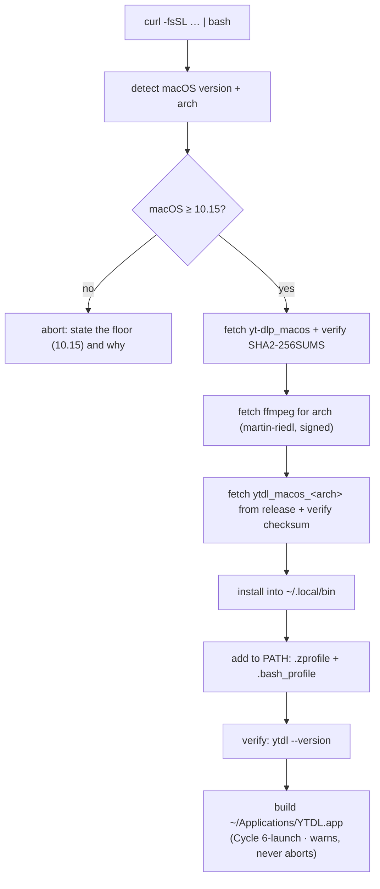

# Distribution — Constraints & Design

Primary objective: ship `ytdl` to **non-developer macOS users** with a fast,
low-friction install that provisions its dependencies, works on older macOS, and
fails with actionable messages.

All version and URL claims below were verified against upstream sources on
**2026-07-21**. Claims that could not be verified are marked *unverified*.

> **Floor raised to macOS 10.15 (2026-07-22, [ADR-0005](../../foundation/decisions/0005-macos-floor-and-single-engine.md)).**
> Cycle 1 ships a Go engine that requires macOS 10.15+, so the project **drops the
> legacy 10.13–10.14 path and Python entirely**. The Mojave/Python analysis below is
> retained for rationale; the **current** support floor is **10.15 Catalina**, and the
> installer provisions a single standalone path (no Python, no evermeet). Sections
> describing the legacy path are historical unless marked otherwise.

## The central constraint

yt-dlp **dropped its legacy macOS builds**. Since the end of August 2025 no
`yt-dlp_macos_legacy` asset is produced; the release of 2026-07-04 confirms only
`yt-dlp_macos` (universal, **macOS 10.15+**) and the platform-independent
`yt-dlp` zipimport script (**needs Python 3.10+**).
([announcement](https://github.com/yt-dlp/yt-dlp/issues/13856),
[release assets](https://github.com/yt-dlp/yt-dlp/releases/tag/2026.07.04))

The reason is structural, not a policy whim: GitHub retired the Intel `macos-13`
runners, and PyInstaller supports only macOS 10.15+. It will not be reversed.

So **Mojave 10.14 cannot run the standard yt-dlp binary.** The upstream advice to
those users is "upgrade macOS, or use a Python install".

That second path still works, but the project **no longer takes it**: Cycle 1's Go
engine requires macOS 10.15+, so the floor is raised to 10.15 and the Python path is
dropped ([ADR-0005](../../foundation/decisions/0005-macos-floor-and-single-engine.md)). The analysis
of that path below is kept for the record.

## Support matrix

The viable combinations, all from **official or signed sources** (post-[ADR-0005](../../foundation/decisions/0005-macos-floor-and-single-engine.md)):

| Target | yt-dlp | ffmpeg | Extra step |
|---|---|---|---|
| macOS 11+ Apple Silicon | `yt-dlp_macos` (universal) | martin-riedl `arm64` (signed + notarized) | — |
| macOS 10.15+ Intel | `yt-dlp_macos` (universal) | martin-riedl `amd64` (signed + notarized) | — |
| macOS 10.14 Mojave and older | not supported | — | floor raised to 10.15 ([ADR-0005](../../foundation/decisions/0005-macos-floor-and-single-engine.md)) |

At the 10.15 floor, `yt-dlp_macos` (10.15+) and martin-riedl's signed arm64/amd64
builds cover **every** supported target — no zipimport, no Python, no evermeet.

<details><summary><b>Historical</b> — why the dropped 10.13–10.14 row once worked</summary>

Two facts made the old-macOS row work out better than expected:

- **Python 3.13's installer supports macOS 10.13+**, so it installs on Mojave.
  The minimum was raised from 10.9 to 10.13, not to 11 as the `macos11.pkg`
  filename suggests. ([3.13.9 release notes](https://www.python.org/downloads/release/python-3139/))
  That `.pkg` is signed and notarized by the Python Software Foundation, so it
  passes Gatekeeper with a normal double-click — an acceptable extra step.
- **evermeet.cx being Intel-only is not a limitation here.** No Apple Silicon Mac
  can run Mojave, so every Mojave machine is Intel by definition. The ARM gap only
  affects macOS 11+, where martin-riedl provides signed arm64 builds.

</details>

The realistic floor with official sources *was* macOS 10.13 High Sierra. Cycle 1's
Go engine raises it to **macOS 10.15 Catalina** ([ADR-0005](../../foundation/decisions/0005-macos-floor-and-single-engine.md));
10.13–10.14 is no longer supported.

## Verified download endpoints

Each was checked with an HTTP request on 2026-07-21:

| What | URL | Result |
|---|---|---|
| yt-dlp (10.15+) | `https://github.com/yt-dlp/yt-dlp/releases/latest/download/yt-dlp_macos` | 200 |
| yt-dlp (zipimport) | `https://github.com/yt-dlp/yt-dlp/releases/latest/download/yt-dlp` | 200 |
| ffmpeg arm64 | `https://ffmpeg.martin-riedl.de/redirect/latest/macos/arm64/release/ffmpeg.zip` | 307 → asset |
| ffmpeg amd64 | `https://ffmpeg.martin-riedl.de/redirect/latest/macos/amd64/release/ffmpeg.zip` | 307 → asset |
| ffmpeg Intel/legacy | `https://evermeet.cx/ffmpeg/getrelease/ffmpeg/zip` | 302 → asset |

Post-[ADR-0005](../../foundation/decisions/0005-macos-floor-and-single-engine.md) the **yt-dlp
zipimport** and **evermeet** endpoints are no longer used (the legacy path is
dropped); they are kept in the table as verified references. Cycle 1 adds our **own**
release assets — `ytdl_macos_arm64`, `ytdl_macos_amd64` and a `SHA2-256SUMS` — fetched
the same way (see [design-cycle1-remaining.md](../../engine/design/cycle1-remaining.md)).
Cycle 6-launch adds `ytdl_launch_macos_{arm64,amd64}` to that same release and the
same sums file ([ADR-0019 §1](../decisions/0019-launcher-mach-o-and-recorded-versions.md)).

The `releases/latest/download/…` form matters: it always resolves to the current
release, so **no version is hardcoded** in the installer and updates need no
installer change.

yt-dlp also publishes `SHA2-256SUMS` per release — the installer must verify the
downloaded binary against it. This is not optional hygiene: the installer runs
`curl | bash` and drops an executable into the user's PATH.

## Gatekeeper

- Files downloaded with `curl` are **not** quarantined; only browser downloads get
  `com.apple.quarantine`. An installer fetching binaries via `curl` therefore
  avoids Gatekeeper entirely — this is the decisive argument for the curl channel
  over any `.pkg`/`.dmg`.
- Since Sequoia, the Control-click bypass is gone; unsigned apps need a trip
  through System Settings → Privacy & Security. `xattr -d com.apple.quarantine`
  still works. *(Sequoia/Tahoe specifics: unverified in detail — relevant only to a
  **downloaded** artefact, which is what the next note draws the line around.)*
- Signing/notarizing anything requires an Apple Developer ID at $99/year. Not
  needed for the shell-script channel; it becomes a real question only for the GUI.

> **Measured on hardware, 2026-08-26 — a bundle *generated* on the machine is a
> different case ([ADR-0018](../decisions/0018-desktop-launcher-app-bundle.md)).**
> Since Cycle 6-launch the installer builds `~/Applications/YTDL.app`. No locally
> created bundle carried `com.apple.quarantine`, so Gatekeeper never assesses it and
> no Developer ID is needed — `spctl` does reject it, and nothing ever asks `spctl`.
> This does **not** soften the `.dmg`/`.app` row in the channel table below: that row
> is about a **downloaded** artefact, and ADR-0018 §4 makes *never downloaded* an
> invariant to protect rather than a happy accident. The same reasoning closed the
> downloadable-installer question a second time — see the addition of 2026-08-27 at
> the end of [ADR-0001](../decisions/0001-distribution-channel.md).

## Channel comparison

| Channel | Friction for a non-developer | Prerequisites | Signing | Old macOS |
|---|---|---|---|---|
| **`curl \| bash`** | one paste into Terminal | none | not required | ✓ works |
| npm | needs Node.js installed first | Node.js | not required | ✗ Node on Mojave is itself a problem |
| Homebrew tap | needs Homebrew installed first | Homebrew | not required | ✗ Homebrew supports only recent macOS |
| `.pkg` unsigned | blocked, manual override | none | required in practice | ✗ |
| `.dmg`/`.app` | blocked, manual override | none | required in practice | ✗ |

Correcting a claim that circulates: `yt-dlp` **is** a normal Homebrew *formula*
and is not deprecated ([formulae.brew.sh](https://formulae.brew.sh/formula/yt-dlp)).
Homebrew is unsuitable here not because of signing, but because it requires
Homebrew itself — which no longer supports Mojave and which the target audience
does not have. Its bottles are built only for Sonoma and newer.

### On third-party legacy builds

[`alex-free/yt-dlp-macos-legacy`](https://github.com/alex-free/yt-dlp-macos-legacy)
offers a standalone binary with ffmpeg bundled for macOS 10.12+, tracking upstream
closely (v1.0.2 on 2026-07-06).

**Not recommended as a default.** The repository was created 2026-06-08, has 1
star and ~13 downloads, ships a 43 MB opaque binary under the Unlicense, with no
checksums or signature. Asking non-technical users to execute that — with full
access to their account — is a materially worse trade than one extra Python
install from python.org. Worth revisiting if it gains adoption and publishes
verifiable checksums.

## Installer design

Post-[ADR-0005](../../foundation/decisions/0005-macos-floor-and-single-engine.md), single path (no
Python branch); Cycle 1 (item 3.2) adds the `ytdl` binary fetch:



Design commitments:

- **Install prefix `~/.local/bin`** — no `sudo`, conventional, works identically
  across all target versions.
- **PATH written to both `~/.zprofile` and `~/.bash_profile`**, idempotently.
  macOS defaults to zsh from Catalina and bash on Mojave, and Terminal.app starts
  *login* shells — so the `*profile` files are the ones that matter, not `.zshrc`.
- **Version detection must handle the `10.x` → `11+` scheme change.** Taking the
  first dot-component alone misreads 10.15 as "10" and would route Catalina down
  the Mojave path. Compare major *and* minor when major is 10.
- **Checksum verification before install**, using the published `SHA2-256SUMS`.
- **Every failure names the next action** — never `brew install …`, which the
  audience cannot act on.
- **The app bundle is built on the machine, and never fails the install.** Since
  Cycle 6-launch `install.sh` also writes `~/Applications/YTDL.app` around a
  per-architecture launcher fetched from the same release and verified against the
  same `SHA2-256SUMS`. It is created when absent, **left alone when unchanged** —
  the installer runs on every update, and churning the bundle would churn the Dock
  entry, the Spotlight index and any alias the user made — and every failure it can
  meet warns and continues, because keeping ytdl installable outranks the icon
  ([the launcher design](cycle6launch-launcher.md) §4.3–§4.4). It runs **after** the
  `ytdl --version` verification: an icon must never exist for an installation that
  does not work.
- **Updates ship with the first version**, not later: `ytdl --update` refreshes
  yt-dlp and the script itself. yt-dlp breaks whenever YouTube changes, and a
  user with no update path is a user with a broken tool within months. This is the
  single most important durability decision in the plan.

The one-liner is published from a public GitHub repository:

```
curl -fsSL https://raw.githubusercontent.com/<owner>/yt-download/main/install.sh | bash
```

A downloadable `install.command` (double-clickable in Finder) can wrap the same
script for users who will not open Terminal at all — it inherits the quarantine
flag when downloaded via browser, so it needs the Privacy & Security override on
modern macOS. Evaluate in phase 2.
