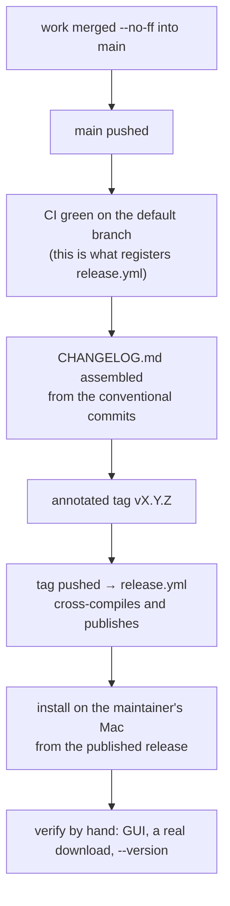

# Releasing `ytdl`

Maintainer guide. A release needs a **Mac**: the container cross-compiles nothing
the maintainer verifies by hand, has no ffmpeg, and cannot run the GUI.

It also records the two failures this project has actually paid for. Both are in
the *Order that matters* section, and neither looks like what it is when it bites.



## Before anything: the gates the release does not replace

The suite is a precondition, never the evidence. Run from the repo root:

```bash
go build ./...
go test -race ./...                                  # whole suite
go vet ./... && gofmt -l .                           # gofmt output must be EMPTY
git diff main -- internal/core/ internal/daemon/     # the parity gate — must be EMPTY
bash tests/test-installer.sh                         # installer logic, pure bash
./hack/check-docs-links.sh                           # documentation links
```

⚠️ **A green suite is not a passed gate C.** Cycle 6-plus's hands-on verification
returned ten findings, three of them blocking, on a tree whose suite was green —
see [review 004](../reviews/004-cycle6plus-gate-c.md). What the oracle here cannot
see is anything involving real hardware, a real network, ffmpeg, or the GUI.

## The version

**SemVer**, starting at `2.0.0`. What may not change without a major: the installed
CLI surface, the config keys, the history record format, and the `~/.local/bin`
install location.

## The changelog

`CHANGELOG.md` lives at the **repo root**, because it is the one document written
for whoever *uses* the product rather than maintains it. It is **assembled at the
release, derived from the conventional commits** — never written line by line as
the work goes, which would duplicate `git log` with a copy that then diverges.

Format: *Keep a Changelog* with SemVer. What changed goes here; **why** goes in the
ADR; **where the work stands** goes in [the roadmap](../../roadmap.md).

## Order that matters

⚠️ **Merge to `main` and push it *before* pushing any tag.**

At v2.0.0 the tags were pushed **before** the branch was merged to `main`, so
`release.yml` had never existed on the default branch. GitHub had not registered
it (`/actions/workflows` → `total_count: 0`, zero runs), so the `v2.0.0` /
`v2.0.0-rc1` tag pushes triggered nothing — no release, no assets, and
`install.sh` correctly failed with a 404 on `releases/latest/download/…`. A tag
push *can* run a workflow from a non-default-branch commit, but the workflow is
only activated once it has reached the default branch. **Order that matters:**
merge to `main` (registers the workflows; CI runs) → push a pre-release tag →
smoke-test the install → tag the real version. The burned tags had to be deleted
and recreated after the merge, since an already-fired tag push does not retrigger.

```bash
git checkout main && git merge --no-ff <branch>
git push origin main                    # registers the workflows; let CI go green
git tag -a vX.Y.Z -m "…" && git push origin vX.Y.Z
```

`release.yml` fires on a `v*` tag: it cross-compiles from Linux with
`CGO_ENABLED=0 GOOS=darwin GOARCH={arm64,amd64}`, `-trimpath` and
`-ldflags "-s -w -X …/internal/buildinfo.Version=$TAG"`, then publishes
`ytdl_macos_{arm64,amd64}` and a yt-dlp-format `SHA2-256SUMS`, marked `--latest`.

## Verifying, and the cache that makes a good push look broken

Install from the published release the way a user would, then exercise what the
container cannot: the GUI, a real download with a real conversion, and
`ytdl --version` against the installed dependencies.

⚠️ **`raw.githubusercontent.com` serves through a CDN that caches a branch path.**

`raw.githubusercontent.com` serves through a CDN that caches a branch path for a
few minutes. Right after a push, `.../main/install.sh` can still return the
previous version, which looks exactly like "the fix didn't work". A commit-pinned
URL (`.../<sha>/install.sh`) bypasses it. `git ls-remote` and `codeload` are
authoritative for what GitHub actually holds. Not worth engineering around —
`--update` runs rarely and the window is minutes — but worth remembering when a
fresh push appears not to have taken effect.

## `deps.conf` reaches users without a release

Since Cycle 6-plus, `deps.conf` is on `main` and a commit to it reaches every
installation within a day — it is **not** gated on a tag. That is deliberate
([ADR-0016](../decisions/0016-cycle6plus-update-path.md)): a withdrawn upstream
build must be repinnable without cutting a version. It also means a careless
commit to `deps.conf` ships immediately.

## Testing a development build without disturbing the installed one

Never verify a release with the binary you have been building. The procedure, and
why an installer run started from a dev build silently overwrites the real `ytdl`,
is in [dev-testing.md](../../guides/dev-testing.md).

## After the release

Update [the roadmap](../../roadmap.md), and record what the hands-on verification
found under the domain's `reviews/` — including "nothing", if the finding is that
a whole class was not exercised.
