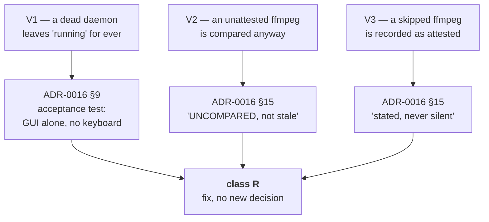

# Review 001 — Cycle 6-plus, the implementation

> **Provenance.** Extracted verbatim on 2026-08-26 from `docs/improvements.md` (lines 323–402).
> The review of the update path as built: findings `V1`–`V9`, two of them blocking.

## Review findings — Cycle 6-plus verification (2026-08-18)

Cycle 6-plus (the update path) was built on 2026-08-13 and **reviewed on
2026-08-18**, against `feat/update-path/implementation` at `0dedb13`. This
section is that review's output: nine findings, verified against the code, three
of them by **executing a reproduction** rather than by reading. Sequencing lives
in [roadmap.md](roadmap.md). All nine were fixed on 2026-08-18, in six commits;
what that cost is the second register below. The two blocking reproductions were
carried verbatim in the fix session's handoff, which has since been consumed —
the causes recorded here are what survives it.

The baseline was verified before anything else, and held: `go build`, `go vet`
and `gofmt -l .` clean, `go test -race -count=1 ./...` green on every package
**without the test cache**, `bash tests/test-installer.sh` 92/92, and the parity
gate `git diff main -- internal/core/ internal/daemon/` **empty**. Nothing below
is a regression in the frozen surface; every finding is in what this cycle added.

> **A new ID prefix, deliberately.** `C`/`U`/`M`/`E` belong to the initial-analysis
> register and `G1…G28` to the gate-C findings. These are neither: they come from
> reviewing one cycle's implementation before its own gate C, so they are `V`
> (verification). The class letters `R`/`M`/`F`/`S` are unaffected — every finding
> below is class `R`, a surface or a mechanism contradicting a document already
> declared normative.

### What makes these `R` and not opinions

Each of the three serious findings contradicts a clause that ADR-0016 wrote for
exactly that case. That is the test: not "could this be better", but "does the
code do the opposite of what the ruling says".

### V — the mechanism contradicts its own ruling (fix session, before gate C)

| # | Finding | Severity | Verified cause |
|---|---|---|---|
| V1 | **A run record left at `running` disables the GUI update path permanently** | **blocker** | Nothing keeps the daemon alive for the duration of an installer run: `cfg.LiveClients = srv.HasClients` (`cmd/ytdl/main.go:307`) is only the SSE client, and `Runner.Running()` is consulted by nobody. Close the tab mid-update → SSE drops → empty queue → the daemon idle-exits after `DefaultIdleTimeout` (20 s) → the `setsid`'d installer finishes anyway → `Runner.finish` (`internal/update/runner.go:185`) never runs. Only `Start` and `finish` write the record and **nothing ages it out**, so `updateBlocked` (`internal/webui/update.go:133`) answers `{reason:"running"}` and `Busy` stays true for ever: the banner hides, `renderUpdateAction` empties the slot, `POST /api/update` answers 409. The failure is **silent and deferred** — invisible until the next real update, when the user reads "È disponibile un aggiornamento" and is offered no control and no reason (`ux-principles.md` §4). A reboot mid-install produces the same state. The design's claim that the surface "says it cannot tell how it went and points at the log" is not implemented: there is no rendering for a `running` record whose process is gone. The webui tests inject a fake `Updater`, so they assert that `running` blocks and never that one can get out. |
| V2 | **A permanent phantom update on the CLI, for an unattested ffmpeg** | **blocker** | `updateSurface` (`cmd/ytdl/main.go:177`) assigns `v.Installed.FFmpeg = dependencyVersion(deps, …)` — the marker's build id — **undoing `InstalledFrom`'s deliberate emptying** of that field for a copy the pin does not vouch for. The comparison it was excluded from therefore runs, against a build that no longer exists, so it can never converge: applying the update makes the installer fall back again. Exactly what ADR-0016 §15 forbids ("an unattested copy is UNCOMPARED, not stale"). The same line also attributes the marker's build id to a **foreign** ffmpeg, so `ytdl --version` prints our recorded version next to somebody else's binary path. The GUI is correct (`guiUpdater.Verdict` uses `local()`), so the two channels disagree (`ux-principles.md` §7). **Reproduced by execution** — see the handoff. |
| V3 | **A never-verified ffmpeg is promoted to "verificata"** | **major** | `install_ffmpeg` returns at the skip test (`install.sh:549`) *before* the `FFMPEG_PINNED=1` on line 568, but the global is already `1` from line 59 — so `write_marker` records `ffmpeg_pinned = true`. The trigger is the intended remedy itself: upstream withdraws build X, users fall back to Y, the maintainer re-pins `deps.conf` to Y; at the next update ffmpeg is skipped as already current and bytes that were never checksummed against anything become "verificata con questo ytdl". Contradicts ADR-0016 §15 ("the degradation is stated, never silent"). **Reproduced by execution** — see the handoff. |
| V4 | The doc comment on `parseKeyValue` states the opposite of the code | minor | `internal/update/parse.go:29` still says "deps.conf is strict — it fails closed", which is the design as it stood *before* ADR-0016 §14.2. The only deps.conf caller passes `strict=false` (`probe.go:215`), and `probe.go:168` argues the opposite at length. The stale half sits on the shared helper, which is what a reader reaches first; the half about the marker is correct. |
| V5 | `ffmpeg_current_build` downloads the whole zip to learn a URL | minor | `install.sh:534` runs `curl -sL -o /dev/null -w '%{url_effective}'` under `--max-time 30` purely to read the effective URL. On a slow link it times out, `FFMPEG_TARGET` ends up empty, and the marker records no ffmpeg build at all — after which every surface shows ffmpeg with no version. A `--head` or a `-r 0-0` range request answers the same question. |
| V6 | `run.Version` is filled in for a **failed** run | minor | `internal/update/runner.go:214` reads the marker regardless of state, so `updateStatusDTO.Version` carries a version for a run that installed nothing. Latent, not visible: `showUpdatePanel`'s `failed` branch ignores it today. |
| V7 | `/api/state` reads the run record and tails the log twice | minor | `internal/webui/update.go:92` (`Busy`) and `:114` (`updateBlocked`) each call `u.Progress()`, which opens the run file and reads up to 8 KB of `update.log`. `/api/state` is on the page's load path. |
| V8 | Both arms of a ternary are identical | nit | `internal/webui/assets/app.js:1086`: `n === 1 ? " download in corso" : " download in corso"`. Harmless in Italian, where the noun is invariant, but it reads as a pluralisation left unfinished. |
| V9 | A leftover `_ = js` | nit | `internal/webui/spa_test.go:449`, residue from moving the "Riprova" assertion into `TestRiprovaStaysOffHistoryRows`. |

### What the review did NOT establish

Recorded so the fix session does not mistake "reviewed" for "exercised". These
were listed as the likeliest bug sites by the session that built the cycle, and
the review did not clear them — it read them and found nothing provable either
way:

- **The handover has still never run end to end anywhere.** `handOver` calls
  `os.Exit`, so no test executes it. The review did confirm the two properties it
  depends on: the bare `fetch` calls in `pollUpdate`/`newBuildIsServing`
  authenticate via the `SameSite=Strict` cookie (`tokenOK` accepts cookie *or*
  header), and `DefaultFirstClientGrace` is 2 minutes against the page's 60 s
  `RESTART_TIMEOUT_MS`, so the incoming daemon cannot idle-exit while the browser
  reconnects. `os.Executable()` after the binary was replaced by `mv` is correct
  on macOS; on Linux it would resolve to a `(deleted)` path, which does not matter
  in production and would matter if the handover is ever exercised in CI.
- **`install.sh` has never run against the real network on a real Mac**, and the
  withdrawn-build fallback **has never fired** — no build has been withdrawn yet.
  It can be forced by pinning a build id that does not exist.
- **The canary workflow has never executed.**
- **All DOM ids referenced by `app.js` exist in `index.html`** (checked by
  difference), so the new surface cannot crash on a missing element — but no
  browser has rendered it.
