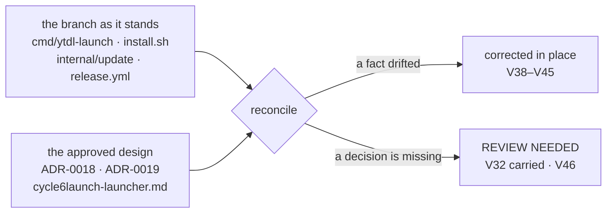

# Review 006 — Cycle 6-launch, the documentation

`/review-docs` of `L1`–`L8` on `feat/launch/implementation`, run on **2026-08-27**
against `da74e81`. It is `L9`'s second half; the
[implementation review](005-cycle6launch-implementation.md) was the first.
Historical: what it asserts is what was true on that day.

**Verdict: updated in place.** Nine living documents were realigned to the code and
to the approved design; nothing historical was edited; one question is carried
forward undecided and one is raised. The register continues the `V` series at
**`V38`** — `V1`–`V29` belong to Cycle 6-plus, `V30`–`V37` to review 005, whose
dated addition of the same day closes `V33`–`V36` and adds `V37`.

## What was measured against what

The rule this review works by: when a document and the code disagree on a **fact**,
the document is wrong and is corrected; when they disagree on a **decision**, the
review escalates and writes nothing down.

Two documents were deliberately **not** touched, and the reason is the same in both
cases — they are historical:
[review 005](005-cycle6launch-implementation.md) and every ADR. Where reality has
moved past them the correction lives here or in a living document that links back,
never in their bytes.

## Updated in place

### `V38` — a living document still carried the measurement ADR-0018 falsified · major

[`cli-reference.md`](../../ux/design/cli-reference.md) §8.3 explained why the
advisories do not exec each tool: *"`yt-dlp --version` is a Python zipapp and costs
the better part of a second"*.

That is the **container's** yt-dlp. Users run the PyInstaller one-file bundle, which
unpacks itself on every invocation and cost **7.33 s on macOS, warm or cold** at gate
A. ADR-0018's *Consequences* named exactly this claim as one of two the measurements
falsified, and design §5.4 corrected the two **code comments** — `versionTimeout`'s
and `Dependencies`'. The third copy of the same sentence, in a maintainer-facing
living document, was not on that list and survived.

It matters more than a wrong number: it is the reasoning a future cycle would use to
decide that one more probe is affordable. The paragraph now carries the real figure,
says which environment the old one described, and points at
[ADR-0019 §2](../decisions/0019-launcher-mach-o-and-recorded-versions.md) for the
startup path that stopped paying it.

⚠️ **A measurement quoted in three places was corrected in two.** That is the
generalisable finding, not the sentence: `grep` for the number, not for the file you
remember.

### `V39` — the as-built engine document did not know the repository builds two commands · major

[`go-engine.md`](../../engine/design/go-engine.md) is the as-built layout, and it
described a module with one command in it. Four corrections, all facts:

- **`cmd/ytdl-launch` did not appear at all** — neither in the package list nor as a
  second binary. It now has its own entry: how it resolves `ytdl` (sidecar, then
  `~/.local/bin/ytdl`), what it writes to `launcher.log` and when it alerts, that it
  imports `internal/config` and nothing else of the engine, and that it owns no
  policy. The section header *One engine, thin front-ends* now says explicitly that
  the launcher is **not a fourth front-end — it opens one**, which is the distinction
  ADR-0019 §1 turns on.
- **`internal/update`'s local-facts bullet** named `Dependencies` only. It now names
  `RecordedDependencies` and the version-source parameter (`none` · `recorded` ·
  `probed`) that keeps the SHOW and COMPARE shapes one walk, with the clause that a
  recorded version is attributed only to a copy that is ours.
- **`cmd/ytdl`'s bullet** did not mention that `runDaemon` schedules the reconcile
  **after `startWebUI` returns**. That ordering is the whole remedy; a document that
  omits it invites the next cycle to move the call.
- **The release paragraph** listed two assets and one sums file. There are four
  assets, one sums file, and a step that refuses to publish an unsigned arm64
  launcher.

The status line also still read *"current as of Cycle 5's closing (2026-08-04)"*
while describing Cycle 6-plus's `internal/update`. Now 2026-08-27.

### `V40` — the distribution design still treated a `.app` as hypothetical · major

[`distribution.md`](../design/distribution.md) is living, and its Gatekeeper section
read *"relevant only if we later ship a `.app`"*. One ships now.

Corrected the way this project corrects a document whose measurements are dated:
**by dated addition, not by rewriting.** The 2026-07-21 verifications stand as
written; a note beside them records what was measured on hardware on 2026-08-26 —
that a bundle **generated** on the machine never acquires `com.apple.quarantine`, so
Gatekeeper never assesses it — and states in as many words that this does **not**
soften the `.dmg`/`.app` row in the channel table, because that row is about a
*downloaded* artefact. [ADR-0018 §4](../decisions/0018-desktop-launcher-app-bundle.md)
makes *never downloaded* an invariant to protect, and
[ADR-0001](../decisions/0001-distribution-channel.md)'s own addition of 2026-08-27
closes the same question from the other side.

The installer flowchart, which ended at `verify: ytdl --version`, gained the bundle
step in the position the code puts it — **after** the verification — and *Design
commitments* gained the bundle's two rules: left alone when unchanged, and never
fatal.

### `V41` — the release guide published two assets · major

[`releasing.md`](../guides/releasing.md) named `ytdl_macos_{arm64,amd64}` and a `SHA2-256SUMS`.
It now names all four assets, records that a step **refuses to publish an arm64
launcher with no `LC_CODE_SIGNATURE`** and that the assertion runs *before* the sums
file is written, and adds the app to the by-hand verification list.

It also gained the asymmetry this cycle discovered, as a permanent property of the
release process rather than a note about one window: **`install.sh` is served from
`main` while everything it downloads comes from `releases/latest`**, so a change to
the installer reaches users in minutes while anything it must *fetch* waits for the
tag. The launcher is the first component in that position; any future one inherits
the window. That is the mirror image of the `deps.conf` asymmetry documented
immediately above it, and the guide now holds both.

### `V42` — the index had not learned that `distribution/` grew an `analysis/` · minor

[`docs/README.md`](../../../README.md) declares the tree and is checked by
`hack/check-docs-links.sh` for ADR completeness — but not for folder completeness.
Its diagram listed `design/ · decisions/ · guides/ · reviews/` for the distribution
domain, and the
[gate-A analysis](../analysis/2026-08-26-tech-choice-desktop-launcher.md) — the
document every measurement in ADR-0018 and ADR-0019 comes from — was reachable only
through those ADRs. Both fixed: `analysis/` in the diagram, and the analysis has a
row of its own, as the engine domain's analyses already do.

### `V43` — four terms in daily use had no glossary entry · minor

`YTDL.app`, **launcher**, **sidecar**, and the **recorded vs probed** distinction are
used across two ADRs, the design, `install.sh`, the launcher's own comments and
review 005. None was in [`glossary.md`](../../glossary.md), whose own rule is *use the
term, or add it*. Added, each pointing at the document that owns it. *Recorded* ·
*probed* is worth the row on its own: it is a different axis from *attested*, which
is about bytes rather than versions, and the two are one confusion away from each
other.

### `V44` — the front door did not mention the app · minor

The repository [`README.md`](../../../../README.md) still answered *"prefer not to use
the Terminal?"* with `ytdl gui`, which is the answer this cycle exists to replace. It
now describes the app first, says it is built on the machine and therefore needs no
security exception, and keeps `ytdl gui` as the Terminal equivalent. It also states
the thing the guides state and the surface cannot: the app **bounces and goes** — the
browser page is the interface, and closing it is what closes ytdl.

⚠️ **Its truth is dated: `L11`, not `L10`.** See `V46` below — this edit is the object
of that gate, and reverting it is one `git checkout` of one file.

### `V45` — the state directory gained a file the sandbox table did not list · nit

[`dev-testing.md`](../../guides/dev-testing.md) enumerates what `XDG_STATE_HOME`
governs, and the list is what a maintainer checks a sandbox against. `launcher.log`
was missing. Added. The 256 KiB cap the launcher now applies to it — the same rule
`internal/daemon` applies to `daemon.log` — is recorded in `go-engine.md`'s launcher
entry, so *"how big can this get"* has one answer in one place.

### And the roadmap, which is the SSOT

Not a finding — the roadmap is *supposed* to be rewritten at `/review-docs`. What
changed: `L9` marked `done` and linked to both reviews; the cycle's own status marker
moved from `planned` to `in progress`; the "where we are now" and "open now" blocks
now say the implementation is **reviewed**, name the two defects that were fixed in
place, and leave `L10`–`L12` as what remains; the cold-start entry says its remedy is
**built**, not merely decided, and that the sub-second first click is gate C's to
confirm; phase 6's `6a` line stops saying the launcher "runs next"; and the *Known
open questions* entry on Sequoia/Tahoe Gatekeeper now says it applies to a
**downloaded** bundle, which is the distinction ADR-0018 measured.

**`V32` is recorded there as an open decision with its three options in one line and
no resolution**, which is what the roadmap is for. No document on this branch says
what the reconcile does to an open page, because nobody has decided it.

## Integrate

- The **launcher analysis** (`2026-08-26-tech-choice-desktop-launcher.md`) — its
  measurements are still true and are now reachable from the index rather than only
  through the ADRs that quote them.
- The **`L10 → L11` window**, which lived in the roadmap and the handoff as a fact
  about *this* cycle, is folded into `releasing.md` as a property of *the release
  process*: the next component fetched from a release will meet the same window.

## Archive

Nothing. No document was superseded by this cycle.

Two candidates were considered and rejected, because *realised* is not *superseded*
(the maintenance policy §4, `.cco/claude/rules/maintenance.md`): the
[Cycle 6-launch design](../design/cycle6launch-launcher.md) and
[cycle6plus-update.md](../design/cycle6plus-update.md). Both describe work that was
built as written; neither has a successor. `cycle6plus-update.md`'s non-goal *"it does
not add a launcher: starting the GUI without a Terminal is Cycle 6-launch"* was
checked and is still an accurate statement about that cycle.

## REVIEW NEEDED

### `V32`, carried unchanged — the reconcile never reaches a page that is already open

Raised by [review 005](005-cycle6launch-implementation.md#v32) and **still
undecided**. This review did not resolve it and wrote no document describing a
behaviour nobody chose.

- **What is suspended:** nothing. The branch is mergeable.
- **The evidence:** [review 005 `V32`](005-cycle6launch-implementation.md#v32), and
  now also the [roadmap's](../../roadmap.md#cycle-6-launch) one-line record of it.
- **What unblocks it:** the maintainer picks one of the review's three options.
  Option 3 (*accept it*) needs no code — it needs a line in the design or in
  `improvements.md`, and this review is the natural moment to write it.

### `V46` — the README describes an app that `main` cannot install until `L11`

**What changed.** `V44` above added the app to the repository README — the one
user-facing English surface that is served from `main` and read before anything is
installed.

**Why it is a new decision.** Between `L10` (merge) and `L11` (release), `install.sh`
comes from `main` while assets come from `releases/latest`, so an install in that
window takes the warn-and-continue path and produces **no app**. The Italian guides
already handle this — *"Se dopo l'installazione l'app non c'è…"* — and `CHANGELOG.md`
is under `[Unreleased]`, which says it of itself. The README has neither marker, and
[ux-principles §5](../../ux/design/ux-principles.md) is *a surface never states
something untrue*. The design's Appendix B, which names every file the cycle touches,
does not list `README.md`, so no gate has ever ruled on it.

**Options.**

| | Option | Pros | Cons |
|---|---|---|---|
| **A** | **Keep the edit on this branch** (it is written and on disk) | one commit; the README, the guides and the changelog tell one story from the merge onward; the window is meant to be short | for the length of that window the front door describes something a fresh install will not produce, with no caveat beside it |
| **B** | **Revert `README.md` and land it with the release** — `git checkout README.md`, re-apply at `L11` | the README is never ahead of what `main` can install | a second commit at release time, on a document nobody will be thinking about then; and it is exactly the kind of follow-up this project has watched slip |
| **C** | Keep the edit **and add one caveat sentence** pointing at the guide's existing note | truthful in the window and after it | a caveat that becomes noise the day after `L11`, in the most-read document in the repository |

**Recommendation (a suggestion, not a decision):** **A**, on the precedent the branch
already set — the guides and the changelog were written ahead of the release at `L8`
and approved at gate B — provided `L11` follows `L10` closely, which the roadmap
already requires for a different reason.

**The exact question:** for `README.md`, do you choose **A** (keep it as written),
**B** (revert it now and re-apply at `L11`), or **C** (keep it with a caveat)?

**Path of the artefact under judgement:** `README.md`, working tree, uncommitted.

## Noted, out of this cycle's scope — not acted on

- [`process/design/docs-reorganization.md`](../../process/design/docs-reorganization.md)
  still says **"Status: awaiting gate B"**, though `DOCS-1` merged on 2026-08-26, and
  its §2 target tree predates both `distribution/analysis/` and `process/reviews/`.
  It belongs to `DOCS-1`, not to this cycle; corrected here it would be an edit to
  another cycle's record with no review of its own. Worth one line at the next
  `/review-docs` that owns the `process` domain.

## What was checked and found sound

Each of these was a candidate finding that survived the check.

- **The two user guides were read against the code, not against the design.**
  `guida-installazione.md` names the app, where it is, and the fourth uninstall line;
  `guida-uso.md` explains the bounce-and-go, the absent *Quit*, and `launcher.log` by
  its real path. Both match `install.sh` and `cmd/ytdl-launch` as they now stand.
- **No document described the pre-fix behaviour of `V33`–`V37`.** Checked
  individually against the state after `fbc8f9e` and `da74e81`: nothing documents
  `APP_INSTALLED`, nothing quotes the installer's closing message or the checksum
  warning, nothing quotes a displayed path — so `V37`'s tilde fold, which was showing
  a true path that was simply not the intended one, is invisible to this tree — and no
  document promised that `launcher.log` keeps every launch for ever. `guida-uso.md`
  says each attempt *leaves a line*, which the 256 KiB cap does not falsify.
- **`guida-uso.md` hedges the alert correctly.** Whether an `osascript` alert launched
  by LaunchServices reaches the front of the screen is a gate-C unknown (design §9),
  and the guide says *"se anche quello non compare"* before pointing at the log. A
  guide that promised the alert would have been a surface stating something not yet
  measured.
- **`cli-reference.md` §8.1's *"no probe is ever on a path a user waits on"* is now
  true again** and was left as written. It describes the cached *verdict*, which was
  never the violated path; the violated one was the GUI daemon's local walk, and
  `V38`'s correction is where that is explained.
- **`ADR-0016 §5`'s doctrine is not contradicted by any living document.** ADR-0019
  *amends* ADR-0016 §5 and §8 and says so in its header; no living document restates
  the amended text in the old form.
- **The design's *"roughly 120 lines"* for the launcher against 247 as built** is not
  a documentation defect. It is a size estimate in an approved design, not a contract;
  Appendix C's contracts are what the design binds, and they are all present. Recorded
  so the next reader does not re-open it.
- **`hack/check-docs-links.sh` was green before and after**, and the ADR table in
  `docs/README.md` is complete: the next number is still `0020`, and this cycle added
  no ADR.

## The handoff was deliberately not updated

`docs/maintainers/handoff.md` — not linked, on purpose — says the phase is *Review*
and that `/review-implementation` has not been run. Both are now false, and it is
**still not this review's document**: the handoff is ephemeral, owned by `/handoff`,
and deleted before the next one is written, which is why nothing in this tree links
to it.
Editing it here would put two hands on a document with one owner. Noted so the next
`/handoff` knows what it is replacing — and its *Gates still open* table needs `V32`
and `V46` added to the Review row.

## Good practices worth repeating

- **The dated addition works, and this cycle used it three times without being
  asked.** `ADR-0001` closed the downloadable-installer question with an addition
  rather than an edit; `roadmap-history.md` recorded `T4`'s reopening the same way;
  and `V40` above followed the pattern rather than rewriting a 2026-07-21
  measurement. A reader can still see what was believed and when.
- **The Italian guides carry the failure case, not only the happy path.** *"Se dopo
  l'installazione l'app non c'è"* and *"se anche quello non compare"* were written
  before gate C could confirm either. That is a surface declining to state something
  it cannot know, which is the harder half of ux-principles §5.
- **`ADR-0019` states which earlier decision it amends, in its header.** That one line
  is why `V38`'s correction could be made confidently: the doctrine's current text is
  findable without reading every ADR that touches it.
- **The design's Appendix B — every file by path — is what made this review cheap.**
  Three of the eight findings above are documents that are *not* in it, which is
  exactly the residue a file list is supposed to leave: a short list to diff against
  rather than a tree to search.

## Where this leaves `L9`

- `/review-implementation`: **done** — [review 005](005-cycle6launch-implementation.md).
- `/review-docs`: **done** — this report. Nine living documents realigned, nothing
  historical edited.
- **`L9` is complete.** `L10` (merge) is unblocked. Two questions are open and neither
  blocks it: `V32` (carried) and `V46` (raised here, one file, one revert).
