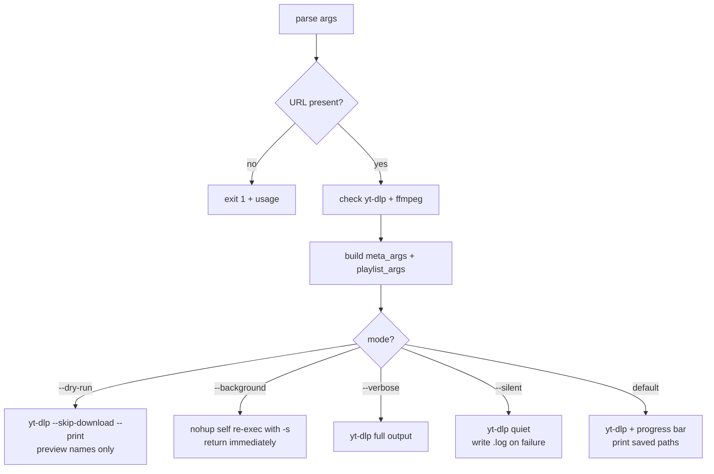
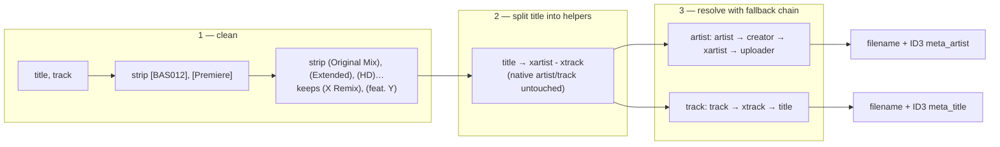

# ytdl — Current Architecture

Status: **as-built**, describing `ytdl` at commit `46421ba` (273 lines, single Bash file).
This document records what the script does today. Proposed changes live in
[improvements.md](../../improvements.md) and [roadmap.md](../../roadmap.md).

## Purpose

`ytdl` is a thin, opinionated wrapper around [yt-dlp](https://github.com/yt-dlp/yt-dlp)
that downloads audio from YouTube / YouTube Music and produces files named
`Artist - Track.<ext>` with correct ID3 tags (artist, title, embedded cover art).

The value it adds over raw `yt-dlp` is **not** download logic — it is the
*metadata normalisation policy* plus a small set of UX affordances (dry-run,
background execution, silent mode with failure logs).

## File layout

Single executable Bash script, no dependencies beyond the runtime tools:

```
ytdl                # everything: config, help, arg parsing, execution modes
```

There is no config file, no library split, no test suite, no version string.

## Runtime dependencies

| Dependency | Required for | Checked at runtime | Failure message |
|---|---|---|---|
| `yt-dlp` | everything | yes (line 115) | suggests `brew install yt-dlp` |
| `ffmpeg` | audio extraction, cover embedding | yes (line 116) | suggests `brew install ffmpeg` |
| `bash` | the script itself | implicit (shebang) | — |

Both checks assume Homebrew is present. That assumption does not hold for the
target audience of the distribution work — see [distribution.md](../../distribution/design/distribution.md).

**Bash compatibility:** verified free of Bash 4+ constructs (no `declare -A`,
`mapfile`, `${var,,}`, `&>>`, `;;&`, globstar). It therefore runs on the Bash 3.2
that ships with macOS, which matters for older systems where no newer Bash exists.

## Configuration

Configuration is compile-time (edit the script) or environment-based. There is no
persistent user config file.

| Setting | Source | Default |
|---|---|---|
| Output directory | `-o/--output` flag → `$YTDL_OUT_DIR` → hardcoded | `~/Music/ytdl` |
| Audio format | `-f/--format` flag → hardcoded | `mp3` |
| Cleanup regexes | hardcoded (`STRIP_BRACKETS`, `STRIP_TAGS`) | see below |

Precedence is flag > environment > default, which is the conventional order.

## Execution model

Argument parsing sets flags, then exactly one of five mutually exclusive paths
runs. The paths do not share a single call site — each builds and invokes
`yt-dlp` separately, with `base_args` shared only between silent and normal mode.



Notable properties of this model:

- **`-b` is implemented by self re-exec.** The script calls itself via `nohup`
  with `-s`, plus the resolved format, output dir and playlist flag. It does not
  forward `--`, so a URL starting with `-` would break; in practice URLs do not.
- **Background jobs are unbounded.** Each `-b` invocation spawns an independent
  detached process. Running it five times starts five concurrent downloads;
  there is no queue, no lock, no concurrency limit.
- **Silent mode is the error-reporting path.** Because `-s` and `-b` produce no
  terminal output, a failure writes `<title>.log` into the output directory
  instead of the audio file. This is the only failure channel for background runs.

## Metadata pipeline

This is the core of the script and the part worth preserving carefully. The goal
is: *structured metadata always wins over title parsing.*



The ordering in `meta_args` (lines 134–140) is deliberate and fragile:

1. Cleanup regexes run first, so downstream steps see normalised text.
2. The title is split into **helper fields** `xartist`/`xtrack` rather than
   overwriting `artist`/`track`. The inline comment records why: writing directly
   to `artist` caused `"Label - Artist — Track"` uploads to yield the label as the
   artist. Helper fields keep YouTube Music's structured metadata authoritative.
3. ID3 tags are written with the same fallback chain as the filename, so the tag
   and the name never disagree.

Any refactor must preserve this ordering and the helper-field indirection.

## Error handling

- `set -euo pipefail` is on. Around each `yt-dlp` call the script drops to
  `set +e`, captures `rc`, and restores — so a download failure is handled rather
  than aborting the script.
- `--no-simulate` is required because `--print`/`--print-to-file` with a
  `before_dl` key otherwise imply `--simulate` (i.e. no download). This is
  documented inline and is easy to break accidentally.
- The normal path counts written files via `--print-to-file after_move:%(filepath)s`
  and reports the full path for a single track, the directory for several, or an
  explicit failure when zero files landed.
- Temporary files are `mktemp` and cleaned by an `EXIT` trap.

## Verified non-issues

Checked during analysis and found correct, recorded to avoid re-litigating:

- `[[ cond ]] && cmd` at line 175 under `set -e` does **not** abort the script
  when the condition is false (confirmed empirically); it is not the classic
  `set -e` pitfall because it is not the final command of the script.
- The `rc` capture pattern around `set +e` / `set -e` is correct in all four
  invocation paths.
