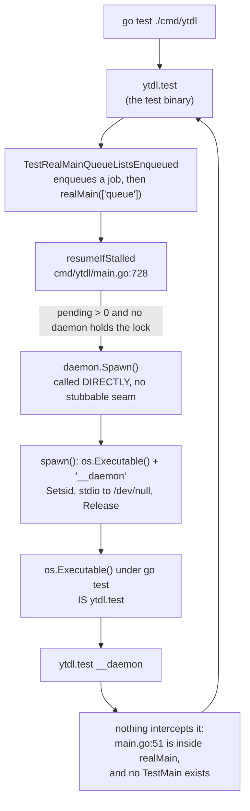
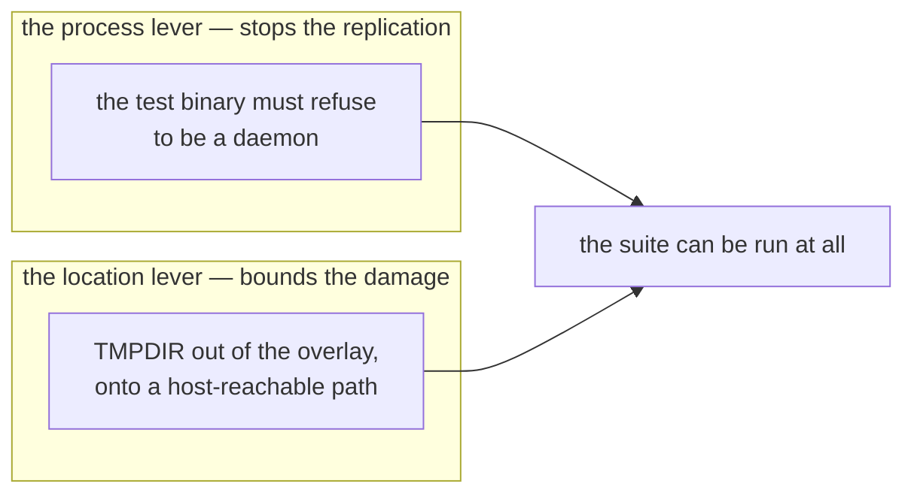

# `DEV-1` analysis — the test suite re-executes itself

Code analysis for [`DEV-1`](../../roadmap.md#dev-1), 2026-08-26. It answers the
question the roadmap left open — *what multiplies three extractions into 1657* —
and states what `T0` must contain before `T1` may be run at all.

**Nothing here is a decision.** The mechanism is established; the remedy is `T2`'s
design, and gate B stands between this document and any of `T3`–`T5`.

> **Addendum, 2026-08-26 (same day).** The remedy was decided and shipped:
> [ADR-0017](../../foundation/decisions/0017-dev-container-oracle.md). Two of this
> document's conclusions were **overtaken by a better option found while validating
> them**, and the original text below is left as written:
>
> - §4 concludes that `T0` needs a *location* lever alongside the process one. It
>   does not. The container now provisions yt-dlp as the **zipapp**, which never
>   unpacks, so there is no extraction to place anywhere — the object was removed
>   rather than relocated. The location lever was dropped, not implemented.
> - §7 records the branching factor as unmeasured. It was then **measured: 1** per
>   suite run — a linear chain, not a tree, and unbounded all the same. The guard
>   described in §5 is what measured it, exactly as proposed there.
>
> Everything else in this document held, including the mechanism in §2, which is the
> part the fix rests on.

## 1. What this establishes

`go test ./cmd/ytdl` starts a process that **re-runs the entire `cmd/ytdl` test
suite**, detached from the test harness, and each such run starts another. The
chain is unbounded: it is not stopped by `go test` returning, by `-test.timeout`,
or by the session ending.

`V25`'s recorded cause — a 30 s `versionTimeout` that kills `yt-dlp` before its
PyInstaller bundle can remove its own extraction — is **correct and unchanged**.
It is the per-run cost. What was missing is the **multiplier**, and the multiplier
is the suite re-executing itself.

This closes the three orders of magnitude the roadmap flagged as unexplained.

## 2. The mechanism

The loop closes because of a property of Go's own test harness, measured here
rather than assumed:

> A test binary handed an unknown **positional** argument does not reject it. Go's
> generated main calls `flag.Parse()`, which stops at the first non-flag argument
> and leaves it in `flag.Args()`. The binary then runs the whole suite and exits 0.

So `__daemon` — the hidden keyword that makes the *production* binary become a
daemon — makes the *test* binary become a second copy of the test suite.

### Why the production binary is fine

`realMain` intercepts `__daemon` as its first act
([`cmd/ytdl/main.go:51`](../../../../cmd/ytdl/main.go)). Under `go test` the entry
point is Go's generated main, which never calls `realMain`. The interception is
real, and it is simply not on the path a test binary takes.

### Why exactly one test is guarded

`TestRunRetryCmdRequeues` takes the daemon flock by hand, with the comment *"so
`resumeIfStalled` sees a live daemon and does NOT self-exec a real one from the
test binary"*. **The hazard was known and one test was immunised.** The other
paths into `resumeIfStalled` — `printQueueOnce` (`main.go:628`), the `--watch`
redraw loop (`main.go:666`) and the retry re-queue (`main.go:849`) — are not.

`resumeIfStalled` is also the **only** spawn call site with no stubbable seam. The
other two are package vars precisely so tests can replace them, and tests do:

| seam | form | stubbed by tests |
|---|---|---|
| `run.spawnDaemon` (`internal/run/runner.go:72`) | package var | yes |
| `spawnQueueDaemon` (`cmd/ytdl/main.go:1201`) | package var | yes |
| **`resumeIfStalled` → `daemon.Spawn()`** (`main.go:732`) | **direct call** | **no** |

There is a second self-exec in the same package, `spawnGUIWithToken`
(`cmd/ytdl/update.go:196`), which builds the same argv without going through
`internal/daemon`. Any containment must cover both, which is convenient: both live
in `cmd/ytdl`, so one interception in that package's test binary covers both.

## 3. Evidence, and how each fact was obtained

Measured facts are labelled `M`, facts read from the tree `R`. **The distinction
matters**: gate C's lesson was that reading and executing disagree.

| # | Fact | How |
|---|---|---|
| `M1` | A Go test binary given the positional argument `__daemon` runs its full suite and exits 0 | `M` — a six-line throwaway package built with `go test -c` and run with that argv. It contains no ytdl code and executes no `yt-dlp`, so it was safe to run before containment |
| `M2` | `yt-dlp --version` allowed to finish leaves **nothing**; `SIGKILL`ed mid-extraction it leaves one `_MEI…` directory of **78 MB** | `M` — one clean run, one killed at 0.35 s, both with `TMPDIR` redirected |
| `M3` | The PyInstaller bundle **honours `TMPDIR`**: the overlay's `/tmp` stayed empty across both runs | `M` — same experiment. This is what makes a redirect a usable lever at all |
| `M4` | The session is **not** root (uid 1001), `mount` is refused, and no `sudo` exists | `M` — `id`, and an attempted 1 MB tmpfs mount |
| `M5` | The **only** host-reachable read-write mount inside the container is the repo itself, `/workspace/yt-download` → `/Users/alessandro/Scripts/yt-download`. Everything else is either the overlay or cco-internal | `M` — `mount` |
| `M6` | The container is currently clean: overlay at 15 %, **zero** `/tmp/_MEI*` | `M` — after the image rebuild |
| `R1` | `resumeIfStalled` calls `daemon.Spawn()` directly | `R` |
| `R2` | `daemon.spawn` self-execs `os.Executable()` with `__daemon`, `Setsid`, stdio to `/dev/null`, then `Release()`s — so the child outlives its parent and is in a different process group | `R` |
| `R3` | `__daemon` is intercepted **inside `realMain`**, which a test binary never enters | `R` |
| `R4` | There is **no `TestMain`** anywhere in the repository | `R` |
| `R5` | `versionTimeout` is 30 s (`internal/update/install.go:50`), and its comment records the reasoning and the `V20` measurement behind it | `R` |

### Arithmetic, and one correction to the record

At **78 MB** per complete extraction, the 77 GB measured corresponds to roughly
1000 complete extractions; 1657 were counted, so the population is a mix of
complete and interrupted ones. The order of magnitude is consistent.

⚠️ `V25`'s recorded cause states that its three extractions per run account for
**~150 MB**, i.e. ~50 MB each. The measured size of a complete extraction is
**78 MB**, so the same three account for ~234 MB. This is a factual correction to a
figure, not to the cause, and it changes nothing about the conclusion.

## 4. What `T0` must contain — and what the candidate levers do not

The roadmap names two candidate levers for `T0`, both about **where** the
extractions land: a per-test `TMPDIR`, or a `TMPDIR` on a bind mount that stays
reachable from the host.

⚠️ **Neither contains the replication.** They relocate the bytes. The chain of
detached test binaries keeps running and keeps multiplying whatever `TMPDIR` says;
the difference is only that the flood arrives on the maintainer's Mac instead of on
the overlay. It also keeps loading the machine — which is the most plausible
explanation for the near-2× spread in the suite's own wall time, since the suite is
competing with copies of itself.

So `T0` has two independent halves, and both are needed:

**The process lever.** A `TestMain` in `cmd/ytdl` that recognises `__daemon` as
`os.Args[1]` and exits immediately breaks the chain at depth 1, covers both
self-exec sites in that package, and is confined to test code. It touches neither
`internal/core` nor `internal/daemon`, so the parity gate is unaffected — worth
stating, because non-negotiable 1 means any durable fix must live in `cmd/ytdl` or
`internal/update` regardless.

**The location lever.** `tmp/` at the repo root is **already** in `.gitignore` as
machine-local development output, and the repo is the only host-reachable
read-write path (`M5`). A `TMPDIR` under it satisfies exactly the property that
failed on 2026-08-26: leftovers stay deletable from the Mac when the container
cannot delete them itself. There is precedent in the tree —
`tests/harness/capture-goldens.sh` already exports its own `TMPDIR`.

What the location lever **cannot** do from inside a session is cap the total. A
size-limited filesystem needs `mount` (`M4`), which means `.cco/`, which means a
session started at `--cco-access edit-project` or a host step. That is a real
constraint on the design, not a preference.

## 5. `T1` can be answered more safely than the roadmap proposes

The roadmap's `T1` is `go test -race -count=1 ./cmd/ytdl/ ; pgrep -af 'ytdl.test'`
— run the suite, then count what survived it. It works, and it costs a reproduction
of `V25` to confirm `V25`, which is how the fourth session was lost.

With the process lever in place the same question is answered without the
reproduction: the `TestMain` that refuses to be a daemon can **record** each refusal
before exiting. One clean suite run then reports the exact number of self-execs it
attempted, by depth, with no detached process ever surviving it.

This is strictly better on both sides — it contains and it measures — and it means
`T0` and `T1` are one step rather than two. It is offered as an input to `T2`'s
design, not adopted here.

## 6. Open questions for the design

1. **Is a test-only interception the mechanism, or scaffolding?** It makes the suite
   safe, but leaves `resumeIfStalled` the one spawn call site a test cannot control.
   A `cmd/ytdl` package var — the shape `spawnQueueDaemon` already has — would give
   it a seam without touching `internal/daemon`. The two are not exclusive, and the
   belt-and-braces reading is defensible given the cost of being wrong.
2. **Where does `TMPDIR` point, and who caps it?** Repo-local is host-reachable and
   free; it is also uncapped, and the disk it can fill is the maintainer's. A capped
   mount requires `.cco/` and therefore a differently-started session.
3. **How does the suite prove it left nothing behind** (`T5`)? A green run that
   leaked is gate C's *"a skipped test looks exactly like a passing one"*, in the
   same shape.
4. **`internal/run` is guarded per-test, by convention only.** Its `spawnDaemon`
   stub is re-applied in each test that needs it; a future test that forgets
   reintroduces the same bomb in a different package. Whether that is worth a
   structural guard is a design question, not a defect today.
5. **Does `T3`'s injectable timeout still matter once the multiplier is gone?**
   Yes — it is `V25`'s actual cause and still costs 234 MB per run — but its
   priority relative to `T4` changes now that the multiplier is the larger term.

## 7. What this analysis did **not** establish

- **The branching factor was not measured.** Whether each suite run spawns exactly
  one successor or several — and therefore whether the growth is linear or
  exponential — follows from how many tests reach `resumeIfStalled` with pending
  work, and is precisely what `T1` should report. The reasoning in §2 gives a lower
  bound of one, which is already unbounded over time.
- **The suite was not run.** No `go test` touching `cmd/ytdl` was executed in this
  session, deliberately. Every fact above comes from reading the tree, from a
  throwaway package that shares no code with it, or from `yt-dlp` invoked directly.
- **Nothing was measured on macOS.** The container is not the target platform — the
  first of the three lessons still carried in the handoff.

## References

- [roadmap § `DEV-1`](../../roadmap.md#dev-1) — the scope, and the entries `T0`–`T5`
- [review 004 § `V25`](../../distribution/reviews/004-cycle6plus-gate-c.md#V25) ·
  [§ `V28`](../../distribution/reviews/004-cycle6plus-gate-c.md#V28) — the recorded
  cause this analysis extends
- [D8 § 5](../../process/reviews/001-docs1-taxonomy-adoption.md#dev1) — where the
  hypothesis was first written down, from code reading, without a working shell
- [go-engine.md](../design/go-engine.md) — the as-built engine and the parity gate
