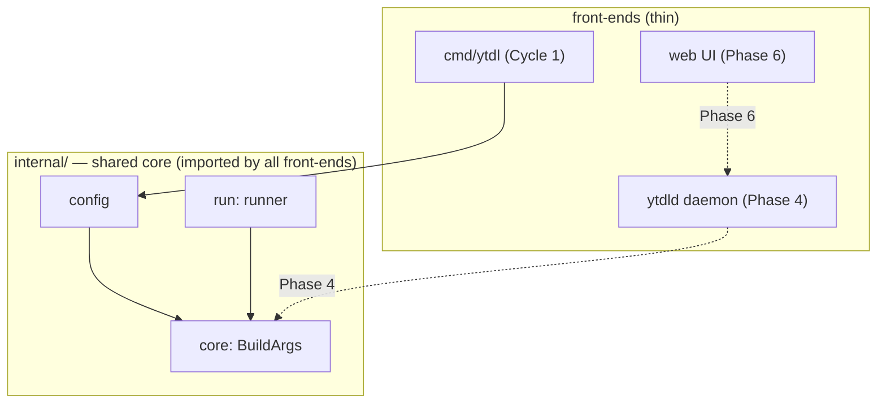

# ADR-0004 — Go engine package layout: reusable `internal/` core

- **Status:** accepted
- **Date:** 2026-07-22
- **Context:** [ADR-0003](../../foundation/decisions/0003-engine-language-go.md), [design-cycle1-core.md](../design/cycle1-core.md),
  [roadmap.md](../../roadmap.md) (Cycle 1)
- **Refines:** [ADR-0003](../../foundation/decisions/0003-engine-language-go.md) — it settled the language (Go)
  and the "one engine, two front-ends" shape; this ADR settles how the Go code is
  physically organised so that shape actually holds.

## Context

ADR-0003 mandates a single shared core (config, job spec, yt-dlp arg builder,
runner) with the CLI, the queue daemon (`ytdld`, Phase 4) and the web UI (Phase 6)
as thin front-ends over it. Cycle 1 writes the first front-end (the CLI) and the
core. The layout question is where the core lives.

A Go `package main` cannot be imported by other packages. If the arg builder — the
fragile metadata pipeline, the "crown jewel" — lived in `package main` under
`cmd/ytdl/`, the later daemon and web server would have to either:

- **duplicate** the builder (two sources of truth for the exact thing ADR-0003
  insists must have one), or
- **shell out** to the CLI binary (which makes the Go CLI a redundant wrapper).

Both are the outcomes ADR-0003 explicitly rejects. The input design sketch in
`golden-test-design.md` placed everything in `package main`; that would need a
disruptive move the moment Phase 4 starts.

## Decision

Put the shared core in importable **`internal/`** packages, with a thin
`cmd/ytdl/main.go` that only wires them together. Standard library only; module path
`github.com/alergyonthestage/ytdl`.

- `internal/core` — pure `BuildArgs(Options) []string` and helpers; no I/O, no exec;
  golden-tested.
- `internal/config` — `Settings`, `Defaults`, `Resolve` (precedence seam).
- `internal/cli` — hand-written parser, verbatim messages, dispatch.
- `internal/run` — the runtime layer (exec, temp files, `.log`, background detach).
- `cmd/ytdl/main.go` — parse → resolve → dependency check → dispatch; owns exit codes.

`internal/` (not `pkg/`) because this is a closed, PolyForm-Strict project with no
third-party consumer; `internal/` documents that the core is not a public API while
still being importable across the module.

## Alternatives considered

- **Everything in `package main` under `cmd/ytdl/`** — rejected. Simplest for a
  CLI-only phase, but not importable by the Phase-4/6 front-ends, forcing duplication
  of the crown jewel or a pointless shell-out. Directly contradicts ADR-0003.
- **Public `pkg/` API** — rejected. Commits to API stability for a consumer that does
  not exist; the project is closed-source under a restrictive licence.

## Consequences

- The Phase-4 daemon and Phase-6 web server import the same `internal/core.BuildArgs`
  and `internal/run` — one source of truth for the metadata pipeline, as ADR-0003
  requires.
- Golden tests live in `internal/core/testdata/` next to the builder they check
  (superseding the `cmd/ytdl/testdata` location sketched in `golden-test-design.md`).
- Slightly more structure than a CLI-only tool strictly needs today; the cost is
  trivial and paid once.
