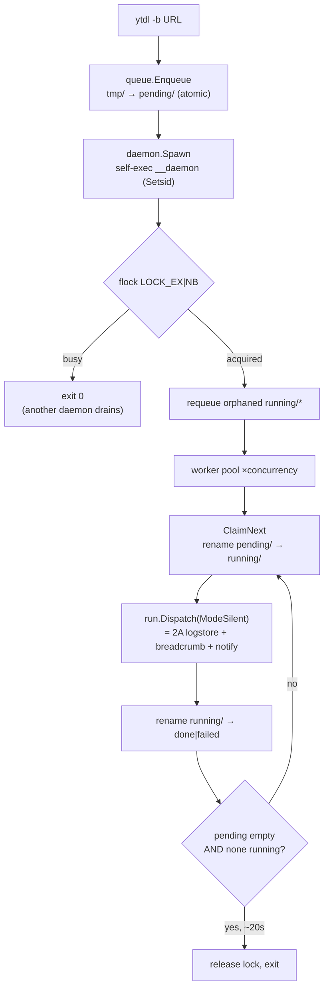

# ADR-0007 — Cycle 2B-core: filesystem queue + on-demand `ytdld` daemon

- **Status:** accepted
- **Date:** 2026-07-23
- **Context:** [roadmap.md](../../roadmap.md) (Phase 4, items 4.5–4.7), [improvements.md](../../improvements.md)
  (U5 queue), [ADR-0003](../../foundation/decisions/0003-engine-language-go.md) / [ADR-0004](0004-go-engine-package-layout.md)
  (one core, thin front-ends; the daemon is `ytdld`), [ADR-0006](0006-cycle2a-logs-breadcrumbs-notifications.md)
  (the 2A seams this cycle reuses)
- **Scope:** Cycle 2B-**core** — the substantial half of Phase 4's queue work.
  `cancel`/`retry` (4.7 tail), Phase-5 hardening (retries/backoff, rate-limit) and
  the broader test pass are **deferred to Cycle 2B-plus** and are **not** covered
  here. The spool layout below is designed so `cancel`/`retry` become pure `mv`
  transitions later, with no rework.

## Context

Cycle 1 reached byte-exact argv parity; Cycle 2A added the runtime-layer log
store, breadcrumbs and notifications, all off the golden path. The remaining
Phase-4 item is **U5**: today `-b` detaches an unbounded number of `Setsid`
children (`run.runBackground`) — five `ytdl -b` invocations start five
simultaneous downloads, with no queue, no concurrency cap, and no way to inspect
what is running. The roadmap (4.5–4.7) calls for a real filesystem-spooled queue
drained by an `ytdld` daemon under a bounded concurrency cap, with
`ytdl queue`/`status` inspection.

The hard constraint is unchanged: `core.BuildArgs` and the golden references stay
**byte-for-byte identical**. Queued downloads must run through the *same* builder,
so the queue is a runtime-layer concern only.

## Decision

Two new leaf packages (`internal/queue`, `internal/daemon`) plus a thin CLI
dispatch layer and one config key. `internal/core` is untouched; queued jobs
execute via the existing `run.Dispatch(…, ModeSilent)`, so they inherit the 2A
log store, breadcrumb and notification wiring for free.

### 1. Filesystem spool, lock-free (maildir-style)

Under `${XDG_STATE_HOME:-~/.local/state}/ytdl/queue/` (beside `logs/`):

```
queue/
├── tmp/       staging — a job is written here, then os.Rename'd into pending/
├── pending/   <enqueuedNanos>-<hash8>.json   (FIFO by name; hash = Hash(NormalizeURL(URL)))
├── running/   claimed jobs
├── done/      terminal: succeeded
├── failed/    terminal: failed
└── lock       the daemon's exclusive flock
```

All state transitions are **atomic `os.Rename`** within one filesystem, no locks:

- **publish:** write to `tmp/`, then rename into `pending/` — a reader never sees a
  partial file;
- **claim:** `rename(pending/X → running/X)`; concurrent workers racing for the
  same file — exactly one wins, the losers get `ENOENT` and move on;
- **finish:** `rename(running/X → done/X | failed/X)`;
- **(2B-plus) retry:** `rename(failed/X → pending/X)`; **cancel:**
  `rename(pending/X → failed/X)` (a running cancel additionally signals the child).

### 2. Job record — settings frozen at enqueue

```go
type Job struct {
    URL        string
    Playlist   bool
    Settings   config.Settings  // resolved snapshot at enqueue time
    EnqueuedAt time.Time
    // 2B-plus: Attempts int, LastError string
}
```

Serialized as JSON (stdlib). The **resolved settings are snapshotted at enqueue**,
so a later config edit does not retroactively change queued jobs. On claim the
daemon rebuilds `core.Options{Mode: ModeSilent, URL, Settings, Playlist}` and
calls `run.Dispatch(o, io.Discard, io.Discard)`.

### 3. On-demand daemon — the same `ytdl` binary, not a second executable

A Gate-B decision: the daemon is `ytdl` self-exec'd into a reserved internal
`__daemon` subcommand (the pattern `run.runBackground` already uses), **not** a
separate `cmd/ytdld` binary. This keeps `install.sh` and `release.yml` unchanged
in 2B-core; the split into `cmd/ytdld` is deferred to Cycle 3, when the web GUI
needs a genuinely long-lived service. ADR-0003 names `ytdld` as a *role*; here
that role lives inside `ytdl`.

Lifecycle (`daemon.Serve`):

1. `flock(lock, LOCK_EX|LOCK_NB)`. If busy → exit 0 (another daemon is draining).
2. **Crash recovery:** holding the exclusive lock proves no other daemon runs, so
   requeue any orphaned `running/*` back to `pending/` (a previous daemon died
   mid-download).
3. A worker pool of `concurrency` goroutines: each `ClaimNext` → `run.Dispatch` →
   `MarkDone`/`MarkFailed`, oldest-first.
4. **Idle-exit:** when `pending` is empty and nothing is `running`, poll ~1 s; after
   ~20 s of continuous emptiness, a final re-scan, then release the lock and exit.

`-b`'s new flow: resolve `Options` → `queue.Enqueue(job)` → `daemon.Spawn()`
(self-exec `os.Executable() __daemon`, `Setsid` + `/dev/null` + `Release`) → print
`▸ Accodato …`. `Spawn` is idempotent: a duplicate daemon exits immediately on the
failed `flock`.

### 4. Idle-exit race — try-lock + poll, residual window documented

A Gate-B decision: use the **non-blocking** `flock` + poll strategy, not a blocking
`flock`. There is a theoretical window (a job enqueued in the microseconds between
the daemon's final empty scan and its lock release) in which a job could sit
undrained. It is closed in practice by the final re-scan and by **recovery on the
next invocation**: any later `ytdl -b` — and `ytdl queue`, which re-spawns a
daemon (via the same idempotent `Spawn`, gated on an `IsRunning` liveness probe)
whenever it sees un-terminal work but no live daemon — drains the leftovers. For a
single-user tool this is acceptable; the blocking-`flock` alternative (excess
daemons parking on the lock until the incumbent exits) was rejected as needless
process churn on bursty enqueues.

### 5. Concurrency

One config key, `concurrency`: an integer ≥ 1, or the literal `unlimited`.
**Default 3.** A fixed pool of N goroutines is the hard cap; `unlimited` runs one
goroutine per job (allowed but discouraged — it reintroduces today's unbounded
behaviour). Like every 2A key, `concurrency` is **not read by `core`**, so it
cannot affect the argv or the goldens.

### 6. CLI surface

`realMain` gains a dispatch level *before* the flag parser: if `args[0]` is a
reserved keyword (`queue`, `status`, or the hidden `__daemon`) it routes to the
subcommand; otherwise the existing download parser runs unchanged (a URL never
collides with these keywords).

- `ytdl queue [--watch]` — list `pending` + `running` (and recent `done`/`failed`);
  `--watch` redraws every ~1 s. Reads are lock-free (`ReadDir` + JSON).
- `ytdl status` — a counts summary plus whether a daemon is active.
- `__daemon` — hidden entry (absent from `--help`), invoked only by the self-exec.

The old `-b` help/message text pointing at `<titolo>.log` (stale since the 2A
breadcrumb rename) is corrected as part of rewriting `-b`.



## Alternatives considered

- **Separate `cmd/ytdld` binary** — rejected for 2B-core. More faithful to
  ADR-0003's letter, but forces `install.sh` (provisioning + checksum) and
  `release.yml` (second cross-compile) changes now, widening the distribution
  surface before the GUI needs it. Reversible: split in Cycle 3.
- **Blocking `flock` for the daemon** — rejected. Fully closes the idle-exit race
  but parks surplus daemons on the lock during bursty enqueues; the try-lock +
  final-rescan + next-invocation recovery is simpler and good enough for one user.
- **launchd LaunchAgent (always-on daemon)** — rejected for now. A real service is
  premature before the GUI; it adds a plist to the installer and an always-running
  process. Revisit in Cycle 3. **Resolved by [ADR-0008](0008-daemon-lifecycle.md):
  no always-on service — the daemon is long-lived but session-scoped (alive while a
  GUI client is connected OR the queue has work; exits when both are false).**
- **A locked/`declare -A`-style index file instead of maildir renames** — rejected.
  Atomic `rename` on one filesystem is the simplest correct primitive; an index
  file reintroduces the locking the spool exists to avoid.
- **Re-resolving settings when the daemon runs a job** — rejected. Freezing at
  enqueue is predictable (a queued job behaves as it did when you queued it) and
  avoids a config edit silently changing in-flight work.

## Consequences

- **Parity preserved.** `internal/core` is byte-unchanged vs. `main`; queued jobs
  use the same `BuildArgs` via `ModeSilent`. Goldens pass untouched.
- **Behaviour change from Cycle 2A.** `-b` no longer detaches an unbounded child;
  it enqueues, and the daemon runs it under the concurrency cap. The stale
  `<titolo>.log` copy is corrected.
- **2A reuse.** Queued downloads get the central log store, failure breadcrumb and
  completion notification for free through `run.Dispatch(ModeSilent)`;
  `NormalizeURL`/`Hash` key the spool filenames.
- **Seams and deferrals for 2B-plus.** `cancel`/`retry` are already just `mv`
  transitions on the spool; Phase-5 retry/backoff adds `Attempts`/`LastError` to
  `Job`. Explicitly deferred to 2B-plus: a **per-job execution timeout** (the pool
  bounds parallelism, not stall detection — a hung `yt-dlp` holds a concurrency
  slot until it returns; distinguishing "hung" from "legitimately long download"
  needs care, so it belongs with the Phase-5 retry/rate-limit work); a **daemon
  logging/diagnostics seam** (today the daemon is silent by design, so a persistent
  spool error is invisible — it now idle-exits rather than wedging, but is not
  surfaced); and **removing the now-unused `core.ReExecArgs` + the three
  `background-*` goldens** (retained here so `internal/core` stays byte-identical to
  `main`, preserving the parity gate — the runtime no longer re-execs for `-b`).
- **Platform.** `flock` and `Setsid` are POSIX; the Linux dev container and CI
  exercise the queue/daemon end to end (notifications no-op there, as in 2A).
- **Docs (on close, Phase 5).** The roadmap will mark 4.5–4.6 and the
  `queue`/`status` half of 4.7 done for 2B-core, and `improvements.md` U5 will
  record the on-demand daemon shape.
