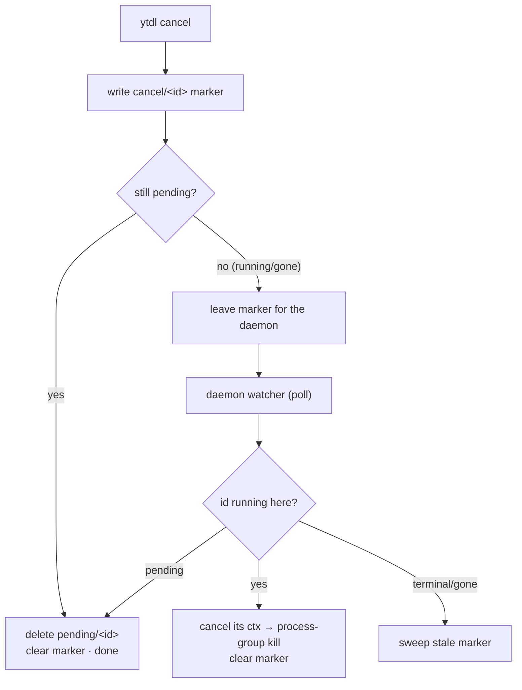
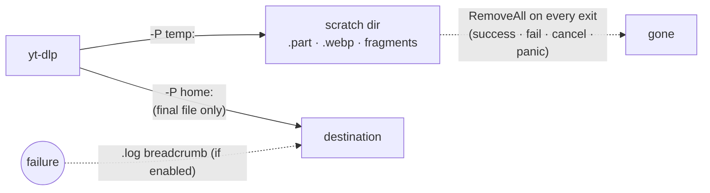

# ADR-0011 — Cycle 2B-plus: cancel/retry, per-job timeout, no-residue downloads

- **Status:** accepted
- **Date:** 2026-07-24
- **Context:** [roadmap.md](../../roadmap.md) (Phase 4 item 4.7 tail; Phase 5 hardening),
  [ADR-0007](0007-cycle2b-queue-daemon.md) (the spool + on-demand daemon this cycle
  completes; the seams/deferrals it named), [ADR-0008](0008-daemon-lifecycle.md)
  (the session-scoped daemon lifetime this must not break),
  [ADR-0010](../../ux/decisions/0010-cycle3-web-gui.md) (the GUI, which stays read-only this cycle)
- **Scope:** Cycle 2B-plus — the queue-completion + first-hardening slice. Delivers
  `cancel`/`retry`, a per-job execution timeout, a daemon diagnostics seam, and a
  "no residue in the destination" guarantee. **Deferred to a dedicated Phase-5
  cycle:** automatic retries/backoff (`Attempts`/`NotBefore`), YouTube rate-limit
  handling, and wiring cancel/retry into the web GUI.

## Context

Cycle 2B-core (ADR-0007) shipped the spool and the on-demand `ytdld` daemon and
explicitly deferred four things to "2B-plus": `cancel`/`retry`, a per-job timeout,
a daemon logging seam, and removing the now-dead `core.ReExecArgs` + `background-*`
goldens. The maintainer added one requirement during design: a **failed or
cancelled download must leave no residue** in the destination folder — today a
failure can strand a `.webp` thumbnail, a `.part`, or a pre-conversion file next to
(or instead of) the audio.

The hard constraint from every prior cycle still holds: **`core.BuildArgs` and the
golden references stay byte-for-byte identical**; anything new is runtime-layer,
appended *after* the builder, off the golden path.

## Decisions

### 1. Cancel is a filesystem marker the daemon turns into a kill

`ytdl cancel` runs as a **separate, short-lived process**; the daemon owns the
running yt-dlp child. In headless mode they share only the spool — there is no
socket. So a running-job cancel travels through the filesystem:

- A new `queue/cancel/` directory holds empty **marker** files `cancel/<id>`.
- `ytdl cancel` writes the marker **first** (covering the race where the daemon
  claims the job in the meantime), then tries to delete it if it is still pending.
- The daemon runs a **watcher** goroutine that polls markers every `PollInterval`
  and, for an id it is currently running, cancels that job's `context` (which tears
  the process down — decision 3). A marker for a job that is neither pending nor
  running is a **stale** marker and is swept.

A **pending** cancel is a *delete*, not a move to `failed/`: the job never ran, so
there is nothing to record and no residue to clean. (There is deliberately no
"cancelled" spool state; the distinction lives in the log record, decision 4.)

**A fresh run must not inherit an old marker.** `Retry` (failed→pending) and
`RequeueRunning` (crash recovery) both keep the original id, so a marker that
outlived its run would make the watcher delete the *re-queued* job. Both operations
therefore **clear any marker for the id they move** — the single subtle correctness
point an adversarial review surfaced (a stale marker silently deleting a retried
job, with the CLI reporting success).

### 2. `retry` and `cancel` address jobs by index or id-prefix

`ytdl retry`/`ytdl cancel` with no argument print a **numbered list** (cancel = the
live queue, running-then-pending; retry = the failed jobs). A target that matches
`^[0-9]{1,3}$` is a **1-based index** into that list; anything longer or non-numeric
is a unique **id-prefix**. Spool ids start with a ~20-digit nanosecond stamp, so the
two never collide. `--all` acts on every entry.

The index is a *live snapshot* view: across two separate invocations (list, then
act) it can drift, so the id-prefix is the stable form and is recommended for
scripts. Per-target failures (a TOCTOU `ErrNotExist`, a filesystem error, a marker
that could not be written) are surfaced and make the command exit non-zero, so a
`ytdl retry … || alert` actually fires.

### 3. One cancellable execution path — `context` + process-group kill — serves both cancel and timeout

The daemon builds a per-job `context` and passes it to the runner
(`run.RunQueued(ctx, …)`), which runs yt-dlp under `exec.CommandContext`. Cancelling
that context — by the watcher (an external cancel) or by a `context.WithTimeout`
(the `job_timeout` key) — tears the job down:

- `Setpgid` puts yt-dlp in its **own process group** (so its ffmpeg child is caught
  too); on cancel we SIGTERM the group, then SIGKILL it after a 5 s grace so a
  process ignoring SIGTERM cannot linger holding a file open.
- The exit code is read from `cmd.ProcessState`, **not** the error `cmd.Run()`
  returns: with a custom `Cancel`, os/exec surfaces the context error even when the
  child exited 0, so a job that finishes cleanly *within the grace window* (the
  graceful outcome the grace exists to allow) must still be counted a success.

`job_timeout` defaults to **0 (off)** so a legitimately long download is never
truncated; it is opt-in. The interactive `ytdl -s` stays **non-cancellable** (no
Setpgid, a background context), preserving its pre-2B-plus Ctrl-C behaviour.

### 4. Cancelled/timed-out ≠ failed

A context stop of an unfinished job is not a genuine download failure: the runner
drops **no `.log` breadcrumb** (a user-initiated cancel or a policy timeout should
not litter the destination) and records the job under a distinct mode
(`"cancelled"`/`"timeout"`) so the history still shows what happened. A genuine
yt-dlp failure keeps the breadcrumb, exactly as before.

### 5. No residue — route intermediates to a scratch dir (all download modes)

Every mode that downloads (default, verbose, silent/queued; **not** dry-run) runs in
a per-job scratch directory and removes it on every exit path. yt-dlp writes all
intermediates there and moves only the **final** file to the destination.

The mechanism is subtle and was **verified against real yt-dlp (2026.07.04)**:
`--paths` is *ignored when `-o` is an absolute path* — and `core.BuildArgs`'s `-o`
is absolute (`OutputDir/template`). So `TempRedirectArgs` appends, after the builder
(off the golden path):

- `-o <template>.%(ext)s` — the **same** template made **relative**, which overrides
  the absolute `-o` (yt-dlp is last-wins for the default output type) so that
  `--paths` takes effect. It is stripped of any leading `/` defensively (an
  absolute `name_template` would otherwise re-break the redirect).
- `-P home:<OutputDir>` — the final file still lands in the destination, identical
  to the original absolute `-o`, so `after_move`/parity are unchanged.
- `-P temp:<scratchDir>` — every intermediate (`.part`, fragments, the embed
  thumbnail, pre-conversion audio) goes here.

The destination therefore only ever holds the final file (success) or the `.log`
breadcrumb (genuine failure) — never a stray intermediate.

### 6. Daemon diagnostics log

The daemon runs detached with `/dev/null` stdio, so ADR-0007's deferred concerns
(persistent spool errors, cancel/timeout/panic kills, orphan recovery) were
invisible. A best-effort, size-capped append log at
`${XDG_STATE_HOME:-~/.local/state}/ytdl/daemon.log` records them. It never affects
draining (a log failure is swallowed); `ytdl status` points at it once it exists.

### 7. Core cleanup

`core.ReExecArgs` and the three `background-*` goldens (dead since `-b` began
enqueuing in 2B-core, kept then only to hold `internal/core` byte-identical to
`main`) are removed. This is the one **deliberate** `internal/core` change ADR-0007
sanctioned; `BuildArgs` and every remaining golden are byte-unchanged, so the parity
gate for the download modes still holds.

## Alternatives considered

- **Post-hoc residue sweep** (scan the destination for known extensions after a
  failure) — rejected. It is heuristic (hard to key precisely to the job, risks
  deleting the user's files) and *chases* residue rather than preventing it. The
  temp redirection guarantees the destination never sees an intermediate.
- **Changing `core.BuildArgs`'s `-o` to relative + `-P home:`** (the "clean" way to
  make `--paths` work) — rejected. It would change the crown-jewel argv and break
  the golden parity gate. Appending a relative `-o` override keeps the builder
  byte-identical while producing the identical final file.
- **A blocking control socket / RPC for cancel** instead of filesystem markers —
  rejected. The headless daemon opens no socket by design (ADR-0010); the spool is
  already the single shared state, and a marker is the smallest addition that keeps
  it so.
- **Cancel/timeout as a spool `cancelled/` state** — rejected. A pending cancel that
  never ran is a delete (nothing to keep); a running cancel ends in `failed/` with a
  distinct *log* mode. A fifth spool dir would add churn for no queue-state benefit.
- **`launchd`-style always-on daemon to guarantee a cancel is serviced** — out of
  scope and rejected by [ADR-0008](0008-daemon-lifecycle.md); a running job always
  has a live daemon, which is exactly when a running-cancel needs servicing.
- **Automatic retry/backoff + rate-limit handling now** — deferred to a dedicated
  Phase-5 cycle. It is the riskiest, most design-heavy part (distinguishing
  transient from permanent failures) and is cleanly separable from manual
  cancel/retry.

## Consequences

- **Parity preserved.** `internal/core` changes only by removing `ReExecArgs` and
  adding the runtime-support `TempRedirectArgs`; `BuildArgs` and the goldens for the
  download modes are byte-unchanged.
- **The GUI stays read-only** this cycle (ADR-0010's deferral stands). `cancel`/
  `retry` are CLI-only; wiring them into the web UI is a later, small follow-up
  (the spool primitives and the daemon watcher already exist). `job_timeout` has no
  GUI control yet, so the settings editor preserves it across a save rather than
  resetting it.
- **Lifetime unchanged.** The watcher lives for the drain and shuts down with it;
  ADR-0008's "alive while work OR a GUI client" test is untouched.
- **Accepted residual risk.** The escalation SIGKILL is keyed by process-group id;
  a pgid could in principle be reused in the sub-microsecond window between the
  child being reaped and the escalation timer being disarmed. The timer is stopped
  on reap and guarded by an atomic flag, narrowing this to a few instructions; fully
  closing it needs `pidfd` (Linux ≥5.3), which the macOS target lacks, so it is
  documented rather than closed. The cross-invocation index race (§2) is likewise
  inherent to any numbered-list UX and mitigated by the stable id-prefix.
- **Platform.** `Setpgid`, process-group signals and `flock` are POSIX; the Linux
  dev container and CI exercise cancel/timeout/process-group teardown end to end.
- **Docs (on close).** The roadmap marks 4.7 (cancel/retry) done and records the
  Phase-5 remainder (auto-retry/backoff, rate-limit) as a dedicated cycle;
  `cli-reference.md` and the Italian usage guide document the new commands.
