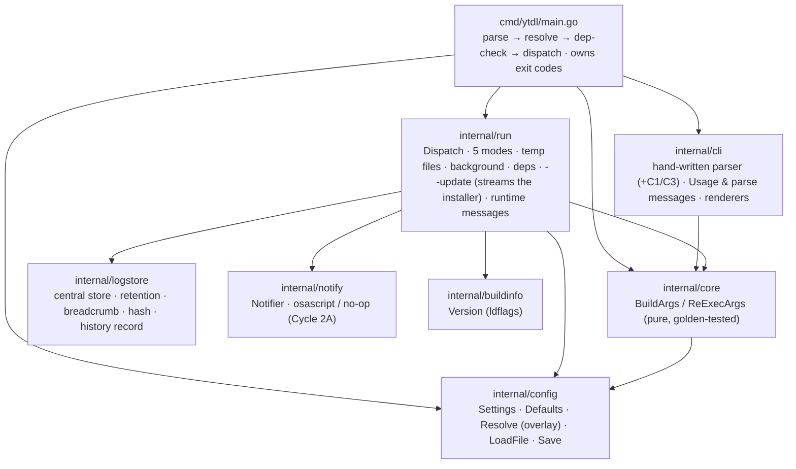
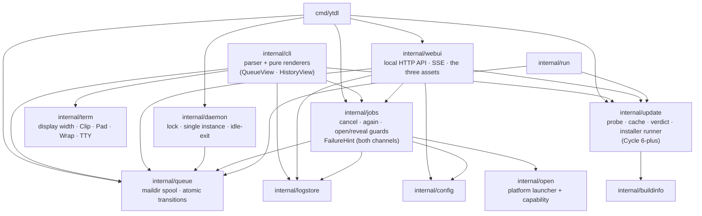

# ytdl — Go Engine Architecture (as-built)

Status: **as-built**. Written for Cycle 1 (Session 3, 2026-07-22); the package
layout below is current as of Cycle 5's closing (2026-08-04). Describes the compiled Go
`ytdl` that supersedes the Bash script at parity. The Bash tool's as-built design
is in [2026-07-21-code-bash-as-built.md](../analysis/2026-07-21-code-bash-as-built.md) (still the golden **reference**); the
exact behaviour this engine reproduces is [go-port-parity-contract.md](go-port-parity-contract.md).
Decisions: [ADR-0003](../../foundation/decisions/0003-engine-language-go.md) (Go),
[ADR-0004](../decisions/0004-go-engine-package-layout.md) (layout),
[ADR-0005](../../foundation/decisions/0005-macos-floor-and-single-engine.md) (10.15 floor).

## One engine, thin front-ends

The download logic — the fragile metadata pipeline that builds yt-dlp's argument
vector — lives once in an importable `internal/` core. The Cycle-1 CLI is the first
front-end; the Phase-4 daemon (`ytdld`) and Phase-6 web UI import the **same**
`core.BuildArgs`, never duplicating or shelling out to it (ADR-0003/0004).

Module `github.com/alergyonthestage/ytdl`, **Go 1.22+, standard library only,
`CGO_ENABLED=0`** (static binary).

## Package layout & dependency direction

Two diagrams: the Cycle-1 spine, then what the later cycles added around it.



The front-ends added since (queue daemon, Cycle 2B; web GUI, Cycle 3; the shared
actions and the CLI's task-oriented surface, Cycles 4–5) hang off the same core:



**`internal/daemon` has no edge to `internal/update`, and that is the point.** The
daemon needs the update capability — it keeps itself alive while an installer of
its own is running (ADR-0008), and it serves the GUI's update routes — but it
takes **all of it by injection** from `cmd/ytdl`: `daemon.Config.LiveClients` is a
composed predicate, and `webui.Updater` is an interface the composition root
implements. That is what let Cycle 6-plus add a whole capability with
`git diff main -- internal/daemon/` still empty.

`internal/jobs` is the seam that keeps the two channels from drifting: whatever
both of them do **to a record** lives there once. That is why the failure-hint
catalogue is in it rather than in either front-end — the GUI and the CLI show the
same remedy because they call the same function, not because two authors kept two
tables in step (gate-C finding G8). The `cli → jobs` edge exists for exactly that;
nothing in `jobs` imports `cli`, so there is no cycle.

- **`internal/config`** (leaf) — the 20-key `Settings` (9 at Cycle 1; the log/notify
  keys arrived in 2A, `concurrency` in 2B, `job_timeout` in 2B-plus,
  `open_folder_on_done` in 5 and `update_check` in 6-plus), `Defaults()`, `Resolve()` (the
  per-field overlay: flag > env > session > config file > default), and `LoadFile()`
  (the tolerant `key=value` parser — **parse, never `source`**). `ConfigPath()` is
  `${XDG_CONFIG_HOME:-~/.config}/ytdl/config`.
- **`internal/core`** — `BuildArgs(Options)` (the crown jewel: pure, no I/O, no exec)
  and `ReExecArgs` for background. Golden-tested for byte-exact argv parity.
- **`internal/cli`** — `Parse()` mirrors the Bash `while/case` (mode priority
  dry-run > background > verbose > silent > default), plus `Usage` and parse-error text.
- **`internal/run`** — the runtime the goldens don't cover: `Dispatch`, the five mode
  behaviours, temp files, native background detach (`Setsid` + `/dev/null`), PATH
  prepend, dependency check, `--update`, and all runtime user-facing
  strings. In Cycle 2A it also records every job to the central store, drops/cleans
  the in-destination failure breadcrumb, and fires completion notifications. Since
  Cycle 6-plus it **resolves the tools it execs through `update.ToolPath`** — our
  own copy under `~/.local/bin` when it is there, else `$PATH` — and appends
  `--ffmpeg-location` **after** `core.BuildArgs`, only for a copy that is ours
  (ADR-0016 §14.3). Rendering `--version` moved out to `internal/cli`
  (`RenderVersion`), which is where the pure renderers live; `run.Update()` — the
  streamed `curl … | bash` — stayed.
- **`internal/logstore`** (leaf, Cycle 2A) — the central log store + age retention
  (`Record`/`Prune`), the in-destination failure breadcrumb (`WriteBreadcrumb`/
  `RemoveBreadcrumb`, keyed by `Hash(NormalizeURL(url))`), and per-item playlist
  reconciliation. All I/O is best-effort; it is off the golden argv path.
- **`internal/notify`** (leaf, Cycle 2A) — the completion-notification `Notifier`
  abstraction: an `osascript` backend on macOS, a no-op elsewhere (so CI and the
  Linux container exercise the same path). Best-effort, timeout-bounded.
- **`internal/queue`** (Cycle 2B) — the filesystem spool under
  `~/.local/state/ytdl/queue/{pending,running,done,failed}/`, with atomic `mv`
  state transitions (maildir-style, no locks). The spool *is* the state, so both
  channels inspect it directly. A job carries its **resolved settings**, frozen at
  enqueue — which is what lets both queue views state where it will land.
- **`internal/daemon`** (Cycle 2B) — the on-demand drainer: an exclusive `flock`
  for single-instance, draining under the concurrency cap, idle-exiting when the
  queue empties **and** `LiveClients` says nothing needs it (ADR-0008).
  **Untouched since Cycle 2B**, like `core` — Cycle 6-plus added a third
  keep-alive clause to that rule *without* touching this package, by composing the
  predicate it is handed in `cmd/ytdl`.
- **`internal/jobs`** (Cycle 5) — what both channels do *to a record*: cancel,
  "riscarica", the open/reveal guards (a record id, never a path), and the
  render-time failure-hint catalogue. Its existence is the answer to "the GUI and
  the CLI disagree about what a verb means".
- **`internal/open`** (Cycle 5) — the only place ytdl invokes the desktop (`open`
  / `xdg-open`), advertised as a **capability** so no dead control is rendered.
- **`internal/webui`** (Cycle 3, extended in Cycle 5) — the loopback HTTP API, the
  SSE stream and the three embedded assets. One document, hash routing, no reload:
  an open SSE connection is the daemon's "GUI connected" clause.
- **`internal/term`** — display-width arithmetic for a terminal that must not
  wrap: `DisplayWidth`, `Clip` (cut a title), `Pad` (align a column) and `Wrap`
  (never cut an instruction), plus TTY/`NO_COLOR` detection.
- **`internal/update`** (near-leaf, Cycle 6-plus) — detection, caching and
  application of an update ([ADR-0016](../../distribution/decisions/0016-cycle6plus-update-path.md)).
  It imports **`internal/buildinfo` and the standard library, nothing else**: the
  state dir arrives as a parameter, never resolved here, which is what keeps it
  injectable into the daemon. Four concerns, one per file group:
  - **probe** (`probe.go`, `parse.go`) — `LatestTag` reads the `302` that
    `github.com/<slug>/releases/latest` answers with; `FetchPin` reads `deps.conf`
    from `raw.githubusercontent.com`. Both comparisons are **string equality**, not
    version ordering, and the probe **tolerates an unknown `deps.conf` key** while
    `install.sh` refuses one (ADR-0016 §14.2).
  - **verdict** (`update.go`) — `Verdict`, and everything a surface asks of it
    *derived* rather than stored: `Known`, `Available`, `Changes`, `ChangedYtdl`,
    `IsDev`. `Changes` reports what **differs**, never what is newer, so a rollback
    reads correctly.
  - **cache** (`cache.go`, `refresh.go`) — `Load`/`Save` (atomic), `DefaultTTL`
    (24 h), `RefreshBudget` (30 s), `RefreshAsync`. Every surface reads the cache;
    no probe is ever on a path a user waits on.
  - **local facts + runner** (`install.go`, `runner.go`) — `Resolve`/`ToolPath`
    (ours vs `$PATH`), `Dependencies`/`InstalledFrom`, the installer marker, and
    `Runner` with `Start`/`Progress`/`Running`/`OnFinish`. Public API added by the
    review: **`StateAbandoned`** — a run that claims to be running while nothing
    is, **derived at read time and never written** — and **`StaleAfter`** (2 h),
    the clock backstop behind the pid test (ADR-0016 §16.1).
- **`cmd/ytdl`** — wires it together and owns `os.Exit` codes. Since Cycle 6-plus it
  is also where the **handover** lives (`handOver`, `spawnGUIWithToken`,
  `daemonAlive`, `guiUpdater`): composition-root work by ADR-0016's own account,
  which is what keeps `internal/daemon` untouched.

Runtime strings live in `run`, parse strings in `cli` — so `run` does not import
`cli` and there is no cycle (a minor consolidation of the design's `cli/dispatch.go`).

## The parity gate (golden tests)

`core.BuildArgs` is pinned to the Bash reference by **golden tests**:
`internal/core/testdata/*.args` are **NUL-delimited** byte streams (newline can't
represent the empty-string `--replace-in-metadata` argument), captured from a live
run of the real Bash `ytdl` by `tests/harness/capture-goldens.sh` (fake
`yt-dlp`/`ffmpeg`/`nohup` shims + a normalizer). Absent config ⇒ `Defaults()` ⇒
identical argv, so config/precedence is tested separately in `internal/config`, not
via goldens.

Runtime temp-file paths (`--print-to-file … <tempfile>`) are injected into
`Options.TitleFile`/`SavedFile` by the runner and normalized to
`{{TITLEFILE}}`/`{{SAVEDFILE}}` in the goldens, keeping `BuildArgs` pure.

## Build, test, release

```bash
go build ./...
go test ./...                     # add -race in CI/locally
go vet ./... && gofmt -l .        # gofmt output must be empty
go test ./internal/core -update   # regenerate goldens from the Bash ytdl
bash tests/test-installer.sh      # installer logic (pure bash, runs in CI too)
```

Requires a **Go 1.22+ toolchain** (`go.mod`) and nothing else — the engine is
stdlib-only, so there are no modules to fetch and a cold, offline machine still
builds and tests.

**In the cco dev container** the toolchain is baked into a per-project image
(`.cco/Dockerfile`, selected by `docker.image` in `.cco/project.yml`): Go under
`/usr/local/go`, plus `yt-dlp` fetched into `~/.local/bin` by `.cco/setup.sh` —
deliberately not baked, since it is the dependency that breaks when YouTube
changes, and deliberately the **zipapp** rather than the PyInstaller build the
installer ships to macOS ([ADR-0017](../../foundation/decisions/0017-dev-container-oracle.md)).

`go vet` and `gofmt` are instant, and the full suite under `-race` returns in
**~8 s** (2026-08-26, measured twice). It leaves nothing behind: no extraction to
collect and no detached process to reap.

⚠️ **The earlier figures are not a slower machine, they are a different defect.**
The suite was measured at **2 m 24 s – 4 m 26 s** (2026-08-22 and 2026-08-26) with
a near-2× spread nobody could explain, and it filled the container's disk three
times over. Both had one cause: `cmd/ytdl`'s test binary **re-executed the whole
suite**, detached and without bound, so every run competed with copies of itself —
and each copy spawned a real PyInstaller `yt-dlp` that unpacked 78 MB per
invocation and leaked it when the probe's timeout killed it. `TestMain` now refuses
the self-exec, `resumeIfStalled` goes through the `spawnQueueDaemon` seam, and the
zipapp unpacks nothing. See ADR-0017 for the decision and the measurements.

**ffmpeg is deliberately absent** (commented out in the Dockerfile), so
real conversions and end-to-end downloads are still verified on macOS, not here.
If `go version` fails, the image was not rebuilt after a `cco build` of the base —
the build command is in the header of `.cco/Dockerfile`.

Release (`.github/workflows/release.yml`, on a `v*` tag): cross-compiles from Linux,
`CGO_ENABLED=0 GOOS=darwin GOARCH={arm64,amd64}`, `-trimpath`,
`-ldflags "-s -w -X …/internal/buildinfo.Version=$TAG"`, publishes
`ytdl_macos_{arm64,amd64}` + a yt-dlp-format `SHA2-256SUMS`, marked `--latest`.
Versioning starts at **2.0.0**.

## Deliberate divergences from the Bash tool (documented, not bugs)

| # | Behaviour | Where |
|---|---|---|
| C1 | `-f` validated against `mp3\|flac\|m4a\|opus\|wav`; invalid flag → exit 1 (config `format` warns + falls through — the asymmetry) | `cmd/ytdl/main.go` |
| C3 | a second positional URL is rejected, not silently dropped | `internal/cli` |
| C5 | the failure-marker filename is sanitised beyond the Bash `tr '/:' '_'` | `internal/logstore` |
| D1 | with `$HOME` unresolvable a **download** fails fast rather than writing to a CWD-relative dir; `-h`/`-V` stay permissive; an absolute `-o` is honoured | `cmd/ytdl/main.go` |
| D2 | (Cycle 2A) the always-on title-derived `<title>.log` is **replaced** by the central log store (always) + an opt-out in-destination breadcrumb `"<title> — FALLITO.<hash8>.log"`; fixes the M2 title collision and keys auto-cleanup by hash. See [ADR-0006](../decisions/0006-cycle2a-logs-breadcrumbs-notifications.md). | `internal/run`, `internal/logstore` |

New capabilities beyond Bash (config-driven, off the golden path): the config file
itself, the `embed_metadata`/`embed_thumbnail` toggles, and — Cycle 2A — the central
log store, the failure breadcrumb, and completion notifications. None read into
`core.BuildArgs`, so the argv and goldens are unaffected; the per-item playlist
breadcrumb's extra yt-dlp print sinks are appended by the runner *after* `BuildArgs`,
keeping the parity gate intact.

## Parity hazards to preserve (do not "clean up")

- **Two `before_dl` templates.** Silent mode prints `%(artist,creator,uploader)s -
  %(track,title)s` — it **omits** the `xartist`/`xtrack` helpers that the filename
  template and the default-mode `before_dl` include. Encoded as separate branches.
- **`--no-simulate` is mode-specific** — present only in silent + default (`base_args`).
- **No album tag** — `meta_args` writes only `meta_artist`/`meta_title` (parity).
- The Bash `ytdl` stays in the repo as the golden **reference** (retired as a shipped
  tool, kept for `-update` golden regeneration).

## Extension points for Cycle 2+ (backend, phase 4)

- **Config:** the log/notify keys landed in Cycle 2A (`log_dir`,
  `log_retention_days`, `breadcrumb_on_failure`, `notify`, `notify_on`,
  `notify_foreground`, `notify_sound`). Still deferred to Cycle 2B: `concurrency`
  and `open_folder_on_done`. `overwrites`/`archive` stay excluded — they would
  change the yt-dlp argv and break parity.
- **Logs/notify (Cycle 2A, done):** the central store, the failure breadcrumb and
  completion notifications live in `internal/logstore` + `internal/notify`, wired
  through `internal/run`, all off the golden argv path. The central store is the
  history the Cycle 2B queue/daemon will read; `NormalizeURL`/`Hash` give a stable
  job identity.
- **Queue/daemon (Cycle 2B, planned):** the queue + `ytdld` daemon reuse
  `core.BuildArgs` and the `logstore`/`notify` primitives. Background mode's current
  unbounded detach (U5) is superseded by the bounded queue.
- **Session precedence layer** in `Resolve` is present but empty (no-op) today — it is
  the GUI/daemon "per-session output dir" seam, so precedence ordering is already stable.
