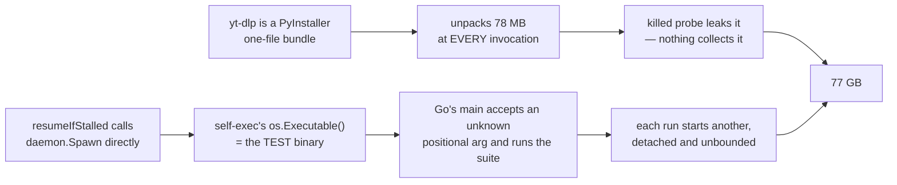

# ADR-0017 — The development container's oracle: yt-dlp as a zipapp, and a test binary that cannot become a daemon

- **Status:** accepted
- **Date:** 2026-08-26
- **Context:** [`DEV-1`](../../roadmap.md#dev-1),
  [the analysis](../../engine/analysis/2026-08-26-code-test-suite-self-replication.md),
  [review 004 § `V25`](../../distribution/reviews/004-cycle6plus-gate-c.md#V25) ·
  [§ `V28`](../../distribution/reviews/004-cycle6plus-gate-c.md#V28),
  [ADR-0005](0005-macos-floor-and-single-engine.md)
- **Bounds, does not supersede:** [ADR-0005](0005-macos-floor-and-single-engine.md)'s
  *"Python is removed from the project"*. That holds for **the product**, which is
  what it was ever about. This ADR states that it never governed the development
  image, and says so explicitly so the next reader does not have to infer it.

## Context

`go test -race ./...` is this project's primary gate. It is named in the project
instructions, it is the oracle the autonomy profile leans on for
`Impl + Test × Feature`, and by 2026-08-26 **it could destroy the session that ran
it**. It had done so four times, the last a documentation review killed mid-edit.
Recovery required rebuilding the container image: once the overlay filled, `rm`
failed from inside and the host could not reach the filesystem either.

A project whose oracle is unusable has no oracle. Everything below follows from
that, and from one thing the record already knew and one it did not:

- **Known** (`V25`): a 30 s `versionTimeout` kills `yt-dlp` before its PyInstaller
  bundle can remove its own `/tmp/_MEI…` extraction. Three per run.
- **Not known**: what turned three into the **1657 extractions and 77 GB** that were
  actually measured. The [analysis](../../engine/analysis/2026-08-26-code-test-suite-self-replication.md)
  found it — the suite re-executed itself, without bound.

Two independent causes, in series:

Each cause is enough to be worth fixing. Together they took the container down.

## Decision

### §1 · The development container provisions yt-dlp as the **zipapp**, not the PyInstaller bundle

`.cco/setup.sh` fetches the plain `yt-dlp` release asset — a Python zipapp — instead
of `yt-dlp_linux*`.

**The object that consumed the disk stops existing.** A one-file PyInstaller bundle
re-extracts on every single invocation, under a fresh random name, and removes the
extraction only on a clean exit; it has no reuse mode, and this was verified rather
than assumed (three runs, three different `_MEI…` names). No `TMPDIR` policy and no
cleanup schedule changes that: relocating the extraction moves the flood, and a
cleanup that requires a working machine is not a remedy, because the failure it
treats is what disables it. The zipapp does not unpack at all.

**This is not a reintroduction of Python to the product.** The installer keeps
shipping the PyInstaller build to macOS, and must: a non-developer's Mac has no
guaranteed interpreter, which is exactly why [ADR-0005](0005-macos-floor-and-single-engine.md)
removed Python. The development image already contains python3, so the container
pays nothing for the form the product cannot use. The zipapp is also not a new idea
here — [ADR-0001](../../distribution/decisions/0001-distribution-channel.md)'s legacy
tier ran yt-dlp by zipimport, and ADR-0005 retired it together with the tier, not on
its merits.

**The shebang is rewritten to the interpreter's absolute path.** Upstream ships
`#!/usr/bin/env python3`, which resolves through `$PATH`; several Go tests empty
`$PATH` deliberately, where an env-shebang would fail for a reason unrelated to what
the test asserts. Only the first line changes and the zip payload is located from the
end of the file, so the artifact survives byte-for-byte otherwise.

**Installed by replacement.** The fetch triggers on absence *or on the wrong form* —
`~/.local/bin` is a host mount that outlives image rebuilds, so an older container's
ELF bundle would otherwise sit there indefinitely. Nothing is ever added alongside.

### §2 · A test binary must not be able to become a daemon

Two layers in `cmd/ytdl`, and both are kept:

1. **`resumeIfStalled` goes through the `spawnQueueDaemon` seam.** It was the only
   spawn call site in the tree without one; the other two are package vars precisely
   so tests can replace them. Production behaviour is unchanged — the var *is*
   `daemon.Spawn`.
2. **`TestMain` refuses the `__daemon` argument outright.** The seam means no test
   should reach a real self-exec; the guard is what holds when a future test reaches
   one by a path nobody anticipated.

The second is not redundancy for its own sake. The hazard was **already known** —
one test held the daemon flock by hand specifically to avoid it — and being known
was not enough, because the guard was per-test and by convention. The cost of the
convention failing again is measured in destroyed sessions, and a backstop that is
never hit is doing its job.

**The guard also measures.** It appends one line per refusal when
`YTDL_TEST_SELFEXEC_LOG` names a file, which answered `DEV-1`'s open question
without ever letting a self-exec succeed. The roadmap's proposed measurement was to
run the suite and count the survivors — that is, to reproduce `V25` in order to
confirm `V25`, which is how the fourth session was lost.

### §3 · The container is not the target platform, and this widens the gap by one axis — deliberately

The container now runs yt-dlp in a **different form** from every user. This is a real
divergence and it is accepted, bounded as follows:

- The tests only ever read `--version`, whose output form is identical (a bare tag,
  one line).
- Real downloads and conversions are not verified in the container at all — it has
  no ffmpeg by design, and gate C on the maintainer's Mac is where that happens.

So the divergence lands on an axis the container **already** did not cover. What it
must not do is drift: if a future need makes the container run real downloads, or
makes the bundle's runtime behaviour part of what is under test, this decision is
back on the table and the design reopens — the alternative below is the one to
revisit.

## Alternatives considered

| Alternative | Why not |
|---|---|
| **`TMPDIR` per test**, cleaned by `testing` | Relocates the extraction; does not stop the replication. The processes keep multiplying and keep loading the machine |
| **`TMPDIR` on a host-reachable bind mount** | Same, plus it moves 77 GB onto the maintainer's Mac. It was the roadmap's leading candidate and it treats the symptom's location, not the cause |
| **A size-capped filesystem for the extractions** | The honest structural cap, and **not reachable**: the session is not root, `mount` is refused, and cco exposes neither tmpfs nor storage quotas in `project.yml` |
| **Cleanup after the suite** (`rm -rf /tmp/_MEI*`) | The status quo ante. It was documented in three places, it was correct, and it was unusable at exactly the moment it was needed |
| **Keep the bundle, fix only the timeout** | Reduces the per-run leak but leaves an object that unpacks 78 MB per invocation, and leaves the multiplier untouched |
| **`pip install yt-dlp`** | The base image's python3 is PEP 668 externally-managed, so `pip3 install --user` refuses; `python3 -m venv` needs a `python3.11-venv` that is not installed. The zipapp needs neither |

## Consequences

- **`go test -race ./...` is a usable gate again**, and the autonomy profile's
  `Impl + Test × Feature` cell rests on something real.
- **The suite is not slow.** It was measured at 2 m 24 s – 4 m 26 s; it now returns
  green in **8 s**. Most of that time was the suite competing with detached copies of
  itself and waiting on 30 s timeouts against a process it was killing.
- **`rm -rf /tmp/_MEI*` stops being part of the workflow**, in the project
  instructions and everywhere else. There is nothing to remove.
- **`V25` and `V28`'s premise changes.** Both were framed around the cost of exec'ing
  and killing the bundle. A probe that answers in ~263 ms and leaks nothing is not
  the thing they described; whether their remaining merit still justifies the work is
  a roadmap question, recorded there rather than silently dropped here.
- **A new obligation:** the container's yt-dlp form is now something a reader could
  mistake for the product's. It is stated in `.cco/setup.sh` at the point of use, in
  this ADR, and on the roadmap.

## Verification

Measured in-container on 2026-08-26, after the change:

| Check | Result |
|---|---|
| 5 probes killed mid-run | **0** residual directories (was 5 × 78 MB) |
| self-execs attempted by one `./cmd/ytdl` run | **0** (was 1 per run, chained without bound) |
| surviving detached test binaries after the suite | **0** |
| `go test -race ./...` | green, **8 s**, twice |
| disk before / after the full suite | 8.7 G / 8.7 G — unchanged |
| `go vet` · `gofmt -l` · `tests/test-installer.sh` | clean · empty · 103/103 |
| parity gate (`git diff main -- internal/core/ internal/daemon/`) | empty |

The regression test reproduces the exact call `daemon.spawn` makes and asserts both
properties that separate a refusal from a second suite: the guard was taken, and
nothing was printed. It carries its own recursion guard, so it cannot become the bomb
it tests for if the guard is ever removed.
