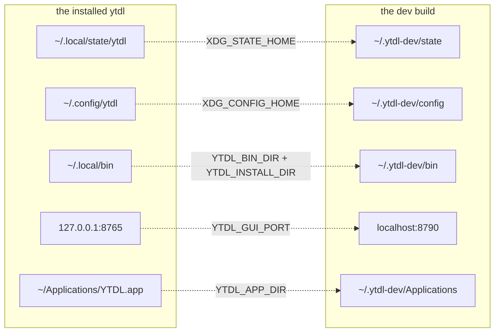

# Running a development build without disturbing the installed one

**Maintainer reference. Not transient** — unlike the gate-C checklist, this
outlives Cycle 6-plus: every future cycle that touches the runtime needs it.

`ytdl` on your `$PATH` is the **released** build. A development build is a
different binary, and running it against your real state would mix the two: the
same queue, the same history, the same config, the same `~/.local/bin` — and,
since Cycle 6-plus, the same update marker and cached verdict. Worse, an
installer run started from a dev build (`ytdl --update`, or the GUI's *Aggiorna*)
**overwrites the real ytdl with the latest release**, silently ending whatever you
were testing.

The seams to separate them already existed; what was missing was writing them
down. Nothing here is a new engine capability.

## The short version

```bash
hack/ytdl-dev.sh build darwin/arm64   # cross-compiles; run it in the container
hack/ytdl-dev.sh seed                 # copy yt-dlp/ffmpeg into the sandbox
hack/ytdl-dev.sh run --version        # run the dev build, isolated
hack/ytdl-dev.sh stop                 # stop the sandbox daemon
hack/ytdl-dev.sh install              # only when testing the update handover
hack/ytdl-dev.sh status               # what is set and what is in the sandbox
hack/ytdl-dev.sh reset                # delete the sandbox; never the real install
```

The sandbox lives at `~/.ytdl-dev` (`YTDL_DEV_HOME` to move it).

### A rebuild does not replace a running daemon

`ytdl gui` starts a daemon only when nothing is already listening
(`cmd/ytdl/main.go`: `if !listening { spawn }`). So rebuilding while a sandbox
GUI is up changes nothing you can see: the old process keeps its inode, keeps
serving, and keeps reporting the **old** version — which reads exactly like a
build that silently failed.

```bash
hack/ytdl-dev.sh stop      # then start it again
```

`status` reports whether one is running, and `build` warns when it finds one.

### Testing the update handover needs `install`

The handover re-execs `os.Executable()`, and `install.sh` replaces
`$YTDL_INSTALL_DIR/ytdl`. Those have to be the **same file**, or the handover
restarts the binary in `tmp/dev/` — the old one — the page never observes a new
version, and it fails after 60 s for a reason unrelated to the code.

`hack/ytdl-dev.sh install` copies the build to `~/.ytdl-dev/bin/ytdl`, which is
what `YTDL_INSTALL_DIR` points at, reproducing a real installation's layout. Run
that copy with the sandbox environment applied:

```bash
hack/ytdl-dev.sh install
eval "$(hack/ytdl-dev.sh env)"
~/.ytdl-dev/bin/ytdl gui
```

`run` deliberately keeps executing the build directory: that is the predictable
thing for ordinary CLI checks, where nothing replaces the binary underneath.

## What is isolated, and by which variable



| Variable | Governs |
|---|---|
| `XDG_STATE_HOME` | the spool, the log store, `update.json`, `update-run.json`, `update.log`, `installed.conf`, the GUI token, `daemon.log`, `launcher.log` |
| `XDG_CONFIG_HOME` | the config file |
| `YTDL_INSTALL_DIR` | where **`install.sh` writes** |
| `YTDL_BIN_DIR` | where **the engine reads** its dependencies |
| `YTDL_OUT_DIR` | where downloads land |
| `YTDL_GUI_PORT` | the GUI's loopback port |
| `YTDL_APP_DIR` | the **parent** of `YTDL.app` — where `install.sh` builds the double-clickable app |
| `YTDL_REPO` · `YTDL_BRANCH` | which repository and branch are probed and installed from |

**`YTDL_APP_DIR` is a sandbox boundary, not a convenience.** The bundle's launcher
resolves `ytdl` from a sidecar file written beside it, so a dev bundle built into
`~/Applications` would carry a sidecar pointing at the sandbox — and the *installed*
app would then start the *dev* engine, or the reverse, depending on which run wrote
last. Pointing the bundle at `$DEV_HOME/Applications` keeps the two apart the same
way the other five variables keep the rest apart.

**The one directory with two names.** `YTDL_INSTALL_DIR` (installer) and
`YTDL_BIN_DIR` (engine) address the same place and must be set to the same value.
Set only one and you get a sandbox that half works: the installer writes where
nothing reads, or the engine reads the real `~/.local/bin` while the installer
replaces it. `hack/ytdl-dev.sh` always sets both; a hand-rolled export list is
where this gets forgotten. Unifying the two names is a candidate for a future
cycle.

**The daemon stays inside.** `internal/daemon`'s `spawn` does not set `cmd.Env`,
so the daemon and the GUI inherit the sandbox. A `ytdl gui` started from the
sandbox is a sandboxed GUI, including the installer it may launch.

## The version stamp is load-bearing

**A build with no `-ldflags` reports `dev`, and a `dev` build is never checked and
never reported stale** (`update.DevVersion`). Every update surface goes inert:
you get `Aggiornamenti: non controllati (build locale)` and conclude, wrongly,
that nothing works.

So always stamp. `hack/ytdl-dev.sh` does it for you, defaulting to
`v0.0.0-dev.<short-sha>` — not the literal `dev`, therefore live, and visibly not
a release wherever a version is displayed. Override with `YTDL_DEV_VERSION`.

| Stamp | Effect |
|---|---|
| *(unstamped)* → `dev` | every update surface inert. Never use it to test this area |
| `v0.0.0-dev.<sha>` (default) | live, and always differs from the released tag — so an update is always "available", which is usually what you want |
| an **older** real version, e.g. `v2.0.9` | the probe reports an update **to ytdl itself**, which is how you reach the banner, the changes table and the handover confirmation |
| the **current** released tag | reaches `sei aggiornato`, the one state the others cannot produce |

The stamp is compared by **string equality**, never parsed or ordered. It only has
to differ. The charset is constrained by `update.validVersion` — letters, digits
and `.` `-` `_` `+` only; anything else is discarded as no answer at all.

## Cross-compiling from the container

You do not need Go on the Mac. `CGO_ENABLED=0` makes the binary static, so the
Linux container produces a real Mach-O, and the repo is a shared mount — what is
built in the container appears in the repo folder on the Mac.

```bash
# in the container
export GIT_CONFIG_COUNT=1 GIT_CONFIG_KEY_0=safe.directory \
       GIT_CONFIG_VALUE_0=/workspace/yt-download
hack/ytdl-dev.sh build darwin/arm64      # or darwin/amd64 on an Intel Mac
```

Output goes to `tmp/dev/ytdl-<goos>-<goarch>`, and `tmp/` is gitignored. `uname -m`
on the Mac tells you which: `arm64` (Apple Silicon) or `x86_64` (→ `amd64`).

If Gatekeeper objects to a binary that arrived through a shared mount:

```bash
xattr -d com.apple.quarantine tmp/dev/ytdl-darwin-arm64
```

## Testing the update path specifically

The update path reaches the network, so two more variables matter — and they
steer the **probe**, `ytdl --update` **and** the GUI's *Aggiorna* alike:

```bash
export YTDL_REPO=owner/repo         # default: alergyonthestage/ytdl
export YTDL_BRANCH=my-branch        # default: main
```

`YTDL_BRANCH` decides where `deps.conf` and `install.sh` are fetched from.
**A branch whose `deps.conf` does not exist makes the pin unanswerable, and every
check then reads `non verificati` for ever** — which is correct behaviour on a
question nobody can answer, and looks exactly like a bug. That is the first thing
to check when the update surface seems dead.

`YTDL_REPO` is how you test against a release you published somewhere harmless: a
fork or scratch repository checks and installs from itself, so nothing you do
there can reach a real installation.

The **host** is deliberately not overridable — `githubBase` and `rawBase` are
package variables with no environment escape. For a tool that updates itself by
executing a downloaded script, keeping the host fixed is worth more than the
convenience of redirecting it at a local server.

### Two GUIs at once: mind the cookie

Cookies **ignore the port** (RFC 6265). The session cookie is set for
`127.0.0.1` with `Path=/`, so a dev GUI on `:8790` and the real GUI on `:8765`
share one cookie jar entry: whichever authenticated last wins, and the other
starts answering `401 … riapri l'interfaccia con ytdl gui`.

`localHost` accepts `localhost` as well as the loopback range, so the clean fix is
to give them different hosts:

- real GUI → `http://127.0.0.1:8765/`
- dev GUI → `http://localhost:8790/`

Different cookie domains, no collision. A private window works too.

## What the sandbox does *not* isolate

Say so rather than assume it:

- **Notifications** (`osascript`) and **open/reveal** reach the real desktop. Both
  are harmless, but a dev build's notification looks exactly like a real one.
- **`/tmp`** is shared. yt-dlp is a PyInstaller bundle and extracts itself there
  on every run; those directories accumulate and are worth clearing occasionally
  (`find /tmp -maxdepth 1 -name '_MEI*' -type d`).
- **The real `~/.local/bin`** is still on `$PATH`. The engine resolves through
  `YTDL_BIN_DIR` first, so it uses the sandbox copy — but anything you type
  yourself in that shell (`yt-dlp --version`) is the real one.
- **`git`**: the sandbox is not a worktree. Building from a dirty tree stamps a
  sha that does not describe what you built.

## Checklist before believing a result

1. `hack/ytdl-dev.sh status` — is the sandbox where you think it is?
2. `hack/ytdl-dev.sh run -- --version` — does it print **four** lines (ytdl,
   yt-dlp, ffmpeg, `Aggiornamenti:`)? Two lines means you ran the released build.
3. Is the stamp **not** `dev`?
4. If the update surface looks dead: is `YTDL_BRANCH` pointing at a branch that
   actually carries `deps.conf`?
