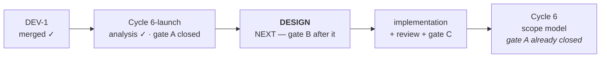

# Handoff — `Cycle 6-launch` has its gate A closed and resumes at **design**

**Ephemeral**, like the nine before it: deleted when the next session writes its own.
Nothing is decided here. Everything normative is in [roadmap.md](roadmap.md), the
ADRs, [ux-principles.md](ux/design/ux-principles.md) and the rules in
`.cco/claude/rules/`.

## Where the project is

| | |
|---|---|
| phase | **Design** — analysis approved, implementation not started |
| branch | **`docs/cycle6launch/gate-a`**, 4 commits above `main`, **not merged** |
| `main` | `8a40b31`, `main == origin/main`, clean |
| code touched | **none.** This session wrote documents only |
| suite | not re-run — nothing was compiled. It was green in 8 s at `main` |

## ✅ The suite is safe — the old warning stays withdrawn

`go test -race ./...` runs in ~8 s and leaves nothing behind. `rm -rf /tmp/_MEI*` is
**not** part of any workflow; there is nothing left to remove, so do not reintroduce
it ([ADR-0017](foundation/decisions/0017-dev-container-oracle.md)).

## What this session did, in one paragraph

Closed gate A of `Cycle 6-launch`. The cycle rested on an unverified claim —
that a bundle generated on the machine carries no quarantine attribute — and the
container cannot evaluate it. Three candidate bundles were built and measured on the
maintainer's Mac. **The claim holds**, and the artefact is settled:
[ADR-0018](distribution/decisions/0018-desktop-launcher-app-bundle.md). The same
verification found a defect nobody was looking for — the GUI's first launch fails
silently about a quarter of the time — and the maintainer put it **in scope**. Every
measurement is in the
[analysis](distribution/analysis/2026-08-26-tech-choice-desktop-launcher.md).

---

# How to resume

**Read, in this order:** [ADR-0018](distribution/decisions/0018-desktop-launcher-app-bundle.md)
→ [the analysis](distribution/analysis/2026-08-26-tech-choice-desktop-launcher.md)
§6 and §7 → [roadmap § Cycle 6-launch](roadmap.md#cycle-6-launch). Then start the
**design phase**. Do not re-open the artefact question or Gatekeeper: both are ruled,
on measurements, in ADR-0018.

**First concrete action:** branch from `main` as `feat/launch/design` *after* the
merge below is done, and write the design at
`distribution/design/cycle6launch-launcher.md`.

## The four questions the design owes

1. **Which binary fills `Contents/MacOS`.** ADR-0018 fixes the *kind* — a
   linker-signed Mach-O — not which one. Two candidates, both viable:
   - **`ytdl` itself**, with a launch role: no new release asset, no new checksum, no
     new CI step; costs ~9.5 MB duplicated and couples the installer to refreshing it
     whenever `ytdl` changes (which is exactly when it should).
   - **A dedicated launcher**, ~2.2 MB: a second asset to build, checksum, version.

   Two defects of the probe build must not be carried over: it reported
   `Identifier=a.out`, and it was **thin arm64** where `install.sh` already handles
   both architectures for `ytdl`.
2. **The remedy for the cold start.** Candidates and costs are in the analysis §7 D2.
   ⚠️ One of them — making yt-dlp itself cheap on macOS, as ADR-0017 did for the
   container — **reintroduces Python**, which
   [ADR-0005](foundation/decisions/0005-macos-floor-and-single-engine.md) deliberately
   removed. It is listed there so it is rejected in writing rather than on sight.
3. **Installer idempotence.** `install.sh` runs on every *update*, so whatever it does
   to the bundle it does repeatedly. Deleting and recreating churns the Dock entry,
   the Spotlight index and any alias the user made. "Leave it alone when unchanged" is
   the likely answer and must be a decision, not an accident.
4. **A visible failure path.** `runGUICmd` reports its errors on stderr — invisible
   from Finder. The port being taken by another program currently produces a
   double-click that does nothing at all.

## Tasks

| # | Task | Roadmap entry |
|---|---|---|
| 1 | **merge `docs/cycle6launch/gate-a` into `main`** from the Mac (see gates) | `Cycle 6-launch` |
| 2 | design: the four questions above → `distribution/design/cycle6launch-launcher.md` | `Cycle 6-launch` |
| 3 | gate B, then implementation + tests | `Cycle 6-launch` |
| 4 | delete `docs/dev1/close-out` — merged into `main`, deletion deferred by the remote policy | — |

Status lives in the roadmap, not here.

## Gates still open

| Gate | What is suspended | What unblocks it |
|---|---|---|
| **Merge** | `main` does not yet carry gate A's rulings | the maintainer merges `docs/cycle6launch/gate-a` **from the Mac** — `git merge --no-ff`. Docs only, no code, so nothing to re-verify beyond `./hack/check-docs-links.sh` |
| **Push** | `origin` has none of it | a **host step**: this container has no credentials and `gh` is not authenticated. `git push origin main` from the Mac |
| **Gate B** | implementation | the maintainer approves the design document. `Design × Feature` is **`U`** in the profile — not delegable |
| **Gate C** | closing the cycle | the maintainer's hands-on verification. **This cycle needs it more than most** — see below |

### What gate C must carry, and why no oracle here replaces it

Three things were measured as **unknowable** from where this session sat, and each is
recorded in the analysis §9:

- **Spotlight and Launchpad discoverability.** The maintainer's Mac has indexing
  **disabled** (`mdutil -s /` → *Indexing disabled*), so nothing about findability
  was testable. The roadmap's claim that `~/Applications` is indexed does stand —
  other locally created bundles there are in the index — but it was inferred, not
  demonstrated for ours.
- **`osacompile` without developer tooling.** The maintainer's Mac has **Xcode**, so
  it cannot certify a property that depends on Xcode being absent. This is why the
  applet was rejected rather than accepted with a caveat.
- **macOS 26.** The maintainer's Mac is **15.6**. The shell-script bundle that
  *worked* here is [reported to fail on 26](https://github.com/Ryubing/Issues/issues/422);
  ADR-0018 does not depend on that report, but the gap is real and machines update.

## Context the next session would otherwise rediscover

### The cold start, in one place

The daemon takes **~7.5 s** to open its port; `waitForGUI` caps at **10 s**. The cost
is one `yt-dlp --version`, measured at **7.33 s on macOS — warm *and* cold** (7.34 s
then 7.33 s back to back: the PyInstaller bundle re-unpacks every invocation, so
there is no warm path). It is called synchronously by `newGUIUpdater`
(`cmd/ytdl/update.go:66` → `update.Dependencies(stateDir, true)`), and `runDaemon`
calls that **before** `startWebUI`. The same daemon answers in **0.80 s** in this
container, where ADR-0017 replaced yt-dlp with the zipapp.

Two claims in `internal/update` contradict the measurements, **recorded and not
corrected** — analysis does not touch code, so the design or the implementation owes
them:

- `Dependencies`' doc comment states the probe *"is never on a path a user is waiting
  on"*. On the daemon startup path it passes `true`, and that path is one a user is
  waiting on.
- `versionTimeout`'s comment models the cost as cold-vs-warm, warm being *"well under
  a second, ~800 ms measured in the container"*. That describes the container.

`installed.conf` already records `yt_dlp_version`, so the authority to skip the exec
is on disk already. **`T4` is reopened** by this
([roadmap-history](roadmap-history.md)): it was deferred on the premise that its
saving is "milliseconds rather than gigabytes" — measured in the container, on the
zipapp. On the target platform the saving is 7.33 seconds.

### The probe scripts

`scratchpad/gatekeeper-probe/` holds the three probes, the cross-built launcher
binaries and the transcripts. **It is gitignored and belongs to the maintainer** — it
does not travel, which is why every number is reproduced inside the analysis rather
than linked. Delete it freely; `./probe.sh clean` removes what it installed on the
Mac. If the design wants to re-measure, the launcher was cross-built from this
container with `GOOS=darwin GOARCH=arm64` and came out **ad-hoc signed by the Go
linker** — `LC_CODE_SIGNATURE`, blob `0xfade0cc0` — with no Xcode anywhere.

### A method note that earned its place

The first probe reported P1 failing where P2 and P3 succeeded, and the script printed
a verdict blaming P1's shape. **That verdict was wrong**: P2 and P3 were clicked with
the daemon already warm, so they never sat the test P1 failed. A single sample of a
race with a 25% margin decides nothing. The stamps and the captured stderr are what
caught it — a check that records *what happened* survives a wrong conclusion drawn
from it, and one that records only pass/fail does not.

## Debts carried, and they are NOT this cycle

The unscheduled ones are in [improvements.md](improvements.md): `V23`, `V19` and the
seven minors. The Cycle 10 ones — `V26`, `V27`, `V29`, `V22` — are on the roadmap as
that cycle's precondition; **`V27` is a normative debt, not a preference**, and Cycle
10 does not start without it. `T3` stays dropped.

## Container gotchas

- git and `go build` want
  `GIT_CONFIG_COUNT=1 GIT_CONFIG_KEY_0=safe.directory GIT_CONFIG_VALUE_0=/workspace/yt-download`
  on **every** invocation. `hack/check-docs-links.sh` carries its own exception.
  `go build` inside `scratchpad/` also needs `GOFLAGS=-buildvcs=false`.
- No credentials for `origin`: pushes are the maintainer's, from the Mac. `gh` is not
  authenticated here and **not installed on the Mac**.
- `.cco/` is read-only unless the session starts with `--cco-access edit-project`, and
  it **cannot be raised afterwards**.
- **No ffmpeg**, deliberately. Real conversions and the GUI are verified on macOS.
- cco exposes **no tmpfs and no storage quota**, and a session is not root — a
  size-capped filesystem is not obtainable from inside.
- The container **can** cross-compile for macOS, both architectures, and the arm64
  output is ad-hoc signed. That is how the P3 probe was produced.

## Reference documents

- [roadmap.md § Cycle 6-launch](roadmap.md#cycle-6-launch) — status, scope, what the
  design still owes
- [ADR-0018](distribution/decisions/0018-desktop-launcher-app-bundle.md) — the
  rulings of this gate A
- [analysis 2026-08-26](distribution/analysis/2026-08-26-tech-choice-desktop-launcher.md)
  — every measurement, and the two decisions it surfaced
- [ADR-0001](distribution/decisions/0001-distribution-channel.md) — superseded in
  part by ADR-0018, and only where it is now wrong
- [ADR-0017](foundation/decisions/0017-dev-container-oracle.md) — why the container's
  yt-dlp differs from every user's, and what that bounds
- [ADR-0008](engine/decisions/0008-daemon-lifecycle.md) — the daemon's liveness
  clause, which the launcher must not break
