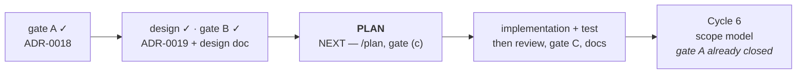

# Handoff — `Cycle 6-launch` has its gate B approved and resumes at **Plan**

**Ephemeral**, like the ten before it: deleted when the next session writes its own.
Nothing is decided here. Everything normative is in [roadmap.md](roadmap.md), the
ADRs, [ux-principles.md](ux/design/ux-principles.md) and the rules in
`.cco/claude/rules/`.

## Where the project is

| | |
|---|---|
| phase | **Plan** — design approved, implementation not started |
| branch | **`feat/launch/design`**, 4 commits above `main`, **not merged** |
| `main` | `8e3cede`, **5 commits ahead of `origin/main`**, clean |
| code touched | **none.** This session wrote documents only |
| suite | re-run here: **14 packages green** under `-race`, installer **103/103**, `gofmt` empty, parity gate empty — but read the ⚠️ below about `go test ./...`'s exit code |

## ⚠️ `go test ./...` now exits non-zero, and it is NOT a regression

`go build ./...`, `go vet ./...` and `go test -race ./...` all exit non-zero in this
container because of **one untracked file**: `scratchpad/gatekeeper-probe/launcher.go`,
the gate-A probe, is a **darwin** program and calls `syscall.Dup2`, which does not
exist on linux. `./...` walks it because it sits inside the module.

**Every real package is green.** The failing line is
`FAIL github.com/alergyonthestage/ytdl/scratchpad/gatekeeper-probe [build failed]`,
and nothing else.

The remedy is to delete `scratchpad/gatekeeper-probe/` — the previous handoff records
that it belongs to the maintainer and can be deleted freely. **This session did not
delete it**: `scratchpad/` is the human's, and the rules forbid an agent removing or
reorganising it unasked. Until then, read past that one line, or scope the run:
`go test -race ./cmd/... ./internal/...`.

## What this session did, in one paragraph

Closed the design phase. The criteria gate was settled first (one design document plus
an ADR), then the design was written, then a **completeness pass** measured every claim
it makes against the code — which found two gaps and corrected them. The maintainer
approved gate B. The two questions [ADR-0018](distribution/decisions/0018-desktop-launcher-app-bundle.md)
had explicitly deferred are now closed in
[ADR-0019](distribution/decisions/0019-launcher-mach-o-and-recorded-versions.md), and
`T4` is closed with them.

---

# How to resume

**Read, in this order:** [ADR-0019](distribution/decisions/0019-launcher-mach-o-and-recorded-versions.md)
→ [the design](distribution/design/cycle6launch-launcher.md), §8 first (the ordered
steps) then §5 (the cold start) → [roadmap § Cycle 6-launch](roadmap.md#cycle-6-launch).
[ADR-0018](distribution/decisions/0018-desktop-launcher-app-bundle.md) and the
[analysis](distribution/analysis/2026-08-26-tech-choice-desktop-launcher.md) are the
layer beneath, needed only if a decision is questioned.

**First concrete action: run `/plan`.** Do **not** start implementing — Plan is a phase
transition with its own gate (objectives, priorities, order). Its input is already
written: design §8 holds **eight ordered steps, each with its own oracle**, and records
that steps **2–3** (the cold-start remedy) and **4–7** (the bundle) are independent of
each other. `/plan` puts them on the roadmap, which is the SSOT for their status.

**Do not re-open**, all three ruled on measurements or approved at a gate:

- the artefact, Gatekeeper, and the name `YTDL` — ADR-0018, measured on hardware;
- which Mach-O, and the cold-start remedy — ADR-0019;
- **the installer's language.** Design §4.7 had marked it *"a question for gate B"*:
  approving the design approved its answer — `install.sh` stays **English**
  throughout, and the Italian lands in the two user guides. It is a one-line change
  if the maintainer ever wants it otherwise.

## Tasks

| # | Task | Roadmap entry |
|---|---|---|
| 1 | **`/plan`** — design §8's eight steps onto the roadmap, then its gate | `Cycle 6-launch` |
| 2 | implementation + test, per the approved design | `Cycle 6-launch` |
| 3 | **merge `feat/launch/design` into `main`** from the Mac (see gates) | `Cycle 6-launch` |
| 4 | delete `docs/cycle6launch/gate-a` — merged, deletion deferred by the remote policy | — |

Status lives in the roadmap, not here.

## Gates still open

| Gate | What is suspended | What unblocks it |
|---|---|---|
| **Plan** | implementation | the maintainer approves the order and priorities that `/plan` produces |
| **Merge** | `main` does not yet carry the design or ADR-0019 | the maintainer merges `feat/launch/design` **from the Mac** — `git merge --no-ff`. Documents only, no code, so `./hack/check-docs-links.sh` is the whole re-verification |
| **Push** | `origin` has none of the last 5 commits on `main` | a **host step**: no credentials here, `gh` is not authenticated. `git push origin main` from the Mac |
| **Gate C** | closing the cycle | the maintainer's hands-on verification on real hardware. This cycle's list grew — see below |

### Why branch cleanup is deferred, measured rather than assumed

`docs/cycle6launch/gate-a` **is** merged: `git merge-base --is-ancestor docs/cycle6launch/gate-a main`
returns true, so deleting it would lose nothing. It stays anyway because `main` is
**5 commits ahead of `origin/main`** and the profile's remote policy holds a local
branch until its work is on the remote (`project-profile.md` §3). **That is correct
behaviour, not a failure** — cleanup always defers by one session here.

## What gate C must carry, and why no oracle here replaces it

Four carried from gate A, and **four this design adds**. The first four are in the
[analysis §9](distribution/analysis/2026-08-26-tech-choice-desktop-launcher.md);
the design's own are in [§9](distribution/design/cycle6launch-launcher.md):

- **Does the alert actually reach the user?** An `osascript` alert whose parent was
  launched by LaunchServices may open behind other windows, or need an `activate`
  first. **The `launcher.log` half does not depend on the answer** — that asymmetry is
  deliberate, and it is why two remedies ship instead of one.
- **Does the Dock tile behave as designed** — appear on launch, leave on exit, no
  *Quit* stranded behind it.
- **Does replacing only the inner binary preserve** the Dock entry, an alias, and the
  Spotlight identity — the whole point of never recreating the bundle.
- **The first click on the first bundle ever installed**: the exact scenario that
  failed at gate A, now expected to open the browser in well under a second, twice in
  a row, with no Terminal.

One item from gate A **stopped being load-bearing**: `osacompile` without developer
tooling. This design uses no applet, so the answer changes nothing unless the artefact
decision is ever re-opened.

## Context the next session would otherwise rediscover

### The completeness pass found two gaps, and both are already corrected

They are recorded because they are what the implementation must respect, not because
anything is left to decide.

- **Substantial.** The design made the launcher's idempotence depend on comparing its
  checksum against `SHA2-256SUMS`, *"already downloaded for `ytdl`"*. **It is not**:
  `install_ytdl` returns **before** its downloads when `ytdl_is_current`
  (`install.sh:700`) — which is exactly the common update path the idempotence rule
  exists to serve. The design now has `install_app_bundle` fetch the sums itself when
  absent (~1 KB), non-fatal like the rest of the step.
- **Minor.** *§Come disinstallare* in the installation guide holds **two** `rm` lines,
  not three, so ADR-0018's *"a fourth line"* is off by one. ADR-0018 stands as written
  — it is historical, and the count was never the obligation.

### Three facts the ADR rests on, verified in this container

Re-deriving them costs an hour; they are cheap to record.

- **The Go linker hard-codes the signing identifier** to the literal `"a.out"` —
  `/usr/local/go/src/cmd/link/internal/ld/macho.go:843` and `:1555`. No build flag
  changes it. That is why `Identifier=a.out` is **accepted with a reason** rather than
  treated as a defect.
- **The linker signs arm64 only**: `NeedCodeSign()` is `IsDarwin() && IsARM64()`
  (`ld/lib.go:301`). Confirmed against the gate-A probe artefacts themselves — the
  arm64 binary carries the `0xfade0cc0` blob and the amd64 one carries **no signature
  at all**. `ytdl_macos_amd64` has shipped unsigned since 2.0.0 and runs. So ADR-0018
  §2's phrasing is exact on arm64 and vacuous on Intel, and ADR-0019 §1 restates it
  precisely.
- **`daemon.spawn` self-exec's `os.Executable()`** (`internal/daemon/daemon.go:486`).
  This is the sharpest argument against putting `ytdl` in `Contents/MacOS`: a bundle
  copy serving the GUI in process would spawn its daemon from the binary the last
  update did not replace.

### The two comments in `internal/update` are still uncorrected, and now owed

The analysis recorded them and did not touch code; the design assigns them to steps
2–3. `Dependencies`' doc comment claims *"a probe is never on a path a user is waiting
on"* — false today, and **made true again** by the remedy rather than merely reworded.
`versionTimeout`'s comment models cold-vs-warm at "~800 ms": that describes the
container's zipapp, and on macOS there is no warm path at all.

## Debts carried, and they are NOT this cycle

The unscheduled ones are in [improvements.md](improvements.md): `V23`, `V19` and the
seven minors. The Cycle 10 ones — `V26`, `V27`, `V29`, `V22` — are on the roadmap as
that cycle's precondition; **`V27` is a normative debt, not a preference**, and Cycle
10 does not start without it. `T3` and `T5` stay as
[roadmap-history](roadmap-history.md) records them; only `T4` closed.

## Container gotchas

- git and `go build` want
  `GIT_CONFIG_COUNT=1 GIT_CONFIG_KEY_0=safe.directory GIT_CONFIG_VALUE_0=/workspace/yt-download`
  on **every** invocation. `hack/check-docs-links.sh` carries its own exception.
- **`go test ./...` exits non-zero for the scratchpad probe** — see the ⚠️ at the top.
- No credentials for `origin`: pushes are the maintainer's, from the Mac. `gh` is not
  authenticated here and **not installed on the Mac**.
- `.cco/` is read-only unless the session starts with `--cco-access edit-project`, and
  it **cannot be raised afterwards**.
- **No ffmpeg**, deliberately. Real conversions and the GUI are verified on macOS.
- The container **can** cross-compile for macOS, both architectures — that is how the
  probe binaries were produced, and how step 4's `GOOS=darwin` oracle will run.

## Reference documents

- [roadmap.md § Cycle 6-launch](roadmap.md#cycle-6-launch) — status and what each gate
  answered
- [design/cycle6launch-launcher.md](distribution/design/cycle6launch-launcher.md) —
  the artefact under gate B: requirements, flows, the eight steps, the test plan
- [ADR-0019](distribution/decisions/0019-launcher-mach-o-and-recorded-versions.md) —
  the dedicated launcher, and versions read from the record
- [ADR-0018](distribution/decisions/0018-desktop-launcher-app-bundle.md) — gate A's
  rulings, which this cycle implements and does not revisit
- [analysis 2026-08-26](distribution/analysis/2026-08-26-tech-choice-desktop-launcher.md)
  — every hardware measurement
- [roadmap-history.md](roadmap-history.md) — `T4`'s deferral, and the dated addition
  that closes it
