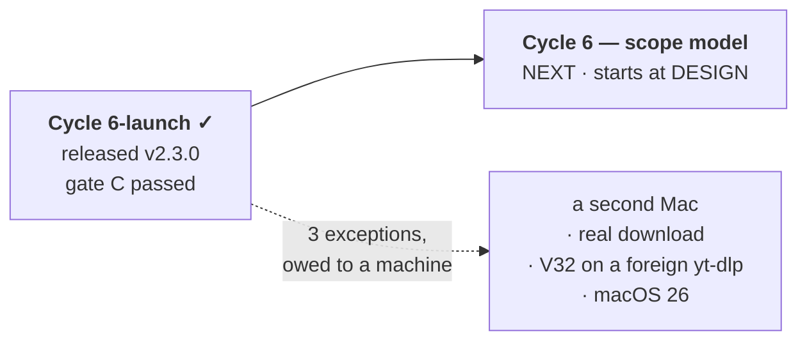

# Handoff — `Cycle 6-launch` is closed and released; next is `Cycle 6`, from design

**Ephemeral**, like the thirteen before it: deleted when the next session writes its
own. Nothing is decided here. Everything normative is in [roadmap.md](roadmap.md),
the ADRs, [ux-principles.md](ux/design/ux-principles.md) and the rules in
`.cco/claude/rules/`.

## Where the project is



| | |
|---|---|
| **Phase** | Between units. `Cycle 6-launch` is closed; `Cycle 6` has not started |
| **Branch** | `main`. This closure is on `docs/cycle6launch/gate-c`, **not merged** — see the gates |
| **Released** | **v2.3.0**, 2026-08-27 — four assets in one `SHA2-256SUMS`, verified present |
| **Suite** | `go test -race ./...` green, 15 packages · `go vet` clean · `gofmt -l .` empty |
| **Installer** | `bash tests/test-installer.sh` → **169/169** |
| **Docs** | `./hack/check-docs-links.sh` → green, 63 files |
| **Parity gate** | `git diff main -- internal/core/ internal/daemon/` → empty |
| **CI** | now runs on **amd64 and arm64**, and `release.yml` will not publish from a tree the suite fails |

## How to resume

**The next unit is [`Cycle 6` — the scope model](roadmap.md#cycle-6), and it starts
at DESIGN.** Its analysis is done and gate A closed on 2026-08-12: do not re-run
`/analyze`, and do not reopen ADR-0015's rulings — the intermediate scope is the
browser tab and lives in the page, presets are values while scopes are durations, and
*Riprova* lands on the history row.

Before anything else, read [ADR-0015](ux/decisions/0015-cycle6-tab-scope-and-faithful-reruns.md) and the
Cycle 6 entry in the roadmap; the trap recorded there is the relative `output_dir`,
which must **not** be made absolute in the reader.

## Tasks

| # | Task | Roadmap entry |
|---|---|---|
| 1 | **merge this closure branch** — `docs/cycle6launch/gate-c`, documentation only | — |
| 2 | start **`Cycle 6`** at `/design` (not `/analyze`) | [`Cycle 6`](roadmap.md#cycle-6) |
| 3 | when the second Mac is available: a **real download with a real conversion**, GUI and CLI | carried from gate C |
| 4 | optional, reversible: **`V32` on a foreign `yt-dlp`** — the procedure is below | carried from gate C |

Status lives in the roadmap, not here.

## Gates still open

| Gate | What is suspended | What unblocks it |
|---|---|---|
| **Merge of this closure** | nothing functional — but until it lands, `main` says `Cycle 6-launch` is in flight and carries no gate C report | `git merge --no-ff docs/cycle6launch/gate-c` from the Mac, then push. No code, no test, no installer file is touched |
| **Hardware, carried from gate C** | nothing — it blocks no unit | a second Mac. [Report 007](distribution/reviews/007-cycle6launch-gate-c.md) records all three exceptions; a finding from any of them opens an ordinary roadmap entry |

`Cycle 6-launch`'s own merge, release and gate C are **done**. The two branches that
were still local — `docs/release/v2.3.0` and `fix/update/arch-dependent-pin-tests` —
were deleted at the end of this session with `git branch -d`, never `-D`.

## Context

### What this session did

1. `/review-implementation` and `/review-docs` (`L9`), then the four minor findings
   and `V37` closed on the maintainer's instruction.
2. **`V32` decided and built** (`L9b`): the update advisory is pushed over SSE.
3. **`V46` decided**: the README keeps its app section.
4. `L10` merge, `L11` release as **v2.3.0**, `L12` **gate C passed on hardware**.
5. Two process defects found and closed along the way — see below.
6. `V47` found at gate C and closed by option A.

### The two process defects, which are the part worth remembering

- **CI had been red on `main` for ten days and no local gate could have seen it.**
  `FetchPin` resolves the ffmpeg build for the machine it runs on; three tests
  asserted one architecture's id unconditionally; the maintainer's container is arm64
  and the runner was amd64. Each was green about the question it asked. It surfaced
  because a person opened the Actions tab. **Closed**: the suite now runs on both
  architectures.
- **A release could be cut from a red tree, and one was.** `ci.yml` and `release.yml`
  are independent workflows, so a tag push publishes whatever CI is doing. v2.3.0 was
  sound because the failure was in the tests, which is luck rather than a property.
  **Closed**: `release.yml`'s publishing job now `needs` a job that calls `ci.yml` —
  the same definition, not a copy.

### The `V32` procedure, for whoever has a foreign `yt-dlp`

Reversible, and the only way to observe the one thing this cycle built and never saw
work on hardware:

```bash
brew install yt-dlp                       # any yt-dlp ytdl did not install will do
mv ~/.local/bin/yt-dlp ~/.local/bin/yt-dlp.bak
# open the GUI → Impostazioni → Versione e aggiornamenti:
# yt-dlp must start as "versione non registrata" and become the real version BY
# ITSELF within ~10 s, without pressing Controlla aggiornamenti
mv ~/.local/bin/yt-dlp.bak ~/.local/bin/yt-dlp
```

### Three invariants a future change can break silently

Pinned by tests, and all three would fail **quietly** if the test were removed with
the code:

1. the `update` SSE frame is sent **on connect**, not only on reconcile;
2. `index.html` must keep shipping `updatePanel` with `hidden` — the guard reads that
   visibility, so without it every pushed advisory is dropped;
3. `reconcileAndPublish` **measures, then publishes**.

### Open questions

**None blocking.** `V32` and `V46` were decided, `V47` was decided and applied. What
is left is observation on hardware nobody in a container can do.

## Reference documents

- [roadmap.md](roadmap.md) — the SSOT; nothing in flight, `Cycle 6` next
- [report 007 — gate C](distribution/reviews/007-cycle6launch-gate-c.md) ·
  [005 — implementation](distribution/reviews/005-cycle6launch-implementation.md) ·
  [006 — documentation](distribution/reviews/006-cycle6launch-documentation.md)
- [analysis — `V32`, the four options](distribution/analysis/2026-08-27-tech-choice-v32-advisory-freshness.md)
- [ADR-0018](distribution/decisions/0018-desktop-launcher-app-bundle.md) ·
  [ADR-0019](distribution/decisions/0019-launcher-mach-o-and-recorded-versions.md)
  (with the dated addition closing `V32`) ·
  [ADR-0015](ux/decisions/0015-cycle6-tab-scope-and-faithful-reruns.md) (what `Cycle 6` must not reopen)
- [releasing.md](distribution/guides/releasing.md) — now records that the release
  verifies itself, and why
- [improvements.md](improvements.md) — `V47` option B, unscheduled
