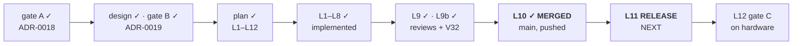

# Handoff — `Cycle 6-launch` is on `main`; the release is what is missing

**Ephemeral**, like the twelve before it: deleted when the next session writes its
own. Nothing is decided here. Everything normative is in [roadmap.md](roadmap.md),
the ADRs, [ux-principles.md](ux/design/ux-principles.md) and the rules in
`.cco/claude/rules/`.

## Where the project is



| | |
|---|---|
| **Phase** | Implementation closed. The cycle is **not** closed: `L11` and `L12` are open |
| **Branch** | `main`, at the merge commit `f04171d` (`--no-ff`), **pushed** — `main` and `origin/main` agree |
| **Working tree** | clean |
| **Suite** | `go test -race ./...` green, 15 packages · `go vet` clean · `gofmt -l .` empty |
| **Installer** | `bash tests/test-installer.sh` → **169/169** |
| **Docs** | `./hack/check-docs-links.sh` → green, 62 files |
| **Parity gate** | `git diff main -- internal/core/ internal/daemon/` → empty |

## How to resume

**The first thing is the release, and it is not a formality.** `install.sh` is
served from `main`, which now looks for launcher assets in `releases/latest` — and
until the release is cut, that is a release without them. Every install in this
window takes the warn-and-continue path and produces **no app**, while the README
that `main` serves says there is one. The window opened at the merge.

The procedure is [releasing.md](distribution/guides/releasing.md), and its order is
not improvisable — two past failures fixed it. From the Mac:

```bash
cd /Users/alessandro/Scripts/yt-download
git pull                                  # main is already pushed; confirm you are on it
# CHANGELOG.md: turn [Unreleased] into the version being cut, with its date
git tag -a v2.3.0 -m "..." && git push origin v2.3.0
# then watch the workflow publish the four assets, SHA2-256SUMS included
```

⚠️ **Check the release actually carries `ytdl_launch_macos_arm64` and
`ytdl_launch_macos_amd64`** before telling anyone to install: the workflow refuses
to publish an unsigned arm64 launcher (`L5`), so a missing asset means the assertion
fired, not that the upload was slow.

**Then gate C**, on hardware, from a Mac — the eight items in
[design §9](distribution/design/cycle6launch-launcher.md) plus the ninth the review
added: **open *Aggiornamenti* on a Mac with a Homebrew `yt-dlp`** and read what it
says. That is the only machine where `V32`'s fix is visible at all. Four of the
eight cannot be observed before the release, which is why `L11` comes first.

## Tasks

| # | Task | Roadmap entry |
|---|---|---|
| 1 | **cut the release** — `CHANGELOG.md` from `[Unreleased]` to the version, tag, push the tag, verify the four assets | `Cycle 6-launch` → `L11` |
| 2 | **re-install on the maintainer's Mac from the published release**, then on the user's | `Cycle 6-launch` → `L11` |
| 3 | **gate C** on hardware — design §9's eight items, plus *Aggiornamenti* on a Mac with a Homebrew `yt-dlp` | `Cycle 6-launch` → `L12` |
| 4 | when gate C passes: move the `Cycle 6-launch` block into `roadmap-history.md`, leaving one line | — |
| 5 | then **Cycle 6** (the scope model), whose gate A is already closed — it starts at **design**, not analysis | `Cycle 6` |

Status lives in the roadmap, not here.

## Gates still open

| Gate | What is suspended | What unblocks it |
|---|---|---|
| **Release** (`L11`) | gate C's four bundle items cannot be observed, and `main` serves an installer whose assets do not exist yet | the maintainer tags and pushes from the Mac; the workflow publishes the assets |
| **Gate C** (`L12`) | closing the cycle, and `C2` — the single exception Cycle 6-plus's gate C recorded | the maintainer's hands-on verification on real hardware, after the release |
| **Merge of this closure** | nothing — but until it lands, `main` carries a roadmap that still calls `L10` planned, and no handoff at all | `git merge --no-ff docs/cycle6launch/handoff` from the Mac. Documentation only: no code, no test, no installer file is touched |

**`Cycle 6-launch`'s own merge is done** and `main` is pushed; the three merged local
branches were deleted with `git branch -d` (never `-D`). The one branch left is the
documentation branch this handoff is committed on, in the table above — `main` is
protected, so a closure commit does not go on it directly.

## Context

### What this session did

1. **`/review-implementation`** →
   [report 005](distribution/reviews/005-cycle6launch-implementation.md). Two
   objective defects fixed in place: an empty `YTDL.app` left behind by a run that
   installed none (`V30` — Finder shows any `*.app` directory and then refuses to
   open it), and a launcher that read its exit status from the error's *type*, so a
   child that exited 0 could raise a critical alert (`V31`).
2. **The four minor findings** (`V33`–`V36`) closed on the maintainer's
   instruction, and `V37` found while closing them. All recorded in a **dated
   addition** at the end of report 005.
3. **`/review-docs`** →
   [report 006](distribution/reviews/006-cycle6launch-documentation.md), nine living
   documents realigned. Its findings are `V38`–`V46`; they were renumbered from
   `V37`–`V45` because `V37` had been taken two minutes earlier.
4. **`V32` decided and built** as `L9b`, and **`V46` decided**: keep the README as
   written.
5. **`L10`**: merged `--no-ff` into `main` and pushed.

### The decisions, and where they live

- **`V32` → the advisory is pushed over SSE.** Four options were priced in
  [the analysis](distribution/analysis/2026-08-27-tech-choice-v32-advisory-freshness.md);
  the decision and the reason the closest runner-up was rejected are in the **dated
  addition to [ADR-0019](distribution/decisions/0019-launcher-mach-o-and-recorded-versions.md)**.
  The distinction that keeps [design §6.2](distribution/design/cycle6plus-update.md)
  coherent — the run panel polls, the advisory is pushed — is written there.
- **`V46` → the README keeps the app section**, accepted knowing it is ahead of what
  `main` can install until `L11`. That is a reason to cut the release promptly, and
  it is the one open dependency between the two.

### Three invariants a future change can break silently

All three are pinned by tests, and all three would fail **quietly** if the test were
removed with the code:

1. **The `update` frame is sent on connect, not only on reconcile.** The page fetches
   `/api/state` and *then* opens the stream; a probe finishing between the two would
   be broadcast to a client that is not connected yet.
2. **`index.html` must keep shipping `updatePanel` with `hidden`.** The guard reads
   the panel's visibility, and the panel is only ever *shown*, never re-hidden — so
   without the attribute the guard is true from the first paint and **every push is
   dropped in silence**.
3. **`reconcileAndPublish` measures, then publishes.** Reversed, it would send the
   page the same recorded answer it already had.

### Two lessons worth carrying

- **Two agents in one working tree share more than files — they share a numbering
  space.** The docs review opened its findings at `V37` while `V37` was being written
  into report 005 two minutes earlier. It cost a renumber of nine findings and their
  cross-references. **Assign the range before launching**, not after.
- **`${p/#$HOME/~}` does not fold anything** (`V37`). Bash tilde-expands the
  *replacement*, so `~` becomes `$HOME` again and the substitution puts back exactly
  what it removed. Two call sites in `install.sh` believed otherwise for months; both
  now go through `home_display`, which spells the fold out with `case` and gets
  `$HOME-extra/App` right.

### Open questions

**None blocking.** `V32` and `V46` were the two open decisions and both are closed.
What remains is execution on hardware, which no session in this container can do.

## Reference documents

- [roadmap.md](roadmap.md) — the SSOT; `Cycle 6-launch` is `in progress` with `L11`
  and `L12` open
- [review 005 — implementation](distribution/reviews/005-cycle6launch-implementation.md)
  · [review 006 — documentation](distribution/reviews/006-cycle6launch-documentation.md)
- [analysis — `V32`, the four options](distribution/analysis/2026-08-27-tech-choice-v32-advisory-freshness.md)
- [ADR-0018](distribution/decisions/0018-desktop-launcher-app-bundle.md) (the artefact)
  · [ADR-0019](distribution/decisions/0019-launcher-mach-o-and-recorded-versions.md)
  (the Mach-O, the cold start, and the dated addition closing `V32`)
- [design — the launcher](distribution/design/cycle6launch-launcher.md) ·
  [design — the update path](distribution/design/cycle6plus-update.md) (§6.2)
- [releasing.md](distribution/guides/releasing.md) — the procedure for `L11`
