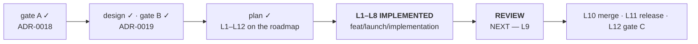

# Handoff — `Cycle 6-launch` is implemented and awaits its review

**Ephemeral**, like the eleven before it: deleted when the next session writes its
own. Nothing is decided here. Everything normative is in [roadmap.md](roadmap.md),
the ADRs, [ux-principles.md](ux/design/ux-principles.md) and the rules in
`.cco/claude/rules/`.

## Where the project is

| | |
|---|---|
| phase | **Review** — implementation complete, `/review-implementation` not yet run |
| branch | **`feat/launch/implementation`**, **not merged**, working tree clean |
| `main` | `29dd642`, **14 commits ahead of `origin/main`** — carries the design and ADR-0019 |
| the diff | `git diff --stat main...HEAD` — 16 files, ~1 645 insertions, roughly half of them tests |
| suite | **`go test -race ./...` exits 0**, 15 packages, **8 s cold**. `go vet` clean, `gofmt -l` empty, installer **148/148**, link checker 59 files, **parity gate empty** |

## ⚠️ The previous handoff's `go test ./...` warning is DEAD — do not carry it forward

It said `./...` exits non-zero because of `scratchpad/gatekeeper-probe/`, a darwin
program inside the module. **That directory no longer exists** (the maintainer's to
delete, and it is gone). `go test -race ./...` now exits 0 on the whole module, and
there is no reason to scope the run to `./cmd/... ./internal/...` any more.

## What this session did

Ran `/plan`, took its gate, merged the design branch, and implemented all eight
steps of [design §8](distribution/design/cycle6launch-launcher.md) in the order the
design fixed. Each step ended green on the **whole** gate, not only its own oracle,
and every commit is atomic.

Two decisions the maintainer took at the plan gate, both on measurements rather than
assumption:

- **the design branch was merged here, not on the Mac.** It touches no `.cco/` file,
  so the read-only blocker recorded by earlier handoffs did not apply. Measured with
  `git diff --name-only main...feat/launch/design | grep -c '^\.cco/'` → 0.
- **`L2`–`L3` first, then `L4`–`L7`**, as design §8 orders them: the bundle without
  the cold-start remedy would ship the defect ADR-0018 pulled into scope.

---

# How to resume

**First concrete action: run `/review-implementation`** on
`feat/launch/implementation`. Everything it needs is on disk; nothing below is a
prerequisite for starting it.

**Read, in this order, only if a finding needs the reasoning behind a choice:**
[ADR-0019](distribution/decisions/0019-launcher-mach-o-and-recorded-versions.md) →
[the design](distribution/design/cycle6launch-launcher.md) (§5 the cold start, §3
the launcher, §4 the bundle, Appendix C the test contracts) →
[roadmap § Cycle 6-launch](roadmap.md#cycle-6-launch).

**Do not re-open** — each was ruled on a measurement or approved at a gate:

- the artefact, Gatekeeper, and the name `YTDL` — ADR-0018, measured on hardware;
- which Mach-O, and the cold-start remedy — ADR-0019;
- **the installer's language**: `install.sh` stays English throughout, the Italian
  lives in the two user guides. Approved at gate B (design §4.7);
- **the install channel**: still `curl`. A dated addition at the end of
  [ADR-0001](distribution/decisions/0001-distribution-channel.md) says why.

## Tasks

| # | Task | Roadmap entry |
|---|---|---|
| 1 | **`/review-implementation`** on `feat/launch/implementation` | `Cycle 6-launch` → `L9` |
| 2 | **`/review-docs`** right after it, on the same branch | `Cycle 6-launch` → `L9` |
| 3 | **merge `--no-ff` into `main`** once both reviews are clean | `Cycle 6-launch` → `L10` |
| 4 | **cut the release** — see the ⚠️ below, its timing is not free | `Cycle 6-launch` → `L11` |
| 5 | **gate C** on hardware — the eight items in [design §9](distribution/design/cycle6launch-launcher.md) | `Cycle 6-launch` → `L12` |
| 6 | delete `docs/cycle6launch/gate-a` and `feat/launch/design` — both merged, deletion deferred by the remote policy | — |

Status lives in the roadmap, not here.

## Gates still open

| Gate | What is suspended | What unblocks it |
|---|---|---|
| **Review** | the merge | `/review-implementation` then `/review-docs` come back clean, or their findings are fixed in place |
| **Merge** | `main` does not carry the implementation | the maintainer approves the merge of `feat/launch/implementation`. Re-verification is the whole gate: suite, vet, gofmt, installer, link checker, parity |
| **Release** | gate C's four bundle items cannot be observed | the maintainer tags and pushes. `L11`, and see the ⚠️ below |
| **Push** | `origin` has none of the last 14 commits on `main` | a **host step**: no credentials here, `gh` is not authenticated. `git push origin main` from the Mac |
| **Gate C** | closing the cycle | the maintainer's hands-on verification on real hardware |

### ⚠️ `L11` is not optional and the `L10 → L11` gap is a surface

`install.sh` is served from **`main`** while assets come from **`releases/latest`**
(`internal/update/runner.go:217` builds the raw URL from the branch). So between the
merge and the release, the newest release carries **no launcher**. Any installer run
in that window — a fresh install, a `deps.conf` change, a forced `ytdl --update` —
takes the warn-and-continue path and installs **no app**.

That is by design (§4.4) and it is why `install_app_bundle` never calls `fail()`.
It is still a user meeting a warning about something merely not released yet, so
keep the gap short.

### Why branch cleanup is deferred again, measured rather than assumed

Both `docs/cycle6launch/gate-a` and `feat/launch/design` **are** merged:
`git merge-base --is-ancestor <branch> main` returns true for each, so deleting them
would lose nothing. They stay because `main` is **14 commits ahead of `origin/main`**
and the profile's remote policy holds a local branch until its work is on the remote
(`project-profile.md` §3). **That is correct behaviour, not a failure** — cleanup
always defers by one session here.

## Context the next session would otherwise rediscover

### Where to look hardest, because these are where the risk is

- **`install_app_bundle` is the only new code that runs on a user's machine on
  every update** and it is the only one no oracle here can execute end to end: the
  suite drives it with `download_optional` stubbed, so the real `curl` path, the
  real `mv` across filesystems and the real `xattr` are unexercised.
- **The `osascript` alert has never been shown.** It is built by a pure function and
  its escaping is tested; whether it reaches the front of the screen from
  LaunchServices is gate C's, and `launcher.log` is the half that does not depend on
  the answer.
- **`go upd.refreshLocal()` in `runDaemon`** is the one new goroutine. It is after
  `startWebUI` deliberately; before it, it is the 7.5 s cold start again.

### Two findings from this session that are worth not repeating

- **A test can be a false positive and still look green.** The first version of the
  installer's bundle tests put every `check` inside `( … )`, where `check()`'s
  `PASS`/`FAIL` counters are discarded: a deliberately broken `--force` printed a
  `✗` and the suite still exited **0**. Rewritten with the variables saved and
  restored by hand. **In `tests/test-installer.sh`, never call `check` in a
  subshell.**
- **Every new contract was verified against a mutation that should break it** — 11
  of them, across the Go and Bash suites, each caught by its own assertion. That is
  what turned up the false positive above, and a real defect: `APP_INSTALLED` was
  set but never reset, so the installer's closing message could have described a
  previous call.

### Three facts measured here, cheap to record and expensive to re-derive

- **The launcher is 2.88 MB**; `ytdl` is ~9.5 MB. ADR-0019's "9.5 MB of engine doing
  a 30-line launcher's job" holds.
- **The Go linker signs `darwin/arm64` and not `darwin/amd64`** — confirmed by
  parsing the load commands of `cmd/ytdl-launch`'s own cross-compiled binaries, not
  only the gate-A probe's. `LC_CODE_SIGNATURE` present on arm64, absent on amd64.
- **The release workflow's signature assertion was verified on the case it must
  refuse**, not only the one it must accept: run against the amd64 launcher it exits
  1 and says why.

### Debts carried, and they are NOT this cycle

The unscheduled ones are in [improvements.md](improvements.md): `V23`, `V19` and the
seven minors. The Cycle 10 ones — `V26`, `V27`, `V29`, `V22` — are on the roadmap as
that cycle's precondition; **`V27` is a normative debt, not a preference**, and Cycle
10 does not start without it.

## Container gotchas

- git and `go build` want
  `GIT_CONFIG_COUNT=1 GIT_CONFIG_KEY_0=safe.directory GIT_CONFIG_VALUE_0=/workspace/yt-download`
  on **every** invocation. `hack/check-docs-links.sh` carries its own exception.
- No credentials for `origin`: pushes are the maintainer's, from the Mac. `gh` is
  not authenticated here and **not installed on the Mac**.
- `.cco/` is read-only unless the session starts with `--cco-access edit-project`,
  and it **cannot be raised afterwards**.
- **No ffmpeg**, deliberately. Real conversions and the GUI are verified on macOS.
- The container **can** cross-compile for macOS, both architectures.
- `pyyaml` is not installed by default; `pip install --break-system-packages pyyaml`
  is what validated `release.yml` here.

## Reference documents

- [roadmap.md § Cycle 6-launch](roadmap.md#cycle-6-launch) — `L1`–`L12`, their
  dependencies and their status
- [design/cycle6launch-launcher.md](distribution/design/cycle6launch-launcher.md) —
  the approved design: requirements, flows, the eight steps, Appendix C's contracts
- [ADR-0019](distribution/decisions/0019-launcher-mach-o-and-recorded-versions.md) —
  the dedicated launcher, and versions read from the record
- [ADR-0018](distribution/decisions/0018-desktop-launcher-app-bundle.md) — gate A's
  rulings, which this cycle implements and does not revisit
- [analysis 2026-08-26](distribution/analysis/2026-08-26-tech-choice-desktop-launcher.md)
  — every hardware measurement
- [dev-testing.md](guides/dev-testing.md) — the sandbox, now including `YTDL_APP_DIR`
